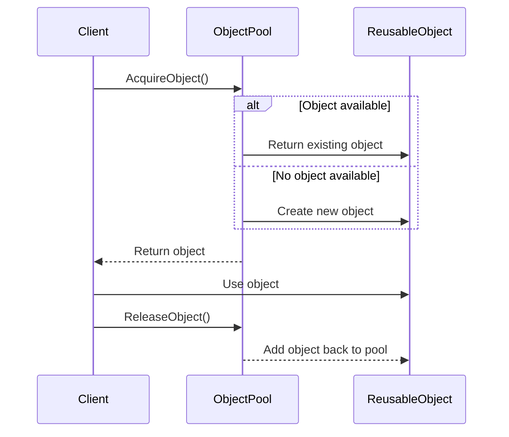

## 4.6 Object Pool Pattern

In the realm of software design, the Object Pool Pattern stands out as a powerful creational design pattern that focuses on reusing objects that are costly to create. This pattern is particularly useful in scenarios where the instantiation of objects is resource-intensive, such as database connections or socket connections. By maintaining a pool of reusable objects, the Object Pool Pattern can significantly enhance application performance and resource management.

### Intent

The primary intent of the Object Pool Pattern is to manage a set of initialized objects ready for use, rather than creating and destroying them on demand. This approach minimizes the overhead associated with object creation and destruction, leading to improved performance and resource utilization.

### Key Participants

1. **Object Pool**: Manages the pool of reusable objects. It handles the allocation and deallocation of objects, ensuring that objects are reused efficiently.
2. **Reusable Object**: The object that is being managed by the pool. It must be reset to a clean state before being reused.
3. **Client**: The entity that requests and returns objects to the pool.

### Applicability

The Object Pool Pattern is applicable in scenarios where:

- Object creation is expensive in terms of time and resources.
- A large number of objects are needed for short periods.
- There is a need to limit the number of instances of a particular class.

### Implementing Object Pool in C#

Let's delve into the implementation of the Object Pool Pattern in C#. We'll explore how to manage a pool of reusable objects and ensure efficient resource management.

#### Managing a Pool of Reusable Objects

To implement an object pool, we need to create a class that manages the pool of objects. This class will handle the allocation and deallocation of objects, ensuring that objects are reused efficiently.

```csharp
using System;
using System.Collections.Generic;

public class ObjectPool<T> where T : new()
{
    private readonly List<T> _available = new List<T>();
    private readonly List<T> _inUse = new List<T>();

    public T AcquireObject()
    {
        lock (_available)
        {
            if (_available.Count != 0)
            {
                T obj = _available[0];
                _inUse.Add(obj);
                _available.RemoveAt(0);
                return obj;
            }
            else
            {
                T obj = new T();
                _inUse.Add(obj);
                return obj;
            }
        }
    }

    public void ReleaseObject(T obj)
    {
        lock (_available)
        {
            _inUse.Remove(obj);
            _available.Add(obj);
        }
    }
}
```

In this implementation:

- **AcquireObject**: This method checks if there are any available objects in the pool. If so, it retrieves an object from the pool; otherwise, it creates a new one.
- **ReleaseObject**: This method returns an object to the pool, making it available for future use.

#### Resource Management

Efficient resource management is crucial in the Object Pool Pattern. By reusing objects, we can reduce the overhead associated with object creation and destruction, leading to improved performance.

### Use Cases and Examples

The Object Pool Pattern is particularly useful in scenarios where object creation is expensive. Let's explore some common use cases and examples.

#### Database Connections

Database connections are often expensive to create due to the overhead of establishing a connection with the database server. By using an object pool, we can maintain a pool of open connections, reusing them as needed.

```csharp
public class DatabaseConnection
{
    public void Open() { /* Open connection */ }
    public void Close() { /* Close connection */ }
}

public class DatabaseConnectionPool : ObjectPool<DatabaseConnection>
{
    public DatabaseConnectionPool(int initialSize)
    {
        for (int i = 0; i < initialSize; i++)
        {
            var connection = new DatabaseConnection();
            connection.Open();
            ReleaseObject(connection);
        }
    }
}
```

In this example, the `DatabaseConnectionPool` class initializes a pool of open database connections, ready for use.

#### Socket Connections

Similar to database connections, socket connections can also benefit from the Object Pool Pattern. By maintaining a pool of open socket connections, we can reduce the overhead associated with establishing new connections.

```csharp
public class SocketConnection
{
    public void Connect() { /* Establish connection */ }
    public void Disconnect() { /* Terminate connection */ }
}

public class SocketConnectionPool : ObjectPool<SocketConnection>
{
    public SocketConnectionPool(int initialSize)
    {
        for (int i = 0; i < initialSize; i++)
        {
            var connection = new SocketConnection();
            connection.Connect();
            ReleaseObject(connection);
        }
    }
}
```

In this example, the `SocketConnectionPool` class initializes a pool of open socket connections, ready for use.

### Design Considerations

When implementing the Object Pool Pattern, there are several design considerations to keep in mind:

- **Thread Safety**: Ensure that the object pool is thread-safe, especially in multi-threaded environments. Use synchronization mechanisms such as locks to prevent race conditions.
- **Object Initialization**: Ensure that objects are properly initialized before being added to the pool. This may involve resetting the object's state.
- **Pool Size**: Determine the optimal size of the pool based on the application's requirements. A pool that is too small may lead to performance bottlenecks, while a pool that is too large may consume excessive resources.

### Differences and Similarities

The Object Pool Pattern is often compared to other creational patterns, such as the Singleton Pattern and the Factory Method Pattern. While these patterns share some similarities, they serve different purposes:

- **Singleton Pattern**: Ensures that a class has only one instance and provides a global point of access to it. Unlike the Object Pool Pattern, the Singleton Pattern does not manage a pool of objects.
- **Factory Method Pattern**: Provides an interface for creating objects in a superclass, but allows subclasses to alter the type of objects that will be created. The Factory Method Pattern focuses on object creation, while the Object Pool Pattern focuses on object reuse.

### Visualizing the Object Pool Pattern

To better understand the Object Pool Pattern, let's visualize the flow of acquiring and releasing objects using a sequence diagram.



This diagram illustrates the process of acquiring and releasing objects in the Object Pool Pattern. The client requests an object from the pool, uses it, and then returns it to the pool for future use.

### Try It Yourself

To gain a deeper understanding of the Object Pool Pattern, try modifying the code examples provided. Experiment with different pool sizes and observe how it affects performance. Consider implementing additional features, such as object expiration or pool resizing.

### Knowledge Check

Before we conclude, let's reinforce our understanding of the Object Pool Pattern with a few key takeaways:

- The Object Pool Pattern is a creational design pattern that focuses on reusing objects that are expensive to create.
- It is particularly useful in scenarios where object creation is resource-intensive, such as database connections or socket connections.
- Key considerations include thread safety, object initialization, and pool size.

### Embrace the Journey

Remember, mastering design patterns is a journey. As you continue to explore and experiment with different patterns, you'll gain a deeper understanding of how to build scalable and maintainable applications. Keep experimenting, stay curious, and enjoy the journey!

## Quiz Time!



### What is the primary intent of the Object Pool Pattern?

- [x] To manage a set of initialized objects ready for use.
- [ ] To ensure a class has only one instance.
- [ ] To provide an interface for creating objects in a superclass.
- [ ] To separate the construction of a complex object from its representation.

> **Explanation:** The primary intent of the Object Pool Pattern is to manage a set of initialized objects ready for use, minimizing the overhead associated with object creation and destruction.

### Which of the following is a key participant in the Object Pool Pattern?

- [x] Object Pool
- [ ] Singleton
- [ ] Factory
- [ ] Adapter

> **Explanation:** The Object Pool is a key participant in the Object Pool Pattern, responsible for managing the pool of reusable objects.

### In which scenario is the Object Pool Pattern particularly useful?

- [x] When object creation is expensive in terms of time and resources.
- [ ] When a class needs to have only one instance.
- [ ] When objects need to be created in a superclass.
- [ ] When objects need to be adapted to different interfaces.

> **Explanation:** The Object Pool Pattern is particularly useful when object creation is expensive in terms of time and resources, such as database connections or socket connections.

### What is a key consideration when implementing the Object Pool Pattern?

- [x] Thread Safety
- [ ] Object Inheritance
- [ ] Interface Segregation
- [ ] Dependency Injection

> **Explanation:** Thread safety is a key consideration when implementing the Object Pool Pattern, especially in multi-threaded environments.

### Which pattern is often compared to the Object Pool Pattern?

- [x] Singleton Pattern
- [ ] Observer Pattern
- [ ] Decorator Pattern
- [ ] Strategy Pattern

> **Explanation:** The Singleton Pattern is often compared to the Object Pool Pattern, but they serve different purposes.

### What does the `AcquireObject` method do in the Object Pool Pattern?

- [x] Retrieves an object from the pool or creates a new one if none are available.
- [ ] Ensures a class has only one instance.
- [ ] Provides an interface for creating objects in a superclass.
- [ ] Separates the construction of a complex object from its representation.

> **Explanation:** The `AcquireObject` method retrieves an object from the pool or creates a new one if none are available, ensuring efficient object reuse.

### What is the role of the `ReleaseObject` method in the Object Pool Pattern?

- [x] Returns an object to the pool, making it available for future use.
- [ ] Ensures a class has only one instance.
- [ ] Provides an interface for creating objects in a superclass.
- [ ] Separates the construction of a complex object from its representation.

> **Explanation:** The `ReleaseObject` method returns an object to the pool, making it available for future use, thus facilitating object reuse.

### How does the Object Pool Pattern improve performance?

- [x] By reusing objects and reducing the overhead of object creation and destruction.
- [ ] By ensuring a class has only one instance.
- [ ] By providing an interface for creating objects in a superclass.
- [ ] By separating the construction of a complex object from its representation.

> **Explanation:** The Object Pool Pattern improves performance by reusing objects and reducing the overhead of object creation and destruction.

### What is a potential pitfall of the Object Pool Pattern?

- [x] Managing thread safety in multi-threaded environments.
- [ ] Ensuring a class has only one instance.
- [ ] Providing an interface for creating objects in a superclass.
- [ ] Separating the construction of a complex object from its representation.

> **Explanation:** Managing thread safety in multi-threaded environments is a potential pitfall of the Object Pool Pattern, requiring careful synchronization.

### True or False: The Object Pool Pattern is a structural design pattern.

- [ ] True
- [x] False

> **Explanation:** False. The Object Pool Pattern is a creational design pattern, focusing on object reuse and efficient resource management.


