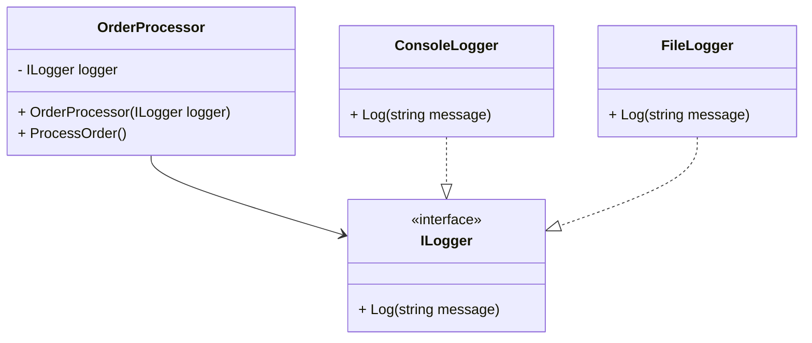

## 4.7 Dependency Injection Pattern

Dependency Injection (DI) is a fundamental design pattern in modern software development, particularly in C#. It is a specific form of Inversion of Control (IoC), a broader principle that decouples the execution of a task from its implementation. This pattern is essential for creating flexible, maintainable, and testable applications. In this section, we will delve into the intricacies of the Dependency Injection pattern, its implementation strategies, and its benefits in C#.

### Intent

The primary intent of the Dependency Injection pattern is to decouple the creation of a class's dependencies from the class itself. By doing so, it allows for more modular, testable, and maintainable code. Instead of a class instantiating its dependencies directly, they are provided to the class, typically through its constructor, properties, or methods.

### Key Participants

- **Client**: The class that requires dependencies.
- **Service**: The dependency that the client requires.
- **Injector**: The component responsible for injecting the service into the client.

### Implementing Dependency Injection

There are three main techniques for implementing Dependency Injection in C#: constructor injection, property injection, and method injection. Each has its use cases and benefits.

#### Constructor Injection

Constructor injection is the most common form of Dependency Injection. It involves passing dependencies to the class through its constructor. This method ensures that the class is always in a valid state, as all required dependencies are provided at the time of instantiation.

```csharp
public interface ILogger
{
    void Log(string message);
}

public class ConsoleLogger : ILogger
{
    public void Log(string message)
    {
        Console.WriteLine(message);
    }
}

public class OrderProcessor
{
    private readonly ILogger _logger;

    public OrderProcessor(ILogger logger)
    {
        _logger = logger;
    }

    public void ProcessOrder()
    {
        _logger.Log("Order processed.");
    }
}

// Usage
ILogger logger = new ConsoleLogger();
OrderProcessor processor = new OrderProcessor(logger);
processor.ProcessOrder();
```

In this example, `OrderProcessor` depends on `ILogger`. The dependency is injected via the constructor, ensuring that `OrderProcessor` can only be instantiated with a valid `ILogger` implementation.

#### Property Injection

Property injection involves setting dependencies through public properties. This method is less common but can be useful when dependencies are optional or when they need to be set after object creation.

```csharp
public class OrderProcessor
{
    public ILogger Logger { get; set; }

    public void ProcessOrder()
    {
        Logger?.Log("Order processed.");
    }
}

// Usage
OrderProcessor processor = new OrderProcessor();
processor.Logger = new ConsoleLogger();
processor.ProcessOrder();
```

Here, `Logger` is set after the `OrderProcessor` is instantiated, allowing for more flexibility but also requiring additional checks to ensure the dependency is set before use.

#### Method Injection

Method injection involves passing dependencies as parameters to a method. This approach is useful for dependencies that are only needed for specific operations.

```csharp
public class OrderProcessor
{
    public void ProcessOrder(ILogger logger)
    {
        logger.Log("Order processed.");
    }
}

// Usage
OrderProcessor processor = new OrderProcessor();
processor.ProcessOrder(new ConsoleLogger());
```

In this example, the `ILogger` dependency is provided directly to the `ProcessOrder` method, allowing for different loggers to be used for different calls.

### Inversion of Control Containers

Inversion of Control (IoC) containers are frameworks that manage the creation and lifecycle of objects and their dependencies. They automate the process of dependency injection, making it easier to manage complex applications.

#### Managing Object Creation and Lifecycles

IoC containers handle the instantiation of objects and their dependencies, allowing developers to focus on the business logic. They also manage the lifecycle of objects, ensuring that resources are efficiently used and released.

#### Using DI Containers

Several DI containers are available for C#, each with its features and benefits. Some popular options include Unity, Autofac, and Microsoft.Extensions.DependencyInjection.

##### Unity

Unity is a lightweight, extensible dependency injection container. It is easy to configure and use, making it a popular choice for many developers.

```csharp
using Unity;

public class Program
{
    public static void Main()
    {
        IUnityContainer container = new UnityContainer();
        container.RegisterType<ILogger, ConsoleLogger>();

        OrderProcessor processor = container.Resolve<OrderProcessor>();
        processor.ProcessOrder();
    }
}
```

In this example, Unity is used to register the `ILogger` interface with the `ConsoleLogger` implementation. The `OrderProcessor` is then resolved from the container, with its dependencies automatically injected.

##### Autofac

Autofac is a powerful and flexible DI container that supports advanced scenarios, such as module-based configuration and lifetime management.

```csharp
using Autofac;

public class Program
{
    public static void Main()
    {
        var builder = new ContainerBuilder();
        builder.RegisterType<ConsoleLogger>().As<ILogger>();
        builder.RegisterType<OrderProcessor>();

        using (var container = builder.Build())
        {
            var processor = container.Resolve<OrderProcessor>();
            processor.ProcessOrder();
        }
    }
}
```

Autofac's fluent API makes it easy to configure dependencies and manage their lifecycles, providing a robust solution for complex applications.

##### Microsoft.Extensions.DependencyInjection

Microsoft.Extensions.DependencyInjection is the built-in DI container for .NET Core applications. It is lightweight and integrates seamlessly with the .NET Core ecosystem.

```csharp
using Microsoft.Extensions.DependencyInjection;

public class Program
{
    public static void Main()
    {
        var serviceCollection = new ServiceCollection();
        serviceCollection.AddTransient<ILogger, ConsoleLogger>();
        serviceCollection.AddTransient<OrderProcessor>();

        var serviceProvider = serviceCollection.BuildServiceProvider();
        var processor = serviceProvider.GetService<OrderProcessor>();
        processor.ProcessOrder();
    }
}
```

This example demonstrates how to use the built-in DI container to register and resolve dependencies in a .NET Core application.

### Use Cases and Examples

Dependency Injection is widely used in modern software development due to its numerous benefits, including enhanced testability, flexibility, and maintainability.

#### Enhancing Testability

By decoupling dependencies, DI makes it easier to test individual components in isolation. Mock objects can be injected in place of real dependencies, allowing for more comprehensive and reliable tests.

```csharp
public class MockLogger : ILogger
{
    public void Log(string message)
    {
        // Mock implementation
    }
}

// Unit Test
[Test]
public void TestOrderProcessing()
{
    ILogger mockLogger = new MockLogger();
    OrderProcessor processor = new OrderProcessor(mockLogger);

    processor.ProcessOrder();

    // Assert statements to verify behavior
}
```

In this unit test, a `MockLogger` is injected into the `OrderProcessor`, allowing the test to focus on the `ProcessOrder` method's behavior without relying on the actual logging implementation.

#### Increasing Flexibility

DI allows for greater flexibility in application design. Different implementations of a dependency can be injected based on the context, enabling more dynamic and adaptable applications.

```csharp
public class FileLogger : ILogger
{
    public void Log(string message)
    {
        // Log to a file
    }
}

// Usage
ILogger logger = new FileLogger();
OrderProcessor processor = new OrderProcessor(logger);
processor.ProcessOrder();
```

In this example, a `FileLogger` is used instead of a `ConsoleLogger`, demonstrating how DI allows for easy swapping of implementations.

### Visualizing Dependency Injection

To better understand how Dependency Injection works, let's visualize the process using a class diagram.



This diagram illustrates the relationship between the `OrderProcessor`, `ILogger`, and its implementations. The `OrderProcessor` depends on the `ILogger` interface, allowing for different logging implementations to be injected.

### Design Considerations

When implementing Dependency Injection, consider the following:

- **Constructor Injection** is preferred for mandatory dependencies, as it ensures that the class is always in a valid state.
- **Property Injection** is suitable for optional dependencies but requires additional checks to ensure dependencies are set before use.
- **Method Injection** is useful for dependencies needed only for specific operations.
- **DI Containers** simplify dependency management but can add complexity to the application. Choose a container that fits your application's needs and complexity.

### Differences and Similarities

Dependency Injection is often confused with other patterns, such as the Service Locator pattern. While both aim to decouple dependencies, they differ in their approach:

- **Dependency Injection**: Dependencies are provided to the class, promoting loose coupling and testability.
- **Service Locator**: The class requests dependencies from a central registry, which can lead to hidden dependencies and reduced testability.

### Try It Yourself

Experiment with the code examples provided in this section. Try swapping out different implementations of the `ILogger` interface or using different DI containers. Observe how these changes affect the flexibility and testability of your application.

### Knowledge Check

- Explain the differences between constructor, property, and method injection.
- Describe the role of an IoC container in managing dependencies.
- Discuss the benefits of using Dependency Injection in software development.

### Embrace the Journey

Remember, mastering Dependency Injection is a journey. As you continue to explore and experiment with this pattern, you'll discover new ways to enhance your application's design and architecture. Keep learning, stay curious, and enjoy the process!

## Quiz Time!



### What is the primary intent of the Dependency Injection pattern?

- [x] To decouple the creation of a class's dependencies from the class itself.
- [ ] To tightly couple classes for better performance.
- [ ] To eliminate the need for interfaces in a design.
- [ ] To increase the complexity of a software system.

> **Explanation:** The primary intent of Dependency Injection is to decouple the creation of a class's dependencies from the class itself, promoting loose coupling and enhancing testability and maintainability.

### Which form of Dependency Injection is most common?

- [x] Constructor Injection
- [ ] Property Injection
- [ ] Method Injection
- [ ] Interface Injection

> **Explanation:** Constructor Injection is the most common form of Dependency Injection, as it ensures that all required dependencies are provided at the time of object creation.

### What is the role of an IoC container?

- [x] To manage the creation and lifecycle of objects and their dependencies.
- [ ] To increase the coupling between classes.
- [ ] To eliminate the need for interfaces in a design.
- [ ] To make the application less testable.

> **Explanation:** An IoC container manages the creation and lifecycle of objects and their dependencies, automating the process of dependency injection and simplifying complex applications.

### Which DI container is built into .NET Core?

- [x] Microsoft.Extensions.DependencyInjection
- [ ] Unity
- [ ] Autofac
- [ ] Ninject

> **Explanation:** Microsoft.Extensions.DependencyInjection is the built-in DI container for .NET Core applications, providing lightweight and seamless integration with the .NET Core ecosystem.

### What is a key benefit of Dependency Injection?

- [x] Enhanced testability
- [ ] Increased complexity
- [ ] Reduced flexibility
- [ ] Tighter coupling

> **Explanation:** A key benefit of Dependency Injection is enhanced testability, as it allows for the injection of mock objects and testing of components in isolation.

### Which of the following is NOT a form of Dependency Injection?

- [x] Interface Injection
- [ ] Constructor Injection
- [ ] Property Injection
- [ ] Method Injection

> **Explanation:** Interface Injection is not a commonly used form of Dependency Injection in C#. The three main forms are Constructor Injection, Property Injection, and Method Injection.

### What does the Service Locator pattern do?

- [x] Provides dependencies from a central registry.
- [ ] Injects dependencies directly into classes.
- [ ] Eliminates the need for interfaces.
- [ ] Increases the coupling between classes.

> **Explanation:** The Service Locator pattern provides dependencies from a central registry, which can lead to hidden dependencies and reduced testability compared to Dependency Injection.

### Which DI container uses a fluent API for configuration?

- [x] Autofac
- [ ] Unity
- [ ] Microsoft.Extensions.DependencyInjection
- [ ] Ninject

> **Explanation:** Autofac uses a fluent API for configuration, allowing for easy setup of dependencies and management of their lifecycles.

### What is a disadvantage of using Property Injection?

- [x] Dependencies may not be set before use.
- [ ] It requires all dependencies to be provided at object creation.
- [ ] It makes the class less flexible.
- [ ] It increases the complexity of the class.

> **Explanation:** A disadvantage of Property Injection is that dependencies may not be set before use, requiring additional checks to ensure they are properly initialized.

### True or False: Dependency Injection can increase the flexibility of an application.

- [x] True
- [ ] False

> **Explanation:** True. Dependency Injection increases the flexibility of an application by allowing different implementations of dependencies to be injected based on the context.


