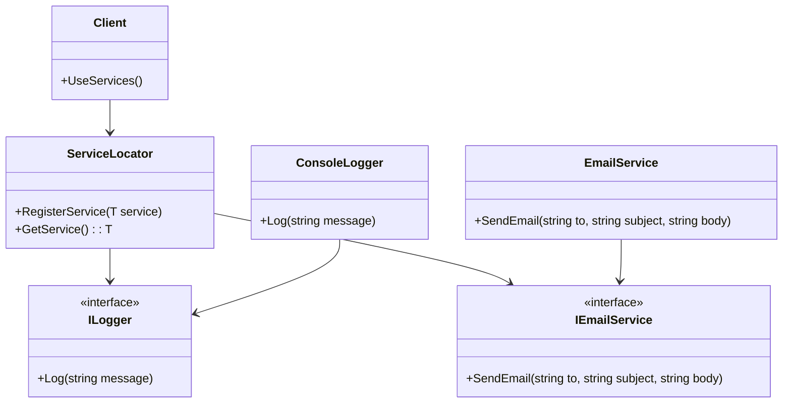

## 4.8 Service Locator Pattern

The Service Locator Pattern is a design pattern that provides a centralized registry for accessing services or dependencies. It is a creational pattern that allows developers to decouple the creation of objects from their usage, promoting a more modular and flexible architecture. In this section, we will delve into the intricacies of the Service Locator Pattern, its implementation in C#, its criticisms, and its appropriate use cases.

### Intent

The primary intent of the Service Locator Pattern is to provide a mechanism to locate and retrieve services or dependencies at runtime. This pattern centralizes the management of dependencies, allowing for easier maintenance and flexibility in changing or swapping services without altering the client code.

### Key Participants

1. **Service Locator**: The central registry that holds references to services and provides methods to retrieve them.
2. **Service Interface**: Defines the contract that services must adhere to.
3. **Concrete Service**: The actual implementation of the service interface.
4. **Client**: The consumer of the services, which retrieves them through the service locator.

### Implementing Service Locator in C#

#### Creating a Service Locator Class

To implement a Service Locator in C#, we start by defining a service interface and its concrete implementation. Then, we create a Service Locator class that maintains a registry of services.

```csharp
// Define a service interface
public interface ILogger
{
    void Log(string message);
}

// Implement the service interface
public class ConsoleLogger : ILogger
{
    public void Log(string message)
    {
        Console.WriteLine($"Log: {message}");
    }
}

// Service Locator class
public class ServiceLocator
{
    private static readonly Dictionary<Type, object> services = new Dictionary<Type, object>();

    // Register a service
    public static void RegisterService<T>(T service)
    {
        services[typeof(T)] = service;
    }

    // Retrieve a service
    public static T GetService<T>()
    {
        return (T)services[typeof(T)];
    }
}

// Usage
class Program
{
    static void Main()
    {
        // Register a service
        ServiceLocator.RegisterService<ILogger>(new ConsoleLogger());

        // Retrieve and use the service
        ILogger logger = ServiceLocator.GetService<ILogger>();
        logger.Log("Service Locator Pattern in action!");
    }
}
```

In this example, we define an `ILogger` interface and a `ConsoleLogger` class that implements it. The `ServiceLocator` class maintains a dictionary of services, allowing clients to register and retrieve services by type.

#### Managing Dependencies Without Injecting Them

The Service Locator Pattern allows for managing dependencies without injecting them directly into the client. This can be advantageous in scenarios where the client does not need to know about the dependencies at compile time.

```csharp
// Another service interface
public interface IEmailService
{
    void SendEmail(string to, string subject, string body);
}

// Implement the email service
public class EmailService : IEmailService
{
    public void SendEmail(string to, string subject, string body)
    {
        Console.WriteLine($"Sending email to {to}: {subject} - {body}");
    }
}

// Register and use multiple services
class Program
{
    static void Main()
    {
        // Register services
        ServiceLocator.RegisterService<ILogger>(new ConsoleLogger());
        ServiceLocator.RegisterService<IEmailService>(new EmailService());

        // Retrieve and use services
        ILogger logger = ServiceLocator.GetService<ILogger>();
        IEmailService emailService = ServiceLocator.GetService<IEmailService>();

        logger.Log("Logging a message.");
        emailService.SendEmail("example@example.com", "Hello", "This is a test email.");
    }
}
```

In this example, we demonstrate how to register and use multiple services through the Service Locator, showcasing its flexibility in managing dependencies.

### Criticism and Alternatives

#### Discussion on the Downsides Compared to Dependency Injection

While the Service Locator Pattern offers flexibility, it has been criticized for several reasons:

1. **Hidden Dependencies**: The pattern can lead to hidden dependencies, making it difficult to understand which services a client relies on.
2. **Testing Challenges**: Testing becomes more challenging as dependencies are not explicitly injected, making it harder to mock or replace services during testing.
3. **Tight Coupling**: Clients become tightly coupled to the Service Locator, reducing the benefits of decoupling that design patterns aim to achieve.

#### Encouraging the Use of Dependency Injection Over Service Locator

Dependency Injection (DI) is often preferred over the Service Locator Pattern due to its explicit handling of dependencies. DI promotes better testability, maintainability, and clarity in code. It allows for easier mocking and replacement of dependencies, facilitating unit testing and reducing coupling.

```csharp
// Using Dependency Injection
public class Application
{
    private readonly ILogger _logger;
    private readonly IEmailService _emailService;

    public Application(ILogger logger, IEmailService emailService)
    {
        _logger = logger;
        _emailService = emailService;
    }

    public void Run()
    {
        _logger.Log("Running application with DI.");
        _emailService.SendEmail("example@example.com", "DI Example", "This is a test email using DI.");
    }
}

// Dependency Injection setup
class Program
{
    static void Main()
    {
        ILogger logger = new ConsoleLogger();
        IEmailService emailService = new EmailService();

        Application app = new Application(logger, emailService);
        app.Run();
    }
}
```

In this example, we demonstrate how Dependency Injection can be used to manage dependencies explicitly, improving code clarity and testability.

### Use Cases and Examples

#### Situations Where Service Locator Might Be Appropriate

Despite its criticisms, the Service Locator Pattern can be useful in certain scenarios:

1. **Legacy Systems**: In legacy systems where refactoring to use Dependency Injection is not feasible, the Service Locator Pattern can provide a way to manage dependencies.
2. **Plugin Architectures**: In plugin architectures where services need to be dynamically loaded and managed, the Service Locator Pattern can offer a flexible solution.
3. **Simple Applications**: In simple applications where the overhead of setting up Dependency Injection frameworks is not justified, the Service Locator Pattern can be a lightweight alternative.

#### Example: Plugin Architecture

```csharp
// Plugin interface
public interface IPlugin
{
    void Execute();
}

// Plugin implementation
public class SamplePlugin : IPlugin
{
    public void Execute()
    {
        Console.WriteLine("Executing Sample Plugin.");
    }
}

// Plugin manager using Service Locator
public class PluginManager
{
    public void LoadPlugins()
    {
        // Register plugins
        ServiceLocator.RegisterService<IPlugin>(new SamplePlugin());
    }

    public void ExecutePlugins()
    {
        // Retrieve and execute plugins
        IPlugin plugin = ServiceLocator.GetService<IPlugin>();
        plugin.Execute();
    }
}

// Usage
class Program
{
    static void Main()
    {
        PluginManager manager = new PluginManager();
        manager.LoadPlugins();
        manager.ExecutePlugins();
    }
}
```

In this example, we demonstrate how the Service Locator Pattern can be used to manage plugins in a plugin architecture, providing flexibility in loading and executing plugins.

### Design Considerations

When considering the use of the Service Locator Pattern, keep the following in mind:

- **Complexity**: Avoid using the pattern in complex systems where Dependency Injection would provide better clarity and maintainability.
- **Testing**: Consider the impact on testing and how dependencies will be mocked or replaced.
- **Documentation**: Ensure that dependencies are well-documented to avoid hidden dependencies and improve code readability.

### Differences and Similarities

The Service Locator Pattern is often compared to Dependency Injection. While both aim to manage dependencies, they differ in their approach:

- **Service Locator**: Centralizes dependency management but can lead to hidden dependencies and testing challenges.
- **Dependency Injection**: Promotes explicit dependency management, improving testability and maintainability.

### Visualizing the Service Locator Pattern

To better understand the Service Locator Pattern, let's visualize its components and interactions using a class diagram.



In this diagram, we see the `ServiceLocator` class managing the `ILogger` and `IEmailService` interfaces, with `ConsoleLogger` and `EmailService` providing concrete implementations. The `Client` interacts with the `ServiceLocator` to retrieve and use these services.

### Try It Yourself

To deepen your understanding of the Service Locator Pattern, try modifying the code examples provided:

- **Add a new service**: Implement a new service interface and concrete class, register it with the Service Locator, and use it in the client.
- **Experiment with different service implementations**: Swap out the `ConsoleLogger` with a different logging implementation and observe how the client code remains unchanged.
- **Test the pattern**: Write unit tests for the client code, focusing on how dependencies are managed and retrieved.

### Knowledge Check

Before moving on, let's summarize the key takeaways:

- The Service Locator Pattern provides a centralized registry for managing services and dependencies.
- It can lead to hidden dependencies and testing challenges, making Dependency Injection a preferred alternative in many cases.
- The pattern is useful in specific scenarios, such as legacy systems and plugin architectures, where its flexibility can be advantageous.

### Embrace the Journey

Remember, mastering design patterns is a journey. As you explore the Service Locator Pattern and its alternatives, you'll gain valuable insights into managing dependencies and designing flexible, maintainable software architectures. Keep experimenting, stay curious, and enjoy the journey!

## Quiz Time!



### What is the primary intent of the Service Locator Pattern?

- [x] To provide a centralized registry for accessing services or dependencies.
- [ ] To enforce strict type checking in service interfaces.
- [ ] To eliminate the need for service interfaces.
- [ ] To replace all instances of Dependency Injection.

> **Explanation:** The Service Locator Pattern aims to centralize the management of services and dependencies, allowing for easier access and flexibility.

### Which of the following is a criticism of the Service Locator Pattern?

- [x] It can lead to hidden dependencies.
- [ ] It enforces strict type checking.
- [ ] It eliminates the need for service interfaces.
- [ ] It simplifies testing.

> **Explanation:** The Service Locator Pattern can lead to hidden dependencies, making it difficult to understand which services a client relies on.

### In which scenario might the Service Locator Pattern be appropriate?

- [x] In a legacy system where refactoring to use Dependency Injection is not feasible.
- [ ] In a new system where Dependency Injection is easily implemented.
- [ ] In a system with no dependencies.
- [ ] In a system that requires strict compile-time type checking.

> **Explanation:** The Service Locator Pattern can be useful in legacy systems where refactoring to use Dependency Injection is not feasible.

### What is a key difference between the Service Locator Pattern and Dependency Injection?

- [x] Service Locator centralizes dependency management, while Dependency Injection promotes explicit dependency management.
- [ ] Service Locator eliminates the need for service interfaces, while Dependency Injection enforces them.
- [ ] Service Locator simplifies testing, while Dependency Injection complicates it.
- [ ] Service Locator enforces strict type checking, while Dependency Injection does not.

> **Explanation:** The Service Locator Pattern centralizes dependency management, while Dependency Injection promotes explicit handling of dependencies.

### What is a potential downside of using the Service Locator Pattern?

- [x] Testing becomes more challenging due to hidden dependencies.
- [ ] It enforces strict compile-time type checking.
- [ ] It eliminates the need for service interfaces.
- [ ] It simplifies the client code.

> **Explanation:** Testing becomes more challenging with the Service Locator Pattern because dependencies are not explicitly injected, making it harder to mock or replace services.

### Which of the following is a key participant in the Service Locator Pattern?

- [x] Service Locator
- [ ] Dependency Injector
- [ ] Type Checker
- [ ] Interface Enforcer

> **Explanation:** The Service Locator is the central registry that holds references to services and provides methods to retrieve them.

### How does the Service Locator Pattern manage dependencies?

- [x] By centralizing them in a registry for retrieval at runtime.
- [ ] By injecting them directly into the client at compile time.
- [ ] By eliminating the need for dependencies.
- [ ] By enforcing strict type checking.

> **Explanation:** The Service Locator Pattern centralizes dependencies in a registry, allowing them to be retrieved at runtime.

### What is a benefit of using Dependency Injection over the Service Locator Pattern?

- [x] Improved testability and maintainability.
- [ ] Simplified client code.
- [ ] Elimination of service interfaces.
- [ ] Enforced strict type checking.

> **Explanation:** Dependency Injection improves testability and maintainability by promoting explicit handling of dependencies.

### Which of the following is a use case for the Service Locator Pattern?

- [x] Plugin architectures where services need to be dynamically loaded.
- [ ] Systems with no dependencies.
- [ ] Systems that require strict compile-time type checking.
- [ ] Systems with no need for service interfaces.

> **Explanation:** The Service Locator Pattern can be useful in plugin architectures where services need to be dynamically loaded and managed.

### True or False: The Service Locator Pattern is always preferred over Dependency Injection.

- [ ] True
- [x] False

> **Explanation:** The Service Locator Pattern is not always preferred over Dependency Injection. Dependency Injection is often favored for its explicit handling of dependencies, improving testability and maintainability.




