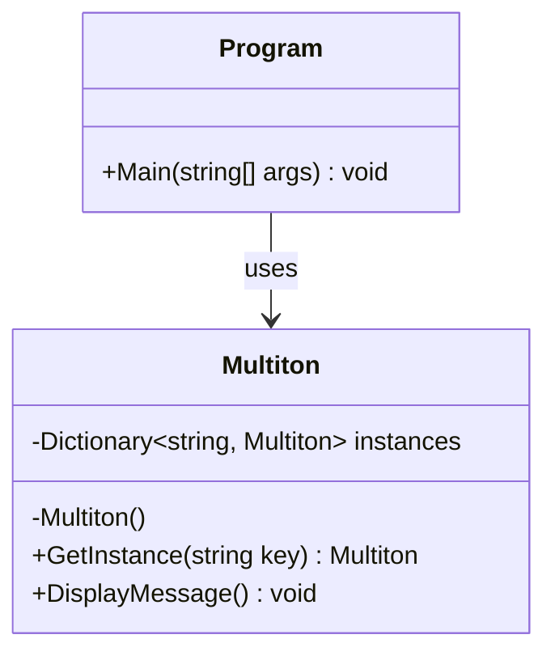

## 4.9 Multiton Pattern

In the realm of software design patterns, the Multiton Pattern stands out as a specialized creational pattern that extends the concept of the Singleton Pattern. While the Singleton Pattern restricts the instantiation of a class to a single object, the Multiton Pattern allows for the controlled creation of multiple instances, each associated with a unique key. This pattern is particularly useful in scenarios where you need to manage a set of instances that are logically singleton per key.

### Intent

The primary intent of the Multiton Pattern is to manage a collection of instances that are uniquely identified by keys. This pattern ensures that only one instance of a class exists for each key, providing a centralized point of access to these instances. By doing so, it helps in reducing memory usage and improving performance by reusing existing instances rather than creating new ones.

### Key Participants

1. **Multiton Class**: The class that implements the Multiton Pattern. It contains a private static dictionary to store instances and a method to retrieve or create instances based on a key.
2. **Client**: The code that interacts with the Multiton class to obtain instances.

### Applicability

The Multiton Pattern is applicable in scenarios where:

- You need to manage a set of instances that are logically singleton per key.
- You want to ensure that only one instance of a class exists for each key.
- You need a centralized point of access to these instances.

### Implementing Multiton in C#

Let's delve into the implementation of the Multiton Pattern in C#. We'll explore how to manage instances through a registry or dictionary, ensuring that each key corresponds to a unique instance.

#### Step-by-Step Implementation

1. **Define the Multiton Class**: Create a class that will implement the Multiton Pattern. This class will have a private static dictionary to store instances and a method to retrieve or create instances based on a key.

```csharp
using System;
using System.Collections.Generic;

public class Multiton
{
    // Private static dictionary to store instances
    private static readonly Dictionary<string, Multiton> instances = new Dictionary<string, Multiton>();

    // Private constructor to prevent direct instantiation
    private Multiton() { }

    // Method to retrieve or create an instance based on a key
    public static Multiton GetInstance(string key)
    {
        if (!instances.ContainsKey(key))
        {
            instances[key] = new Multiton();
        }
        return instances[key];
    }

    // Example method to demonstrate functionality
    public void DisplayMessage()
    {
        Console.WriteLine("Instance for key: " + key);
    }
}
```

2. **Accessing Instances**: Use the `GetInstance` method to retrieve or create instances based on a key. This method checks if an instance for the given key already exists in the dictionary. If not, it creates a new instance and stores it in the dictionary.

```csharp
public class Program
{
    public static void Main(string[] args)
    {
        // Retrieve instances for different keys
        Multiton instance1 = Multiton.GetInstance("Key1");
        Multiton instance2 = Multiton.GetInstance("Key2");
        Multiton instance3 = Multiton.GetInstance("Key1");

        // Display messages to demonstrate functionality
        instance1.DisplayMessage(); // Output: Instance for key: Key1
        instance2.DisplayMessage(); // Output: Instance for key: Key2
        instance3.DisplayMessage(); // Output: Instance for key: Key1

        // Check if instance1 and instance3 are the same
        Console.WriteLine(ReferenceEquals(instance1, instance3)); // Output: True
    }
}
```

### Diagrams

To better understand the Multiton Pattern, let's visualize the relationship between keys and instances using a class diagram.



**Diagram Description**: The class diagram illustrates the `Multiton` class with a private static dictionary to store instances. The `GetInstance` method retrieves or creates instances based on a key. The `Program` class demonstrates how to use the `Multiton` class.

### Use Cases and Examples

The Multiton Pattern is particularly useful in scenarios where you need to manage instances that are logically singleton per key. Let's explore some practical use cases and examples.

#### Use Case 1: Database Connection Pool

In a database-driven application, you might need to manage multiple database connections, each associated with a different database. The Multiton Pattern can be used to manage these connections, ensuring that only one connection exists for each database.

```csharp
public class DatabaseConnection
{
    private static readonly Dictionary<string, DatabaseConnection> connections = new Dictionary<string, DatabaseConnection>();

    private DatabaseConnection() { }

    public static DatabaseConnection GetConnection(string databaseName)
    {
        if (!connections.ContainsKey(databaseName))
        {
            connections[databaseName] = new DatabaseConnection();
        }
        return connections[databaseName];
    }

    public void Connect()
    {
        Console.WriteLine("Connecting to database: " + databaseName);
    }
}
```

#### Use Case 2: Configuration Manager

In a large application, you might have different configurations for different environments (e.g., development, testing, production). The Multiton Pattern can be used to manage these configurations, ensuring that only one configuration exists for each environment.

```csharp
public class ConfigurationManager
{
    private static readonly Dictionary<string, ConfigurationManager> configurations = new Dictionary<string, ConfigurationManager>();

    private ConfigurationManager() { }

    public static ConfigurationManager GetConfiguration(string environment)
    {
        if (!configurations.ContainsKey(environment))
        {
            configurations[environment] = new ConfigurationManager();
        }
        return configurations[environment];
    }

    public void LoadConfiguration()
    {
        Console.WriteLine("Loading configuration for environment: " + environment);
    }
}
```

### Design Considerations

When implementing the Multiton Pattern, consider the following:

- **Thread Safety**: Ensure that the implementation is thread-safe, especially if the pattern is used in a multi-threaded environment. You can use locks or other synchronization mechanisms to achieve thread safety.
- **Memory Management**: Be mindful of memory usage, as the dictionary holding instances can grow indefinitely if not managed properly. Consider implementing a mechanism to remove unused instances.
- **Performance**: The performance of the Multiton Pattern can be impacted by the size of the dictionary and the frequency of access. Optimize the implementation to minimize performance overhead.

### Differences and Similarities

The Multiton Pattern is often compared to the Singleton Pattern. Here are some key differences and similarities:

- **Singleton Pattern**: Restricts the instantiation of a class to a single object. It provides a global point of access to the instance.
- **Multiton Pattern**: Allows for the controlled creation of multiple instances, each associated with a unique key. It provides a centralized point of access to these instances.

Both patterns aim to manage the instantiation of classes, but the Multiton Pattern offers more flexibility by allowing multiple instances, each identified by a key.

### Try It Yourself

To deepen your understanding of the Multiton Pattern, try modifying the code examples provided:

1. **Add Thread Safety**: Implement thread safety in the `GetInstance` method using locks or other synchronization mechanisms.
2. **Implement a Cleanup Mechanism**: Add a method to remove unused instances from the dictionary to manage memory usage.
3. **Extend Functionality**: Add additional methods to the `Multiton` class to demonstrate more complex functionality.

### Knowledge Check

- What is the primary intent of the Multiton Pattern?
- How does the Multiton Pattern differ from the Singleton Pattern?
- What are some practical use cases for the Multiton Pattern?
- How can you ensure thread safety when implementing the Multiton Pattern?
- What are some design considerations to keep in mind when using the Multiton Pattern?

### Embrace the Journey

Remember, mastering design patterns is a journey. As you explore the Multiton Pattern and other design patterns, you'll gain valuable insights into software architecture and design. Keep experimenting, stay curious, and enjoy the journey!

## Quiz Time!



### What is the primary intent of the Multiton Pattern?

- [x] To manage a collection of instances uniquely identified by keys.
- [ ] To restrict the instantiation of a class to a single object.
- [ ] To provide a global point of access to an instance.
- [ ] To allow multiple instances without any restrictions.

> **Explanation:** The Multiton Pattern is designed to manage a collection of instances, each uniquely identified by a key, ensuring that only one instance exists for each key.

### How does the Multiton Pattern differ from the Singleton Pattern?

- [x] The Multiton Pattern allows multiple instances, each identified by a key.
- [ ] The Multiton Pattern restricts instantiation to a single object.
- [ ] The Singleton Pattern allows multiple instances, each identified by a key.
- [ ] The Singleton Pattern provides a centralized point of access to instances.

> **Explanation:** The Multiton Pattern allows for multiple instances, each associated with a unique key, whereas the Singleton Pattern restricts instantiation to a single object.

### Which of the following is a use case for the Multiton Pattern?

- [x] Managing database connections for different databases.
- [ ] Restricting the instantiation of a class to a single object.
- [ ] Providing a global point of access to a single instance.
- [ ] Allowing multiple instances without any restrictions.

> **Explanation:** The Multiton Pattern is useful for managing instances that are logically singleton per key, such as database connections for different databases.

### How can you ensure thread safety when implementing the Multiton Pattern?

- [x] Use locks or other synchronization mechanisms.
- [ ] Avoid using a dictionary to store instances.
- [ ] Allow multiple threads to access the dictionary simultaneously.
- [ ] Use a single instance for all keys.

> **Explanation:** Thread safety can be ensured by using locks or other synchronization mechanisms to prevent concurrent access to the dictionary storing instances.

### What is a design consideration when using the Multiton Pattern?

- [x] Be mindful of memory usage and implement a cleanup mechanism.
- [ ] Allow the dictionary to grow indefinitely without management.
- [ ] Use a single instance for all keys.
- [ ] Avoid using synchronization mechanisms for thread safety.

> **Explanation:** It's important to manage memory usage by implementing a cleanup mechanism to remove unused instances from the dictionary.

### Which pattern is often compared to the Multiton Pattern?

- [x] Singleton Pattern
- [ ] Factory Method Pattern
- [ ] Observer Pattern
- [ ] Strategy Pattern

> **Explanation:** The Multiton Pattern is often compared to the Singleton Pattern, as both manage the instantiation of classes, but the Multiton Pattern allows multiple instances per key.

### What is a key participant in the Multiton Pattern?

- [x] Multiton Class
- [ ] Observer Class
- [ ] Strategy Class
- [ ] Factory Class

> **Explanation:** The Multiton Class is a key participant in the Multiton Pattern, responsible for managing instances through a dictionary.

### What is the purpose of the `GetInstance` method in the Multiton Pattern?

- [x] To retrieve or create an instance based on a key.
- [ ] To restrict the instantiation of a class to a single object.
- [ ] To provide a global point of access to an instance.
- [ ] To allow multiple instances without any restrictions.

> **Explanation:** The `GetInstance` method retrieves or creates an instance based on a key, ensuring that only one instance exists for each key.

### What is a potential drawback of the Multiton Pattern?

- [x] The dictionary holding instances can grow indefinitely if not managed properly.
- [ ] It restricts the instantiation of a class to a single object.
- [ ] It provides a global point of access to an instance.
- [ ] It allows multiple instances without any restrictions.

> **Explanation:** A potential drawback of the Multiton Pattern is that the dictionary holding instances can grow indefinitely if not managed properly, leading to increased memory usage.

### True or False: The Multiton Pattern provides a centralized point of access to instances.

- [x] True
- [ ] False

> **Explanation:** True. The Multiton Pattern provides a centralized point of access to instances, ensuring that only one instance exists for each key.


