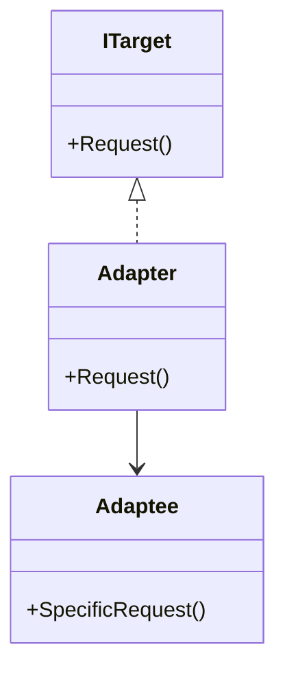

## 5.1 Adapter Design Pattern

In the realm of software engineering, the Adapter Design Pattern is a structural pattern that plays a crucial role in enabling incompatible interfaces to work together. This pattern acts as a bridge between two incompatible interfaces, allowing them to communicate seamlessly. In this section, we will delve into the intricacies of the Adapter Design Pattern, its implementation in C#, and explore its practical applications.

### Intent

The primary intent of the Adapter Design Pattern is to allow two incompatible interfaces to work together. It involves creating an adapter that translates the interface of a class into another interface that clients expect. This pattern is particularly useful when integrating with legacy code or third-party libraries that do not match the current system's interface.

### Key Participants

1. **Target Interface**: The interface that the client expects.
2. **Adaptee**: The existing interface that needs adaptation.
3. **Adapter**: The class that implements the target interface and translates the requests to the adaptee.

### Implementing Adapter in C#

The Adapter Design Pattern can be implemented in two primary ways in C#: using class adapters and object adapters. Let's explore each approach in detail.

#### Class Adapter

A class adapter uses inheritance to adapt one interface to another. This approach involves creating a new class that inherits from the adaptee and implements the target interface.

```csharp
// Target interface
public interface ITarget
{
    void Request();
}

// Adaptee class
public class Adaptee
{
    public void SpecificRequest()
    {
        Console.WriteLine("Called SpecificRequest()");
    }
}

// Adapter class
public class ClassAdapter : Adaptee, ITarget
{
    public void Request()
    {
        // Translate the request to the adaptee's method
        SpecificRequest();
    }
}

// Client code
public class Client
{
    public void Execute()
    {
        ITarget target = new ClassAdapter();
        target.Request();
    }
}
```

In this example, the `ClassAdapter` inherits from `Adaptee` and implements the `ITarget` interface. The `Request` method in the adapter translates the call to the `SpecificRequest` method of the adaptee.

#### Object Adapter

An object adapter uses composition to achieve the same goal. Instead of inheriting from the adaptee, the adapter holds a reference to an instance of the adaptee.

```csharp
// Target interface
public interface ITarget
{
    void Request();
}

// Adaptee class
public class Adaptee
{
    public void SpecificRequest()
    {
        Console.WriteLine("Called SpecificRequest()");
    }
}

// Adapter class
public class ObjectAdapter : ITarget
{
    private readonly Adaptee _adaptee;

    public ObjectAdapter(Adaptee adaptee)
    {
        _adaptee = adaptee;
    }

    public void Request()
    {
        // Translate the request to the adaptee's method
        _adaptee.SpecificRequest();
    }
}

// Client code
public class Client
{
    public void Execute()
    {
        Adaptee adaptee = new Adaptee();
        ITarget target = new ObjectAdapter(adaptee);
        target.Request();
    }
}
```

In the object adapter example, the `ObjectAdapter` holds a reference to an `Adaptee` instance and implements the `ITarget` interface. The `Request` method delegates the call to the `SpecificRequest` method of the adaptee.

### Class vs. Object Adapters

Understanding the differences between class and object adapters is crucial for selecting the appropriate approach for your use case.

- **Class Adapter**:
  - Uses inheritance.
  - Can only adapt a single class (no multiple inheritance in C#).
  - Directly accesses protected members of the adaptee.

- **Object Adapter**:
  - Uses composition.
  - Can adapt multiple classes.
  - More flexible and adheres to the composition over inheritance principle.

### Use Cases and Examples

The Adapter Design Pattern is widely used in various scenarios, particularly when dealing with legacy systems or third-party libraries.

#### Integrating with Legacy Code

When integrating new functionality into an existing system, you may encounter legacy code with interfaces that do not match the new system's requirements. The adapter pattern allows you to create a bridge between the old and new interfaces without modifying the legacy code.

#### Example: Media Player

Consider a media player application that supports playing audio files. You want to add support for video files, but the existing interface only supports audio playback.

```csharp
// Existing audio player interface
public interface IAudioPlayer
{
    void PlayAudio(string fileName);
}

// New video player class
public class VideoPlayer
{
    public void PlayVideo(string fileName)
    {
        Console.WriteLine($"Playing video file: {fileName}");
    }
}

// Adapter class
public class MediaAdapter : IAudioPlayer
{
    private readonly VideoPlayer _videoPlayer;

    public MediaAdapter(VideoPlayer videoPlayer)
    {
        _videoPlayer = videoPlayer;
    }

    public void PlayAudio(string fileName)
    {
        // Translate audio play request to video play request
        _videoPlayer.PlayVideo(fileName);
    }
}

// Client code
public class MediaPlayer
{
    private readonly IAudioPlayer _audioPlayer;

    public MediaPlayer(IAudioPlayer audioPlayer)
    {
        _audioPlayer = audioPlayer;
    }

    public void Play(string fileName)
    {
        _audioPlayer.PlayAudio(fileName);
    }
}

// Usage
public class Program
{
    public static void Main()
    {
        VideoPlayer videoPlayer = new VideoPlayer();
        IAudioPlayer mediaAdapter = new MediaAdapter(videoPlayer);
        MediaPlayer mediaPlayer = new MediaPlayer(mediaAdapter);

        mediaPlayer.Play("example.mp4");
    }
}
```

In this example, the `MediaAdapter` adapts the `VideoPlayer` class to the `IAudioPlayer` interface, allowing the `MediaPlayer` to play video files using the existing audio interface.

### Design Considerations

When implementing the Adapter Design Pattern, consider the following:

- **Interface Compatibility**: Ensure that the adapter correctly translates between the target and adaptee interfaces.
- **Performance Overhead**: Be mindful of any performance overhead introduced by the adapter, especially in performance-critical applications.
- **Maintainability**: Keep the adapter implementation simple and maintainable to facilitate future changes.

### Differences and Similarities

The Adapter Design Pattern is often confused with the Facade Pattern. While both patterns provide a simplified interface, the key difference is their intent:

- **Adapter Pattern**: Focuses on converting an interface into another interface that clients expect.
- **Facade Pattern**: Provides a simplified interface to a complex subsystem without altering its functionality.

### Visualizing the Adapter Pattern

To better understand the Adapter Design Pattern, let's visualize the relationships between the target, adaptee, and adapter using a class diagram.



In this diagram, the `Adapter` class implements the `ITarget` interface and holds a reference to the `Adaptee` class, translating requests from the target to the adaptee.

### Try It Yourself

To deepen your understanding of the Adapter Design Pattern, try modifying the code examples provided. Experiment with different interfaces and adaptees to see how the adapter pattern can be applied in various scenarios. Consider creating adapters for other types of media players or integrating additional functionality into the existing system.

### Knowledge Check

Before we conclude, let's reinforce your understanding of the Adapter Design Pattern with a few questions:

- What is the primary intent of the Adapter Design Pattern?
- How does a class adapter differ from an object adapter?
- In what scenarios is the Adapter Design Pattern particularly useful?
- What are the key participants in the Adapter Design Pattern?

### Embrace the Journey

Remember, mastering design patterns is a journey. As you continue to explore and apply these patterns, you'll gain a deeper understanding of how to build scalable and maintainable software systems. Keep experimenting, stay curious, and enjoy the journey!

## Quiz Time!



### What is the primary intent of the Adapter Design Pattern?

- [x] To allow incompatible interfaces to work together.
- [ ] To provide a simplified interface to a complex subsystem.
- [ ] To create a new interface for existing classes.
- [ ] To encapsulate a group of individual factories.

> **Explanation:** The Adapter Design Pattern is intended to allow incompatible interfaces to work together by translating one interface into another that clients expect.

### How does a class adapter differ from an object adapter?

- [x] A class adapter uses inheritance, while an object adapter uses composition.
- [ ] A class adapter uses composition, while an object adapter uses inheritance.
- [ ] A class adapter can adapt multiple classes, while an object adapter cannot.
- [ ] A class adapter is more flexible than an object adapter.

> **Explanation:** A class adapter uses inheritance to adapt interfaces, whereas an object adapter uses composition, making it more flexible and capable of adapting multiple classes.

### In what scenarios is the Adapter Design Pattern particularly useful?

- [x] When integrating with legacy code or third-party libraries.
- [ ] When creating a new interface for existing classes.
- [ ] When simplifying a complex subsystem.
- [ ] When encapsulating a group of individual factories.

> **Explanation:** The Adapter Design Pattern is particularly useful when integrating with legacy code or third-party libraries that have incompatible interfaces.

### What are the key participants in the Adapter Design Pattern?

- [x] Target Interface, Adaptee, Adapter
- [ ] Client, Factory, Product
- [ ] Context, Strategy, ConcreteStrategy
- [ ] Subject, Observer, ConcreteObserver

> **Explanation:** The key participants in the Adapter Design Pattern are the Target Interface, Adaptee, and Adapter.

### Which pattern is often confused with the Adapter Pattern?

- [x] Facade Pattern
- [ ] Singleton Pattern
- [ ] Observer Pattern
- [ ] Factory Pattern

> **Explanation:** The Adapter Pattern is often confused with the Facade Pattern, as both provide simplified interfaces, but their intents differ.

### What is a potential drawback of using the Adapter Pattern?

- [x] Performance overhead due to additional abstraction.
- [ ] Increased complexity in the subsystem.
- [ ] Difficulty in maintaining the adapter code.
- [ ] Limited flexibility in adapting multiple classes.

> **Explanation:** A potential drawback of using the Adapter Pattern is the performance overhead introduced by the additional abstraction layer.

### Which principle does the object adapter adhere to?

- [x] Composition over inheritance
- [ ] Inheritance over composition
- [ ] Single responsibility principle
- [ ] Open/closed principle

> **Explanation:** The object adapter adheres to the principle of composition over inheritance by using composition to adapt interfaces.

### What is the role of the Adapter class in the Adapter Pattern?

- [x] To translate requests from the target interface to the adaptee.
- [ ] To provide a simplified interface to a complex subsystem.
- [ ] To create a new interface for existing classes.
- [ ] To encapsulate a group of individual factories.

> **Explanation:** The Adapter class translates requests from the target interface to the adaptee, allowing incompatible interfaces to work together.

### Can the Adapter Pattern be used to adapt multiple classes?

- [x] Yes, using an object adapter.
- [ ] No, it can only adapt a single class.
- [ ] Yes, using a class adapter.
- [ ] No, it is not designed for multiple classes.

> **Explanation:** The Adapter Pattern can adapt multiple classes using an object adapter, which uses composition to achieve this flexibility.

### True or False: The Adapter Pattern can be implemented using both inheritance and composition.

- [x] True
- [ ] False

> **Explanation:** True. The Adapter Pattern can be implemented using both inheritance (class adapter) and composition (object adapter).


