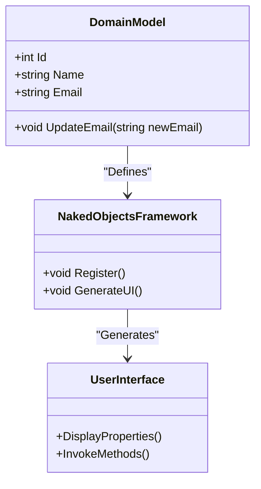

## 5.10 Naked Objects Pattern

The Naked Objects Pattern is a unique approach in software design that emphasizes the automatic generation of user interfaces directly from the domain model. This pattern is particularly useful for rapid application development and creating administrative interfaces. By focusing on the domain model, developers can ensure that the business logic remains central, while the user interface is dynamically generated to reflect the underlying data structures and relationships.

### Intent

The primary intent of the Naked Objects Pattern is to streamline the development process by eliminating the need for manually coding user interfaces. Instead, the UI is automatically generated based on the domain model, allowing developers to focus on the core business logic. This approach not only speeds up development but also ensures that the UI is always in sync with the domain model, reducing the risk of inconsistencies.

### Key Participants

1. **Domain Model**: The central component of the Naked Objects Pattern. It defines the business logic and data structures that the application operates on.
2. **Naked Objects Framework**: A framework that supports the dynamic generation of user interfaces from the domain model. Examples include the Naked Objects Framework for .NET.
3. **User Interface**: Automatically generated based on the domain model, providing a direct representation of the underlying data and operations.

### Applicability

The Naked Objects Pattern is particularly applicable in scenarios where:

- Rapid application development is required.
- The domain model is complex and subject to frequent changes.
- Consistency between the UI and the domain model is critical.
- Administrative interfaces are needed, where the focus is on data manipulation rather than aesthetics.

### Implementing Naked Objects in C#

Implementing the Naked Objects Pattern in C# involves utilizing frameworks that support dynamic UI generation. One such framework is the Naked Objects Framework for .NET, which provides the necessary tools to automatically generate user interfaces from domain models.

#### Step-by-Step Implementation

1. **Define the Domain Model**: Start by defining the domain model using C# classes. These classes should encapsulate the business logic and data structures.

    ```csharp
    public class Customer
    {
        public int Id { get; set; }
        public string Name { get; set; }
        public string Email { get; set; }

        public void UpdateEmail(string newEmail)
        {
            // Business logic for updating email
            Email = newEmail;
        }
    }
    ```

2. **Configure the Naked Objects Framework**: Set up the Naked Objects Framework in your C# project. This involves installing the necessary packages and configuring the framework to recognize your domain model.

3. **Generate the User Interface**: Once the domain model is defined and the framework is configured, the user interface can be automatically generated. The framework will create a UI that reflects the properties and methods of the domain model.

4. **Customize the UI**: While the Naked Objects Pattern emphasizes automatic UI generation, there may be scenarios where customization is required. The framework provides hooks and extensions to allow for UI customization.

#### Code Example

Below is a simple example demonstrating how to implement the Naked Objects Pattern in C# using a hypothetical framework:

```csharp
using NakedObjects;

public class Product
{
    public int ProductId { get; set; }
    public string ProductName { get; set; }
    public decimal Price { get; set; }

    public void ApplyDiscount(decimal discountPercentage)
    {
        // Business logic for applying discount
        Price -= Price * (discountPercentage / 100);
    }
}

// Configure the Naked Objects Framework
public class NakedObjectsConfiguration
{
    public void Configure()
    {
        // Framework configuration code
        // Register domain model classes
        NakedObjectsFramework.Register<Product>();
    }
}

// Main application
public class Program
{
    public static void Main(string[] args)
    {
        // Initialize and run the Naked Objects application
        var app = new NakedObjectsApplication();
        app.Run();
    }
}
```

### Design Considerations

When using the Naked Objects Pattern, consider the following:

- **Domain-Driven Design (DDD)**: The pattern aligns well with DDD principles, as it emphasizes the importance of the domain model.
- **UI Customization**: While the pattern promotes automatic UI generation, there may be cases where customization is necessary. Ensure that the chosen framework supports this.
- **Performance**: Automatically generated UIs may not be as optimized as manually crafted ones. Evaluate the performance implications for your specific use case.

### Differences and Similarities

The Naked Objects Pattern is often compared to other UI generation patterns, such as Model-View-Controller (MVC) and Model-View-ViewModel (MVVM). While MVC and MVVM separate the UI from the business logic, the Naked Objects Pattern integrates them by generating the UI directly from the domain model. This integration can lead to faster development times but may limit flexibility in UI design.

### Use Cases and Examples

The Naked Objects Pattern is particularly useful in the following scenarios:

- **Rapid Application Development**: By automating UI generation, developers can quickly prototype and develop applications.
- **Administrative Interfaces**: For applications where data manipulation is the primary focus, such as admin panels, the Naked Objects Pattern provides a straightforward solution.
- **Complex Domain Models**: In applications with complex and evolving domain models, the pattern ensures that the UI remains consistent with the underlying data structures.

### Visualizing the Naked Objects Pattern

To better understand the Naked Objects Pattern, let's visualize the relationship between the domain model, the framework, and the generated user interface.



**Diagram Explanation**: This diagram illustrates how the domain model defines the business logic and data structures, which the Naked Objects Framework uses to generate the user interface. The UI directly reflects the properties and methods of the domain model, ensuring consistency and alignment with the business logic.

### Try It Yourself

To get hands-on experience with the Naked Objects Pattern, try modifying the code examples provided. Experiment with adding new properties and methods to the domain model, and observe how the generated UI changes. This exercise will help reinforce your understanding of how the pattern works and its benefits in rapid application development.

### Knowledge Check

Before we conclude, let's summarize the key takeaways:

- The Naked Objects Pattern emphasizes automatic UI generation from the domain model.
- It is particularly useful for rapid application development and administrative interfaces.
- The pattern aligns well with Domain-Driven Design principles.
- While it speeds up development, consider the trade-offs in terms of UI customization and performance.

### Embrace the Journey

Remember, mastering design patterns is a journey. The Naked Objects Pattern offers a unique approach to software design, and by experimenting with it, you'll gain valuable insights into how domain models can drive user interface generation. Keep exploring, stay curious, and enjoy the process of learning and applying new patterns in your software development projects.

## Quiz Time!



### What is the primary intent of the Naked Objects Pattern?

- [x] To automatically generate user interfaces from the domain model
- [ ] To separate the UI from the business logic
- [ ] To enhance UI customization
- [ ] To improve performance of applications

> **Explanation:** The Naked Objects Pattern focuses on automatically generating user interfaces directly from the domain model, ensuring consistency and rapid development.

### Which framework is commonly used for implementing the Naked Objects Pattern in C#?

- [x] Naked Objects Framework for .NET
- [ ] ASP.NET Core
- [ ] Entity Framework
- [ ] Xamarin

> **Explanation:** The Naked Objects Framework for .NET is specifically designed to support the Naked Objects Pattern by generating UIs from domain models.

### In which scenarios is the Naked Objects Pattern particularly useful?

- [x] Rapid application development
- [x] Administrative interfaces
- [ ] High-performance gaming applications
- [ ] Static website development

> **Explanation:** The pattern is ideal for rapid application development and administrative interfaces where data manipulation is key.

### What is a key consideration when using the Naked Objects Pattern?

- [x] UI customization may be limited
- [ ] It requires extensive manual coding
- [ ] It is not compatible with Domain-Driven Design
- [ ] It is only suitable for small applications

> **Explanation:** While the pattern automates UI generation, customization options may be limited compared to manually crafted UIs.

### How does the Naked Objects Pattern align with Domain-Driven Design (DDD)?

- [x] It emphasizes the importance of the domain model
- [ ] It separates the UI from the domain model
- [ ] It focuses on UI aesthetics
- [ ] It disregards business logic

> **Explanation:** The pattern aligns with DDD by placing the domain model at the center of the application, driving both business logic and UI generation.

### What is a potential drawback of using the Naked Objects Pattern?

- [x] Performance may be less optimized
- [ ] It requires extensive UI design skills
- [ ] It is incompatible with C#
- [ ] It cannot handle complex domain models

> **Explanation:** Automatically generated UIs may not be as optimized as manually designed ones, potentially impacting performance.

### Which of the following is NOT a key participant in the Naked Objects Pattern?

- [ ] Domain Model
- [ ] Naked Objects Framework
- [ ] User Interface
- [x] Database Schema

> **Explanation:** The key participants are the domain model, the framework, and the user interface. The database schema is not directly involved in the pattern.

### What is the role of the Naked Objects Framework?

- [x] To generate the user interface from the domain model
- [ ] To design the database schema
- [ ] To handle network communication
- [ ] To optimize application performance

> **Explanation:** The framework's role is to generate the UI based on the domain model, ensuring consistency and alignment with business logic.

### Which design principle does the Naked Objects Pattern support?

- [x] Domain-Driven Design
- [ ] Separation of Concerns
- [ ] Single Responsibility Principle
- [ ] Open/Closed Principle

> **Explanation:** The pattern supports Domain-Driven Design by emphasizing the domain model's central role in application development.

### True or False: The Naked Objects Pattern is suitable for applications where UI aesthetics are a primary concern.

- [ ] True
- [x] False

> **Explanation:** The pattern focuses on functionality and consistency with the domain model, rather than UI aesthetics.


