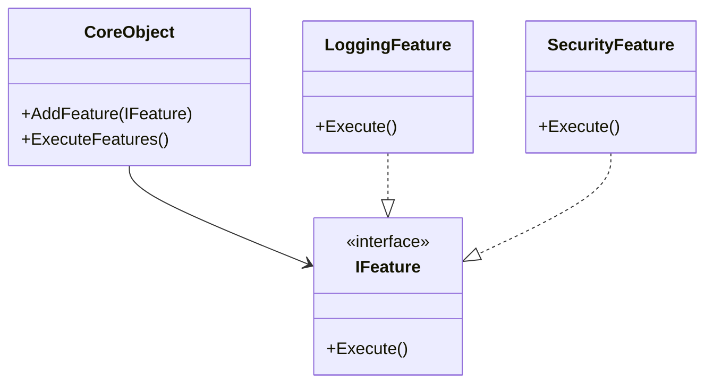

## 5.11 Extension Object Pattern

In the realm of software design, the ability to extend the functionality of objects without altering their structure is a powerful tool. The Extension Object Pattern is a structural design pattern that allows developers to add new capabilities to objects dynamically. This pattern is particularly useful in scenarios where the class hierarchy is fixed, or when you want to keep the core class clean and focused on its primary responsibilities.

### Intent

The primary intent of the Extension Object Pattern is to enable the addition of new functionality to objects without modifying their existing structure. This is achieved by attaching extension objects that encapsulate the new behavior. This pattern is especially beneficial when dealing with closed class hierarchies or when you want to avoid the pitfalls of subclassing.

### Key Participants

1. **Core Object**: The object to which new functionality will be added.
2. **Extension Object**: The object that encapsulates the new functionality.
3. **Extension Manager**: Manages the extensions and facilitates the interaction between the core object and its extensions.

### Applicability

- When you need to add functionality to objects without modifying their structure.
- When subclassing is not feasible or desirable.
- In plugin systems where new features can be added dynamically.
- When implementing feature toggles that can be enabled or disabled at runtime.

### Implementing Extension Objects in C#

In C#, the Extension Object Pattern can be implemented using extension methods and composition. Let's explore these techniques in detail.

#### Using Extension Methods

Extension methods in C# provide a way to add new methods to existing types without modifying their source code. They are defined as static methods in a static class and use the `this` keyword to specify the type they extend.

```csharp
public static class StringExtensions
{
    // Extension method to reverse a string
    public static string Reverse(this string str)
    {
        char[] charArray = str.ToCharArray();
        Array.Reverse(charArray);
        return new string(charArray);
    }
}

// Usage
string original = "Hello, World!";
string reversed = original.Reverse();
Console.WriteLine(reversed); // Output: !dlroW ,olleH
```

In this example, we define an extension method `Reverse` for the `string` type. This method can be called on any string instance, providing additional functionality without altering the `string` class itself.

#### Using Composition

Composition is another powerful technique for implementing the Extension Object Pattern. By composing objects, you can add new behavior dynamically.

```csharp
public interface IFeature
{
    void Execute();
}

public class CoreObject
{
    private readonly List<IFeature> _features = new List<IFeature>();

    public void AddFeature(IFeature feature)
    {
        _features.Add(feature);
    }

    public void ExecuteFeatures()
    {
        foreach (var feature in _features)
        {
            feature.Execute();
        }
    }
}

public class LoggingFeature : IFeature
{
    public void Execute()
    {
        Console.WriteLine("Logging feature executed.");
    }
}

public class SecurityFeature : IFeature
{
    public void Execute()
    {
        Console.WriteLine("Security feature executed.");
    }
}

// Usage
CoreObject core = new CoreObject();
core.AddFeature(new LoggingFeature());
core.AddFeature(new SecurityFeature());
core.ExecuteFeatures();
// Output:
// Logging feature executed.
// Security feature executed.
```

In this example, `CoreObject` can dynamically add and execute features. Each feature implements the `IFeature` interface, allowing for flexible and extensible behavior.

### Adding Functionality at Runtime

One of the significant advantages of the Extension Object Pattern is the ability to add functionality at runtime. This is particularly useful in scenarios where the requirements may change, or new features need to be integrated without redeploying the entire application.

#### Enhancing Objects Without Altering Class Definitions

By using extension methods and composition, you can enhance objects without altering their class definitions. This approach promotes the Open/Closed Principle, one of the SOLID principles, which states that software entities should be open for extension but closed for modification.

### Use Cases and Examples

The Extension Object Pattern is widely used in various scenarios, including plugin systems and feature toggles.

#### Plugin Systems

In a plugin system, new features can be added dynamically without modifying the core application. This is achieved by defining a common interface for plugins and allowing the application to load and execute them at runtime.

```csharp
public interface IPlugin
{
    void Run();
}

public class PluginManager
{
    private readonly List<IPlugin> _plugins = new List<IPlugin>();

    public void LoadPlugin(IPlugin plugin)
    {
        _plugins.Add(plugin);
    }

    public void ExecutePlugins()
    {
        foreach (var plugin in _plugins)
        {
            plugin.Run();
        }
    }
}

public class SamplePlugin : IPlugin
{
    public void Run()
    {
        Console.WriteLine("Sample plugin executed.");
    }
}

// Usage
PluginManager manager = new PluginManager();
manager.LoadPlugin(new SamplePlugin());
manager.ExecutePlugins();
// Output: Sample plugin executed.
```

In this example, `PluginManager` manages a collection of plugins, allowing them to be loaded and executed dynamically.

#### Feature Toggles

Feature toggles allow you to enable or disable features at runtime, providing flexibility in feature management and deployment.

```csharp
public interface IFeatureToggle
{
    bool IsEnabled { get; }
    void Execute();
}

public class FeatureToggleManager
{
    private readonly List<IFeatureToggle> _features = new List<IFeatureToggle>();

    public void AddFeature(IFeatureToggle feature)
    {
        _features.Add(feature);
    }

    public void ExecuteEnabledFeatures()
    {
        foreach (var feature in _features)
        {
            if (feature.IsEnabled)
            {
                feature.Execute();
            }
        }
    }
}

public class BetaFeature : IFeatureToggle
{
    public bool IsEnabled => true;

    public void Execute()
    {
        Console.WriteLine("Beta feature executed.");
    }
}

// Usage
FeatureToggleManager toggleManager = new FeatureToggleManager();
toggleManager.AddFeature(new BetaFeature());
toggleManager.ExecuteEnabledFeatures();
// Output: Beta feature executed.
```

In this example, `FeatureToggleManager` manages features that can be toggled on or off, allowing for dynamic feature management.

### Design Considerations

When implementing the Extension Object Pattern, consider the following:

- **Performance**: Adding extensions dynamically can introduce overhead. Ensure that the performance impact is acceptable for your application.
- **Complexity**: While the pattern provides flexibility, it can also increase complexity. Use it judiciously to avoid overengineering.
- **Compatibility**: Ensure that extensions are compatible with the core object and do not introduce conflicts.

### Differences and Similarities

The Extension Object Pattern is often compared to the Decorator Pattern. While both patterns add functionality to objects, the key difference lies in their approach. The Decorator Pattern wraps objects to add behavior, whereas the Extension Object Pattern attaches extensions to add functionality.

### Visualizing the Extension Object Pattern

To better understand the Extension Object Pattern, let's visualize the relationship between the core object and its extensions using a class diagram.



**Diagram Description**: The class diagram illustrates the `CoreObject` class, which can add and execute features. The `IFeature` interface defines the contract for features, and `LoggingFeature` and `SecurityFeature` are concrete implementations of this interface.

### Try It Yourself

Experiment with the Extension Object Pattern by modifying the code examples provided. Try adding new features or plugins, and observe how they integrate seamlessly with the core object. Consider implementing a feature toggle that can be enabled or disabled based on user input or configuration settings.

### Knowledge Check

- What is the primary intent of the Extension Object Pattern?
- How do extension methods in C# facilitate the implementation of the Extension Object Pattern?
- What are some common use cases for the Extension Object Pattern?
- How does the Extension Object Pattern differ from the Decorator Pattern?

### Embrace the Journey

Remember, mastering design patterns is a journey. The Extension Object Pattern is just one of many tools in your software design toolkit. As you continue to explore and experiment, you'll discover new ways to enhance your applications and create flexible, maintainable code. Keep experimenting, stay curious, and enjoy the journey!

## Quiz Time!



### What is the primary intent of the Extension Object Pattern?

- [x] To add new functionality to objects without modifying their structure.
- [ ] To modify the structure of objects to add new functionality.
- [ ] To replace existing functionality in objects.
- [ ] To create new objects with additional functionality.

> **Explanation:** The Extension Object Pattern is designed to add new functionality to objects without altering their existing structure.

### How do extension methods in C# facilitate the implementation of the Extension Object Pattern?

- [x] By allowing new methods to be added to existing types without modifying their source code.
- [ ] By modifying the source code of existing types to add new methods.
- [ ] By creating new types that inherit from existing types.
- [ ] By replacing existing methods with new implementations.

> **Explanation:** Extension methods in C# allow developers to add new methods to existing types without altering their source code, making them a key tool for implementing the Extension Object Pattern.

### What are some common use cases for the Extension Object Pattern?

- [x] Plugin systems and feature toggles.
- [ ] Data validation and error handling.
- [ ] Logging and auditing.
- [ ] User authentication and authorization.

> **Explanation:** The Extension Object Pattern is commonly used in plugin systems and feature toggles, where new functionality can be added dynamically.

### How does the Extension Object Pattern differ from the Decorator Pattern?

- [x] The Extension Object Pattern attaches extensions to add functionality, while the Decorator Pattern wraps objects.
- [ ] The Extension Object Pattern wraps objects, while the Decorator Pattern attaches extensions.
- [ ] Both patterns wrap objects to add functionality.
- [ ] Both patterns attach extensions to add functionality.

> **Explanation:** The key difference is that the Extension Object Pattern attaches extensions to add functionality, whereas the Decorator Pattern wraps objects.

### What is a key benefit of using the Extension Object Pattern?

- [x] It allows for the dynamic addition of functionality without modifying the core object.
- [ ] It simplifies the code by reducing the number of classes.
- [ ] It enhances performance by reducing overhead.
- [ ] It ensures compatibility with all existing systems.

> **Explanation:** A key benefit of the Extension Object Pattern is its ability to dynamically add functionality without altering the core object's structure.

### Which of the following is a potential drawback of the Extension Object Pattern?

- [x] Increased complexity.
- [ ] Reduced flexibility.
- [ ] Incompatibility with existing systems.
- [ ] Decreased performance.

> **Explanation:** While the Extension Object Pattern provides flexibility, it can also increase complexity, which should be managed carefully.

### In the context of the Extension Object Pattern, what is a core object?

- [x] The object to which new functionality will be added.
- [ ] The object that encapsulates the new functionality.
- [ ] The object that manages the extensions.
- [ ] The object that replaces existing functionality.

> **Explanation:** The core object is the one to which new functionality is added through extensions.

### What role does the Extension Manager play in the Extension Object Pattern?

- [x] It manages the extensions and facilitates interaction between the core object and its extensions.
- [ ] It encapsulates the new functionality.
- [ ] It replaces existing functionality in the core object.
- [ ] It creates new objects with additional functionality.

> **Explanation:** The Extension Manager is responsible for managing extensions and facilitating their interaction with the core object.

### Can the Extension Object Pattern be used to modify existing functionality in objects?

- [ ] Yes
- [x] No

> **Explanation:** The Extension Object Pattern is designed to add new functionality, not modify existing functionality.

### Is subclassing a recommended approach when using the Extension Object Pattern?

- [ ] True
- [x] False

> **Explanation:** The Extension Object Pattern is used as an alternative to subclassing, allowing for the addition of functionality without modifying the class hierarchy.




