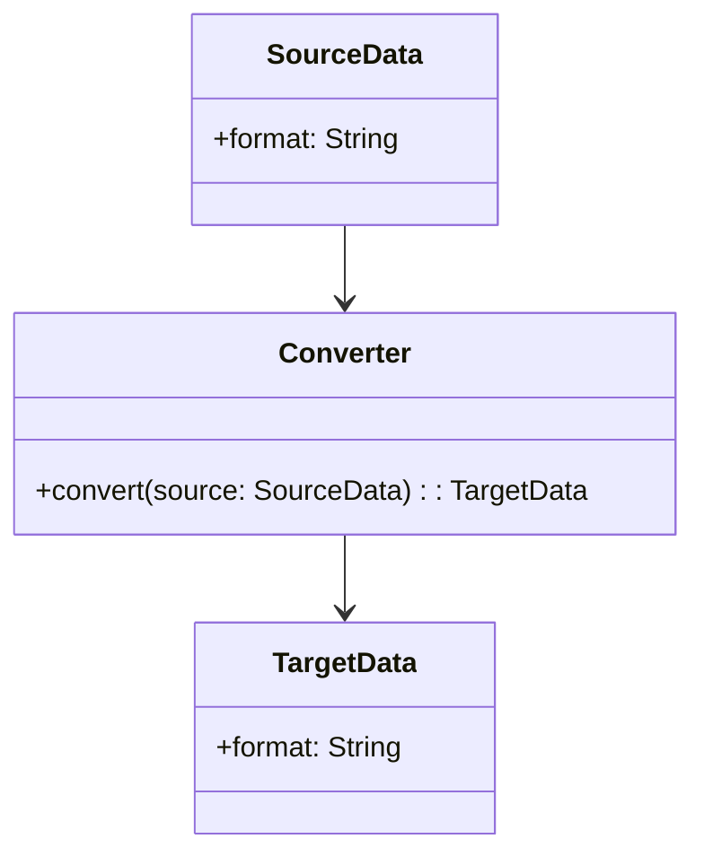
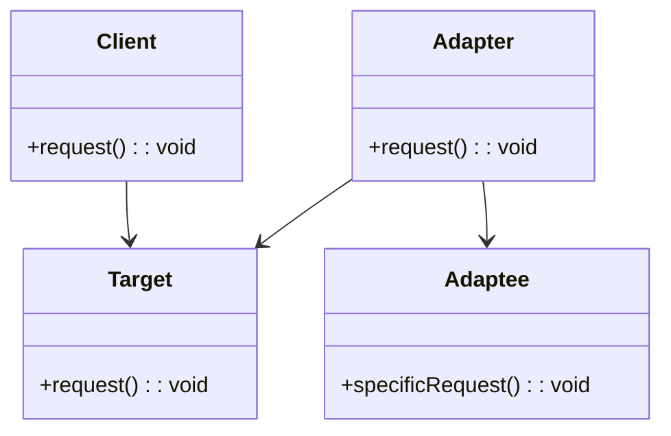

## 5.12 Converter vs. Adapter

In the realm of software design patterns, particularly within the C# programming language, understanding the nuances between different patterns is crucial for creating robust and maintainable applications. Two such patterns that often come up in discussions are the **Converter** and **Adapter** patterns. While they may seem similar at first glance, they serve distinct purposes and are used in different contexts. This section will delve into these two patterns, exploring their differences, use cases, and how they can be effectively implemented in C#.

### Introduction to Structural Design Patterns

Before diving into the specifics of the Converter and Adapter patterns, it's essential to understand the broader category they belong to: **Structural Design Patterns**. These patterns are concerned with how classes and objects are composed to form larger structures. They help ensure that if one part of a system changes, the entire system doesn't need to be rewritten. Structural patterns simplify the design by identifying a simple way to realize relationships between entities.

### Understanding the Converter Pattern

#### Intent

The **Converter Pattern** is primarily used to transform data from one format to another. This pattern is particularly useful when dealing with different data representations that need to be converted to a common format for processing or storage.

#### Key Participants

- **Source Data**: The original data format that needs conversion.
- **Target Data**: The desired data format after conversion.
- **Converter**: The component responsible for transforming the source data into the target format.

#### Applicability

Use the Converter Pattern when:

- You need to transform data between different formats.
- You want to encapsulate the conversion logic in a single place.
- You aim to decouple the conversion logic from the business logic.

#### Sample Code Snippet

Let's consider a scenario where we need to convert temperature data from Celsius to Fahrenheit.

```csharp
public class TemperatureConverter
{
    public double CelsiusToFahrenheit(double celsius)
    {
        return (celsius * 9 / 5) + 32;
    }

    public double FahrenheitToCelsius(double fahrenheit)
    {
        return (fahrenheit - 32) * 5 / 9;
    }
}

// Usage
var converter = new TemperatureConverter();
double fahrenheit = converter.CelsiusToFahrenheit(25);
double celsius = converter.FahrenheitToCelsius(77);
```

In this example, the `TemperatureConverter` class encapsulates the logic for converting temperature values between Celsius and Fahrenheit.

#### Design Considerations

- **Simplicity**: Keep the conversion logic simple and focused.
- **Reusability**: Design the converter to be reusable across different parts of the application.
- **Performance**: Ensure that the conversion process is efficient, especially when dealing with large data sets.

### Understanding the Adapter Pattern

#### Intent

The **Adapter Pattern** is used to allow incompatible interfaces to work together. It acts as a bridge between two incompatible interfaces, enabling them to communicate.

#### Key Participants

- **Client**: The component that requires a specific interface.
- **Adaptee**: The existing component with an incompatible interface.
- **Adapter**: The component that adapts the interface of the adaptee to the target interface.

#### Applicability

Use the Adapter Pattern when:

- You want to use an existing class, but its interface is not compatible with the rest of your system.
- You need to create a reusable class that cooperates with unrelated or unforeseen classes.
- You want to convert the interface of a class into another interface that clients expect.

#### Sample Code Snippet

Consider a scenario where we have a legacy system that provides temperature data in Fahrenheit, but our new system expects data in Celsius.

```csharp
// Legacy system
public class FahrenheitSensor
{
    public double GetTemperature()
    {
        return 77; // Example temperature in Fahrenheit
    }
}

// Target interface
public interface ICelsiusSensor
{
    double GetTemperature();
}

// Adapter
public class TemperatureAdapter : ICelsiusSensor
{
    private readonly FahrenheitSensor _fahrenheitSensor;

    public TemperatureAdapter(FahrenheitSensor fahrenheitSensor)
    {
        _fahrenheitSensor = fahrenheitSensor;
    }

    public double GetTemperature()
    {
        double fahrenheit = _fahrenheitSensor.GetTemperature();
        return (fahrenheit - 32) * 5 / 9; // Convert to Celsius
    }
}

// Usage
FahrenheitSensor legacySensor = new FahrenheitSensor();
ICelsiusSensor adapter = new TemperatureAdapter(legacySensor);
double temperatureInCelsius = adapter.GetTemperature();
```

In this example, the `TemperatureAdapter` class adapts the `FahrenheitSensor` to the `ICelsiusSensor` interface, allowing the legacy system to work with the new system.

#### Design Considerations

- **Compatibility**: Ensure that the adapter correctly translates the interface of the adaptee to the target interface.
- **Transparency**: The adapter should be transparent to the client, meaning the client should not be aware of the adaptation process.
- **Performance**: Consider the performance implications of the adaptation, especially if it involves complex transformations.

### Differences and Similarities

#### Differences

- **Purpose**: The Converter Pattern is focused on transforming data, while the Adapter Pattern is about transforming interfaces.
- **Use Case**: Use the Converter Pattern when you need to change data formats and the Adapter Pattern when you need to make incompatible interfaces work together.
- **Implementation**: Converters typically involve straightforward data transformation logic, whereas adapters involve wrapping one interface with another.

#### Similarities

- **Encapsulation**: Both patterns encapsulate specific logic—conversion logic in the case of converters and interface adaptation logic in the case of adapters.
- **Decoupling**: Both patterns help decouple different parts of a system, promoting modularity and flexibility.

### Visualizing the Patterns

To better understand the differences between the Converter and Adapter patterns, let's visualize them using Mermaid.js diagrams.

#### Converter Pattern Diagram



**Caption**: This diagram illustrates the Converter Pattern, where `SourceData` is transformed into `TargetData` through a `Converter`.

#### Adapter Pattern Diagram



**Caption**: This diagram shows the Adapter Pattern, where the `Adapter` bridges the `Adaptee` and the `Target` interface, allowing the `Client` to interact with the `Adaptee`.

### Try It Yourself

To solidify your understanding of these patterns, try modifying the code examples:

- **Converter Pattern**: Extend the `TemperatureConverter` to include conversions between Kelvin and Celsius.
- **Adapter Pattern**: Create an adapter for a different legacy system that provides temperature data in Kelvin, adapting it to the `ICelsiusSensor` interface.

### Knowledge Check

- Explain the primary purpose of the Converter Pattern.
- Describe a scenario where the Adapter Pattern would be beneficial.
- What are the key differences between the Converter and Adapter patterns?

### Embrace the Journey

Remember, mastering design patterns is a journey. As you continue to explore and implement these patterns, you'll gain a deeper understanding of how they can enhance your software design. Keep experimenting, stay curious, and enjoy the process!

### References and Links

- [Design Patterns: Elements of Reusable Object-Oriented Software](https://en.wikipedia.org/wiki/Design_Patterns) - A foundational book on design patterns.
- [C# Programming Guide](https://docs.microsoft.com/en-us/dotnet/csharp/programming-guide/) - Official Microsoft documentation for C#.
- [Adapter Pattern on Refactoring.Guru](https://refactoring.guru/design-patterns/adapter) - A comprehensive guide to the Adapter Pattern.

## Quiz Time!



### What is the primary purpose of the Converter Pattern?

- [x] Transform data from one format to another
- [ ] Allow incompatible interfaces to work together
- [ ] Enhance performance of data processing
- [ ] Simplify complex algorithms

> **Explanation:** The Converter Pattern is used to transform data from one format to another, encapsulating the conversion logic.

### In which scenario would you use the Adapter Pattern?

- [x] When you need to make incompatible interfaces work together
- [ ] When you need to transform data formats
- [ ] When you want to optimize data storage
- [ ] When you need to enhance security features

> **Explanation:** The Adapter Pattern is used to allow incompatible interfaces to work together by acting as a bridge between them.

### What is a key difference between the Converter and Adapter patterns?

- [x] Converter focuses on data transformation, Adapter focuses on interface transformation
- [ ] Converter is used for performance optimization, Adapter is used for security
- [ ] Converter is a behavioral pattern, Adapter is a creational pattern
- [ ] Converter is used for UI design, Adapter is used for database access

> **Explanation:** The Converter Pattern focuses on transforming data formats, while the Adapter Pattern focuses on transforming interfaces.

### Which pattern would you use to encapsulate conversion logic?

- [x] Converter Pattern
- [ ] Adapter Pattern
- [ ] Singleton Pattern
- [ ] Observer Pattern

> **Explanation:** The Converter Pattern is used to encapsulate conversion logic, making it reusable and maintainable.

### What is a similarity between the Converter and Adapter patterns?

- [x] Both encapsulate specific logic
- [ ] Both are used for enhancing security
- [ ] Both are used for UI design
- [ ] Both are behavioral patterns

> **Explanation:** Both patterns encapsulate specific logic—conversion logic in converters and interface adaptation logic in adapters.

### Which pattern would you use to adapt a legacy system's interface to a new system?

- [x] Adapter Pattern
- [ ] Converter Pattern
- [ ] Factory Pattern
- [ ] Strategy Pattern

> **Explanation:** The Adapter Pattern is used to adapt a legacy system's interface to a new system, allowing them to work together.

### What is the role of the Adapter in the Adapter Pattern?

- [x] It acts as a bridge between the client and the adaptee
- [ ] It transforms data formats
- [ ] It enhances performance
- [ ] It manages database connections

> **Explanation:** The Adapter acts as a bridge between the client and the adaptee, allowing them to communicate despite incompatible interfaces.

### Which pattern would you use to convert temperature data from Celsius to Fahrenheit?

- [x] Converter Pattern
- [ ] Adapter Pattern
- [ ] Observer Pattern
- [ ] Command Pattern

> **Explanation:** The Converter Pattern is used to convert data formats, such as temperature data from Celsius to Fahrenheit.

### What is the role of the Client in the Adapter Pattern?

- [x] It requires a specific interface to work with
- [ ] It transforms data formats
- [ ] It manages database connections
- [ ] It enhances security features

> **Explanation:** The Client requires a specific interface to work with, which the Adapter provides by adapting the Adaptee's interface.

### True or False: The Adapter Pattern is used to transform data formats.

- [ ] True
- [x] False

> **Explanation:** False. The Adapter Pattern is used to allow incompatible interfaces to work together, not to transform data formats.


