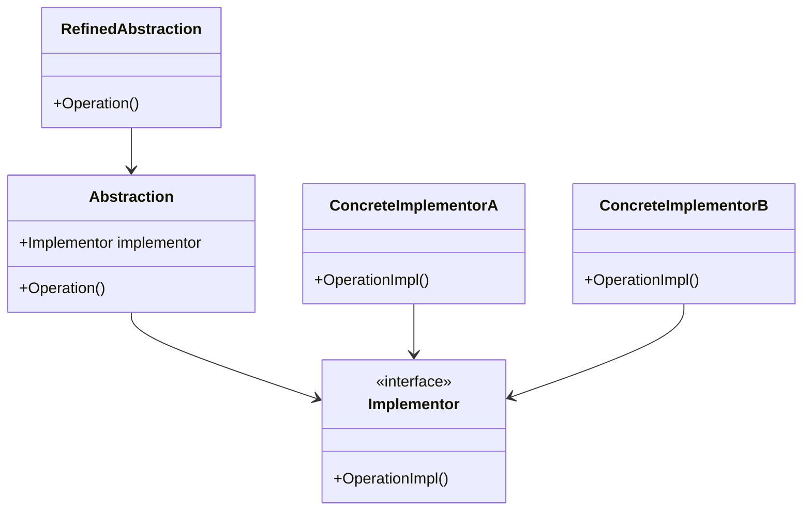

## 5.2 Bridge Design Pattern

The Bridge Design Pattern is a structural pattern that plays a crucial role in software architecture by decoupling an abstraction from its implementation. This separation allows both the abstraction and the implementation to evolve independently, providing flexibility and scalability in software design. In this section, we will delve into the intricacies of the Bridge Design Pattern, explore its implementation in C#, and examine its applicability in real-world scenarios.

### Intent of the Bridge Design Pattern

The primary intent of the Bridge Design Pattern is to separate the abstraction from its implementation so that both can be modified independently without affecting each other. This pattern is particularly useful when dealing with complex systems that require multiple variations of an abstraction and its implementations.

### Key Participants

1. **Abstraction**: Defines the abstraction's interface and maintains a reference to an object of type Implementor.
2. **Refined Abstraction**: Extends the interface defined by Abstraction.
3. **Implementor**: Defines the interface for implementation classes. This interface doesn't have to correspond exactly to Abstraction's interface; in fact, the two interfaces can be quite different.
4. **Concrete Implementor**: Implements the Implementor interface and defines its concrete implementation.

### Diagram

To better understand the Bridge Design Pattern, let's visualize it using a class diagram:



### Implementing Bridge in C#

In C#, the Bridge Design Pattern can be implemented using interfaces and classes to separate the abstraction from its implementation. Let's walk through a practical example to illustrate this concept.

#### Example Scenario: Device Control System

Imagine we are developing a device control system that can operate various types of devices such as TVs and Radios. Each device can have different implementations for turning on, turning off, and adjusting volume. The Bridge Design Pattern allows us to decouple the device control abstraction from its specific implementations.

#### Step-by-Step Implementation

1. **Define the Implementor Interface**

```csharp
public interface IDevice
{
    void TurnOn();
    void TurnOff();
    void SetVolume(int volume);
}
```

2. **Create Concrete Implementors**

```csharp
public class TV : IDevice
{
    public void TurnOn() => Console.WriteLine("TV is turned on.");
    public void TurnOff() => Console.WriteLine("TV is turned off.");
    public void SetVolume(int volume) => Console.WriteLine($"TV volume set to {volume}.");
}

public class Radio : IDevice
{
    public void TurnOn() => Console.WriteLine("Radio is turned on.");
    public void TurnOff() => Console.WriteLine("Radio is turned off.");
    public void SetVolume(int volume) => Console.WriteLine($"Radio volume set to {volume}.");
}
```

3. **Define the Abstraction**

```csharp
public abstract class RemoteControl
{
    protected IDevice device;

    protected RemoteControl(IDevice device)
    {
        this.device = device;
    }

    public abstract void TurnOn();
    public abstract void TurnOff();
    public abstract void SetVolume(int volume);
}
```

4. **Create Refined Abstractions**

```csharp
public class BasicRemoteControl : RemoteControl
{
    public BasicRemoteControl(IDevice device) : base(device) { }

    public override void TurnOn() => device.TurnOn();
    public override void TurnOff() => device.TurnOff();
    public override void SetVolume(int volume) => device.SetVolume(volume);
}

public class AdvancedRemoteControl : RemoteControl
{
    public AdvancedRemoteControl(IDevice device) : base(device) { }

    public override void TurnOn() => device.TurnOn();
    public override void TurnOff() => device.TurnOff();
    public override void SetVolume(int volume) => device.SetVolume(volume);

    public void Mute() => Console.WriteLine("Device is muted.");
}
```

5. **Client Code**

```csharp
public class Client
{
    public static void Main(string[] args)
    {
        IDevice tv = new TV();
        RemoteControl basicRemote = new BasicRemoteControl(tv);
        basicRemote.TurnOn();
        basicRemote.SetVolume(10);
        basicRemote.TurnOff();

        IDevice radio = new Radio();
        RemoteControl advancedRemote = new AdvancedRemoteControl(radio);
        advancedRemote.TurnOn();
        advancedRemote.SetVolume(20);
        advancedRemote.Mute();
        advancedRemote.TurnOff();
    }
}
```

### Decoupling Abstraction and Implementation

The Bridge Design Pattern effectively decouples the abstraction from its implementation, allowing both to be developed and extended independently. In our example, we can easily add new devices or new types of remote controls without altering existing code. This flexibility is a hallmark of the Bridge Design Pattern.

### Use Cases and Examples

The Bridge Design Pattern is particularly useful in scenarios where:

- **Cross-Platform Implementations**: When developing applications that need to run on multiple platforms, the Bridge Pattern allows you to separate platform-specific code from the core logic.
- **Supporting Different Databases**: In applications that need to support multiple databases, the Bridge Pattern can be used to separate database-specific code from the application logic.
- **GUI Frameworks**: When developing graphical user interfaces, the Bridge Pattern can be used to separate the abstraction of the UI from its platform-specific implementation.

### Design Considerations

When implementing the Bridge Design Pattern, consider the following:

- **Complexity**: The Bridge Pattern can introduce additional complexity due to the separation of abstraction and implementation. Ensure that the benefits of flexibility and scalability outweigh the added complexity.
- **Performance**: The indirection introduced by the Bridge Pattern can impact performance. Evaluate whether the performance trade-offs are acceptable for your application.
- **C# Specific Features**: Utilize C# features such as interfaces, abstract classes, and dependency injection to effectively implement the Bridge Pattern.

### Differences and Similarities

The Bridge Design Pattern is often confused with the Adapter Pattern. While both patterns involve abstraction and implementation, the key difference is that the Adapter Pattern is used to make incompatible interfaces work together, whereas the Bridge Pattern is used to separate abstraction from implementation.

### Try It Yourself

To deepen your understanding of the Bridge Design Pattern, try modifying the code examples provided:

- **Add a new device**: Implement a new device class, such as a `SmartSpeaker`, and integrate it with the existing remote controls.
- **Extend functionality**: Add new methods to the `AdvancedRemoteControl` class, such as a `ChangeChannel` method for the TV.
- **Experiment with interfaces**: Modify the `IDevice` interface to include additional methods and see how it affects the overall design.

### Conclusion

The Bridge Design Pattern is a powerful tool in the software architect's toolkit, providing a flexible and scalable way to decouple abstraction from implementation. By understanding and applying this pattern, you can create software systems that are easier to maintain and extend.

Remember, mastering design patterns is a journey. As you continue to explore and experiment with different patterns, you'll gain a deeper understanding of software architecture and design. Keep experimenting, stay curious, and enjoy the journey!

## Quiz Time!



### What is the primary intent of the Bridge Design Pattern?

- [x] To decouple an abstraction from its implementation so that both can vary independently.
- [ ] To make incompatible interfaces work together.
- [ ] To provide a simplified interface to a complex subsystem.
- [ ] To ensure a class has only one instance.

> **Explanation:** The Bridge Design Pattern aims to separate abstraction from implementation, allowing both to evolve independently.

### Which of the following is a key participant in the Bridge Design Pattern?

- [x] Abstraction
- [ ] Adapter
- [ ] Facade
- [ ] Singleton

> **Explanation:** The Abstraction is a key participant in the Bridge Design Pattern, along with Implementor, Refined Abstraction, and Concrete Implementor.

### How does the Bridge Design Pattern differ from the Adapter Pattern?

- [x] The Bridge Pattern separates abstraction from implementation, while the Adapter Pattern makes incompatible interfaces work together.
- [ ] The Bridge Pattern is used for simplifying interfaces, while the Adapter Pattern is used for decoupling.
- [ ] The Bridge Pattern is used for ensuring a single instance, while the Adapter Pattern is used for creating objects.
- [ ] The Bridge Pattern is used for creating complex subsystems, while the Adapter Pattern is used for simplifying them.

> **Explanation:** The Bridge Pattern focuses on separating abstraction from implementation, whereas the Adapter Pattern focuses on making incompatible interfaces compatible.

### In the provided code example, what is the role of the `IDevice` interface?

- [x] It defines the interface for implementation classes.
- [ ] It defines the abstraction's interface.
- [ ] It extends the interface defined by Abstraction.
- [ ] It implements the interface for abstraction classes.

> **Explanation:** The `IDevice` interface defines the interface for implementation classes in the Bridge Design Pattern.

### What is a potential drawback of using the Bridge Design Pattern?

- [x] It can introduce additional complexity due to the separation of abstraction and implementation.
- [ ] It can make incompatible interfaces work together.
- [ ] It can ensure a class has only one instance.
- [ ] It can simplify complex subsystems.

> **Explanation:** The Bridge Pattern can introduce complexity due to the separation of abstraction and implementation, which needs to be managed carefully.

### Which C# feature is particularly useful for implementing the Bridge Pattern?

- [x] Interfaces
- [ ] Enumerations
- [ ] Delegates
- [ ] Events

> **Explanation:** Interfaces are particularly useful in C# for implementing the Bridge Pattern, as they help define the contract for implementation classes.

### What is the role of the `Concrete Implementor` in the Bridge Design Pattern?

- [x] It implements the Implementor interface and defines its concrete implementation.
- [ ] It defines the abstraction's interface.
- [ ] It extends the interface defined by Abstraction.
- [ ] It maintains a reference to an object of type Implementor.

> **Explanation:** The Concrete Implementor implements the Implementor interface and provides the concrete implementation in the Bridge Design Pattern.

### How can the Bridge Design Pattern be beneficial in cross-platform implementations?

- [x] It allows platform-specific code to be separated from core logic, enabling easier adaptation to different platforms.
- [ ] It ensures a class has only one instance across platforms.
- [ ] It simplifies complex subsystems for cross-platform compatibility.
- [ ] It makes incompatible interfaces work together across platforms.

> **Explanation:** The Bridge Pattern allows platform-specific code to be separated from core logic, facilitating cross-platform implementations.

### What is the advantage of using the Bridge Pattern in supporting different databases?

- [x] It separates database-specific code from application logic, allowing support for multiple databases.
- [ ] It ensures a single instance of the database connection.
- [ ] It simplifies the database interface for easier access.
- [ ] It makes incompatible database interfaces work together.

> **Explanation:** The Bridge Pattern separates database-specific code from application logic, enabling support for multiple databases.

### True or False: The Bridge Design Pattern is only applicable to object-oriented programming languages.

- [x] True
- [ ] False

> **Explanation:** The Bridge Design Pattern is primarily applicable to object-oriented programming languages, where abstraction and implementation can be separated.


