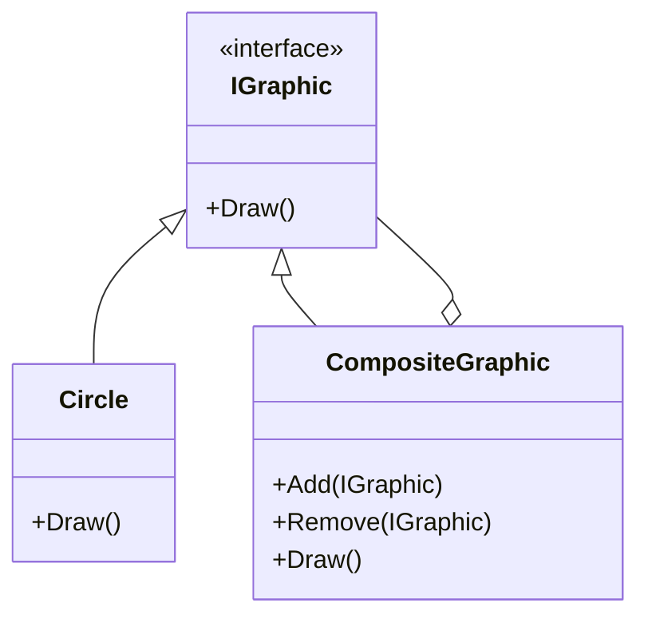

## 5.3 Composite Design Pattern

The Composite Design Pattern is a structural pattern that allows you to compose objects into tree structures to represent part-whole hierarchies. This pattern lets clients treat individual objects and compositions of objects uniformly. In this section, we will delve into the intricacies of the Composite Design Pattern, its implementation in C#, and its various applications.

### Intent

The primary intent of the Composite Design Pattern is to allow clients to treat individual objects and compositions of objects uniformly. This is particularly useful when dealing with tree structures, such as file systems, GUI components, or organizational hierarchies.

### Key Participants

1. **Component**: Declares the interface for objects in the composition and implements default behavior for the interface common to all classes.
2. **Leaf**: Represents leaf objects in the composition. A leaf has no children.
3. **Composite**: Defines behavior for components having children and stores child components.
4. **Client**: Manipulates objects in the composition through the component interface.

### Applicability

Use the Composite Design Pattern when:
- You want to represent part-whole hierarchies of objects.
- You want clients to be able to ignore the difference between compositions of objects and individual objects.

### Implementing Composite in C#

#### Using Recursive Structures and Interfaces

To implement the Composite Design Pattern in C#, we start by defining a common interface for both composite and leaf objects. This interface will declare operations that are common to both types of objects.

```csharp
// Component
public interface IGraphic
{
    void Draw();
}

// Leaf
public class Circle : IGraphic
{
    public void Draw()
    {
        Console.WriteLine("Drawing a Circle");
    }
}

// Composite
public class CompositeGraphic : IGraphic
{
    private List<IGraphic> _graphics = new List<IGraphic>();

    public void Add(IGraphic graphic)
    {
        _graphics.Add(graphic);
    }

    public void Remove(IGraphic graphic)
    {
        _graphics.Remove(graphic);
    }

    public void Draw()
    {
        foreach (var graphic in _graphics)
        {
            graphic.Draw();
        }
    }
}

// Client
public class Client
{
    public static void Main(string[] args)
    {
        // Create leaf objects
        IGraphic circle1 = new Circle();
        IGraphic circle2 = new Circle();

        // Create composite object
        CompositeGraphic compositeGraphic = new CompositeGraphic();
        compositeGraphic.Add(circle1);
        compositeGraphic.Add(circle2);

        // Draw composite
        compositeGraphic.Draw();
    }
}
```

In this example, `IGraphic` is the component interface, `Circle` is a leaf, and `CompositeGraphic` is the composite class that can contain multiple `IGraphic` objects.

#### Handling Hierarchies

The Composite Design Pattern simplifies client code that deals with tree structures by allowing clients to treat individual objects and compositions uniformly. This is achieved by defining a common interface for all objects in the hierarchy.

### Composite Entity Pattern

The Composite Entity Pattern is a variation of the Composite Design Pattern that deals with managing a complex entity composed of multiple simpler entities. This pattern is particularly useful in enterprise applications where entities are often composed of multiple sub-entities.

#### Implementing Composite Entity in C#

```csharp
// Coarse-Grained Object
public class CoarseGrainedObject
{
    private DependentObject1 do1 = new DependentObject1();
    private DependentObject2 do2 = new DependentObject2();

    public void SetData(string data1, string data2)
    {
        do1.Data = data1;
        do2.Data = data2;
    }

    public string[] GetData()
    {
        return new string[] { do1.Data, do2.Data };
    }
}

// Dependent Object 1
public class DependentObject1
{
    public string Data { get; set; }
}

// Dependent Object 2
public class DependentObject2
{
    public string Data { get; set; }
}

// Composite Entity
public class CompositeEntity
{
    private CoarseGrainedObject cgo = new CoarseGrainedObject();

    public void SetData(string data1, string data2)
    {
        cgo.SetData(data1, data2);
    }

    public string[] GetData()
    {
        return cgo.GetData();
    }
}

// Client
public class CompositeEntityClient
{
    private CompositeEntity compositeEntity = new CompositeEntity();

    public void PrintData()
    {
        foreach (var data in compositeEntity.GetData())
        {
            Console.WriteLine("Data: " + data);
        }
    }

    public void SetData(string data1, string data2)
    {
        compositeEntity.SetData(data1, data2);
    }
}
```

In this example, `CompositeEntity` manages a `CoarseGrainedObject` which in turn manages `DependentObject1` and `DependentObject2`. The client interacts with the composite entity to manage the data.

#### Use Cases and Examples

The Composite Entity Pattern is commonly used in enterprise applications to manage complex entities composed of multiple sub-entities. This pattern helps in reducing the complexity of the client code by providing a unified interface to manage the entity.

### Composite View Pattern

The Composite View Pattern is used in UI frameworks to handle composite structures. This pattern allows developers to create complex UI components by composing simpler components.

#### Implementing Composite View in C#

```csharp
// Component
public interface IViewComponent
{
    void Render();
}

// Leaf
public class TextView : IViewComponent
{
    public void Render()
    {
        Console.WriteLine("Rendering TextView");
    }
}

// Composite
public class CompositeView : IViewComponent
{
    private List<IViewComponent> _components = new List<IViewComponent>();

    public void Add(IViewComponent component)
    {
        _components.Add(component);
    }

    public void Remove(IViewComponent component)
    {
        _components.Remove(component);
    }

    public void Render()
    {
        foreach (var component in _components)
        {
            component.Render();
        }
    }
}

// Client
public class ViewClient
{
    public static void Main(string[] args)
    {
        // Create leaf objects
        IViewComponent textView1 = new TextView();
        IViewComponent textView2 = new TextView();

        // Create composite object
        CompositeView compositeView = new CompositeView();
        compositeView.Add(textView1);
        compositeView.Add(textView2);

        // Render composite view
        compositeView.Render();
    }
}
```

In this example, `IViewComponent` is the component interface, `TextView` is a leaf, and `CompositeView` is the composite class that can contain multiple `IViewComponent` objects.

#### Use Cases and Examples

The Composite View Pattern is commonly used in UI frameworks to create complex UI components by composing simpler components. This pattern helps in reducing the complexity of the client code by providing a unified interface to manage the UI components.

### Use Cases and Examples

#### GUI Components

The Composite Design Pattern is widely used in GUI frameworks to represent complex UI components as compositions of simpler components. For example, a window can contain panels, buttons, and text fields, each of which can be treated as a component.

#### File System Representations

The Composite Design Pattern is also used to represent file systems, where directories can contain files and other directories. This allows clients to treat files and directories uniformly.

### Design Considerations

When implementing the Composite Design Pattern, consider the following:
- **Uniformity**: Ensure that the component interface provides a uniform way to interact with both leaf and composite objects.
- **Efficiency**: Be mindful of the performance implications of traversing large composite structures.
- **Flexibility**: Design the component interface to be flexible enough to accommodate future changes.

### Differences and Similarities

The Composite Design Pattern is often confused with the Decorator Pattern. While both patterns involve recursive composition, the Composite Pattern focuses on part-whole hierarchies, whereas the Decorator Pattern focuses on adding responsibilities to objects dynamically.

### Try It Yourself

Experiment with the code examples provided by:
- Adding new types of leaf objects and composite objects.
- Implementing additional operations in the component interface.
- Creating more complex tree structures and observing how the client code interacts with them.

### Visualizing the Composite Design Pattern

Below is a class diagram representing the Composite Design Pattern:



This diagram illustrates the relationships between the component, leaf, and composite classes.

### Knowledge Check

- Explain the primary intent of the Composite Design Pattern.
- Describe a real-world scenario where the Composite Design Pattern can be applied.
- Implement a simple composite structure using the provided code examples.

### Embrace the Journey

Remember, mastering design patterns is a journey. As you continue to explore and experiment with the Composite Design Pattern, you'll gain a deeper understanding of how to build scalable and maintainable software architectures. Keep experimenting, stay curious, and enjoy the journey!

## Quiz Time!



### What is the primary intent of the Composite Design Pattern?

- [x] To allow clients to treat individual objects and compositions of objects uniformly.
- [ ] To add responsibilities to objects dynamically.
- [ ] To provide a way to create a family of related objects.
- [ ] To define a one-to-many dependency between objects.

> **Explanation:** The Composite Design Pattern allows clients to treat individual objects and compositions of objects uniformly, which is its primary intent.

### Which of the following is a key participant in the Composite Design Pattern?

- [x] Component
- [ ] Factory
- [x] Leaf
- [ ] Adapter

> **Explanation:** The key participants in the Composite Design Pattern include the Component, Leaf, Composite, and Client.

### In the Composite Design Pattern, what role does the Composite class play?

- [x] It defines behavior for components having children and stores child components.
- [ ] It represents leaf objects in the composition.
- [ ] It declares the interface for objects in the composition.
- [ ] It manipulates objects in the composition through the component interface.

> **Explanation:** The Composite class defines behavior for components having children and stores child components.

### What is a common use case for the Composite Design Pattern?

- [x] GUI components
- [ ] Database connections
- [ ] Network protocols
- [ ] Encryption algorithms

> **Explanation:** A common use case for the Composite Design Pattern is GUI components, where complex UI components are composed of simpler components.

### How does the Composite Design Pattern simplify client code?

- [x] By allowing clients to treat individual objects and compositions uniformly.
- [ ] By dynamically adding responsibilities to objects.
- [ ] By providing a way to create a family of related objects.
- [ ] By defining a one-to-many dependency between objects.

> **Explanation:** The Composite Design Pattern simplifies client code by allowing clients to treat individual objects and compositions uniformly.

### What is the difference between the Composite and Decorator Patterns?

- [x] The Composite Pattern focuses on part-whole hierarchies, while the Decorator Pattern focuses on adding responsibilities to objects dynamically.
- [ ] The Composite Pattern is used for creating a family of related objects, while the Decorator Pattern is used for defining a one-to-many dependency.
- [ ] The Composite Pattern is used for network protocols, while the Decorator Pattern is used for encryption algorithms.
- [ ] The Composite Pattern is used for database connections, while the Decorator Pattern is used for GUI components.

> **Explanation:** The Composite Pattern focuses on part-whole hierarchies, whereas the Decorator Pattern focuses on adding responsibilities to objects dynamically.

### Which pattern is often confused with the Composite Pattern?

- [x] Decorator Pattern
- [ ] Factory Pattern
- [ ] Adapter Pattern
- [ ] Singleton Pattern

> **Explanation:** The Composite Pattern is often confused with the Decorator Pattern due to their similar recursive composition structures.

### What is a Composite Entity Pattern used for?

- [x] Managing a complex entity composed of multiple simpler entities.
- [ ] Adding responsibilities to objects dynamically.
- [ ] Creating a family of related objects.
- [ ] Defining a one-to-many dependency between objects.

> **Explanation:** The Composite Entity Pattern is used for managing a complex entity composed of multiple simpler entities.

### In the Composite View Pattern, what is the role of the Composite class?

- [x] It defines behavior for components having children and stores child components.
- [ ] It represents leaf objects in the composition.
- [ ] It declares the interface for objects in the composition.
- [ ] It manipulates objects in the composition through the component interface.

> **Explanation:** In the Composite View Pattern, the Composite class defines behavior for components having children and stores child components.

### True or False: The Composite Design Pattern is only applicable to GUI components.

- [ ] True
- [x] False

> **Explanation:** False. The Composite Design Pattern is applicable to various scenarios, including GUI components, file system representations, and organizational hierarchies.


