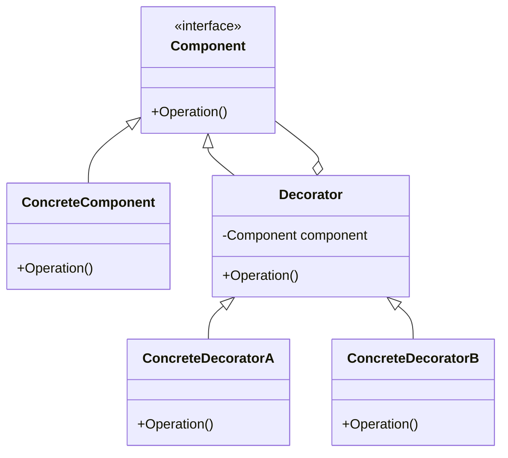

## 5.4 Decorator Design Pattern

The Decorator Design Pattern is a structural pattern that allows us to add responsibilities to objects dynamically without altering their structure. This pattern is particularly useful when we want to extend the functionality of classes in a flexible and reusable way. In this section, we will delve into the intricacies of the Decorator Pattern, explore its implementation in C#, and examine its practical applications.

### Intent

The primary intent of the Decorator Pattern is to attach additional responsibilities to an object dynamically. Decorators provide a flexible alternative to subclassing for extending functionality. This pattern is ideal for scenarios where we need to add features to objects without modifying their code, thus adhering to the Open/Closed Principle of software design.

### Key Participants

1. **Component**: Defines the interface for objects that can have responsibilities added to them dynamically.
2. **ConcreteComponent**: The class to which additional responsibilities can be attached.
3. **Decorator**: Maintains a reference to a Component object and defines an interface that conforms to Component's interface.
4. **ConcreteDecorator**: Adds responsibilities to the component.

### Diagram

To better understand the Decorator Pattern, let's visualize its structure using a class diagram:



**Caption**: Class diagram illustrating the Decorator Pattern structure.

### Implementing Decorator in C#

Let's explore how to implement the Decorator Pattern in C# using classes and inheritance to wrap objects.

#### Step-by-Step Implementation

1. **Define the Component Interface**: This interface will declare the operation that can be dynamically extended.

    ```csharp
    public interface IComponent
    {
        void Operation();
    }
    ```

2. **Create the ConcreteComponent**: This class implements the Component interface and represents the core functionality.

    ```csharp
    public class ConcreteComponent : IComponent
    {
        public void Operation()
        {
            Console.WriteLine("ConcreteComponent Operation");
        }
    }
    ```

3. **Create the Decorator Class**: This abstract class implements the Component interface and contains a reference to a Component object.

    ```csharp
    public abstract class Decorator : IComponent
    {
        protected IComponent component;

        public Decorator(IComponent component)
        {
            this.component = component;
        }

        public virtual void Operation()
        {
            component.Operation();
        }
    }
    ```

4. **Implement Concrete Decorators**: These classes extend the Decorator class and add additional responsibilities.

    ```csharp
    public class ConcreteDecoratorA : Decorator
    {
        public ConcreteDecoratorA(IComponent component) : base(component) { }

        public override void Operation()
        {
            base.Operation();
            AddedBehavior();
        }

        void AddedBehavior()
        {
            Console.WriteLine("ConcreteDecoratorA Added Behavior");
        }
    }

    public class ConcreteDecoratorB : Decorator
    {
        public ConcreteDecoratorB(IComponent component) : base(component) { }

        public override void Operation()
        {
            base.Operation();
            AddedBehavior();
        }

        void AddedBehavior()
        {
            Console.WriteLine("ConcreteDecoratorB Added Behavior");
        }
    }
    ```

5. **Client Code**: Demonstrate how to use decorators to extend functionality.

    ```csharp
    class Program
    {
        static void Main(string[] args)
        {
            IComponent component = new ConcreteComponent();
            IComponent decoratorA = new ConcreteDecoratorA(component);
            IComponent decoratorB = new ConcreteDecoratorB(decoratorA);

            decoratorB.Operation();
        }
    }
    ```

**Explanation**: In this example, `ConcreteDecoratorA` and `ConcreteDecoratorB` add additional behavior to the `ConcreteComponent` without altering its structure.

### Utilizing C# Attributes

In C#, attributes are a powerful way to add metadata to code elements. While attributes are not decorators in the traditional sense, they can be used to influence behavior at runtime.

#### Understanding the Difference

- **Attributes**: Provide metadata that can be used by the runtime or tools to modify behavior.
- **Decorators**: Extend functionality by wrapping objects.

### Enhancing Object Functionality

The Decorator Pattern allows us to add features to objects without altering existing code. This is particularly useful in scenarios where we need to extend functionality in a modular and reusable way.

#### Adding Features Dynamically

Consider a logging system where we want to add logging capabilities to various components without modifying their code. The Decorator Pattern allows us to wrap these components with logging decorators.

### Use Cases and Examples

The Decorator Pattern is widely used in software development for various purposes. Let's explore some common use cases:

#### Logging

Decorators can be used to add logging functionality to components, allowing us to log method calls, parameters, and execution time.

```csharp
public class LoggingDecorator : Decorator
{
    public LoggingDecorator(IComponent component) : base(component) { }

    public override void Operation()
    {
        Console.WriteLine("Logging: Before Operation");
        base.Operation();
        Console.WriteLine("Logging: After Operation");
    }
}
```

#### Encryption

In security-sensitive applications, decorators can be used to add encryption and decryption capabilities to data processing components.

```csharp
public class EncryptionDecorator : Decorator
{
    public EncryptionDecorator(IComponent component) : base(component) { }

    public override void Operation()
    {
        Console.WriteLine("Encrypting data...");
        base.Operation();
        Console.WriteLine("Decrypting data...");
    }
}
```

#### Data Compression

For applications dealing with large data sets, decorators can be used to add data compression and decompression functionality.

```csharp
public class CompressionDecorator : Decorator
{
    public CompressionDecorator(IComponent component) : base(component) { }

    public override void Operation()
    {
        Console.WriteLine("Compressing data...");
        base.Operation();
        Console.WriteLine("Decompressing data...");
    }
}
```

### Design Considerations

When using the Decorator Pattern, consider the following:

- **Performance**: Adding multiple layers of decorators can impact performance.
- **Complexity**: Overuse of decorators can lead to complex and hard-to-maintain code.
- **Flexibility**: Decorators provide a flexible way to extend functionality without modifying existing code.

### Differences and Similarities

The Decorator Pattern is often confused with other patterns such as the Proxy and Adapter patterns. Here are some key differences:

- **Decorator vs. Proxy**: While both patterns involve wrapping objects, the Proxy Pattern controls access to the object, whereas the Decorator Pattern adds functionality.
- **Decorator vs. Adapter**: The Adapter Pattern changes the interface of an object, while the Decorator Pattern enhances its behavior.

### Try It Yourself

To deepen your understanding of the Decorator Pattern, try modifying the code examples provided:

- **Add a new decorator**: Create a new decorator that adds a different type of behavior, such as caching or validation.
- **Chain multiple decorators**: Experiment with chaining multiple decorators to see how they interact.
- **Measure performance**: Use a stopwatch to measure the performance impact of adding decorators.

### Embrace the Journey

Remember, mastering design patterns is a journey. As you experiment with the Decorator Pattern, you'll gain insights into how to extend functionality in a flexible and reusable way. Keep exploring, stay curious, and enjoy the process of learning and applying design patterns in your software development projects.

## Quiz Time!



### What is the primary intent of the Decorator Pattern?

- [x] To add responsibilities to objects dynamically without altering their structure.
- [ ] To change the interface of an object.
- [ ] To control access to an object.
- [ ] To provide a default implementation of an interface.

> **Explanation:** The Decorator Pattern is designed to add responsibilities to objects dynamically without altering their structure.

### Which of the following is a key participant in the Decorator Pattern?

- [x] Component
- [ ] Adapter
- [ ] Proxy
- [ ] Singleton

> **Explanation:** The Component is a key participant in the Decorator Pattern, defining the interface for objects that can have responsibilities added to them dynamically.

### How does the Decorator Pattern adhere to the Open/Closed Principle?

- [x] By allowing objects to be extended without modifying their code.
- [ ] By providing a default implementation of an interface.
- [ ] By controlling access to an object.
- [ ] By changing the interface of an object.

> **Explanation:** The Decorator Pattern adheres to the Open/Closed Principle by allowing objects to be extended without modifying their code.

### What is the difference between a Decorator and an Adapter?

- [x] A Decorator adds functionality, while an Adapter changes the interface.
- [ ] A Decorator changes the interface, while an Adapter adds functionality.
- [ ] Both add functionality and change the interface.
- [ ] Neither adds functionality nor changes the interface.

> **Explanation:** A Decorator adds functionality to an object, while an Adapter changes the interface of an object.

### Which of the following is a common use case for the Decorator Pattern?

- [x] Logging
- [ ] Singleton
- [ ] Factory Method
- [ ] Observer

> **Explanation:** Logging is a common use case for the Decorator Pattern, allowing us to add logging functionality to components.

### What is a potential drawback of using the Decorator Pattern?

- [x] It can lead to complex and hard-to-maintain code.
- [ ] It changes the interface of an object.
- [ ] It controls access to an object.
- [ ] It provides a default implementation of an interface.

> **Explanation:** A potential drawback of using the Decorator Pattern is that it can lead to complex and hard-to-maintain code if overused.

### How can decorators impact performance?

- [x] By adding multiple layers of decorators, which can impact performance.
- [ ] By changing the interface of an object.
- [ ] By controlling access to an object.
- [ ] By providing a default implementation of an interface.

> **Explanation:** Adding multiple layers of decorators can impact performance due to the additional processing required.

### What is the role of the ConcreteDecorator in the Decorator Pattern?

- [x] To add responsibilities to the component.
- [ ] To define the interface for objects that can have responsibilities added.
- [ ] To change the interface of an object.
- [ ] To control access to an object.

> **Explanation:** The ConcreteDecorator adds responsibilities to the component in the Decorator Pattern.

### How can you experiment with the Decorator Pattern?

- [x] By creating a new decorator that adds a different type of behavior.
- [ ] By changing the interface of an object.
- [ ] By controlling access to an object.
- [ ] By providing a default implementation of an interface.

> **Explanation:** You can experiment with the Decorator Pattern by creating a new decorator that adds a different type of behavior.

### True or False: The Decorator Pattern can be used to change the interface of an object.

- [ ] True
- [x] False

> **Explanation:** False. The Decorator Pattern is used to add functionality to an object without changing its interface.


