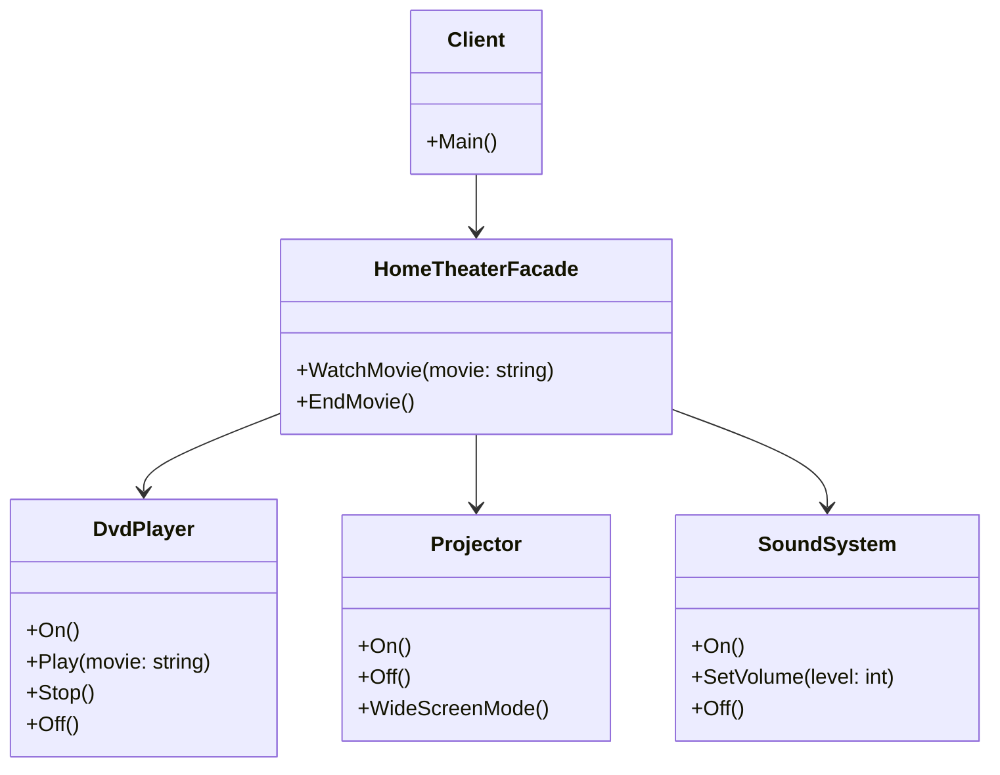

## 5.5 Facade Design Pattern

The Facade Design Pattern is a structural pattern that provides a simplified interface to a complex subsystem. It is one of the most commonly used design patterns in software engineering, particularly when dealing with complex systems that require a more user-friendly interface. In this section, we will explore the Facade Design Pattern in detail, focusing on its implementation in C#, how it simplifies complex subsystems, and its various use cases and examples.

### Intent of the Facade Design Pattern

The primary intent of the Facade Design Pattern is to provide a unified interface to a set of interfaces in a subsystem. Facade defines a higher-level interface that makes the subsystem easier to use. By doing so, it hides the complexities of the subsystem from the client, allowing for a more straightforward interaction.

### Key Participants

1. **Facade**: The main class that provides a simplified interface to the complex subsystem.
2. **Subsystem Classes**: The classes that implement the subsystem's functionality. These classes handle the actual work but are hidden behind the Facade.
3. **Client**: The entity that interacts with the Facade instead of the subsystem classes directly.

### Applicability

Use the Facade Design Pattern when:

- You want to provide a simple interface to a complex subsystem.
- There are many interdependent classes in the subsystem.
- You need to decouple the client from the subsystem, making the subsystem easier to use and understand.
- You want to layer your subsystems.

### Implementing Facade in C#

Let's delve into how we can implement the Facade Design Pattern in C#. We'll create a simple example where a Facade simplifies the interaction with a complex subsystem involving a home theater system.

#### Step-by-Step Implementation

1. **Define the Subsystem Classes**: These classes represent the complex subsystem. In our example, we'll have classes for the DVD player, projector, and sound system.

```csharp
public class DvdPlayer
{
    public void On() => Console.WriteLine("DVD Player is on.");
    public void Play(string movie) => Console.WriteLine($"Playing \"{movie}\".");
    public void Stop() => Console.WriteLine("Stopping DVD Player.");
    public void Off() => Console.WriteLine("DVD Player is off.");
}

public class Projector
{
    public void On() => Console.WriteLine("Projector is on.");
    public void Off() => Console.WriteLine("Projector is off.");
    public void WideScreenMode() => Console.WriteLine("Projector in widescreen mode.");
}

public class SoundSystem
{
    public void On() => Console.WriteLine("Sound System is on.");
    public void SetVolume(int level) => Console.WriteLine($"Setting volume to {level}.");
    public void Off() => Console.WriteLine("Sound System is off.");
}
```

2. **Create the Facade Class**: This class will provide a simplified interface to the subsystem classes.

```csharp
public class HomeTheaterFacade
{
    private readonly DvdPlayer _dvdPlayer;
    private readonly Projector _projector;
    private readonly SoundSystem _soundSystem;

    public HomeTheaterFacade(DvdPlayer dvdPlayer, Projector projector, SoundSystem soundSystem)
    {
        _dvdPlayer = dvdPlayer;
        _projector = projector;
        _soundSystem = soundSystem;
    }

    public void WatchMovie(string movie)
    {
        Console.WriteLine("Get ready to watch a movie...");
        _projector.On();
        _projector.WideScreenMode();
        _soundSystem.On();
        _soundSystem.SetVolume(5);
        _dvdPlayer.On();
        _dvdPlayer.Play(movie);
    }

    public void EndMovie()
    {
        Console.WriteLine("Shutting movie theater down...");
        _dvdPlayer.Stop();
        _dvdPlayer.Off();
        _soundSystem.Off();
        _projector.Off();
    }
}
```

3. **Use the Facade in the Client Code**: The client interacts with the Facade instead of the subsystem classes directly.

```csharp
class Program
{
    static void Main(string[] args)
    {
        DvdPlayer dvdPlayer = new DvdPlayer();
        Projector projector = new Projector();
        SoundSystem soundSystem = new SoundSystem();

        HomeTheaterFacade homeTheater = new HomeTheaterFacade(dvdPlayer, projector, soundSystem);

        homeTheater.WatchMovie("Inception");
        homeTheater.EndMovie();
    }
}
```

### Simplifying Complex Subsystems

The Facade Design Pattern is particularly useful in simplifying complex subsystems. By providing a higher-level interface, the Facade pattern hides the complexities of the subsystem from the client. This not only makes the system easier to use but also reduces the dependencies between the client and the subsystem.

#### Benefits of Using Facade

- **Reduces Complexity**: By hiding the complexities of the subsystem, the Facade pattern makes it easier for clients to interact with the system.
- **Improves Readability**: The Facade pattern improves the readability of the code by providing a clear and concise interface.
- **Encourages Loose Coupling**: By decoupling the client from the subsystem, the Facade pattern promotes loose coupling, making the system more flexible and easier to maintain.

### Use Cases and Examples

The Facade Design Pattern is widely used in various scenarios. Here are some common use cases:

1. **Simplifying API Usage**: Facades are often used to simplify the usage of complex APIs. By providing a higher-level interface, the Facade pattern makes it easier for developers to interact with the API.

2. **Database Access Layers**: Facades can be used to simplify database access layers. By providing a unified interface, the Facade pattern makes it easier to interact with the database.

3. **Legacy System Integration**: When integrating with legacy systems, Facades can provide a simplified interface to the legacy system, making it easier to interact with.

4. **Microservices Architecture**: In a microservices architecture, Facades can be used to provide a unified interface to multiple microservices, simplifying the interaction with the system.

### Design Considerations

When implementing the Facade Design Pattern, consider the following:

- **Identify the Subsystem**: Clearly identify the subsystem that the Facade will simplify. This will help in designing the Facade interface.
- **Define the Facade Interface**: Design a clear and concise interface for the Facade. This will make it easier for clients to interact with the subsystem.
- **Encapsulate Subsystem Logic**: Ensure that the Facade encapsulates the subsystem logic, hiding the complexities from the client.

### Differences and Similarities

The Facade Design Pattern is often confused with other design patterns, such as the Adapter pattern. Here are some key differences and similarities:

- **Facade vs. Adapter**: The Facade pattern provides a simplified interface to a complex subsystem, while the Adapter pattern allows incompatible interfaces to work together. The Facade pattern is used to simplify interactions, while the Adapter pattern is used to make interfaces compatible.
- **Facade vs. Proxy**: The Facade pattern provides a simplified interface, while the Proxy pattern provides a surrogate or placeholder for another object. The Proxy pattern is used to control access to an object, while the Facade pattern is used to simplify interactions.

### Visualizing the Facade Design Pattern

To better understand the Facade Design Pattern, let's visualize it using a class diagram.



In this diagram, the `Client` interacts with the `HomeTheaterFacade`, which in turn interacts with the `DvdPlayer`, `Projector`, and `SoundSystem`. The Facade provides a simplified interface to the complex subsystem, making it easier for the client to interact with.

### Try It Yourself

Now that we've explored the Facade Design Pattern, let's try modifying the code example to see how it works in practice. Here are some suggestions:

- **Add More Subsystem Classes**: Try adding more subsystem classes, such as a `Lights` class, and update the Facade to include these new classes.
- **Enhance the Facade Interface**: Add more methods to the Facade interface, such as a `PauseMovie` method, and implement the corresponding logic in the subsystem classes.
- **Refactor the Subsystem Logic**: Refactor the subsystem logic to see how the Facade pattern helps in maintaining a clean and concise interface.

### Knowledge Check

Before we wrap up, let's reinforce what we've learned with some key takeaways:

- The Facade Design Pattern provides a simplified interface to a complex subsystem.
- It is used to reduce complexity, improve readability, and promote loose coupling.
- The Facade pattern is commonly used in scenarios such as simplifying API usage, database access layers, and legacy system integration.

Remember, this is just the beginning. As you progress, you'll build more complex and interactive systems using the Facade Design Pattern. Keep experimenting, stay curious, and enjoy the journey!

## Quiz Time!



### What is the primary intent of the Facade Design Pattern?

- [x] To provide a simplified interface to a complex subsystem.
- [ ] To allow incompatible interfaces to work together.
- [ ] To provide a surrogate or placeholder for another object.
- [ ] To define a family of algorithms.

> **Explanation:** The primary intent of the Facade Design Pattern is to provide a simplified interface to a complex subsystem, making it easier for clients to interact with the system.

### Which of the following is a key participant in the Facade Design Pattern?

- [x] Facade
- [ ] Adapter
- [ ] Proxy
- [ ] Singleton

> **Explanation:** The key participants in the Facade Design Pattern are the Facade, Subsystem Classes, and the Client.

### When should you use the Facade Design Pattern?

- [x] When you want to provide a simple interface to a complex subsystem.
- [ ] When you need to control access to an object.
- [ ] When you want to make interfaces compatible.
- [ ] When you need to define a family of algorithms.

> **Explanation:** Use the Facade Design Pattern when you want to provide a simple interface to a complex subsystem, making it easier for clients to interact with the system.

### What is the difference between the Facade and Adapter patterns?

- [x] Facade simplifies interactions, while Adapter makes interfaces compatible.
- [ ] Facade controls access, while Adapter simplifies interactions.
- [ ] Facade provides a surrogate, while Adapter defines algorithms.
- [ ] Facade defines algorithms, while Adapter controls access.

> **Explanation:** The Facade pattern simplifies interactions with a complex subsystem, while the Adapter pattern makes incompatible interfaces compatible.

### Which of the following is a benefit of using the Facade Design Pattern?

- [x] Reduces complexity
- [ ] Increases complexity
- [ ] Provides a surrogate
- [ ] Defines algorithms

> **Explanation:** The Facade Design Pattern reduces complexity by providing a simplified interface to a complex subsystem.

### What does the Facade pattern encourage?

- [x] Loose coupling
- [ ] Tight coupling
- [ ] Increased dependencies
- [ ] Complex interactions

> **Explanation:** The Facade pattern encourages loose coupling by decoupling the client from the subsystem, making the system more flexible and easier to maintain.

### In which architecture is the Facade pattern commonly used?

- [x] Microservices Architecture
- [ ] Monolithic Architecture
- [ ] Layered Architecture
- [ ] Event-Driven Architecture

> **Explanation:** In a microservices architecture, Facades can be used to provide a unified interface to multiple microservices, simplifying the interaction with the system.

### What is a common use case for the Facade Design Pattern?

- [x] Simplifying API usage
- [ ] Controlling access to an object
- [ ] Making interfaces compatible
- [ ] Defining a family of algorithms

> **Explanation:** A common use case for the Facade Design Pattern is simplifying API usage by providing a higher-level interface.

### What should you consider when implementing the Facade Design Pattern?

- [x] Identify the subsystem
- [ ] Define a family of algorithms
- [ ] Control access to an object
- [ ] Make interfaces compatible

> **Explanation:** When implementing the Facade Design Pattern, consider identifying the subsystem that the Facade will simplify and designing a clear and concise interface for the Facade.

### True or False: The Facade pattern is used to provide a surrogate or placeholder for another object.

- [ ] True
- [x] False

> **Explanation:** False. The Facade pattern is used to provide a simplified interface to a complex subsystem, not to provide a surrogate or placeholder for another object.




