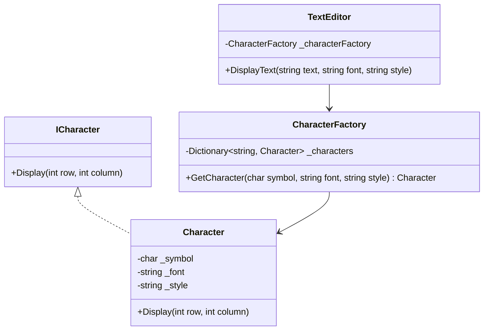

## 5.6 Flyweight Design Pattern

The Flyweight Design Pattern is a structural design pattern that focuses on minimizing memory usage by sharing as much data as possible with similar objects. This pattern is particularly useful when dealing with a large number of objects that share common data. By using the Flyweight pattern, we can significantly reduce the memory footprint of applications, making them more efficient and scalable.

### Intent

The primary intent of the Flyweight Design Pattern is to use sharing to support a large number of fine-grained objects efficiently. This is achieved by separating intrinsic and extrinsic states, allowing the intrinsic state to be shared among multiple objects, while the extrinsic state is stored outside the shared objects.

### Key Participants

1. **Flyweight Interface**: Declares an interface through which flyweights can receive and act on extrinsic state.
2. **Concrete Flyweight**: Implements the Flyweight interface and adds storage for intrinsic state, which is shared across multiple objects.
3. **Flyweight Factory**: Creates and manages flyweight objects, ensuring that shared objects are reused.
4. **Client**: Maintains references to flyweight objects and computes or stores extrinsic state.

### Applicability

The Flyweight Design Pattern is applicable when:
- An application uses a large number of objects.
- Storage costs are high due to the sheer quantity of objects.
- Most object state can be made extrinsic.
- Many groups of objects may be replaced by relatively few shared objects once extrinsic state is removed.

### Implementing Flyweight in C#

Let's explore how to implement the Flyweight Design Pattern in C#. We'll create a simple example of a text editor where each character is represented as an object. The intrinsic state will be the character's font and style, while the extrinsic state will be its position in the document.

#### Step 1: Define the Flyweight Interface

```csharp
public interface ICharacter
{
    void Display(int row, int column);
}
```

#### Step 2: Implement the Concrete Flyweight

```csharp
public class Character : ICharacter
{
    private readonly char _symbol;
    private readonly string _font;
    private readonly string _style;

    public Character(char symbol, string font, string style)
    {
        _symbol = symbol;
        _font = font;
        _style = style;
    }

    public void Display(int row, int column)
    {
        Console.WriteLine($"Character: {_symbol}, Font: {_font}, Style: {_style}, Position: ({row}, {column})");
    }
}
```

#### Step 3: Create the Flyweight Factory

```csharp
public class CharacterFactory
{
    private readonly Dictionary<string, Character> _characters = new Dictionary<string, Character>();

    public Character GetCharacter(char symbol, string font, string style)
    {
        string key = $"{symbol}-{font}-{style}";
        if (!_characters.ContainsKey(key))
        {
            _characters[key] = new Character(symbol, font, style);
        }
        return _characters[key];
    }
}
```

#### Step 4: Use the Flyweight Pattern in the Client

```csharp
public class TextEditor
{
    private readonly CharacterFactory _characterFactory = new CharacterFactory();

    public void DisplayText(string text, string font, string style)
    {
        for (int i = 0; i < text.Length; i++)
        {
            Character character = _characterFactory.GetCharacter(text[i], font, style);
            character.Display(0, i);
        }
    }
}
```

#### Step 5: Test the Implementation

```csharp
public class Program
{
    public static void Main()
    {
        TextEditor editor = new TextEditor();
        editor.DisplayText("Hello, World!", "Arial", "Bold");
    }
}
```

### Memory Optimization

The Flyweight Design Pattern is particularly effective in reducing memory usage in applications where many objects share common data. By separating intrinsic and extrinsic states, we can ensure that shared data is stored only once, significantly reducing the memory footprint.

#### Visualizing Flyweight Pattern



### Use Cases and Examples

The Flyweight Design Pattern is commonly used in scenarios where memory optimization is crucial. Here are some typical use cases:

#### Text Rendering

In text rendering, each character can be represented as an object. By using the Flyweight pattern, we can share the font and style information among multiple characters, reducing memory usage.

#### Game Development

In game development, objects like trees, rocks, or enemies that appear multiple times can share common data such as textures or models. This allows for efficient memory usage and improved performance.

#### Graphical User Interfaces

In graphical user interfaces, widgets that share common properties can use the Flyweight pattern to minimize memory consumption.

### Design Considerations

When implementing the Flyweight Design Pattern, consider the following:

- **Identify Intrinsic and Extrinsic States**: Clearly distinguish between intrinsic state (shared) and extrinsic state (unique to each object).
- **Manage Extrinsic State**: Ensure that the client manages the extrinsic state, as it is not stored within the flyweight objects.
- **Performance Trade-offs**: While the Flyweight pattern reduces memory usage, it may increase the complexity of the code and the time required to manage extrinsic state.

### Differences and Similarities

The Flyweight Design Pattern is often compared to other patterns like the Singleton and Prototype patterns. Here are some key differences and similarities:

- **Singleton vs. Flyweight**: The Singleton pattern ensures a class has only one instance, while the Flyweight pattern allows multiple instances that share common data.
- **Prototype vs. Flyweight**: The Prototype pattern creates new objects by copying existing ones, while the Flyweight pattern reuses existing objects to minimize memory usage.

### Try It Yourself

Experiment with the Flyweight pattern by modifying the code examples. Try changing the font and style of characters in the text editor or adding new types of objects in a game development scenario. Observe how the Flyweight pattern helps in reducing memory usage.

### Knowledge Check

- Explain the difference between intrinsic and extrinsic states in the Flyweight pattern.
- How does the Flyweight pattern help in reducing memory usage?
- What are some common use cases for the Flyweight pattern?

### Embrace the Journey

Remember, mastering design patterns like the Flyweight pattern is a journey. As you continue to explore and implement these patterns, you'll gain a deeper understanding of how to build efficient and scalable applications. Keep experimenting, stay curious, and enjoy the journey!

## Quiz Time!



### What is the primary intent of the Flyweight Design Pattern?

- [x] To use sharing to support a large number of fine-grained objects efficiently.
- [ ] To ensure a class has only one instance.
- [ ] To create new objects by copying existing ones.
- [ ] To define a family of algorithms.

> **Explanation:** The Flyweight Design Pattern aims to minimize memory usage by sharing data among multiple objects.

### Which of the following is an example of intrinsic state in the Flyweight pattern?

- [x] Font and style of a character in a text editor.
- [ ] Position of a character in a document.
- [ ] Color of a widget in a GUI.
- [ ] Size of a game object.

> **Explanation:** Intrinsic state is shared among objects, such as font and style in a text editor.

### What role does the Flyweight Factory play in the Flyweight pattern?

- [x] It creates and manages flyweight objects, ensuring shared objects are reused.
- [ ] It maintains references to flyweight objects and computes extrinsic state.
- [ ] It implements the Flyweight interface and adds storage for intrinsic state.
- [ ] It declares an interface through which flyweights can receive extrinsic state.

> **Explanation:** The Flyweight Factory is responsible for creating and managing shared flyweight objects.

### In which scenario is the Flyweight Design Pattern most applicable?

- [x] When an application uses a large number of objects with shared data.
- [ ] When a class needs to have only one instance.
- [ ] When objects need to be created by copying existing ones.
- [ ] When a family of algorithms needs to be defined.

> **Explanation:** The Flyweight pattern is used when many objects share common data, reducing memory usage.

### How does the Flyweight pattern differ from the Singleton pattern?

- [x] Flyweight allows multiple instances sharing data, while Singleton ensures a single instance.
- [ ] Flyweight creates new objects by copying, while Singleton shares one instance.
- [ ] Flyweight defines a family of algorithms, while Singleton ensures a single instance.
- [ ] Flyweight uses inheritance, while Singleton uses composition.

> **Explanation:** Flyweight focuses on sharing data among multiple instances, unlike Singleton, which ensures a single instance.

### What is the role of the Client in the Flyweight pattern?

- [x] It maintains references to flyweight objects and computes or stores extrinsic state.
- [ ] It creates and manages flyweight objects.
- [ ] It implements the Flyweight interface.
- [ ] It declares an interface for flyweights.

> **Explanation:** The Client is responsible for managing extrinsic state and using flyweight objects.

### Which of the following is a common use case for the Flyweight pattern?

- [x] Text rendering in a text editor.
- [ ] Ensuring a class has only one instance.
- [ ] Creating new objects by copying existing ones.
- [ ] Defining a family of algorithms.

> **Explanation:** The Flyweight pattern is commonly used in text rendering to share font and style data.

### What is a potential trade-off when using the Flyweight pattern?

- [x] Increased complexity in managing extrinsic state.
- [ ] Increased memory usage due to shared data.
- [ ] Decreased performance due to object copying.
- [ ] Reduced flexibility in algorithm selection.

> **Explanation:** While the Flyweight pattern reduces memory usage, it may increase complexity in managing extrinsic state.

### How does the Flyweight pattern optimize memory usage?

- [x] By sharing intrinsic state among multiple objects.
- [ ] By creating new objects through copying.
- [ ] By ensuring a single instance of a class.
- [ ] By defining a family of algorithms.

> **Explanation:** The Flyweight pattern optimizes memory by sharing intrinsic state among objects.

### True or False: The Flyweight pattern is only applicable in graphical applications.

- [ ] True
- [x] False

> **Explanation:** The Flyweight pattern can be applied in various domains, not just graphical applications, wherever memory optimization is needed.


