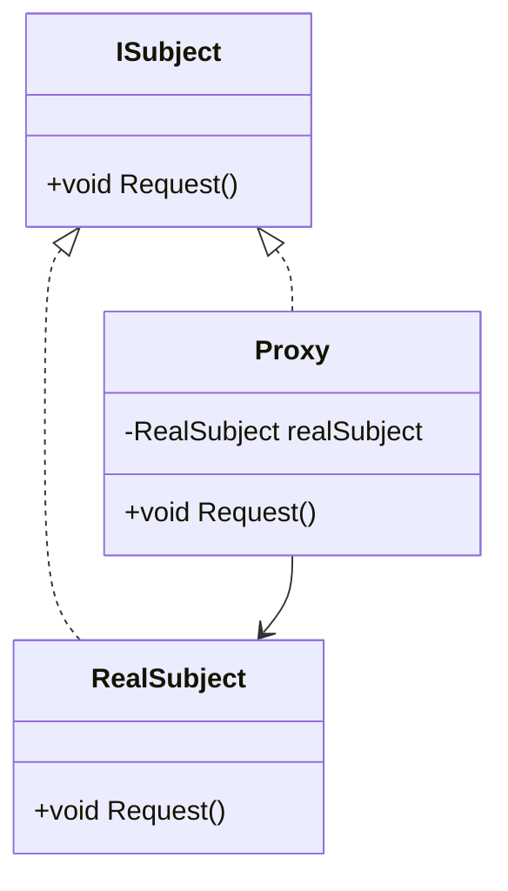

## 5.7 Proxy Design Pattern

The Proxy Design Pattern is a structural design pattern that provides a surrogate or placeholder for another object to control access to it. This pattern is particularly useful in scenarios where direct access to an object is either not desirable or possible. By using a proxy, you can introduce an additional layer of control, which can be leveraged for various purposes such as lazy initialization, access control, logging, and more.

### Intent

The primary intent of the Proxy Design Pattern is to provide a substitute or placeholder for another object to control access to it. This can be useful for several reasons, including:

- **Lazy Initialization**: Deferring the creation and initialization of expensive objects until they are actually needed.
- **Access Control**: Restricting access to certain objects based on user permissions or other criteria.
- **Remote Proxy**: Representing an object that exists in a different address space, such as in a different machine or network.
- **Smart Proxy**: Adding additional functionality, such as logging or caching, when accessing an object.

### Key Participants

1. **Subject**: Defines the common interface for RealSubject and Proxy so that a Proxy can be used anywhere a RealSubject is expected.
2. **RealSubject**: The real object that the proxy represents.
3. **Proxy**: Maintains a reference to the RealSubject and provides an interface identical to the Subject's interface. It controls access to the RealSubject and may be responsible for creating and deleting it.

### Types of Proxies

1. **Virtual Proxy**: Controls access to a resource that is expensive to create. It creates the resource only when it is needed.
2. **Remote Proxy**: Represents an object located in a different address space. It handles the communication between the client and the remote object.
3. **Protective Proxy**: Controls access to the original object. It can check permissions before forwarding the request to the real object.
4. **Smart Proxy**: Provides additional functionality, such as reference counting, logging, or caching, when accessing an object.

### Implementing Proxy in C#

Let's explore how to implement the Proxy Design Pattern in C# using interfaces and classes.

#### Using Interfaces and Classes to Create Proxies

In C#, interfaces are often used to define the contract that both the RealSubject and Proxy must adhere to. Here's a simple example:

```csharp
// Subject interface
public interface ISubject
{
    void Request();
}

// RealSubject class
public class RealSubject : ISubject
{
    public void Request()
    {
        Console.WriteLine("RealSubject: Handling Request.");
    }
}

// Proxy class
public class Proxy : ISubject
{
    private RealSubject _realSubject;

    public void Request()
    {
        if (_realSubject == null)
        {
            _realSubject = new RealSubject();
        }
        Console.WriteLine("Proxy: Logging the request.");
        _realSubject.Request();
    }
}

// Client code
public class Client
{
    public static void Main(string[] args)
    {
        ISubject proxy = new Proxy();
        proxy.Request();
    }
}
```

In this example, the `Proxy` class controls access to the `RealSubject`. It logs the request before delegating it to the `RealSubject`.

### Dynamic Proxy

Dynamic proxies in C# can be created using reflection and runtime code generation. This allows for more flexible and powerful proxy implementations that can handle method calls dynamically.

#### Creating Proxies that Handle Method Calls Dynamically

Dynamic proxies can be particularly useful when you need to intercept method calls and add behavior such as logging, transaction management, or security checks.

Here's an example using the `System.Reflection` namespace to create a dynamic proxy:

```csharp
using System;
using System.Reflection;

public interface IService
{
    void Serve();
}

public class RealService : IService
{
    public void Serve()
    {
        Console.WriteLine("RealService: Serving.");
    }
}

public class DynamicProxy : DispatchProxy
{
    private IService _realService;

    protected override object Invoke(MethodInfo targetMethod, object[] args)
    {
        Console.WriteLine("DynamicProxy: Before invoking " + targetMethod.Name);
        var result = targetMethod.Invoke(_realService, args);
        Console.WriteLine("DynamicProxy: After invoking " + targetMethod.Name);
        return result;
    }

    public static T Create<T>(T realService) where T : class
    {
        object proxy = Create<T, DynamicProxy>();
        ((DynamicProxy)proxy)._realService = realService;
        return (T)proxy;
    }
}

public class Client
{
    public static void Main(string[] args)
    {
        IService service = new RealService();
        IService proxy = DynamicProxy.Create(service);
        proxy.Serve();
    }
}
```

In this example, the `DynamicProxy` class uses `DispatchProxy` to intercept method calls and add behavior before and after the method invocation.

### Use Cases and Examples

The Proxy Design Pattern is versatile and can be applied in various scenarios. Let's explore some common use cases:

#### Lazy Loading

Lazy loading is a common use case for the Proxy Design Pattern. It involves deferring the creation of an expensive object until it is actually needed.

```csharp
public class LazyLoadingProxy : ISubject
{
    private RealSubject _realSubject;

    public void Request()
    {
        if (_realSubject == null)
        {
            Console.WriteLine("LazyLoadingProxy: Creating RealSubject.");
            _realSubject = new RealSubject();
        }
        _realSubject.Request();
    }
}
```

In this example, the `LazyLoadingProxy` creates the `RealSubject` only when the `Request` method is called for the first time.

#### Access Control

Access control can be implemented using a protective proxy. This proxy checks permissions before allowing access to the real object.

```csharp
public class ProtectiveProxy : ISubject
{
    private RealSubject _realSubject;
    private bool _hasAccess;

    public ProtectiveProxy(bool hasAccess)
    {
        _hasAccess = hasAccess;
    }

    public void Request()
    {
        if (!_hasAccess)
        {
            Console.WriteLine("ProtectiveProxy: Access denied.");
            return;
        }

        if (_realSubject == null)
        {
            _realSubject = new RealSubject();
        }
        _realSubject.Request();
    }
}
```

In this example, the `ProtectiveProxy` checks if the user has access before delegating the request to the `RealSubject`.

#### Remote Object Access

Remote proxies are used to represent objects that exist in different address spaces. They handle the communication between the client and the remote object.

```csharp
public class RemoteProxy : ISubject
{
    private RealSubject _realSubject;

    public void Request()
    {
        Console.WriteLine("RemoteProxy: Forwarding request to remote object.");
        // Simulate remote call
        _realSubject = new RealSubject();
        _realSubject.Request();
    }
}
```

In this example, the `RemoteProxy` simulates forwarding a request to a remote object.

### Design Considerations

When implementing the Proxy Design Pattern, consider the following:

- **Performance**: Proxies can introduce additional overhead, so it's important to ensure that the benefits outweigh the costs.
- **Complexity**: Adding a proxy layer can increase the complexity of your codebase. Ensure that the added complexity is justified by the benefits.
- **Security**: Proxies can be used to enforce security policies, but they can also introduce vulnerabilities if not implemented correctly.

### Differences and Similarities

The Proxy Design Pattern is often confused with other patterns such as Decorator and Adapter. Here's how they differ:

- **Proxy vs. Decorator**: Both patterns provide a level of indirection, but the Proxy controls access to the object, while the Decorator adds behavior to the object.
- **Proxy vs. Adapter**: The Adapter pattern changes the interface of an object, while the Proxy pattern provides the same interface as the real object.

### Visualizing the Proxy Design Pattern

To better understand the Proxy Design Pattern, let's visualize it using a class diagram.



In this diagram, the `ISubject` interface is implemented by both the `RealSubject` and the `Proxy`. The `Proxy` maintains a reference to the `RealSubject` and controls access to it.

### Try It Yourself

To deepen your understanding of the Proxy Design Pattern, try modifying the code examples provided:

- **Experiment with Lazy Loading**: Modify the `LazyLoadingProxy` to include a delay or resource-intensive operation to simulate an expensive object creation.
- **Implement Additional Access Control**: Enhance the `ProtectiveProxy` to check for different levels of access or permissions.
- **Create a Dynamic Proxy**: Use the `DynamicProxy` example to intercept additional method calls and add custom behavior.

### Knowledge Check

Before we conclude, let's summarize the key takeaways:

- The Proxy Design Pattern provides a surrogate or placeholder for another object to control access.
- It can be used for lazy loading, access control, remote object access, and more.
- Proxies can be implemented using interfaces and classes, or dynamically using reflection.
- Consider performance, complexity, and security when implementing proxies.

Remember, mastering design patterns is a journey. Keep experimenting, stay curious, and enjoy the process of learning and applying these patterns in your projects.

## Quiz Time!



### What is the primary intent of the Proxy Design Pattern?

- [x] To provide a surrogate or placeholder for another object to control access.
- [ ] To add new functionality to an existing object.
- [ ] To change the interface of an existing object.
- [ ] To create a family of related objects.

> **Explanation:** The Proxy Design Pattern provides a surrogate or placeholder for another object to control access to it.

### Which of the following is NOT a type of proxy?

- [ ] Virtual Proxy
- [ ] Remote Proxy
- [ ] Protective Proxy
- [x] Adapter Proxy

> **Explanation:** Adapter Proxy is not a recognized type of proxy. The recognized types include Virtual, Remote, Protective, and Smart Proxies.

### What is a common use case for a Virtual Proxy?

- [x] Lazy loading of expensive objects.
- [ ] Access control based on user permissions.
- [ ] Representing remote objects.
- [ ] Adding logging functionality.

> **Explanation:** A Virtual Proxy is commonly used for lazy loading of expensive objects, deferring their creation until needed.

### How does a Protective Proxy control access?

- [x] By checking permissions before forwarding the request to the real object.
- [ ] By adding additional functionality to the real object.
- [ ] By changing the interface of the real object.
- [ ] By representing the real object in a different address space.

> **Explanation:** A Protective Proxy controls access by checking permissions before forwarding the request to the real object.

### What is the role of the Proxy class in the Proxy Design Pattern?

- [x] To maintain a reference to the RealSubject and control access to it.
- [ ] To define the common interface for RealSubject and Proxy.
- [ ] To handle method calls dynamically using reflection.
- [ ] To represent an object located in a different address space.

> **Explanation:** The Proxy class maintains a reference to the RealSubject and controls access to it.

### Which C# feature is commonly used to create dynamic proxies?

- [ ] Generics
- [ ] LINQ
- [x] Reflection
- [ ] Delegates

> **Explanation:** Reflection is commonly used in C# to create dynamic proxies that handle method calls dynamically.

### What is the difference between a Proxy and a Decorator?

- [x] A Proxy controls access to an object, while a Decorator adds behavior to an object.
- [ ] A Proxy changes the interface of an object, while a Decorator provides the same interface.
- [ ] A Proxy is used for lazy loading, while a Decorator is used for access control.
- [ ] A Proxy is used for remote objects, while a Decorator is used for local objects.

> **Explanation:** A Proxy controls access to an object, while a Decorator adds behavior to an object.

### Which pattern is often confused with the Proxy pattern?

- [ ] Singleton
- [ ] Factory
- [x] Adapter
- [ ] Observer

> **Explanation:** The Adapter pattern is often confused with the Proxy pattern, but they serve different purposes.

### True or False: A Smart Proxy can add logging functionality to an object.

- [x] True
- [ ] False

> **Explanation:** A Smart Proxy can add additional functionality, such as logging, when accessing an object.

### What should be considered when implementing the Proxy Design Pattern?

- [x] Performance, complexity, and security.
- [ ] Only performance.
- [ ] Only security.
- [ ] Only complexity.

> **Explanation:** When implementing the Proxy Design Pattern, consider performance, complexity, and security.


