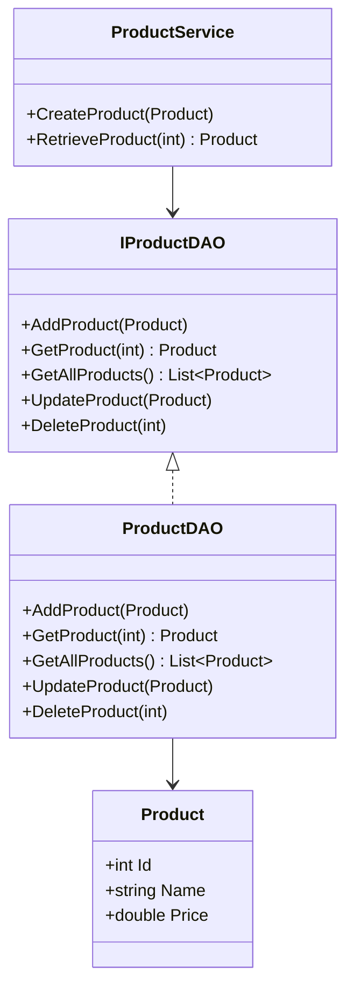

## 5.8.1 Data Access Object (DAO) Pattern

The Data Access Object (DAO) pattern is a structural design pattern that provides an abstract interface to some type of database or other persistence mechanism. By mapping application calls to the persistence layer, the DAO pattern provides some specific data operations without exposing details of the database. This pattern allows for the separation of data access logic from business logic, promoting a cleaner and more maintainable codebase.

### Intent

The primary intent of the DAO pattern is to abstract and encapsulate all access to the data source. This abstraction allows the rest of the application to remain agnostic to the underlying data source, whether it be a relational database, a file system, or an external service. By doing so, the DAO pattern facilitates easier testing, maintenance, and scalability.

### Key Participants

1. **DAO Interface**: Defines the standard operations to be performed on a model object(s).
2. **Concrete DAO Class**: Implements the DAO interface. This class contains the actual logic to access the data source.
3. **Model Object or Value Object**: Represents the data that is being accessed.

### Applicability

Use the DAO pattern when:
- You need to separate data access logic from business logic.
- You want to switch between different data sources without affecting the business logic.
- You aim to improve code maintainability and testability by isolating database access code.

### Implementing DAO in C#

#### Creating DAO Interfaces and Classes

To implement the DAO pattern in C#, we start by defining an interface that outlines the operations that can be performed on the data. Then, we create a concrete class that implements this interface and contains the logic to interact with the data source.

```csharp
// DAO Interface
public interface IProductDAO
{
    void AddProduct(Product product);
    Product GetProduct(int id);
    List<Product> GetAllProducts();
    void UpdateProduct(Product product);
    void DeleteProduct(int id);
}

// Concrete DAO Class
public class ProductDAO : IProductDAO
{
    private readonly string connectionString;

    public ProductDAO(string connectionString)
    {
        this.connectionString = connectionString;
    }

    public void AddProduct(Product product)
    {
        // Logic to add product to the database
    }

    public Product GetProduct(int id)
    {
        // Logic to retrieve a product from the database
        return new Product(); // Placeholder
    }

    public List<Product> GetAllProducts()
    {
        // Logic to retrieve all products from the database
        return new List<Product>(); // Placeholder
    }

    public void UpdateProduct(Product product)
    {
        // Logic to update a product in the database
    }

    public void DeleteProduct(int id)
    {
        // Logic to delete a product from the database
    }
}
```

#### Separating Data Persistence Logic from Business Logic

By using the DAO pattern, we ensure that the business logic does not directly interact with the data source. Instead, it communicates through the DAO interface, which abstracts the underlying data access details.

```csharp
// Business Logic Layer
public class ProductService
{
    private readonly IProductDAO productDAO;

    public ProductService(IProductDAO productDAO)
    {
        this.productDAO = productDAO;
    }

    public void CreateProduct(Product product)
    {
        // Business logic before adding product
        productDAO.AddProduct(product);
    }

    public Product RetrieveProduct(int id)
    {
        // Business logic before retrieving product
        return productDAO.GetProduct(id);
    }

    // Additional business logic methods
}
```

### Use Cases and Examples

#### Accessing Databases

The DAO pattern is commonly used to access relational databases. By encapsulating database access logic within DAO classes, we can easily switch between different databases or modify the database schema without affecting the business logic.

```csharp
// Example of using ProductService with a DAO
public class Program
{
    public static void Main()
    {
        IProductDAO productDAO = new ProductDAO("your_connection_string");
        ProductService productService = new ProductService(productDAO);

        Product newProduct = new Product { Id = 1, Name = "Laptop", Price = 999.99 };
        productService.CreateProduct(newProduct);

        Product retrievedProduct = productService.RetrieveProduct(1);
        Console.WriteLine($"Retrieved Product: {retrievedProduct.Name}");
    }
}
```

#### Accessing Files or External Services

The DAO pattern can also be applied to access files or external services. For instance, if your application needs to read from or write to a file, you can create a DAO class that handles file operations.

```csharp
// File-based DAO Interface
public interface IFileDAO
{
    void WriteData(string data);
    string ReadData();
}

// Concrete File-based DAO Class
public class FileDAO : IFileDAO
{
    private readonly string filePath;

    public FileDAO(string filePath)
    {
        this.filePath = filePath;
    }

    public void WriteData(string data)
    {
        File.WriteAllText(filePath, data);
    }

    public string ReadData()
    {
        return File.ReadAllText(filePath);
    }
}
```

### Design Considerations

When implementing the DAO pattern, consider the following:
- **Transaction Management**: Ensure that transactions are handled properly to maintain data integrity.
- **Error Handling**: Implement robust error handling to manage exceptions that may occur during data access.
- **Performance**: Optimize data access operations to minimize performance bottlenecks.
- **Security**: Secure data access operations to prevent unauthorized access or SQL injection attacks.

### Differences and Similarities

The DAO pattern is often compared to the Repository pattern. While both patterns abstract data access, the Repository pattern is more focused on providing a collection-like interface for accessing domain objects, whereas the DAO pattern is more about abstracting the persistence mechanism itself.

### Visualizing the DAO Pattern

To better understand the DAO pattern, let's visualize the interaction between the components using a class diagram.



### Try It Yourself

Experiment with the DAO pattern by modifying the code examples:
- Implement a new DAO class for a different data source, such as a NoSQL database.
- Add additional methods to the DAO interface and implement them in the concrete class.
- Modify the business logic in `ProductService` to include validation or transformation before data access.

### Knowledge Check

- What is the primary purpose of the DAO pattern?
- How does the DAO pattern promote separation of concerns?
- What are some common use cases for the DAO pattern?
- How does the DAO pattern differ from the Repository pattern?

### Embrace the Journey

Remember, mastering design patterns like DAO is a journey. As you continue to explore and implement these patterns, you'll gain a deeper understanding of how to build scalable and maintainable applications. Keep experimenting, stay curious, and enjoy the process!

## Quiz Time!



### What is the primary purpose of the DAO pattern?

- [x] To abstract and encapsulate all access to a data source.
- [ ] To provide a user interface for data manipulation.
- [ ] To handle user authentication and authorization.
- [ ] To manage application configuration settings.

> **Explanation:** The DAO pattern abstracts and encapsulates all access to a data source, allowing the rest of the application to remain agnostic to the underlying data source.

### Which component in the DAO pattern defines the standard operations to be performed on a model object?

- [x] DAO Interface
- [ ] Concrete DAO Class
- [ ] Model Object
- [ ] Business Logic Layer

> **Explanation:** The DAO Interface defines the standard operations to be performed on a model object.

### How does the DAO pattern promote separation of concerns?

- [x] By separating data access logic from business logic.
- [ ] By combining data access and business logic.
- [ ] By integrating user interface with data access.
- [ ] By merging configuration settings with business logic.

> **Explanation:** The DAO pattern promotes separation of concerns by separating data access logic from business logic.

### What is a common use case for the DAO pattern?

- [x] Accessing relational databases.
- [ ] Rendering user interfaces.
- [ ] Managing application state.
- [ ] Handling user input validation.

> **Explanation:** A common use case for the DAO pattern is accessing relational databases.

### How does the DAO pattern differ from the Repository pattern?

- [x] DAO abstracts the persistence mechanism, while Repository provides a collection-like interface.
- [ ] DAO provides a collection-like interface, while Repository abstracts the persistence mechanism.
- [ ] DAO is used for user interface design, while Repository is for data access.
- [ ] DAO is for configuration management, while Repository is for business logic.

> **Explanation:** The DAO pattern abstracts the persistence mechanism itself, while the Repository pattern provides a collection-like interface for accessing domain objects.

### What should be considered when implementing the DAO pattern?

- [x] Transaction Management
- [x] Error Handling
- [x] Performance
- [ ] User Interface Design

> **Explanation:** When implementing the DAO pattern, consider transaction management, error handling, and performance.

### Which of the following is NOT a key participant in the DAO pattern?

- [ ] DAO Interface
- [ ] Concrete DAO Class
- [ ] Model Object
- [x] User Interface Component

> **Explanation:** The User Interface Component is not a key participant in the DAO pattern.

### What is the role of the Concrete DAO Class?

- [x] To implement the DAO interface and contain the logic to interact with the data source.
- [ ] To define the standard operations to be performed on a model object.
- [ ] To represent the data that is being accessed.
- [ ] To manage user interface interactions.

> **Explanation:** The Concrete DAO Class implements the DAO interface and contains the logic to interact with the data source.

### What is a benefit of using the DAO pattern?

- [x] Improved code maintainability and testability.
- [ ] Simplified user interface design.
- [ ] Enhanced user authentication.
- [ ] Reduced application configuration complexity.

> **Explanation:** The DAO pattern improves code maintainability and testability by isolating database access code.

### True or False: The DAO pattern can be used to access external services.

- [x] True
- [ ] False

> **Explanation:** The DAO pattern can be used to access external services, in addition to databases and file systems.


