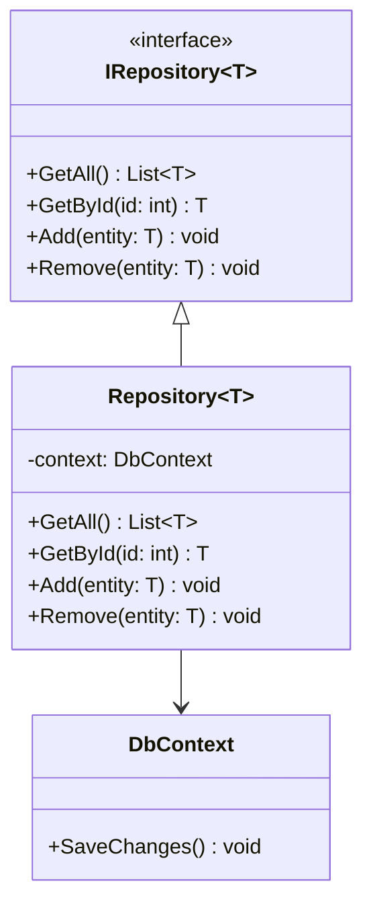

## 5.8.2 Repository Pattern

The Repository Pattern is a crucial design pattern in software development, particularly in the context of data access and management. It provides a collection-like interface for accessing domain objects, abstracting the data access layer and promoting a clean separation of concerns. In this section, we will delve into the intricacies of the Repository Pattern, its implementation in C#, integration with Object-Relational Mappers (ORMs) like Entity Framework, and the Identity Map Pattern for efficient object management.

### Design Pattern Name

**Repository Pattern**

### Category

Structural Design Pattern

### Intent

The primary intent of the Repository Pattern is to mediate between the domain and data mapping layers using a collection-like interface for accessing domain objects. It centralizes data access logic, making it easier to manage and test.

### Diagrams

To better understand the Repository Pattern, let's visualize its structure using a class diagram:



**Diagram Description:** This diagram illustrates the relationship between the `IRepository` interface, the `Repository` class, and the `DbContext` used for data access.

### Key Participants

- **IRepository<T>**: An interface defining the contract for data access operations.
- **Repository<T>**: A concrete class implementing the `IRepository<T>` interface, encapsulating data access logic.
- **DbContext**: Represents the database context used for interacting with the database.

### Applicability

The Repository Pattern is applicable in scenarios where:

- You need to abstract and encapsulate data access logic.
- You want to promote a clean separation of concerns between the domain and data access layers.
- You aim to facilitate unit testing by mocking data access operations.
- You require a consistent interface for accessing domain objects across different data sources.

### Sample Code Snippet

Let's explore a sample implementation of the Repository Pattern in C#:

```csharp
// Define the IRepository interface
public interface IRepository<T> where T : class
{
    IEnumerable<T> GetAll();
    T GetById(int id);
    void Add(T entity);
    void Remove(T entity);
}

// Implement the Repository class
public class Repository<T> : IRepository<T> where T : class
{
    private readonly DbContext _context;
    private readonly DbSet<T> _dbSet;

    public Repository(DbContext context)
    {
        _context = context;
        _dbSet = context.Set<T>();
    }

    public IEnumerable<T> GetAll()
    {
        return _dbSet.ToList();
    }

    public T GetById(int id)
    {
        return _dbSet.Find(id);
    }

    public void Add(T entity)
    {
        _dbSet.Add(entity);
    }

    public void Remove(T entity)
    {
        _dbSet.Remove(entity);
    }
}
```

**Code Explanation:** In this example, we define an `IRepository<T>` interface with methods for common data access operations. The `Repository<T>` class implements this interface, using Entity Framework's `DbContext` and `DbSet<T>` to perform data access operations.

### Implementing Repository in C#

Implementing the Repository Pattern in C# involves creating interfaces and classes that encapsulate data access logic. Let's break down the steps:

#### Using Interfaces and Classes to Create Repositories

1. **Define the IRepository Interface**: Start by defining an interface that outlines the contract for data access operations. This interface should include methods for common operations like retrieving all entities, getting an entity by ID, adding, and removing entities.

2. **Implement the Repository Class**: Create a concrete class that implements the `IRepository` interface. This class should encapsulate the data access logic, interacting with the database context to perform operations.

3. **Integrate with ORMs**: Use an ORM like Entity Framework to simplify data access. The repository class can leverage the ORM's features to interact with the database, reducing boilerplate code and improving maintainability.

#### Integrating with ORMs like Entity Framework

Entity Framework is a popular ORM for .NET applications, providing a powerful and flexible way to interact with databases. Integrating the Repository Pattern with Entity Framework involves:

- **Using DbContext**: The `DbContext` class represents the database context, providing access to the database and managing entity states.

- **Leveraging DbSet<T>**: The `DbSet<T>` class represents a collection of entities of a specific type, allowing for CRUD operations.

- **Handling Transactions**: Use Entity Framework's transaction management features to ensure data consistency and integrity.

### Identity Map Pattern

The Identity Map Pattern is a complementary pattern to the Repository Pattern, aimed at improving performance and consistency by keeping a record of all loaded objects. This ensures that each object is loaded only once, preventing duplicate instances and reducing database queries.

#### Implementing Identity Map in C#

To implement the Identity Map Pattern in C#, follow these steps:

1. **Create an Identity Map Class**: Define a class that maintains a dictionary of loaded objects, keyed by their unique identifiers.

2. **Integrate with the Repository**: Modify the repository class to check the identity map before loading an object from the database. If the object is already loaded, return it from the identity map.

3. **Manage Object States**: Ensure that the identity map correctly tracks object states, updating or removing objects as needed.

#### Use Cases and Examples

The Identity Map Pattern is particularly useful in scenarios where:

- You need to minimize database queries by reusing loaded objects.
- You want to ensure consistency by preventing duplicate instances of the same object.
- You aim to improve performance by reducing the overhead of loading objects from the database.

### Use Cases and Examples

The Repository Pattern is widely used in software development for abstracting data access layers and facilitating unit testing. Let's explore some common use cases and examples:

#### Abstracting Data Access Layers

The Repository Pattern provides a consistent interface for accessing data, abstracting the underlying data access logic. This promotes a clean separation of concerns, allowing developers to focus on business logic without worrying about data access details.

#### Unit Testing

By abstracting data access logic into repositories, you can easily mock data access operations for unit testing. This enables you to test business logic in isolation, ensuring that your application behaves as expected.

### Design Considerations

When implementing the Repository Pattern, consider the following:

- **Consistency**: Ensure that the repository provides a consistent interface for accessing data, regardless of the underlying data source.

- **Performance**: Use caching and identity maps to improve performance by reducing database queries and reusing loaded objects.

- **Scalability**: Design the repository to handle large volumes of data and concurrent access, ensuring that it scales with your application's needs.

- **Integration with ORMs**: Leverage ORM features to simplify data access and reduce boilerplate code, improving maintainability and reducing the risk of errors.

### Differences and Similarities

The Repository Pattern is often confused with other data access patterns, such as the Data Access Object (DAO) Pattern. While both patterns aim to abstract data access logic, the Repository Pattern focuses on providing a collection-like interface for accessing domain objects, whereas the DAO Pattern is more concerned with encapsulating data access operations.

### Try It Yourself

To deepen your understanding of the Repository Pattern, try modifying the sample code to:

- Add support for updating entities.
- Implement caching to improve performance.
- Integrate with a different ORM, such as Dapper.

### Knowledge Check

- What is the primary intent of the Repository Pattern?
- How does the Identity Map Pattern complement the Repository Pattern?
- What are the key benefits of using the Repository Pattern in software development?

### Embrace the Journey

Remember, mastering design patterns is a journey. As you progress, you'll build more scalable and maintainable applications. Keep experimenting, stay curious, and enjoy the journey!

## Quiz Time!



### What is the primary intent of the Repository Pattern?

- [x] To mediate between the domain and data mapping layers using a collection-like interface for accessing domain objects.
- [ ] To provide a direct connection to the database for CRUD operations.
- [ ] To replace the need for an ORM in data access.
- [ ] To handle user authentication and authorization.

> **Explanation:** The Repository Pattern's primary intent is to mediate between the domain and data mapping layers, providing a collection-like interface for accessing domain objects.

### How does the Identity Map Pattern complement the Repository Pattern?

- [x] By keeping a record of all loaded objects to ensure each object is loaded only once.
- [ ] By providing a direct connection to the database for CRUD operations.
- [ ] By replacing the need for an ORM in data access.
- [ ] By handling user authentication and authorization.

> **Explanation:** The Identity Map Pattern complements the Repository Pattern by keeping a record of all loaded objects, ensuring each object is loaded only once, which improves performance and consistency.

### What are the key benefits of using the Repository Pattern in software development?

- [x] Abstracting data access layers and facilitating unit testing.
- [ ] Providing a direct connection to the database for CRUD operations.
- [ ] Replacing the need for an ORM in data access.
- [ ] Handling user authentication and authorization.

> **Explanation:** The key benefits of using the Repository Pattern include abstracting data access layers and facilitating unit testing by providing a consistent interface for data access.

### Which class in Entity Framework represents the database context?

- [x] DbContext
- [ ] DbSet
- [ ] Repository
- [ ] IdentityMap

> **Explanation:** In Entity Framework, the `DbContext` class represents the database context, providing access to the database and managing entity states.

### What is the role of the IRepository interface in the Repository Pattern?

- [x] To define the contract for data access operations.
- [ ] To provide a direct connection to the database for CRUD operations.
- [ ] To replace the need for an ORM in data access.
- [ ] To handle user authentication and authorization.

> **Explanation:** The `IRepository` interface defines the contract for data access operations, outlining methods for common operations like retrieving, adding, and removing entities.

### How can the Repository Pattern improve unit testing?

- [x] By abstracting data access logic into repositories, allowing for easy mocking of data access operations.
- [ ] By providing a direct connection to the database for CRUD operations.
- [ ] By replacing the need for an ORM in data access.
- [ ] By handling user authentication and authorization.

> **Explanation:** The Repository Pattern improves unit testing by abstracting data access logic into repositories, allowing for easy mocking of data access operations and testing business logic in isolation.

### What is the purpose of the DbSet class in Entity Framework?

- [x] To represent a collection of entities of a specific type, allowing for CRUD operations.
- [ ] To provide a direct connection to the database for CRUD operations.
- [ ] To replace the need for an ORM in data access.
- [ ] To handle user authentication and authorization.

> **Explanation:** In Entity Framework, the `DbSet` class represents a collection of entities of a specific type, allowing for CRUD operations.

### Which pattern is often confused with the Repository Pattern?

- [x] Data Access Object (DAO) Pattern
- [ ] Singleton Pattern
- [ ] Observer Pattern
- [ ] Strategy Pattern

> **Explanation:** The Repository Pattern is often confused with the Data Access Object (DAO) Pattern, as both aim to abstract data access logic.

### What is a key consideration when implementing the Repository Pattern?

- [x] Ensuring consistency and performance by using caching and identity maps.
- [ ] Providing a direct connection to the database for CRUD operations.
- [ ] Replacing the need for an ORM in data access.
- [ ] Handling user authentication and authorization.

> **Explanation:** A key consideration when implementing the Repository Pattern is ensuring consistency and performance by using caching and identity maps to reduce database queries and reuse loaded objects.

### True or False: The Repository Pattern eliminates the need for an ORM in data access.

- [ ] True
- [x] False

> **Explanation:** False. The Repository Pattern does not eliminate the need for an ORM; rather, it complements ORMs by providing a consistent interface for accessing domain objects and abstracting data access logic.


