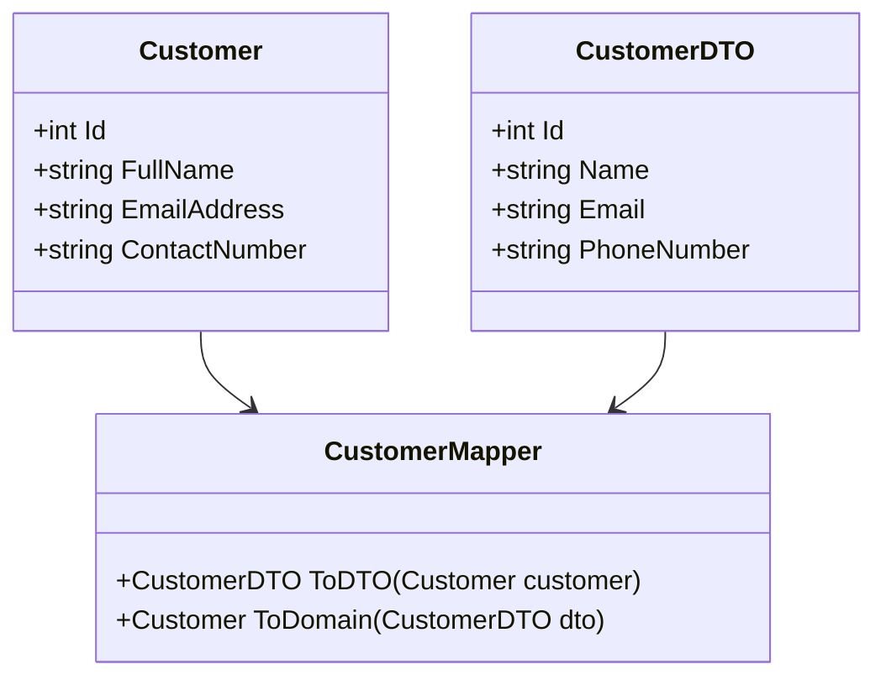

## 5.8.3 Data Transfer Object (DTO) Pattern

The Data Transfer Object (DTO) pattern is a structural design pattern used to transfer data between software application subsystems. It is particularly useful in distributed systems where reducing the number of calls between client and server is crucial for performance optimization. In this section, we will explore the concept of DTOs, their implementation in C#, and their practical use cases.

### Intent

The primary intent of the DTO pattern is to encapsulate data and transfer it between layers or subsystems of an application. By doing so, it reduces the number of method calls required to fetch or send data, thereby optimizing network usage and improving application performance.

### Key Participants

- **DTO Class**: A simple data container class that holds the data to be transferred.
- **Assembler**: Responsible for converting domain models to DTOs and vice versa.
- **Client**: Consumes the DTOs to perform operations or display data.

### Applicability

The DTO pattern is applicable in scenarios where:
- Data needs to be transferred across different layers or tiers of an application.
- Network performance is a concern, and reducing the number of remote calls is necessary.
- There is a need to decouple the client from the internal representation of data.

### Implementing DTOs in C#

#### Creating Simple Data Containers

A DTO is typically a simple class with no behavior other than storage and retrieval of its own data. It often contains properties that correspond to the data fields being transferred.

```csharp
public class CustomerDTO
{
    public int Id { get; set; }
    public string Name { get; set; }
    public string Email { get; set; }
    public string PhoneNumber { get; set; }
}
```

In this example, `CustomerDTO` is a simple data container with properties for customer information. It does not contain any business logic or methods beyond what is necessary to hold and retrieve data.

#### Mapping Between Domain Models and DTOs

Mapping between domain models and DTOs is a crucial step in implementing the DTO pattern. This can be done manually or using libraries such as AutoMapper.

**Manual Mapping Example:**

```csharp
public class Customer
{
    public int Id { get; set; }
    public string FullName { get; set; }
    public string EmailAddress { get; set; }
    public string ContactNumber { get; set; }
}

public class CustomerMapper
{
    public CustomerDTO ToDTO(Customer customer)
    {
        return new CustomerDTO
        {
            Id = customer.Id,
            Name = customer.FullName,
            Email = customer.EmailAddress,
            PhoneNumber = customer.ContactNumber
        };
    }

    public Customer ToDomain(CustomerDTO dto)
    {
        return new Customer
        {
            Id = dto.Id,
            FullName = dto.Name,
            EmailAddress = dto.Email,
            ContactNumber = dto.PhoneNumber
        };
    }
}
```

**Using AutoMapper:**

```csharp
var config = new MapperConfiguration(cfg => 
{
    cfg.CreateMap<Customer, CustomerDTO>()
        .ForMember(dest => dest.Name, opt => opt.MapFrom(src => src.FullName))
        .ForMember(dest => dest.Email, opt => opt.MapFrom(src => src.EmailAddress))
        .ForMember(dest => dest.PhoneNumber, opt => opt.MapFrom(src => src.ContactNumber));
});

IMapper mapper = config.CreateMapper();
CustomerDTO dto = mapper.Map<CustomerDTO>(customer);
```

### Use Cases and Examples

#### Reducing Network Overhead

In distributed systems, DTOs can significantly reduce network overhead by consolidating multiple data fields into a single transfer object, thus minimizing the number of remote calls.

**Example Scenario:**

Consider a web application that needs to display customer details on a dashboard. Instead of making separate calls to fetch each piece of customer information, a single DTO can be used to transfer all necessary data in one go.

#### Decoupling Layers

DTOs help decouple the presentation layer from the business logic layer. By using DTOs, changes in the domain model do not directly affect the client, as the client interacts with the DTOs instead.

**Example Scenario:**

In a multi-tier architecture, the presentation layer can use DTOs to interact with the business logic layer. This decoupling allows for changes in the business logic without impacting the presentation layer.

### Design Considerations

- **When to Use**: Use DTOs when you need to transfer data between layers or systems, especially in distributed applications where network performance is a concern.
- **Pitfalls**: Overusing DTOs can lead to unnecessary complexity. Ensure that DTOs are used only when there is a clear benefit in terms of performance or decoupling.
- **C# Specific Features**: Leverage C# features such as properties, auto-implemented properties, and libraries like AutoMapper for efficient DTO implementation.

### Differences and Similarities

- **DTO vs. Value Object**: DTOs are used for data transfer, while value objects are used to represent a descriptive aspect of the domain with no identity.
- **DTO vs. Entity**: Entities have a distinct identity and lifecycle, whereas DTOs are transient and used solely for data transfer.

### Visualizing the DTO Pattern



**Diagram Description**: This class diagram illustrates the relationship between the `Customer` domain model, the `CustomerDTO`, and the `CustomerMapper` responsible for converting between the two.

### Try It Yourself

Experiment with the provided code examples by modifying the `CustomerDTO` to include additional fields or by changing the mapping logic in `CustomerMapper`. Try using AutoMapper to simplify the mapping process and observe how it affects the code structure.

### Knowledge Check

- Explain the primary purpose of the DTO pattern.
- Describe how DTOs can reduce network overhead in distributed systems.
- Discuss the differences between DTOs and entities.
- Provide an example of when to use DTOs in a multi-tier architecture.

### Embrace the Journey

Remember, mastering the DTO pattern is just one step in your journey to becoming an expert in C# design patterns. As you continue to explore and experiment, you'll gain a deeper understanding of how to build efficient and scalable applications. Keep learning, stay curious, and enjoy the process!

## Quiz Time!



### What is the primary purpose of a DTO?

- [x] To transfer data between application subsystems
- [ ] To encapsulate business logic
- [ ] To manage database transactions
- [ ] To handle user authentication

> **Explanation:** The primary purpose of a DTO is to transfer data between application subsystems, especially in distributed systems.

### How can DTOs help reduce network overhead?

- [x] By consolidating multiple data fields into a single transfer object
- [ ] By increasing the number of remote calls
- [ ] By adding additional layers of abstraction
- [ ] By simplifying the user interface

> **Explanation:** DTOs reduce network overhead by consolidating multiple data fields into a single transfer object, minimizing the number of remote calls.

### What is a key difference between a DTO and an entity?

- [x] DTOs are transient and used solely for data transfer, while entities have a distinct identity and lifecycle.
- [ ] DTOs encapsulate business logic, while entities do not.
- [ ] DTOs are used for database transactions, while entities are not.
- [ ] DTOs manage user authentication, while entities do not.

> **Explanation:** DTOs are transient and used solely for data transfer, whereas entities have a distinct identity and lifecycle.

### In which scenario is the DTO pattern most applicable?

- [x] When transferring data across different layers or tiers of an application
- [ ] When encapsulating complex business logic
- [ ] When managing database transactions
- [ ] When handling user authentication

> **Explanation:** The DTO pattern is most applicable when transferring data across different layers or tiers of an application, especially in distributed systems.

### What is the role of an assembler in the DTO pattern?

- [x] To convert domain models to DTOs and vice versa
- [ ] To manage database transactions
- [ ] To handle user authentication
- [ ] To encapsulate business logic

> **Explanation:** The assembler is responsible for converting domain models to DTOs and vice versa.

### Which C# feature can be leveraged for efficient DTO implementation?

- [x] Auto-implemented properties
- [ ] LINQ queries
- [ ] Asynchronous programming
- [ ] Exception handling

> **Explanation:** Auto-implemented properties in C# can be leveraged for efficient DTO implementation, simplifying the code.

### What is a potential pitfall of overusing DTOs?

- [x] Unnecessary complexity
- [ ] Improved network performance
- [ ] Simplified code structure
- [ ] Enhanced user interface

> **Explanation:** Overusing DTOs can lead to unnecessary complexity, so they should be used only when there is a clear benefit.

### How does the DTO pattern help in decoupling layers?

- [x] By allowing changes in the domain model without affecting the client
- [ ] By managing database transactions
- [ ] By handling user authentication
- [ ] By encapsulating business logic

> **Explanation:** The DTO pattern helps in decoupling layers by allowing changes in the domain model without affecting the client, as the client interacts with the DTOs.

### Which library can be used to simplify mapping between domain models and DTOs in C#?

- [x] AutoMapper
- [ ] Entity Framework
- [ ] ASP.NET Core
- [ ] Newtonsoft.Json

> **Explanation:** AutoMapper is a library that can be used to simplify mapping between domain models and DTOs in C#.

### True or False: DTOs should contain business logic.

- [x] False
- [ ] True

> **Explanation:** DTOs should not contain business logic; they are simple data containers used for transferring data.


