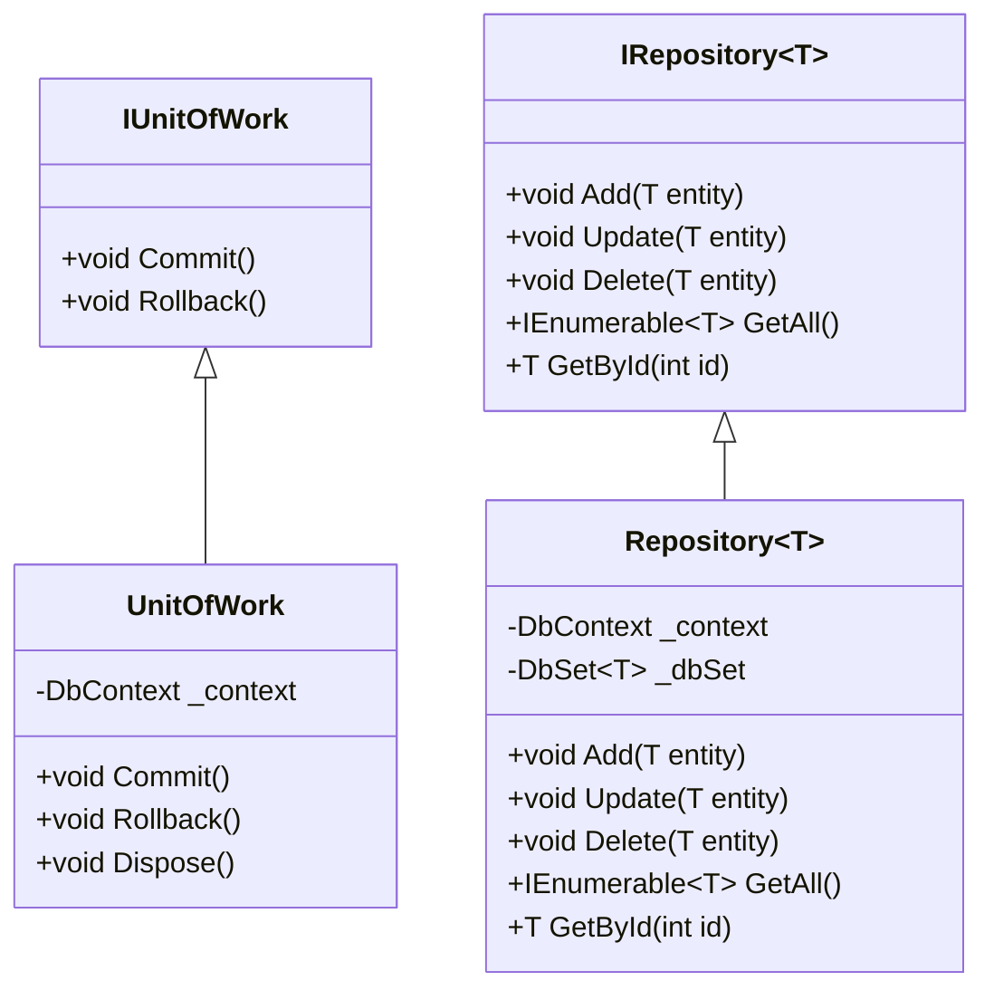

## 5.8.4 Unit of Work Pattern

In the realm of software design patterns, the Unit of Work pattern stands out as a crucial tool for managing transactional data access. It plays a pivotal role in maintaining a list of objects affected by a business transaction and coordinating the writing out of changes. This pattern is particularly beneficial in complex systems where multiple operations need to be executed as a single unit to ensure data consistency and integrity.

### Intent

The primary intent of the Unit of Work pattern is to manage a set of changes to data as a single transaction. This pattern ensures that all operations within a transaction are completed successfully before committing the changes to the database. If any operation fails, the entire transaction is rolled back, maintaining the integrity of the data.

### Key Participants

1. **Unit of Work Interface**: Defines the contract for the operations that can be performed within a unit of work.
2. **Concrete Unit of Work**: Implements the unit of work interface, managing the transaction and coordinating changes.
3. **Repository**: Works with the unit of work to perform data access operations.
4. **Entities**: Represent the data objects that are managed within the unit of work.

### Applicability

The Unit of Work pattern is applicable in scenarios where:

- Multiple operations need to be executed as a single transaction.
- Data consistency and integrity are critical.
- There is a need to minimize database round-trips by batching operations.
- You want to decouple business logic from data access logic.

### Implementing Unit of Work in C#

Implementing the Unit of Work pattern in C# involves creating a unit of work class that manages transactional operations across repositories. Let's explore a step-by-step approach to implementing this pattern.

#### Step 1: Define the Unit of Work Interface

The unit of work interface defines the contract for transactional operations. It typically includes methods for committing and rolling back transactions.

```csharp
public interface IUnitOfWork : IDisposable
{
    void Commit();
    void Rollback();
}
```

#### Step 2: Implement the Concrete Unit of Work

The concrete unit of work class implements the unit of work interface. It manages the transaction and coordinates changes across repositories.

```csharp
public class UnitOfWork : IUnitOfWork
{
    private readonly DbContext _context;

    public UnitOfWork(DbContext context)
    {
        _context = context;
    }

    public void Commit()
    {
        _context.SaveChanges();
    }

    public void Rollback()
    {
        // Implement rollback logic if necessary
    }

    public void Dispose()
    {
        _context.Dispose();
    }
}
```

#### Step 3: Define the Repository Interface

The repository interface defines the contract for data access operations. It typically includes methods for adding, updating, and deleting entities.

```csharp
public interface IRepository<T> where T : class
{
    void Add(T entity);
    void Update(T entity);
    void Delete(T entity);
    IEnumerable<T> GetAll();
    T GetById(int id);
}
```

#### Step 4: Implement the Concrete Repository

The concrete repository class implements the repository interface. It performs data access operations using the unit of work.

```csharp
public class Repository<T> : IRepository<T> where T : class
{
    private readonly DbContext _context;
    private readonly DbSet<T> _dbSet;

    public Repository(DbContext context)
    {
        _context = context;
        _dbSet = context.Set<T>();
    }

    public void Add(T entity)
    {
        _dbSet.Add(entity);
    }

    public void Update(T entity)
    {
        _context.Entry(entity).State = EntityState.Modified;
    }

    public void Delete(T entity)
    {
        _dbSet.Remove(entity);
    }

    public IEnumerable<T> GetAll()
    {
        return _dbSet.ToList();
    }

    public T GetById(int id)
    {
        return _dbSet.Find(id);
    }
}
```

### Use Cases and Examples

The Unit of Work pattern is particularly useful in scenarios where multiple repository changes need to be coordinated within a single transaction. Let's explore a practical example.

#### Example: Coordinating Multiple Repository Changes

Consider a scenario where you need to update a customer's order and their account balance as part of a single transaction. The Unit of Work pattern can help ensure that both operations are completed successfully or not at all.

```csharp
public class OrderService
{
    private readonly IUnitOfWork _unitOfWork;
    private readonly IRepository<Order> _orderRepository;
    private readonly IRepository<Customer> _customerRepository;

    public OrderService(IUnitOfWork unitOfWork, IRepository<Order> orderRepository, IRepository<Customer> customerRepository)
    {
        _unitOfWork = unitOfWork;
        _orderRepository = orderRepository;
        _customerRepository = customerRepository;
    }

    public void ProcessOrder(Order order, Customer customer)
    {
        try
        {
            _orderRepository.Add(order);
            customer.Balance -= order.TotalAmount;
            _customerRepository.Update(customer);

            _unitOfWork.Commit();
        }
        catch (Exception)
        {
            _unitOfWork.Rollback();
            throw;
        }
    }
}
```

In this example, the `ProcessOrder` method adds a new order and updates the customer's balance. If any operation fails, the transaction is rolled back, ensuring data consistency.

### Design Considerations

When implementing the Unit of Work pattern, consider the following:

- **Transaction Management**: Ensure that transactions are managed efficiently to avoid performance bottlenecks.
- **Concurrency**: Handle concurrency issues to prevent data corruption.
- **Error Handling**: Implement robust error handling to manage transaction failures gracefully.
- **Performance**: Minimize database round-trips by batching operations within a transaction.

### Differences and Similarities

The Unit of Work pattern is often used in conjunction with the Repository pattern. While the Repository pattern focuses on data access operations, the Unit of Work pattern manages transactional operations across multiple repositories. Together, they provide a powerful mechanism for managing data access in complex systems.

### Visualizing the Unit of Work Pattern

To better understand the Unit of Work pattern, let's visualize the interaction between the key participants using a class diagram.



This diagram illustrates the relationships between the unit of work, repository, and entities. The `UnitOfWork` class implements the `IUnitOfWork` interface, while the `Repository` class implements the `IRepository` interface.

### Try It Yourself

To deepen your understanding of the Unit of Work pattern, try modifying the code examples to:

- Add a new entity and repository.
- Implement additional methods in the unit of work interface.
- Experiment with different transaction management strategies.

### Knowledge Check

Before we conclude, let's reinforce your understanding of the Unit of Work pattern with a few questions:

- What is the primary intent of the Unit of Work pattern?
- How does the Unit of Work pattern ensure data consistency?
- What are the key participants in the Unit of Work pattern?
- How does the Unit of Work pattern differ from the Repository pattern?

### Embrace the Journey

Remember, mastering design patterns is a journey. The Unit of Work pattern is just one of many tools in your software design toolkit. As you continue to explore and experiment, you'll gain a deeper understanding of how to build scalable and maintainable applications. Keep learning, stay curious, and enjoy the journey!

## Quiz Time!



### What is the primary intent of the Unit of Work pattern?

- [x] To manage a set of changes to data as a single transaction.
- [ ] To provide a mechanism for data access operations.
- [ ] To handle concurrency issues in data access.
- [ ] To implement error handling in data access.

> **Explanation:** The primary intent of the Unit of Work pattern is to manage a set of changes to data as a single transaction, ensuring data consistency and integrity.

### Which of the following is a key participant in the Unit of Work pattern?

- [x] Unit of Work Interface
- [ ] Singleton Pattern
- [ ] Observer Pattern
- [ ] Factory Pattern

> **Explanation:** The Unit of Work Interface is a key participant in the Unit of Work pattern, defining the contract for transactional operations.

### How does the Unit of Work pattern ensure data consistency?

- [x] By managing a set of changes as a single transaction.
- [ ] By providing a mechanism for data access operations.
- [ ] By handling concurrency issues in data access.
- [ ] By implementing error handling in data access.

> **Explanation:** The Unit of Work pattern ensures data consistency by managing a set of changes as a single transaction, committing all changes only if all operations succeed.

### What is the role of the repository in the Unit of Work pattern?

- [x] To perform data access operations.
- [ ] To manage transactional operations.
- [ ] To handle concurrency issues.
- [ ] To implement error handling.

> **Explanation:** The repository performs data access operations, working with the unit of work to manage transactional operations.

### How does the Unit of Work pattern differ from the Repository pattern?

- [x] The Unit of Work pattern manages transactional operations across repositories.
- [ ] The Repository pattern manages transactional operations across repositories.
- [ ] The Unit of Work pattern provides a mechanism for data access operations.
- [ ] The Repository pattern ensures data consistency.

> **Explanation:** The Unit of Work pattern manages transactional operations across repositories, while the Repository pattern focuses on data access operations.

### What is a common use case for the Unit of Work pattern?

- [x] Coordinating multiple repository changes within a single transaction.
- [ ] Implementing error handling in data access.
- [ ] Handling concurrency issues in data access.
- [ ] Providing a mechanism for data access operations.

> **Explanation:** A common use case for the Unit of Work pattern is coordinating multiple repository changes within a single transaction to ensure data consistency.

### Which method is typically included in the Unit of Work interface?

- [x] Commit
- [ ] Add
- [ ] Update
- [ ] Delete

> **Explanation:** The `Commit` method is typically included in the Unit of Work interface to commit the transaction.

### What is the purpose of the `Rollback` method in the Unit of Work pattern?

- [x] To revert changes if a transaction fails.
- [ ] To add a new entity to the database.
- [ ] To update an existing entity in the database.
- [ ] To delete an entity from the database.

> **Explanation:** The `Rollback` method is used to revert changes if a transaction fails, ensuring data consistency.

### How can you enhance the Unit of Work pattern for better performance?

- [x] By minimizing database round-trips.
- [ ] By increasing the number of repositories.
- [ ] By adding more methods to the unit of work interface.
- [ ] By implementing additional error handling.

> **Explanation:** Enhancing the Unit of Work pattern for better performance can be achieved by minimizing database round-trips, batching operations within a transaction.

### True or False: The Unit of Work pattern is only applicable in simple systems.

- [ ] True
- [x] False

> **Explanation:** False. The Unit of Work pattern is particularly beneficial in complex systems where multiple operations need to be executed as a single unit to ensure data consistency and integrity.


