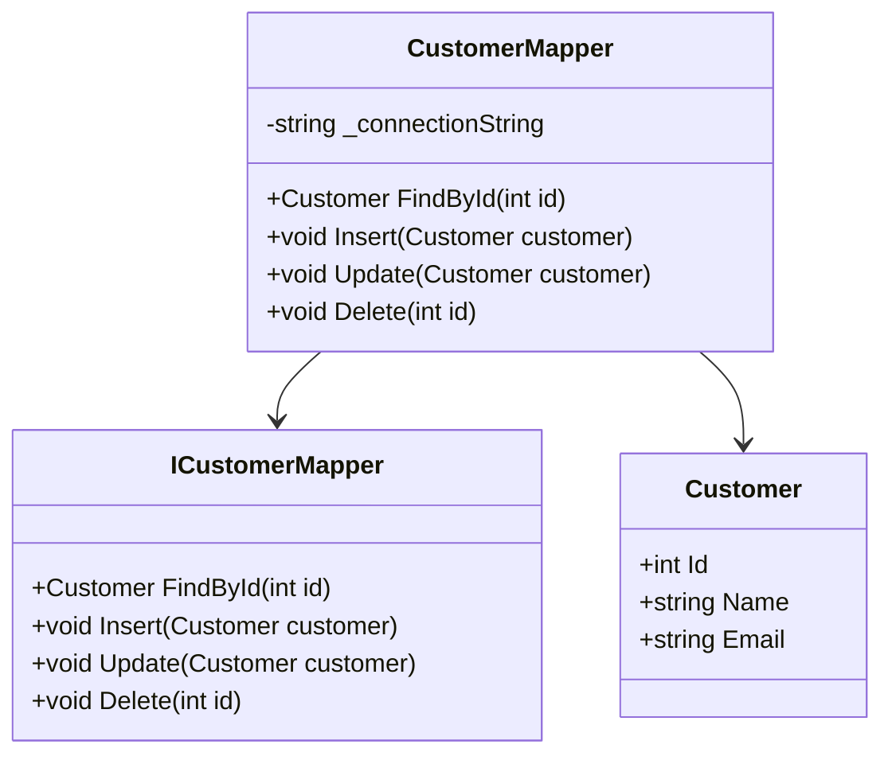

## 5.8.5 Data Mapper Pattern

The Data Mapper Pattern is a structural design pattern that plays a crucial role in decoupling the in-memory objects of an application from the database. This pattern is particularly useful in scenarios where you need to maintain a clean separation between the business logic and the data access logic, allowing for more maintainable and scalable applications.

### Intent

The primary intent of the Data Mapper Pattern is to transfer data between objects and a database while keeping them independent of each other. This separation allows developers to change the database schema or the object model without affecting the other, providing flexibility and reducing the risk of introducing bugs.

### Key Participants

1. **Domain Objects**: These are the objects that represent the data and business logic in your application.
2. **Data Mapper**: This component is responsible for transferring data between the domain objects and the database. It encapsulates the logic for converting between the two representations.
3. **Database**: The persistent storage where the data is stored and retrieved.

### Applicability

- Use the Data Mapper Pattern when you need to decouple your domain logic from the data access logic.
- It is particularly useful in complex applications where the domain model and the database schema are likely to change independently.
- Ideal for applications that require support for multiple data sources or databases.

### Implementing Data Mapper in C#

Implementing the Data Mapper Pattern in C# involves creating mapper classes that handle the conversion between domain objects and database records. Let's walk through the steps to implement this pattern.

#### Step 1: Define Domain Objects

Domain objects are the core of your application logic. They represent the entities in your system. For example, consider a simple `Customer` class:

```csharp
public class Customer
{
    public int Id { get; set; }
    public string Name { get; set; }
    public string Email { get; set; }
}
```

#### Step 2: Create a Data Mapper Interface

Define an interface that outlines the operations for transferring data between the domain objects and the database:

```csharp
public interface ICustomerMapper
{
    Customer FindById(int id);
    void Insert(Customer customer);
    void Update(Customer customer);
    void Delete(int id);
}
```

#### Step 3: Implement the Data Mapper

Implement the interface to handle the actual data transfer logic. This implementation will interact with the database:

```csharp
public class CustomerMapper : ICustomerMapper
{
    private readonly string _connectionString;

    public CustomerMapper(string connectionString)
    {
        _connectionString = connectionString;
    }

    public Customer FindById(int id)
    {
        // Database access logic to find a customer by ID
        // For demonstration, let's assume we're using ADO.NET
        using (var connection = new SqlConnection(_connectionString))
        {
            connection.Open();
            var command = new SqlCommand("SELECT * FROM Customers WHERE Id = @Id", connection);
            command.Parameters.AddWithValue("@Id", id);

            using (var reader = command.ExecuteReader())
            {
                if (reader.Read())
                {
                    return new Customer
                    {
                        Id = (int)reader["Id"],
                        Name = (string)reader["Name"],
                        Email = (string)reader["Email"]
                    };
                }
            }
        }
        return null;
    }

    public void Insert(Customer customer)
    {
        // Database access logic to insert a new customer
        using (var connection = new SqlConnection(_connectionString))
        {
            connection.Open();
            var command = new SqlCommand("INSERT INTO Customers (Name, Email) VALUES (@Name, @Email)", connection);
            command.Parameters.AddWithValue("@Name", customer.Name);
            command.Parameters.AddWithValue("@Email", customer.Email);
            command.ExecuteNonQuery();
        }
    }

    public void Update(Customer customer)
    {
        // Database access logic to update an existing customer
        using (var connection = new SqlConnection(_connectionString))
        {
            connection.Open();
            var command = new SqlCommand("UPDATE Customers SET Name = @Name, Email = @Email WHERE Id = @Id", connection);
            command.Parameters.AddWithValue("@Name", customer.Name);
            command.Parameters.AddWithValue("@Email", customer.Email);
            command.Parameters.AddWithValue("@Id", customer.Id);
            command.ExecuteNonQuery();
        }
    }

    public void Delete(int id)
    {
        // Database access logic to delete a customer
        using (var connection = new SqlConnection(_connectionString))
        {
            connection.Open();
            var command = new SqlCommand("DELETE FROM Customers WHERE Id = @Id", connection);
            command.Parameters.AddWithValue("@Id", id);
            command.ExecuteNonQuery();
        }
    }
}
```

### Visualizing the Data Mapper Pattern

To better understand the Data Mapper Pattern, let's visualize the interaction between the components using a class diagram.



**Diagram Description**: This class diagram illustrates the relationship between the `Customer`, `ICustomerMapper`, and `CustomerMapper` classes. The `CustomerMapper` class implements the `ICustomerMapper` interface and interacts with the `Customer` class to perform data operations.

### Use Cases and Examples

The Data Mapper Pattern is particularly useful in scenarios where you need to maintain a clean separation between the business logic and the data access logic. Let's explore some common use cases and examples.

#### Use Case 1: Decoupled Persistence Layers

In large-scale applications, it's common to have a separate persistence layer that handles all database interactions. The Data Mapper Pattern allows you to decouple this layer from the rest of your application, making it easier to manage and maintain.

#### Use Case 2: Handling Multiple Data Sources

When your application needs to interact with multiple data sources, such as different databases or external APIs, the Data Mapper Pattern can help manage these interactions by providing a consistent interface for data access.

#### Example: Implementing a Product Data Mapper

Let's consider an example where we implement a data mapper for a `Product` entity:

```csharp
public class Product
{
    public int Id { get; set; }
    public string Name { get; set; }
    public decimal Price { get; set; }
}

public interface IProductMapper
{
    Product FindById(int id);
    void Insert(Product product);
    void Update(Product product);
    void Delete(int id);
}

public class ProductMapper : IProductMapper
{
    private readonly string _connectionString;

    public ProductMapper(string connectionString)
    {
        _connectionString = connectionString;
    }

    public Product FindById(int id)
    {
        using (var connection = new SqlConnection(_connectionString))
        {
            connection.Open();
            var command = new SqlCommand("SELECT * FROM Products WHERE Id = @Id", connection);
            command.Parameters.AddWithValue("@Id", id);

            using (var reader = command.ExecuteReader())
            {
                if (reader.Read())
                {
                    return new Product
                    {
                        Id = (int)reader["Id"],
                        Name = (string)reader["Name"],
                        Price = (decimal)reader["Price"]
                    };
                }
            }
        }
        return null;
    }

    public void Insert(Product product)
    {
        using (var connection = new SqlConnection(_connectionString))
        {
            connection.Open();
            var command = new SqlCommand("INSERT INTO Products (Name, Price) VALUES (@Name, @Price)", connection);
            command.Parameters.AddWithValue("@Name", product.Name);
            command.Parameters.AddWithValue("@Price", product.Price);
            command.ExecuteNonQuery();
        }
    }

    public void Update(Product product)
    {
        using (var connection = new SqlConnection(_connectionString))
        {
            connection.Open();
            var command = new SqlCommand("UPDATE Products SET Name = @Name, Price = @Price WHERE Id = @Id", connection);
            command.Parameters.AddWithValue("@Name", product.Name);
            command.Parameters.AddWithValue("@Price", product.Price);
            command.Parameters.AddWithValue("@Id", product.Id);
            command.ExecuteNonQuery();
        }
    }

    public void Delete(int id)
    {
        using (var connection = new SqlConnection(_connectionString))
        {
            connection.Open();
            var command = new SqlCommand("DELETE FROM Products WHERE Id = @Id", connection);
            command.Parameters.AddWithValue("@Id", id);
            command.ExecuteNonQuery();
        }
    }
}
```

### Design Considerations

When implementing the Data Mapper Pattern, consider the following:

- **Performance**: The pattern can introduce additional overhead due to the abstraction layer. Ensure that the data access logic is optimized for performance.
- **Complexity**: While the pattern provides flexibility, it can also increase the complexity of your codebase. Use it judiciously in scenarios where the benefits outweigh the complexity.
- **Testing**: The separation of concerns makes it easier to test the domain logic independently of the data access logic.

### Differences and Similarities

The Data Mapper Pattern is often compared to the Active Record Pattern. While both patterns are used for data access, they have key differences:

- **Data Mapper**: Separates the domain logic from the data access logic, providing more flexibility and decoupling.
- **Active Record**: Combines the domain logic and data access logic within the same class, making it simpler but less flexible.

### Try It Yourself

To get hands-on experience with the Data Mapper Pattern, try modifying the code examples provided. For instance, you can:

- Add new fields to the `Customer` or `Product` classes and update the mapper logic accordingly.
- Implement a new data mapper for a different entity, such as `Order` or `Supplier`.
- Experiment with different database technologies, such as using Entity Framework instead of ADO.NET.

### Knowledge Check

Before we wrap up, let's reinforce what we've learned with a few questions:

1. What is the primary intent of the Data Mapper Pattern?
2. How does the Data Mapper Pattern differ from the Active Record Pattern?
3. What are some common use cases for the Data Mapper Pattern?

### Embrace the Journey

Remember, mastering design patterns is a journey. As you continue to explore and experiment with the Data Mapper Pattern, you'll gain a deeper understanding of how to build scalable and maintainable applications. Keep experimenting, stay curious, and enjoy the journey!

## Quiz Time!



### What is the primary intent of the Data Mapper Pattern?

- [x] To transfer data between objects and a database while keeping them independent
- [ ] To combine domain logic and data access logic within the same class
- [ ] To provide a user interface for database operations
- [ ] To optimize database queries for performance

> **Explanation:** The primary intent of the Data Mapper Pattern is to transfer data between objects and a database while keeping them independent of each other.

### Which component is responsible for transferring data between domain objects and the database in the Data Mapper Pattern?

- [ ] Domain Objects
- [x] Data Mapper
- [ ] Database
- [ ] User Interface

> **Explanation:** The Data Mapper is responsible for transferring data between domain objects and the database.

### What is a key difference between the Data Mapper Pattern and the Active Record Pattern?

- [x] Data Mapper separates domain logic from data access logic, while Active Record combines them
- [ ] Data Mapper is only used for read operations, while Active Record is used for write operations
- [ ] Data Mapper is faster than Active Record
- [ ] Data Mapper is only applicable to relational databases

> **Explanation:** The Data Mapper Pattern separates domain logic from data access logic, providing more flexibility, while the Active Record Pattern combines them within the same class.

### In which scenario is the Data Mapper Pattern particularly useful?

- [ ] When you need to combine domain logic and data access logic
- [x] When you need to decouple your domain logic from the data access logic
- [ ] When you need to optimize database queries
- [ ] When you need to provide a user interface for database operations

> **Explanation:** The Data Mapper Pattern is particularly useful when you need to decouple your domain logic from the data access logic.

### What is a potential drawback of using the Data Mapper Pattern?

- [x] It can introduce additional overhead due to the abstraction layer
- [ ] It combines domain logic and data access logic
- [ ] It is only applicable to relational databases
- [ ] It cannot handle multiple data sources

> **Explanation:** The Data Mapper Pattern can introduce additional overhead due to the abstraction layer, which can impact performance.

### Which of the following is a key participant in the Data Mapper Pattern?

- [x] Domain Objects
- [ ] User Interface
- [ ] Network Layer
- [ ] Logging System

> **Explanation:** Domain Objects are a key participant in the Data Mapper Pattern, representing the data and business logic in the application.

### How does the Data Mapper Pattern enhance testability?

- [x] By separating concerns, allowing domain logic to be tested independently of data access logic
- [ ] By combining domain logic and data access logic in the same class
- [ ] By providing a user interface for testing
- [ ] By optimizing database queries for performance

> **Explanation:** The separation of concerns in the Data Mapper Pattern allows domain logic to be tested independently of data access logic, enhancing testability.

### What is a common use case for the Data Mapper Pattern?

- [x] Decoupled persistence layers
- [ ] Combining domain logic and data access logic
- [ ] Optimizing database queries
- [ ] Providing a user interface for database operations

> **Explanation:** A common use case for the Data Mapper Pattern is decoupled persistence layers, where the data access logic is separated from the domain logic.

### True or False: The Data Mapper Pattern is only applicable to relational databases.

- [ ] True
- [x] False

> **Explanation:** False. The Data Mapper Pattern can be used with various types of databases and data sources, not just relational databases.

### What is a benefit of using the Data Mapper Pattern?

- [x] Flexibility in changing the database schema or object model independently
- [ ] Combining domain logic and data access logic
- [ ] Providing a user interface for database operations
- [ ] Optimizing database queries for performance

> **Explanation:** A benefit of using the Data Mapper Pattern is the flexibility it provides in changing the database schema or object model independently.


