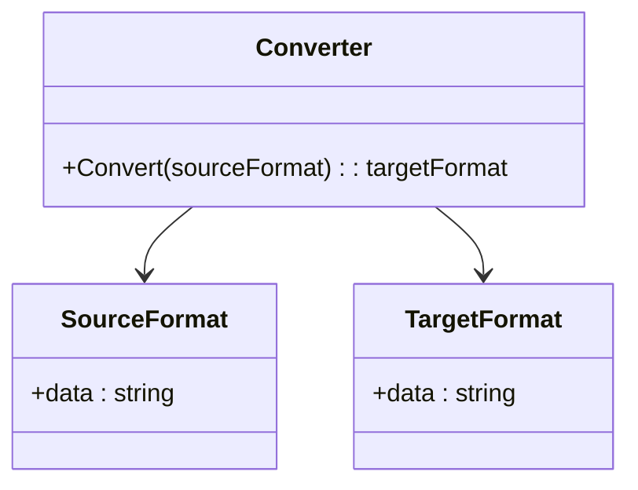

## 5.9 Converter Pattern

In the realm of software engineering, data often needs to be transformed from one format to another to ensure compatibility, usability, and efficiency. The Converter Pattern is a structural design pattern that provides a solution for transforming data between different formats. This pattern is particularly useful in scenarios where data needs to be imported, exported, or converted between various systems or components. In this section, we will delve into the Converter Pattern, its implementation in C#, and explore practical use cases and examples.

### Intent

The primary intent of the Converter Pattern is to provide a mechanism for converting data from one format to another. This pattern abstracts the conversion logic, allowing for a clean separation of concerns and promoting reusability and maintainability. By encapsulating the conversion logic within a dedicated converter class or method, developers can easily adapt to changes in data formats without affecting the rest of the application.

### Key Participants

- **Source Format**: The original data format that needs to be converted.
- **Target Format**: The desired data format after conversion.
- **Converter**: The component responsible for transforming data from the source format to the target format.

### Applicability

The Converter Pattern is applicable in scenarios where:

- Data needs to be transformed between different formats, such as XML to JSON, CSV to Excel, or proprietary formats to standard formats.
- Applications require data import/export functionality, where data from external sources needs to be converted to a format compatible with the application.
- Systems need to integrate with third-party services or APIs that use different data formats.

### Implementing Converter in C#

Implementing the Converter Pattern in C# involves creating a converter class or method that encapsulates the conversion logic. This can be achieved using transformation methods and utilities provided by the .NET framework or third-party libraries. Let's explore a step-by-step approach to implementing a converter in C#.

#### Step 1: Define the Source and Target Formats

Before implementing the converter, it's essential to define the source and target formats. This involves understanding the structure and representation of the data in both formats. For example, if we are converting data from XML to JSON, we need to understand the XML schema and the corresponding JSON structure.

#### Step 2: Create the Converter Class

The converter class is responsible for encapsulating the conversion logic. It should provide methods for converting data from the source format to the target format. Here's an example of a simple converter class in C#:

```csharp
using System;
using System.Xml;
using Newtonsoft.Json;

public class XmlToJsonConverter
{
    // Method to convert XML to JSON
    public string ConvertXmlToJson(string xmlData)
    {
        // Load the XML data into an XmlDocument
        XmlDocument xmlDoc = new XmlDocument();
        xmlDoc.LoadXml(xmlData);

        // Convert the XmlDocument to JSON using Newtonsoft.Json
        string jsonData = JsonConvert.SerializeXmlNode(xmlDoc);

        return jsonData;
    }
}
```

In this example, the `XmlToJsonConverter` class provides a method `ConvertXmlToJson` that takes XML data as input and returns the corresponding JSON data. The conversion is performed using the `XmlDocument` class from the .NET framework and the `JsonConvert` class from the Newtonsoft.Json library.

#### Step 3: Utilize Transformation Utilities

C# and the .NET framework offer various utilities and libraries for data transformation. For XML to JSON conversion, we used the `XmlDocument` class and the Newtonsoft.Json library. Similarly, other utilities can be used for different types of conversions, such as:

- **CSV to Excel**: Use libraries like `CsvHelper` for parsing CSV data and `EPPlus` for generating Excel files.
- **Proprietary Formats**: Implement custom parsing and serialization logic for proprietary data formats.

#### Step 4: Handle Edge Cases and Errors

When implementing a converter, it's crucial to handle edge cases and errors gracefully. This includes validating input data, handling malformed data, and providing meaningful error messages. Here's an example of error handling in the `XmlToJsonConverter` class:

```csharp
public string ConvertXmlToJson(string xmlData)
{
    try
    {
        XmlDocument xmlDoc = new XmlDocument();
        xmlDoc.LoadXml(xmlData);
        string jsonData = JsonConvert.SerializeXmlNode(xmlDoc);
        return jsonData;
    }
    catch (XmlException ex)
    {
        Console.WriteLine("Error parsing XML: " + ex.Message);
        return null;
    }
    catch (Exception ex)
    {
        Console.WriteLine("Unexpected error: " + ex.Message);
        return null;
    }
}
```

In this example, we use try-catch blocks to handle `XmlException` and general exceptions, providing error messages to the user.

### Use Cases and Examples

The Converter Pattern is widely used in various applications and systems. Let's explore some practical use cases and examples.

#### Use Case 1: Data Import/Export

In many applications, data import/export functionality is essential for integrating with external systems or providing data to users in different formats. The Converter Pattern can be used to implement this functionality efficiently.

**Example: Importing CSV Data into a Database**

Suppose we have a CSV file containing user data that needs to be imported into a database. We can use the Converter Pattern to transform the CSV data into a format compatible with the database.

```csharp
using System;
using System.Collections.Generic;
using System.IO;
using CsvHelper;
using CsvHelper.Configuration;

public class CsvToDatabaseConverter
{
    // Method to convert CSV data to a list of User objects
    public List<User> ConvertCsvToUsers(string csvFilePath)
    {
        using (var reader = new StreamReader(csvFilePath))
        using (var csv = new CsvReader(reader, new CsvConfiguration(System.Globalization.CultureInfo.InvariantCulture)))
        {
            var users = new List<User>();
            csv.Read();
            csv.ReadHeader();
            while (csv.Read())
            {
                var user = new User
                {
                    Id = csv.GetField<int>("Id"),
                    Name = csv.GetField<string>("Name"),
                    Email = csv.GetField<string>("Email")
                };
                users.Add(user);
            }
            return users;
        }
    }
}

public class User
{
    public int Id { get; set; }
    public string Name { get; set; }
    public string Email { get; set; }
}
```

In this example, the `CsvToDatabaseConverter` class provides a method `ConvertCsvToUsers` that reads a CSV file and converts it into a list of `User` objects. The `CsvHelper` library is used for parsing the CSV data.

#### Use Case 2: Format Conversions in Applications

Applications often need to convert data between different formats for processing, storage, or presentation. The Converter Pattern provides a structured approach to implement these conversions.

**Example: Converting Image Formats**

Suppose we have an application that processes images and needs to convert them between different formats, such as JPEG to PNG. We can use the Converter Pattern to implement this functionality.

```csharp
using System;
using System.Drawing;
using System.Drawing.Imaging;

public class ImageFormatConverter
{
    // Method to convert an image from one format to another
    public void ConvertImageFormat(string inputFilePath, string outputFilePath, ImageFormat format)
    {
        using (Image image = Image.FromFile(inputFilePath))
        {
            image.Save(outputFilePath, format);
        }
    }
}
```

In this example, the `ImageFormatConverter` class provides a method `ConvertImageFormat` that takes an input image file, converts it to the specified format, and saves it to the output file. The `System.Drawing` namespace is used for image processing.

### Design Considerations

When implementing the Converter Pattern, consider the following design considerations:

- **Performance**: Ensure that the conversion process is efficient, especially for large datasets or complex formats. Optimize the conversion logic and use efficient libraries and algorithms.
- **Scalability**: Design the converter to handle varying data sizes and formats. Consider using parallel processing or asynchronous operations for large-scale conversions.
- **Extensibility**: Design the converter to be easily extensible for new formats or conversion logic. Use interfaces or abstract classes to define a common contract for converters.
- **Error Handling**: Implement robust error handling to manage invalid data, conversion failures, and unexpected errors. Provide meaningful error messages and logging for troubleshooting.

### Differences and Similarities

The Converter Pattern is often compared to other design patterns, such as the Adapter Pattern and the Decorator Pattern. While these patterns share some similarities, they serve different purposes:

- **Converter vs. Adapter**: The Adapter Pattern is used to make an interface compatible with another interface, often involving structural changes. The Converter Pattern focuses on transforming data formats without altering the underlying structure.
- **Converter vs. Decorator**: The Decorator Pattern adds additional behavior to an object dynamically, while the Converter Pattern transforms data formats. Decorators are used for enhancing functionality, whereas converters are used for data transformation.

### Visualizing the Converter Pattern

To better understand the Converter Pattern, let's visualize the process of converting data from one format to another using a class diagram.



In this diagram, the `Converter` class is responsible for converting data from the `SourceFormat` to the `TargetFormat`. The `Convert` method encapsulates the conversion logic.

### Try It Yourself

To gain hands-on experience with the Converter Pattern, try modifying the code examples provided. Here are some suggestions:

- Extend the `XmlToJsonConverter` class to support additional XML features, such as attributes and namespaces.
- Implement a converter for a different data format, such as JSON to CSV or XML to YAML.
- Experiment with different image formats in the `ImageFormatConverter` class, such as BMP or GIF.

### Knowledge Check

To reinforce your understanding of the Converter Pattern, consider the following questions:

- What is the primary intent of the Converter Pattern?
- How does the Converter Pattern differ from the Adapter Pattern?
- What are some common use cases for the Converter Pattern?
- How can you handle errors and edge cases in a converter implementation?
- What are some design considerations when implementing the Converter Pattern?

### Embrace the Journey

Remember, mastering design patterns is a journey. The Converter Pattern is just one of many patterns that can enhance your software design skills. As you continue to explore and experiment with different patterns, you'll gain a deeper understanding of how to build scalable and maintainable applications. Keep experimenting, stay curious, and enjoy the journey!

## Quiz Time!



### What is the primary intent of the Converter Pattern?

- [x] To transform data from one format to another
- [ ] To adapt an interface to another interface
- [ ] To add additional behavior to an object
- [ ] To encapsulate a request as an object

> **Explanation:** The Converter Pattern is designed to transform data from one format to another, ensuring compatibility and usability.

### How does the Converter Pattern differ from the Adapter Pattern?

- [x] Converter focuses on data transformation, Adapter focuses on interface compatibility
- [ ] Converter adds behavior, Adapter transforms data
- [ ] Converter is for structural changes, Adapter is for data changes
- [ ] Converter and Adapter are the same

> **Explanation:** The Converter Pattern focuses on transforming data formats, while the Adapter Pattern focuses on making interfaces compatible.

### Which library is used in the example to convert XML to JSON?

- [x] Newtonsoft.Json
- [ ] System.Text.Json
- [ ] CsvHelper
- [ ] EPPlus

> **Explanation:** The example uses the Newtonsoft.Json library to convert XML data to JSON format.

### What is a common use case for the Converter Pattern?

- [x] Data import/export
- [ ] Adding behavior to objects
- [ ] Making interfaces compatible
- [ ] Encapsulating requests

> **Explanation:** The Converter Pattern is commonly used for data import/export, where data needs to be transformed between different formats.

### What should be considered when implementing a converter?

- [x] Performance, scalability, extensibility, error handling
- [ ] Only performance
- [ ] Only scalability
- [ ] Only error handling

> **Explanation:** When implementing a converter, it's important to consider performance, scalability, extensibility, and error handling.

### What is the role of the Converter class in the pattern?

- [x] To encapsulate the conversion logic
- [ ] To adapt interfaces
- [ ] To add behavior to objects
- [ ] To encapsulate requests

> **Explanation:** The Converter class encapsulates the conversion logic, transforming data from the source format to the target format.

### Which method is used to handle errors in the XmlToJsonConverter example?

- [x] Try-catch blocks
- [ ] If-else statements
- [ ] Switch-case statements
- [ ] Loops

> **Explanation:** Try-catch blocks are used to handle errors and exceptions in the XmlToJsonConverter example.

### What is the purpose of the Convert method in the Converter class?

- [x] To perform the data transformation
- [ ] To add behavior to objects
- [ ] To adapt interfaces
- [ ] To encapsulate requests

> **Explanation:** The Convert method performs the data transformation, converting data from the source format to the target format.

### Which namespace is used for image processing in the ImageFormatConverter example?

- [x] System.Drawing
- [ ] System.Text.Json
- [ ] System.Xml
- [ ] System.IO

> **Explanation:** The System.Drawing namespace is used for image processing in the ImageFormatConverter example.

### True or False: The Converter Pattern is used to add additional behavior to an object.

- [ ] True
- [x] False

> **Explanation:** False. The Converter Pattern is used to transform data formats, not to add additional behavior to an object.


