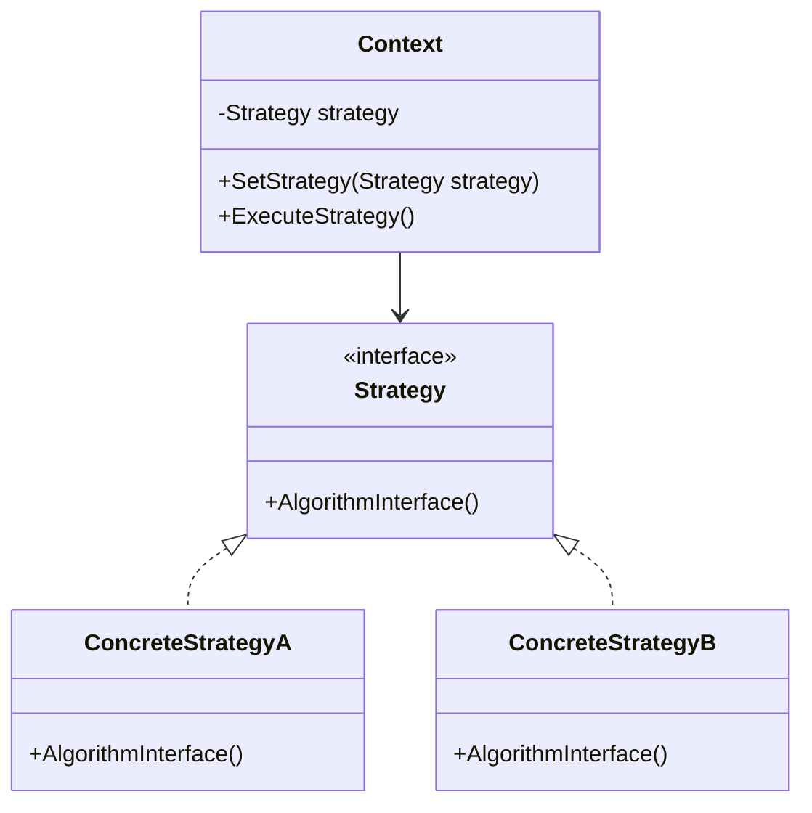

## 6.1 Strategy Design Pattern

The Strategy Design Pattern is a behavioral design pattern that defines a family of algorithms, encapsulates each one, and makes them interchangeable. This pattern allows the algorithm to vary independently from clients that use it. In this section, we will delve into the intricacies of the Strategy Pattern, its implementation in C#, and its practical applications.

### Strategy Pattern Description

The Strategy Pattern is about defining a set of behaviors and making them selectable at runtime. This pattern is particularly useful when you have multiple algorithms for a specific task and want to switch between them dynamically. It promotes the Open/Closed Principle, one of the SOLID principles, by allowing new strategies to be added without modifying existing code.

#### Key Concepts

- **Encapsulation of Algorithms**: Each algorithm is encapsulated in its own class, implementing a common interface.
- **Interchangeability**: Algorithms can be swapped in and out without affecting the client code.
- **Runtime Flexibility**: The pattern allows for the selection of algorithms at runtime, providing flexibility and adaptability.

### Implementing Strategy in C#

To implement the Strategy Pattern in C#, we typically use interfaces and classes to define and encapsulate strategies. Let's explore this with a practical example.

#### Step-by-Step Implementation

1. **Define the Strategy Interface**: Create an interface that declares the method(s) that all concrete strategies must implement.

```csharp
public interface ISortingStrategy
{
    void Sort(List<int> list);
}
```

2. **Implement Concrete Strategies**: Create classes that implement the strategy interface, each providing a different algorithm.

```csharp
public class BubbleSortStrategy : ISortingStrategy
{
    public void Sort(List<int> list)
    {
        // Implementation of Bubble Sort
        for (int i = 0; i < list.Count - 1; i++)
        {
            for (int j = 0; j < list.Count - i - 1; j++)
            {
                if (list[j] > list[j + 1])
                {
                    // Swap
                    int temp = list[j];
                    list[j] = list[j + 1];
                    list[j + 1] = temp;
                }
            }
        }
    }
}

public class QuickSortStrategy : ISortingStrategy
{
    public void Sort(List<int> list)
    {
        // Implementation of Quick Sort
        QuickSort(list, 0, list.Count - 1);
    }

    private void QuickSort(List<int> list, int low, int high)
    {
        if (low < high)
        {
            int pi = Partition(list, low, high);
            QuickSort(list, low, pi - 1);
            QuickSort(list, pi + 1, high);
        }
    }

    private int Partition(List<int> list, int low, int high)
    {
        int pivot = list[high];
        int i = (low - 1);
        for (int j = low; j < high; j++)
        {
            if (list[j] < pivot)
            {
                i++;
                int temp = list[i];
                list[i] = list[j];
                list[j] = temp;
            }
        }
        int temp1 = list[i + 1];
        list[i + 1] = list[high];
        list[high] = temp1;
        return i + 1;
    }
}
```

3. **Create the Context Class**: This class maintains a reference to a strategy object and delegates the algorithm execution to the strategy object.

```csharp
public class SortContext
{
    private ISortingStrategy _sortingStrategy;

    public SortContext(ISortingStrategy sortingStrategy)
    {
        _sortingStrategy = sortingStrategy;
    }

    public void SetStrategy(ISortingStrategy sortingStrategy)
    {
        _sortingStrategy = sortingStrategy;
    }

    public void SortList(List<int> list)
    {
        _sortingStrategy.Sort(list);
    }
}
```

4. **Client Code**: Use the context class to execute the desired strategy.

```csharp
class Program
{
    static void Main(string[] args)
    {
        List<int> numbers = new List<int> { 5, 3, 8, 6, 2 };

        SortContext context = new SortContext(new BubbleSortStrategy());
        context.SortList(numbers);
        Console.WriteLine("Bubble Sorted: " + string.Join(", ", numbers));

        context.SetStrategy(new QuickSortStrategy());
        context.SortList(numbers);
        Console.WriteLine("Quick Sorted: " + string.Join(", ", numbers));
    }
}
```

### Replacing Conditional Logic

One of the significant advantages of the Strategy Pattern is its ability to replace complex conditional logic. Instead of using multiple `if-else` or `switch` statements to select an algorithm, you can encapsulate each algorithm in a strategy class and select the appropriate strategy at runtime.

#### Example: Payment Processing

Consider a payment processing system that supports multiple payment methods. Instead of using conditional statements to handle each payment method, you can use the Strategy Pattern to encapsulate each payment method.

```csharp
public interface IPaymentStrategy
{
    void Pay(decimal amount);
}

public class CreditCardPayment : IPaymentStrategy
{
    public void Pay(decimal amount)
    {
        Console.WriteLine($"Paid {amount} using Credit Card.");
    }
}

public class PayPalPayment : IPaymentStrategy
{
    public void Pay(decimal amount)
    {
        Console.WriteLine($"Paid {amount} using PayPal.");
    }
}

public class PaymentContext
{
    private IPaymentStrategy _paymentStrategy;

    public PaymentContext(IPaymentStrategy paymentStrategy)
    {
        _paymentStrategy = paymentStrategy;
    }

    public void SetStrategy(IPaymentStrategy paymentStrategy)
    {
        _paymentStrategy = paymentStrategy;
    }

    public void ProcessPayment(decimal amount)
    {
        _paymentStrategy.Pay(amount);
    }
}
```

### Function Composition Pattern

The Strategy Pattern can be combined with the Function Composition Pattern to create more complex behaviors by composing simple strategies. This approach allows for greater flexibility and reusability of code.

#### Example: Composing Strategies

Suppose we have a set of strategies for processing text, such as converting to uppercase, trimming whitespace, and replacing certain characters. We can compose these strategies to create a complex text processing pipeline.

```csharp
public interface ITextProcessingStrategy
{
    string Process(string input);
}

public class UpperCaseStrategy : ITextProcessingStrategy
{
    public string Process(string input)
    {
        return input.ToUpper();
    }
}

public class TrimStrategy : ITextProcessingStrategy
{
    public string Process(string input)
    {
        return input.Trim();
    }
}

public class ReplaceStrategy : ITextProcessingStrategy
{
    private readonly string _oldValue;
    private readonly string _newValue;

    public ReplaceStrategy(string oldValue, string newValue)
    {
        _oldValue = oldValue;
        _newValue = newValue;
    }

    public string Process(string input)
    {
        return input.Replace(_oldValue, _newValue);
    }
}

public class TextProcessor
{
    private readonly List<ITextProcessingStrategy> _strategies = new List<ITextProcessingStrategy>();

    public void AddStrategy(ITextProcessingStrategy strategy)
    {
        _strategies.Add(strategy);
    }

    public string Execute(string input)
    {
        foreach (var strategy in _strategies)
        {
            input = strategy.Process(input);
        }
        return input;
    }
}
```

### Use Cases and Examples

The Strategy Pattern is widely used in various domains. Here are some common use cases:

- **Sorting Algorithms**: As demonstrated earlier, different sorting algorithms can be encapsulated as strategies.
- **Payment Processing**: Different payment methods can be implemented as strategies.
- **Compression Algorithms**: Different compression techniques can be encapsulated as strategies.
- **File Parsing**: Different file formats can be parsed using different strategies.

#### Example: Sorting Algorithms

Let's revisit the sorting algorithms example and see how we can extend it with additional strategies.

```csharp
public class MergeSortStrategy : ISortingStrategy
{
    public void Sort(List<int> list)
    {
        // Implementation of Merge Sort
        MergeSort(list, 0, list.Count - 1);
    }

    private void MergeSort(List<int> list, int left, int right)
    {
        if (left < right)
        {
            int middle = (left + right) / 2;
            MergeSort(list, left, middle);
            MergeSort(list, middle + 1, right);
            Merge(list, left, middle, right);
        }
    }

    private void Merge(List<int> list, int left, int middle, int right)
    {
        int n1 = middle - left + 1;
        int n2 = right - middle;

        int[] L = new int[n1];
        int[] R = new int[n2];

        for (int i = 0; i < n1; i++)
            L[i] = list[left + i];
        for (int j = 0; j < n2; j++)
            R[j] = list[middle + 1 + j];

        int iIndex = 0, jIndex = 0;
        int k = left;
        while (iIndex < n1 && jIndex < n2)
        {
            if (L[iIndex] <= R[jIndex])
            {
                list[k] = L[iIndex];
                iIndex++;
            }
            else
            {
                list[k] = R[jIndex];
                jIndex++;
            }
            k++;
        }

        while (iIndex < n1)
        {
            list[k] = L[iIndex];
            iIndex++;
            k++;
        }

        while (jIndex < n2)
        {
            list[k] = R[jIndex];
            jIndex++;
            k++;
        }
    }
}
```

### Design Considerations

When implementing the Strategy Pattern, consider the following:

- **Interface Design**: Ensure that the strategy interface is well-defined and encompasses all necessary methods.
- **Strategy Selection**: Determine how strategies will be selected at runtime. This could be based on user input, configuration settings, or other criteria.
- **Performance**: Be mindful of the performance implications of switching strategies, especially in performance-critical applications.
- **Extensibility**: Design the system to easily accommodate new strategies without modifying existing code.

### Differences and Similarities

The Strategy Pattern is often compared to other patterns, such as the State Pattern and the Command Pattern. Here are some key differences and similarities:

- **State Pattern**: While the Strategy Pattern focuses on interchangeable algorithms, the State Pattern is concerned with changing behavior based on an object's state.
- **Command Pattern**: The Command Pattern encapsulates a request as an object, allowing for parameterization and queuing of requests. The Strategy Pattern, on the other hand, encapsulates algorithms.

### Visualizing the Strategy Pattern

To better understand the Strategy Pattern, let's visualize it using a class diagram.



**Diagram Description**: The diagram illustrates the relationship between the `Context`, `Strategy`, and `ConcreteStrategy` classes. The `Context` class maintains a reference to a `Strategy` object and delegates the algorithm execution to the `Strategy` object. The `ConcreteStrategy` classes implement the `Strategy` interface, providing specific algorithm implementations.

### Try It Yourself

To deepen your understanding of the Strategy Pattern, try modifying the code examples provided:

- **Add a New Sorting Strategy**: Implement a new sorting algorithm, such as Heap Sort, and integrate it into the existing system.
- **Experiment with Payment Strategies**: Add additional payment methods, such as Bitcoin or Apple Pay, and test the system's flexibility.
- **Compose Text Processing Strategies**: Create a text processing pipeline that combines multiple strategies to achieve complex transformations.

### Knowledge Check

Before we conclude, let's summarize the key takeaways:

- The Strategy Pattern defines a family of algorithms, encapsulates each one, and makes them interchangeable.
- It promotes flexibility and adaptability by allowing algorithms to be selected at runtime.
- The pattern is implemented using interfaces and classes to define and encapsulate strategies.
- It is widely used in various domains, including sorting algorithms, payment processing, and file parsing.

Remember, mastering design patterns is a journey. As you continue to explore and experiment with the Strategy Pattern, you'll gain a deeper understanding of its power and versatility. Keep experimenting, stay curious, and enjoy the journey!

## Quiz Time!



### What is the primary purpose of the Strategy Design Pattern?

- [x] To define a family of algorithms, encapsulate each one, and make them interchangeable.
- [ ] To manage object creation and lifecycle.
- [ ] To provide a way to access the elements of an aggregate object sequentially.
- [ ] To ensure a class has only one instance.

> **Explanation:** The Strategy Pattern is designed to define a family of algorithms, encapsulate each one, and make them interchangeable, allowing the algorithm to vary independently from clients that use it.

### Which of the following is a key benefit of using the Strategy Pattern?

- [x] It allows algorithms to be selected at runtime.
- [ ] It ensures a class has only one instance.
- [ ] It provides a way to access the elements of an aggregate object sequentially.
- [ ] It manages object creation and lifecycle.

> **Explanation:** The Strategy Pattern allows for the selection of algorithms at runtime, providing flexibility and adaptability.

### In the Strategy Pattern, what role does the Context class play?

- [x] It maintains a reference to a strategy object and delegates the algorithm execution to the strategy object.
- [ ] It defines the interface for the algorithms.
- [ ] It implements the specific algorithm.
- [ ] It provides a way to access the elements of an aggregate object sequentially.

> **Explanation:** The Context class maintains a reference to a strategy object and delegates the algorithm execution to the strategy object.

### How does the Strategy Pattern promote the Open/Closed Principle?

- [x] By allowing new strategies to be added without modifying existing code.
- [ ] By ensuring a class has only one instance.
- [ ] By providing a way to access the elements of an aggregate object sequentially.
- [ ] By managing object creation and lifecycle.

> **Explanation:** The Strategy Pattern promotes the Open/Closed Principle by allowing new strategies to be added without modifying existing code.

### Which of the following is a common use case for the Strategy Pattern?

- [x] Sorting algorithms
- [ ] Singleton instance management
- [ ] Object creation and lifecycle management
- [ ] Sequential access to elements of an aggregate object

> **Explanation:** Sorting algorithms are a common use case for the Strategy Pattern, as different sorting strategies can be encapsulated and selected at runtime.

### What is a key difference between the Strategy Pattern and the State Pattern?

- [x] The Strategy Pattern focuses on interchangeable algorithms, while the State Pattern is concerned with changing behavior based on an object's state.
- [ ] The Strategy Pattern manages object creation and lifecycle, while the State Pattern ensures a class has only one instance.
- [ ] The Strategy Pattern provides a way to access the elements of an aggregate object sequentially, while the State Pattern defines a family of algorithms.
- [ ] The Strategy Pattern ensures a class has only one instance, while the State Pattern manages object creation and lifecycle.

> **Explanation:** The Strategy Pattern focuses on interchangeable algorithms, while the State Pattern is concerned with changing behavior based on an object's state.

### How can the Strategy Pattern help replace complex conditional logic?

- [x] By encapsulating each algorithm in a strategy class and selecting the appropriate strategy at runtime.
- [ ] By ensuring a class has only one instance.
- [ ] By providing a way to access the elements of an aggregate object sequentially.
- [ ] By managing object creation and lifecycle.

> **Explanation:** The Strategy Pattern helps replace complex conditional logic by encapsulating each algorithm in a strategy class and selecting the appropriate strategy at runtime.

### What is the role of the Strategy interface in the Strategy Pattern?

- [x] It declares the method(s) that all concrete strategies must implement.
- [ ] It maintains a reference to a strategy object and delegates the algorithm execution to the strategy object.
- [ ] It implements the specific algorithm.
- [ ] It provides a way to access the elements of an aggregate object sequentially.

> **Explanation:** The Strategy interface declares the method(s) that all concrete strategies must implement.

### Which of the following is a design consideration when implementing the Strategy Pattern?

- [x] Interface design
- [ ] Singleton instance management
- [ ] Object creation and lifecycle management
- [ ] Sequential access to elements of an aggregate object

> **Explanation:** Interface design is a crucial consideration when implementing the Strategy Pattern, ensuring that the strategy interface is well-defined and encompasses all necessary methods.

### True or False: The Strategy Pattern can be combined with the Function Composition Pattern to create more complex behaviors.

- [x] True
- [ ] False

> **Explanation:** True. The Strategy Pattern can be combined with the Function Composition Pattern to create more complex behaviors by composing simple strategies.


