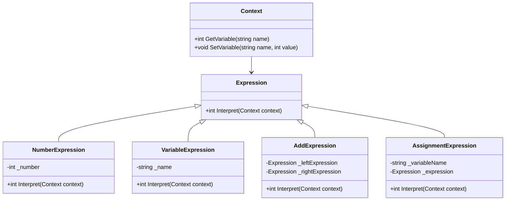

## 6.10 Interpreter Design Pattern

The Interpreter Design Pattern is a powerful tool in the arsenal of software engineers and architects, especially when dealing with complex language processing tasks. This pattern provides a way to evaluate language grammar or expressions, making it particularly useful in scenarios such as scripting languages, calculators, and more. In this section, we will delve into the intricacies of the Interpreter Design Pattern, explore its implementation in C#, and examine its applicability through practical examples.

### Interpreter Pattern Description

The Interpreter Design Pattern is a behavioral pattern that defines a representation of a grammar and provides an interpreter to work with it. This pattern is particularly useful when you need to interpret expressions or sentences in a language. It involves defining a grammar for the language and implementing an interpreter that uses this grammar to interpret sentences.

#### Key Concepts

- **Grammar Representation**: The pattern involves creating a representation of the grammar of the language you want to interpret. This is typically done using classes that represent different parts of the grammar.
- **Interpreter**: An interpreter is implemented to evaluate expressions or sentences based on the grammar representation.
- **Abstract Syntax Tree (AST)**: The grammar is often represented as an abstract syntax tree, where each node represents a part of the grammar.

### Implementing Interpreter in C#

Implementing the Interpreter Design Pattern in C# involves several steps, including defining the grammar, creating an abstract syntax tree, and implementing the interpreter. Let's explore each of these steps in detail.

#### Parsing and Interpreting Expressions

To implement an interpreter, we first need to define the grammar of the language we want to interpret. This involves creating classes that represent different parts of the grammar. Once the grammar is defined, we can create an interpreter that evaluates expressions based on this grammar.

Here's a simple example of implementing an interpreter for a basic arithmetic language in C#:

```csharp
// Abstract Expression
public abstract class Expression
{
    public abstract int Interpret();
}

// Terminal Expression for Numbers
public class NumberExpression : Expression
{
    private int _number;

    public NumberExpression(int number)
    {
        _number = number;
    }

    public override int Interpret()
    {
        return _number;
    }
}

// Non-Terminal Expression for Addition
public class AddExpression : Expression
{
    private Expression _leftExpression;
    private Expression _rightExpression;

    public AddExpression(Expression left, Expression right)
    {
        _leftExpression = left;
        _rightExpression = right;
    }

    public override int Interpret()
    {
        return _leftExpression.Interpret() + _rightExpression.Interpret();
    }
}

// Non-Terminal Expression for Subtraction
public class SubtractExpression : Expression
{
    private Expression _leftExpression;
    private Expression _rightExpression;

    public SubtractExpression(Expression left, Expression right)
    {
        _leftExpression = left;
        _rightExpression = right;
    }

    public override int Interpret()
    {
        return _leftExpression.Interpret() - _rightExpression.Interpret();
    }
}

// Client Code
public class InterpreterClient
{
    public static void Main(string[] args)
    {
        // (5 + 3) - (2 + 1)
        Expression expression = new SubtractExpression(
            new AddExpression(new NumberExpression(5), new NumberExpression(3)),
            new AddExpression(new NumberExpression(2), new NumberExpression(1))
        );

        Console.WriteLine($"Result: {expression.Interpret()}");
    }
}
```

**Explanation:**

- **Abstract Expression**: This is the base class for all expressions. It defines the `Interpret` method that all concrete expressions must implement.
- **Terminal Expression**: Represents leaf nodes in the abstract syntax tree. In this example, `NumberExpression` is a terminal expression that represents numbers.
- **Non-Terminal Expression**: Represents nodes with children in the abstract syntax tree. `AddExpression` and `SubtractExpression` are non-terminal expressions that represent addition and subtraction operations, respectively.
- **Client Code**: Constructs an abstract syntax tree representing the expression `(5 + 3) - (2 + 1)` and interprets it.

### Defining Grammars

Defining grammars is a crucial step in implementing the Interpreter Design Pattern. A grammar defines the rules for forming valid expressions in a language. In the context of the Interpreter Design Pattern, a grammar is typically represented as a set of classes that correspond to different parts of the grammar.

#### Creating Abstract Syntax Trees

An abstract syntax tree (AST) is a tree representation of the abstract syntactic structure of a language. Each node in the tree represents a construct occurring in the language. The Interpreter Design Pattern uses ASTs to represent the grammar of the language being interpreted.

Let's extend our previous example to include multiplication and division:

```csharp
// Non-Terminal Expression for Multiplication
public class MultiplyExpression : Expression
{
    private Expression _leftExpression;
    private Expression _rightExpression;

    public MultiplyExpression(Expression left, Expression right)
    {
        _leftExpression = left;
        _rightExpression = right;
    }

    public override int Interpret()
    {
        return _leftExpression.Interpret() * _rightExpression.Interpret();
    }
}

// Non-Terminal Expression for Division
public class DivideExpression : Expression
{
    private Expression _leftExpression;
    private Expression _rightExpression;

    public DivideExpression(Expression left, Expression right)
    {
        _leftExpression = left;
        _rightExpression = right;
    }

    public override int Interpret()
    {
        return _leftExpression.Interpret() / _rightExpression.Interpret();
    }
}

// Client Code
public class InterpreterClient
{
    public static void Main(string[] args)
    {
        // ((5 + 3) * 2) / (2 + 1)
        Expression expression = new DivideExpression(
            new MultiplyExpression(
                new AddExpression(new NumberExpression(5), new NumberExpression(3)),
                new NumberExpression(2)
            ),
            new AddExpression(new NumberExpression(2), new NumberExpression(1))
        );

        Console.WriteLine($"Result: {expression.Interpret()}");
    }
}
```

**Explanation:**

- **MultiplyExpression** and **DivideExpression** are additional non-terminal expressions that represent multiplication and division operations.
- The client code constructs an AST representing the expression `((5 + 3) * 2) / (2 + 1)` and interprets it.

### Use Cases and Examples

The Interpreter Design Pattern is particularly useful in scenarios where you need to interpret or evaluate expressions in a language. Here are some common use cases:

- **Scripting Languages**: Implementing interpreters for scripting languages that allow users to write and execute scripts.
- **Calculators**: Building calculators that can evaluate mathematical expressions.
- **Configuration Files**: Parsing and interpreting configuration files that use a specific syntax.
- **Domain-Specific Languages (DSLs)**: Implementing interpreters for DSLs that are tailored to specific problem domains.

#### Example: Implementing a Simple Scripting Language

Let's implement a simple scripting language using the Interpreter Design Pattern. This language will support variable assignment and arithmetic operations.

```csharp
// Context for storing variables
public class Context
{
    private Dictionary<string, int> _variables = new Dictionary<string, int>();

    public int GetVariable(string name)
    {
        return _variables.ContainsKey(name) ? _variables[name] : 0;
    }

    public void SetVariable(string name, int value)
    {
        _variables[name] = value;
    }
}

// Abstract Expression
public abstract class Expression
{
    public abstract int Interpret(Context context);
}

// Terminal Expression for Numbers
public class NumberExpression : Expression
{
    private int _number;

    public NumberExpression(int number)
    {
        _number = number;
    }

    public override int Interpret(Context context)
    {
        return _number;
    }
}

// Terminal Expression for Variables
public class VariableExpression : Expression
{
    private string _name;

    public VariableExpression(string name)
    {
        _name = name;
    }

    public override int Interpret(Context context)
    {
        return context.GetVariable(_name);
    }
}

// Non-Terminal Expression for Addition
public class AddExpression : Expression
{
    private Expression _leftExpression;
    private Expression _rightExpression;

    public AddExpression(Expression left, Expression right)
    {
        _leftExpression = left;
        _rightExpression = right;
    }

    public override int Interpret(Context context)
    {
        return _leftExpression.Interpret(context) + _rightExpression.Interpret(context);
    }
}

// Non-Terminal Expression for Assignment
public class AssignmentExpression : Expression
{
    private string _variableName;
    private Expression _expression;

    public AssignmentExpression(string variableName, Expression expression)
    {
        _variableName = variableName;
        _expression = expression;
    }

    public override int Interpret(Context context)
    {
        int value = _expression.Interpret(context);
        context.SetVariable(_variableName, value);
        return value;
    }
}

// Client Code
public class InterpreterClient
{
    public static void Main(string[] args)
    {
        Context context = new Context();

        // x = 5 + 3
        Expression assignment = new AssignmentExpression("x", new AddExpression(new NumberExpression(5), new NumberExpression(3)));
        assignment.Interpret(context);

        // y = x + 2
        Expression assignment2 = new AssignmentExpression("y", new AddExpression(new VariableExpression("x"), new NumberExpression(2)));
        assignment2.Interpret(context);

        Console.WriteLine($"x: {context.GetVariable("x")}");
        Console.WriteLine($"y: {context.GetVariable("y")}");
    }
}
```

**Explanation:**

- **Context**: A class that stores variable values. It provides methods to get and set variable values.
- **VariableExpression**: A terminal expression that represents variables. It retrieves the value of a variable from the context.
- **AssignmentExpression**: A non-terminal expression that represents variable assignment. It evaluates an expression and assigns the result to a variable in the context.

### Design Considerations

When implementing the Interpreter Design Pattern, there are several design considerations to keep in mind:

- **Complexity**: The pattern can become complex if the grammar is large or if there are many different types of expressions. Consider using other patterns or techniques if the grammar is too complex.
- **Performance**: Interpreters can be slower than compiled code because they evaluate expressions at runtime. Consider optimizing performance if necessary.
- **Extensibility**: The pattern is highly extensible, making it easy to add new types of expressions or modify existing ones.

### Differences and Similarities

The Interpreter Design Pattern is often confused with other patterns, such as the Visitor Pattern and the Strategy Pattern. Here are some key differences and similarities:

- **Visitor Pattern**: The Visitor Pattern is used to separate an algorithm from the objects it operates on. It is often used to perform operations on elements of an object structure. The Interpreter Pattern, on the other hand, is used to interpret expressions in a language.
- **Strategy Pattern**: The Strategy Pattern is used to define a family of algorithms and make them interchangeable. It is often used to encapsulate algorithms. The Interpreter Pattern is used to interpret expressions based on a grammar.

### Visualizing the Interpreter Pattern

To better understand the structure and flow of the Interpreter Design Pattern, let's visualize it using a class diagram.



**Diagram Explanation:**

- **Context**: Represents the context in which expressions are interpreted. It stores variable values.
- **Expression**: The abstract base class for all expressions. It defines the `Interpret` method.
- **NumberExpression**, **VariableExpression**, **AddExpression**, **AssignmentExpression**: Concrete classes that represent different types of expressions.

### Try It Yourself

To gain a deeper understanding of the Interpreter Design Pattern, try modifying the code examples provided. Here are some suggestions:

- **Add New Operations**: Implement additional operations, such as multiplication and division, and update the client code to use them.
- **Extend the Language**: Add support for new language constructs, such as conditional expressions or loops.
- **Optimize Performance**: Experiment with optimizing the performance of the interpreter, such as by caching results of expressions.

### Knowledge Check

To reinforce your understanding of the Interpreter Design Pattern, consider the following questions:

- What are the key components of the Interpreter Design Pattern?
- How does the Interpreter Design Pattern differ from the Visitor Pattern?
- What are some common use cases for the Interpreter Design Pattern?
- How can you optimize the performance of an interpreter?

### Embrace the Journey

Remember, mastering design patterns is a journey, not a destination. The Interpreter Design Pattern is just one of many patterns that can help you build more robust and maintainable software. As you continue to explore and experiment with design patterns, you'll gain a deeper understanding of how to apply them effectively in your projects. Keep experimenting, stay curious, and enjoy the journey!

## Quiz Time!



### What is the primary purpose of the Interpreter Design Pattern?

- [x] To evaluate language grammar or expressions
- [ ] To separate an algorithm from the objects it operates on
- [ ] To define a family of algorithms and make them interchangeable
- [ ] To encapsulate algorithms

> **Explanation:** The Interpreter Design Pattern is used to evaluate language grammar or expressions.

### Which component of the Interpreter Design Pattern represents the grammar of the language?

- [x] Abstract Syntax Tree (AST)
- [ ] Context
- [ ] Terminal Expression
- [ ] Non-Terminal Expression

> **Explanation:** The Abstract Syntax Tree (AST) represents the grammar of the language in the Interpreter Design Pattern.

### What is a common use case for the Interpreter Design Pattern?

- [x] Scripting languages
- [ ] User interface design
- [ ] Database management
- [ ] Network communication

> **Explanation:** The Interpreter Design Pattern is commonly used in scripting languages to evaluate expressions.

### How does the Interpreter Design Pattern differ from the Visitor Pattern?

- [x] The Interpreter Pattern is used to interpret expressions, while the Visitor Pattern is used to separate an algorithm from the objects it operates on.
- [ ] The Interpreter Pattern is used to encapsulate algorithms, while the Visitor Pattern is used to interpret expressions.
- [ ] The Interpreter Pattern is used to define a family of algorithms, while the Visitor Pattern is used to encapsulate algorithms.
- [ ] The Interpreter Pattern is used to separate an algorithm from the objects it operates on, while the Visitor Pattern is used to interpret expressions.

> **Explanation:** The Interpreter Pattern is used to interpret expressions, while the Visitor Pattern is used to separate an algorithm from the objects it operates on.

### What is the role of the Context class in the Interpreter Design Pattern?

- [x] To store variable values and provide methods to get and set them
- [ ] To represent leaf nodes in the abstract syntax tree
- [ ] To define the `Interpret` method for all expressions
- [ ] To perform operations on elements of an object structure

> **Explanation:** The Context class stores variable values and provides methods to get and set them in the Interpreter Design Pattern.

### Which of the following is a terminal expression in the provided example?

- [x] NumberExpression
- [ ] AddExpression
- [ ] AssignmentExpression
- [ ] Context

> **Explanation:** NumberExpression is a terminal expression that represents numbers in the provided example.

### How can you optimize the performance of an interpreter?

- [x] By caching results of expressions
- [ ] By adding more non-terminal expressions
- [ ] By using the Visitor Pattern
- [ ] By separating algorithms from the objects they operate on

> **Explanation:** Caching results of expressions can help optimize the performance of an interpreter.

### What is the primary challenge when implementing the Interpreter Design Pattern?

- [x] Complexity of the grammar
- [ ] Lack of extensibility
- [ ] Difficulty in defining the `Interpret` method
- [ ] Inability to represent variables

> **Explanation:** The primary challenge when implementing the Interpreter Design Pattern is the complexity of the grammar.

### What is the benefit of using the Interpreter Design Pattern?

- [x] It provides a way to evaluate language grammar or expressions.
- [ ] It separates algorithms from the objects they operate on.
- [ ] It defines a family of algorithms and makes them interchangeable.
- [ ] It encapsulates algorithms.

> **Explanation:** The Interpreter Design Pattern provides a way to evaluate language grammar or expressions.

### True or False: The Interpreter Design Pattern is suitable for large and complex grammars.

- [ ] True
- [x] False

> **Explanation:** The Interpreter Design Pattern can become complex and less suitable for large and complex grammars.


