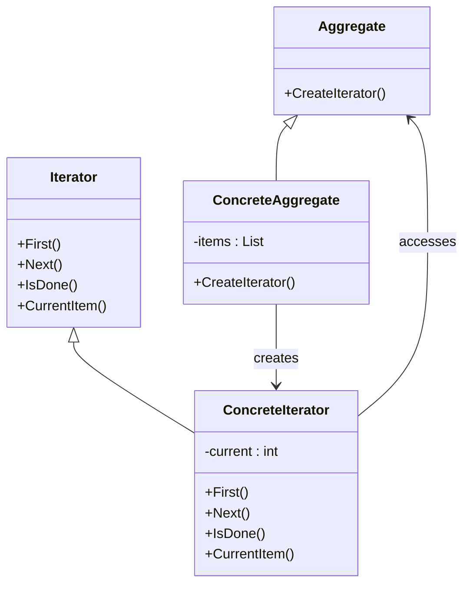

## 6.11 Iterator Design Pattern

The Iterator Design Pattern is a fundamental behavioral pattern that provides a standardized way to access elements of a collection sequentially without exposing its underlying representation. This pattern is particularly useful when dealing with complex data structures, as it abstracts the traversal process, allowing developers to focus on the logic of iteration rather than the intricacies of the data structure itself.

### Iterator Pattern Description

The primary intent of the Iterator Design Pattern is to decouple the traversal logic from the collection's implementation. By doing so, it allows for flexibility and reusability of the iteration logic across different types of collections. This pattern is widely used in C# and is supported by the language's built-in interfaces, `IEnumerator` and `IEnumerable`.

### Key Participants

- **Iterator**: Defines an interface for accessing and traversing elements.
- **Concrete Iterator**: Implements the Iterator interface and keeps track of the current position in the traversal.
- **Aggregate**: Defines an interface for creating an Iterator object.
- **Concrete Aggregate**: Implements the Aggregate interface and returns an instance of the Concrete Iterator.

### Implementing Iterator in C#

In C#, the Iterator pattern is implemented using the `IEnumerator` and `IEnumerable` interfaces. These interfaces provide a standard way to iterate over collections, such as arrays, lists, and custom data structures.

#### Using `IEnumerator` and `IEnumerable` Interfaces

The `IEnumerable` interface defines a single method, `GetEnumerator()`, which returns an `IEnumerator` object. The `IEnumerator` interface provides the methods `MoveNext()`, `Reset()`, and a property `Current` to facilitate iteration.

```csharp
using System;
using System.Collections;

public class DaysOfWeek : IEnumerable
{
    private string[] days = { "Sunday", "Monday", "Tuesday", "Wednesday", "Thursday", "Friday", "Saturday" };

    public IEnumerator GetEnumerator()
    {
        return new DaysEnumerator(days);
    }

    private class DaysEnumerator : IEnumerator
    {
        private string[] _days;
        private int position = -1;

        public DaysEnumerator(string[] days)
        {
            _days = days;
        }

        public bool MoveNext()
        {
            position++;
            return (position < _days.Length);
        }

        public void Reset()
        {
            position = -1;
        }

        public object Current
        {
            get
            {
                if (position < 0 || position >= _days.Length)
                    throw new InvalidOperationException();
                return _days[position];
            }
        }
    }
}

class Program
{
    static void Main()
    {
        DaysOfWeek daysOfWeek = new DaysOfWeek();
        foreach (string day in daysOfWeek)
        {
            Console.WriteLine(day);
        }
    }
}
```

In this example, `DaysOfWeek` is a collection that implements `IEnumerable`, and `DaysEnumerator` is a nested class that implements `IEnumerator`. The `foreach` loop in the `Main` method demonstrates how the iterator is used to traverse the collection.

### Custom Iterators with Yield

C# provides a powerful feature called `yield` that simplifies the creation of iterators. By using `yield return`, you can create an iterator without explicitly implementing the `IEnumerator` interface.

#### Implementing Iterators Using `yield` Return

The `yield` keyword allows you to define an iterator block, which can return each element of the collection one at a time. This approach is more concise and easier to read.

```csharp
using System;
using System.Collections.Generic;

public class FibonacciSequence
{
    public IEnumerable<int> GetFibonacciNumbers(int count)
    {
        int previous = 0, current = 1;

        for (int i = 0; i < count; i++)
        {
            yield return previous;
            int next = previous + current;
            previous = current;
            current = next;
        }
    }
}

class Program
{
    static void Main()
    {
        FibonacciSequence fibonacci = new FibonacciSequence();
        foreach (int number in fibonacci.GetFibonacciNumbers(10))
        {
            Console.WriteLine(number);
        }
    }
}
```

In this example, the `GetFibonacciNumbers` method uses `yield return` to generate Fibonacci numbers. The `foreach` loop in the `Main` method demonstrates how to iterate over the sequence.

### Use Cases and Examples

The Iterator pattern is particularly useful in scenarios where you need to:

- Loop over custom data structures without exposing their internal details.
- Provide multiple traversal algorithms for a collection.
- Simplify the iteration logic by using `yield`.

#### Looping Over Custom Data Structures

Consider a scenario where you have a custom data structure, such as a binary tree, and you want to iterate over its elements in a specific order (e.g., in-order traversal).

```csharp
using System;
using System.Collections.Generic;

public class TreeNode<T>
{
    public T Value { get; set; }
    public TreeNode<T> Left { get; set; }
    public TreeNode<T> Right { get; set; }

    public TreeNode(T value)
    {
        Value = value;
        Left = Right = null;
    }
}

public class BinaryTree<T>
{
    public TreeNode<T> Root { get; set; }

    public IEnumerable<T> InOrderTraversal()
    {
        if (Root != null)
        {
            foreach (var value in InOrderTraversal(Root))
            {
                yield return value;
            }
        }
    }

    private IEnumerable<T> InOrderTraversal(TreeNode<T> node)
    {
        if (node.Left != null)
        {
            foreach (var value in InOrderTraversal(node.Left))
            {
                yield return value;
            }
        }

        yield return node.Value;

        if (node.Right != null)
        {
            foreach (var value in InOrderTraversal(node.Right))
            {
                yield return value;
            }
        }
    }
}

class Program
{
    static void Main()
    {
        BinaryTree<int> tree = new BinaryTree<int>
        {
            Root = new TreeNode<int>(1)
            {
                Left = new TreeNode<int>(2),
                Right = new TreeNode<int>(3)
            }
        };

        foreach (int value in tree.InOrderTraversal())
        {
            Console.WriteLine(value);
        }
    }
}
```

In this example, the `BinaryTree` class provides an `InOrderTraversal` method that uses `yield` to iterate over the tree's nodes in in-order sequence.

### Design Considerations

When implementing the Iterator pattern, consider the following:

- **Encapsulation**: The pattern helps maintain encapsulation by not exposing the internal structure of the collection.
- **Flexibility**: It allows for different traversal strategies without modifying the collection.
- **Performance**: Using `yield` can improve performance by generating elements on-the-fly, reducing memory usage.

### Differences and Similarities

The Iterator pattern is often compared to the **Composite** pattern, as both deal with collections. However, the Composite pattern focuses on treating individual objects and compositions uniformly, while the Iterator pattern focuses on traversing elements.

### Visualizing the Iterator Pattern

To better understand the Iterator pattern, let's visualize the interaction between the key participants using a class diagram.



This diagram illustrates the relationship between the Aggregate, Concrete Aggregate, Iterator, and Concrete Iterator classes.

### Try It Yourself

To deepen your understanding of the Iterator pattern, try modifying the code examples:

- Implement a custom iterator for a different data structure, such as a linked list.
- Experiment with different traversal strategies, such as pre-order or post-order traversal for the binary tree example.
- Use `yield` to create an iterator for a collection of objects with complex relationships.

### Knowledge Check

Before we conclude, let's reinforce what we've learned:

- Explain the purpose of the Iterator Design Pattern.
- Demonstrate how `IEnumerator` and `IEnumerable` are used in C#.
- Provide an example of using `yield` to simplify iterator implementation.

### Embrace the Journey

Remember, mastering design patterns is a journey. As you continue to explore and apply these patterns, you'll enhance your ability to build robust and maintainable software. Keep experimenting, stay curious, and enjoy the process!

## Quiz Time!



### What is the primary intent of the Iterator Design Pattern?

- [x] To provide a way to access elements of a collection sequentially without exposing its underlying representation.
- [ ] To create a new collection from an existing one.
- [ ] To modify the elements of a collection.
- [ ] To sort the elements of a collection.

> **Explanation:** The Iterator Design Pattern is intended to provide a way to access elements of a collection sequentially without exposing its underlying representation.

### Which interfaces are used in C# to implement the Iterator pattern?

- [x] IEnumerable and IEnumerator
- [ ] ICollection and IList
- [ ] IComparable and IComparer
- [ ] IDisposable and ICloneable

> **Explanation:** The Iterator pattern in C# is implemented using the IEnumerable and IEnumerator interfaces.

### What does the `yield` keyword in C# do?

- [x] It simplifies the creation of iterators by allowing the method to return elements one at a time.
- [ ] It stops the execution of a method.
- [ ] It creates a new collection.
- [ ] It sorts the elements of a collection.

> **Explanation:** The `yield` keyword in C# simplifies the creation of iterators by allowing the method to return elements one at a time.

### In the provided binary tree example, what traversal strategy is used?

- [x] In-order traversal
- [ ] Pre-order traversal
- [ ] Post-order traversal
- [ ] Level-order traversal

> **Explanation:** The binary tree example uses in-order traversal, where the left subtree is visited first, followed by the root, and then the right subtree.

### What is a key benefit of using the Iterator pattern?

- [x] It maintains encapsulation by not exposing the internal structure of the collection.
- [ ] It increases the speed of data processing.
- [ ] It reduces the size of the collection.
- [ ] It automatically sorts the collection.

> **Explanation:** A key benefit of the Iterator pattern is that it maintains encapsulation by not exposing the internal structure of the collection.

### How does the Iterator pattern differ from the Composite pattern?

- [x] The Iterator pattern focuses on traversing elements, while the Composite pattern focuses on treating individual objects and compositions uniformly.
- [ ] The Iterator pattern modifies elements, while the Composite pattern sorts them.
- [ ] The Iterator pattern creates new collections, while the Composite pattern deletes them.
- [ ] The Iterator pattern is used for sorting, while the Composite pattern is used for filtering.

> **Explanation:** The Iterator pattern focuses on traversing elements, while the Composite pattern focuses on treating individual objects and compositions uniformly.

### What method does the `IEnumerable` interface define?

- [x] GetEnumerator()
- [ ] MoveNext()
- [ ] Reset()
- [ ] Current()

> **Explanation:** The `IEnumerable` interface defines the GetEnumerator() method, which returns an IEnumerator object.

### What does the `MoveNext()` method of the `IEnumerator` interface do?

- [x] It advances the enumerator to the next element of the collection.
- [ ] It resets the enumerator to its initial position.
- [ ] It returns the current element in the collection.
- [ ] It sorts the elements of the collection.

> **Explanation:** The `MoveNext()` method of the `IEnumerator` interface advances the enumerator to the next element of the collection.

### True or False: The Iterator pattern can be used to provide multiple traversal algorithms for a collection.

- [x] True
- [ ] False

> **Explanation:** True. The Iterator pattern can be used to provide multiple traversal algorithms for a collection, allowing for flexibility in how the collection is traversed.

### What is the role of the Concrete Iterator in the Iterator pattern?

- [x] It implements the Iterator interface and keeps track of the current position in the traversal.
- [ ] It defines an interface for creating an Iterator object.
- [ ] It creates a new collection from an existing one.
- [ ] It modifies the elements of a collection.

> **Explanation:** The Concrete Iterator implements the Iterator interface and keeps track of the current position in the traversal.


