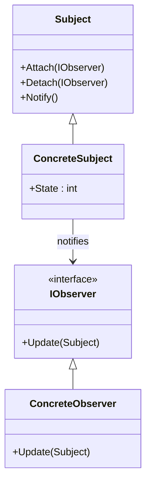
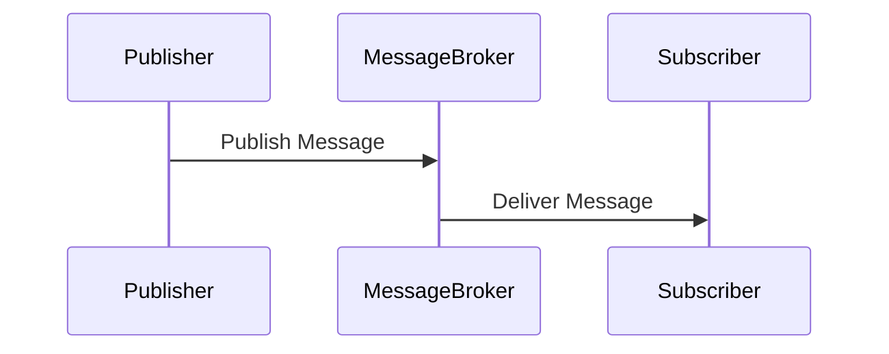

## 6.12 Observer vs. Publish/Subscribe Pattern

In the realm of software design patterns, the Observer and Publish/Subscribe patterns are pivotal for enabling communication between components in a system. Both patterns facilitate the notification of changes or events, yet they differ in their structure, intent, and use cases. In this section, we will delve into the intricacies of these patterns, explore their implementation in C#, and examine their applicability in modern software architecture.

### Understanding the Observer Pattern

#### Intent

The Observer pattern is a behavioral design pattern that defines a one-to-many dependency between objects. When one object (the subject) changes its state, all its dependents (observers) are notified and updated automatically. This pattern is particularly useful for implementing distributed event-handling systems.

#### Key Participants

- **Subject**: The object that holds the state and notifies observers of changes.
- **Observer**: The object that needs to be informed about changes in the subject.
- **ConcreteSubject**: A specific implementation of the subject.
- **ConcreteObserver**: A specific implementation of the observer that reacts to changes in the subject.

#### Applicability

Use the Observer pattern when:

- An abstraction has two aspects, one dependent on the other.
- A change to one object requires changing others, and you don't know how many objects need to be changed.
- An object should be able to notify other objects without making assumptions about who these objects are.

#### Sample Code Snippet

Here's a basic implementation of the Observer pattern in C#:

```csharp
// Subject interface
public interface ISubject
{
    void Attach(IObserver observer);
    void Detach(IObserver observer);
    void Notify();
}

// ConcreteSubject
public class ConcreteSubject : ISubject
{
    private List<IObserver> _observers = new List<IObserver>();
    private int _state;

    public int State
    {
        get { return _state; }
        set
        {
            _state = value;
            Notify();
        }
    }

    public void Attach(IObserver observer)
    {
        _observers.Add(observer);
    }

    public void Detach(IObserver observer)
    {
        _observers.Remove(observer);
    }

    public void Notify()
    {
        foreach (var observer in _observers)
        {
            observer.Update(this);
        }
    }
}

// Observer interface
public interface IObserver
{
    void Update(ISubject subject);
}

// ConcreteObserver
public class ConcreteObserver : IObserver
{
    public void Update(ISubject subject)
    {
        if (subject is ConcreteSubject concreteSubject)
        {
            Console.WriteLine("Observer: Reacted to the event. New State: " + concreteSubject.State);
        }
    }
}

// Usage
var subject = new ConcreteSubject();
var observer1 = new ConcreteObserver();
var observer2 = new ConcreteObserver();

subject.Attach(observer1);
subject.Attach(observer2);

subject.State = 5;
```

### Understanding the Publish/Subscribe Pattern

#### Intent

The Publish/Subscribe pattern is a messaging pattern where senders (publishers) send messages without knowing who will receive them. Receivers (subscribers) express interest in certain messages and receive only those messages. This pattern is ideal for decoupling the components that produce information from those that consume it.

#### Key Participants

- **Publisher**: The component that sends messages.
- **Subscriber**: The component that receives messages.
- **Message Broker**: An intermediary that manages the distribution of messages from publishers to subscribers.

#### Applicability

Use the Publish/Subscribe pattern when:

- You need to decouple the sender of a message from its receivers.
- You want to implement an event-driven architecture.
- You need to support multiple subscribers for a single event.

#### Sample Code Snippet

Here's a basic implementation of the Publish/Subscribe pattern in C# using an event aggregator:

```csharp
// Event Aggregator
public class EventAggregator
{
    private readonly Dictionary<Type, List<Action<object>>> _subscribers = new Dictionary<Type, List<Action<object>>>();

    public void Subscribe<T>(Action<T> action)
    {
        if (!_subscribers.ContainsKey(typeof(T)))
        {
            _subscribers[typeof(T)] = new List<Action<object>>();
        }
        _subscribers[typeof(T)].Add(x => action((T)x));
    }

    public void Publish<T>(T message)
    {
        if (_subscribers.ContainsKey(typeof(T)))
        {
            foreach (var action in _subscribers[typeof(T)])
            {
                action(message);
            }
        }
    }
}

// Usage
var eventAggregator = new EventAggregator();

eventAggregator.Subscribe<string>(message => Console.WriteLine("Received message: " + message));
eventAggregator.Publish("Hello, World!");
```

### Differences and Similarities

#### Differences

- **Coupling**: The Observer pattern involves a direct relationship between the subject and observers, whereas the Publish/Subscribe pattern decouples publishers and subscribers through a message broker.
- **Scalability**: Publish/Subscribe is generally more scalable due to its decoupled nature, allowing for distributed systems.
- **Complexity**: The Observer pattern is simpler and more straightforward, while Publish/Subscribe can introduce complexity with message brokers and routing.

#### Similarities

- Both patterns facilitate communication between components.
- Both patterns can be used to implement event-driven systems.
- Both patterns allow for multiple receivers of a single event.

### Implementing Publish/Subscribe in C#

#### Using Event Aggregators

Event aggregators are a common way to implement the Publish/Subscribe pattern in C#. They act as a centralized hub for managing subscriptions and publishing events.

```csharp
// Event Aggregator with Generics
public class GenericEventAggregator
{
    private readonly Dictionary<Type, List<Delegate>> _subscribers = new Dictionary<Type, List<Delegate>>();

    public void Subscribe<T>(Action<T> action)
    {
        if (!_subscribers.ContainsKey(typeof(T)))
        {
            _subscribers[typeof(T)] = new List<Delegate>();
        }
        _subscribers[typeof(T)].Add(action);
    }

    public void Publish<T>(T message)
    {
        if (_subscribers.ContainsKey(typeof(T)))
        {
            foreach (var action in _subscribers[typeof(T)].Cast<Action<T>>())
            {
                action(message);
            }
        }
    }
}

// Usage
var genericEventAggregator = new GenericEventAggregator();

genericEventAggregator.Subscribe<int>(number => Console.WriteLine("Received number: " + number));
genericEventAggregator.Publish(42);
```

#### Using Message Brokers

Message brokers like RabbitMQ or Azure Service Bus can be used to implement the Publish/Subscribe pattern in distributed systems. They provide robust messaging capabilities, including message persistence, routing, and delivery guarantees.

```csharp
// Example using RabbitMQ (pseudo-code)
public class RabbitMQPublisher
{
    public void Publish(string message)
    {
        // Connect to RabbitMQ and publish message
    }
}

public class RabbitMQSubscriber
{
    public void Subscribe()
    {
        // Connect to RabbitMQ and listen for messages
    }
}

// Usage
var publisher = new RabbitMQPublisher();
var subscriber = new RabbitMQSubscriber();

subscriber.Subscribe();
publisher.Publish("Hello from RabbitMQ!");
```

### Use Cases and Examples

#### Decoupled Communication

Both patterns are excellent for decoupling components in a system. The Observer pattern is suitable for scenarios where the subject and observers are tightly coupled, such as in GUI applications. The Publish/Subscribe pattern is ideal for distributed systems where components need to communicate without direct dependencies.

#### Event-Driven Systems

Event-driven systems benefit from both patterns. The Observer pattern can be used for local event handling, while the Publish/Subscribe pattern is better suited for distributed event processing across multiple services or applications.

### Visualizing the Patterns

#### Observer Pattern Diagram



#### Publish/Subscribe Pattern Diagram



### Design Considerations

- **Observer Pattern**: Consider using this pattern when the number of observers is relatively small and the subject and observers are part of the same application.
- **Publish/Subscribe Pattern**: Opt for this pattern in distributed systems where components need to communicate across network boundaries.

### Differences and Similarities

- **Observer Pattern**: Direct relationship, simpler implementation, suitable for local event handling.
- **Publish/Subscribe Pattern**: Decoupled communication, scalable, suitable for distributed systems.

### Try It Yourself

Experiment with the provided code examples by modifying the message types, adding more observers or subscribers, and testing the patterns in different scenarios. Consider integrating a message broker like RabbitMQ to explore the Publish/Subscribe pattern in a distributed environment.

### Knowledge Check

- What are the key differences between the Observer and Publish/Subscribe patterns?
- How can you implement the Publish/Subscribe pattern using an event aggregator in C#?
- What are some use cases for the Observer pattern in software development?

### Embrace the Journey

Remember, mastering design patterns is a journey. As you explore these patterns, you'll gain insights into building more robust and maintainable systems. Keep experimenting, stay curious, and enjoy the process of learning and applying these powerful design patterns in your projects.

## Quiz Time!



### What is the primary intent of the Observer pattern?

- [x] To define a one-to-many dependency between objects
- [ ] To decouple publishers and subscribers
- [ ] To manage distributed transactions
- [ ] To optimize performance

> **Explanation:** The Observer pattern defines a one-to-many dependency between objects, allowing observers to be notified of changes in the subject.

### Which pattern is more suitable for distributed systems?

- [ ] Observer Pattern
- [x] Publish/Subscribe Pattern
- [ ] Singleton Pattern
- [ ] Factory Pattern

> **Explanation:** The Publish/Subscribe pattern is more suitable for distributed systems due to its decoupled nature and scalability.

### What is a key difference between the Observer and Publish/Subscribe patterns?

- [x] Observer involves direct relationships, while Publish/Subscribe uses a message broker
- [ ] Observer is used for distributed systems, while Publish/Subscribe is not
- [ ] Observer is more scalable than Publish/Subscribe
- [ ] Observer is more complex than Publish/Subscribe

> **Explanation:** The Observer pattern involves direct relationships between subjects and observers, while the Publish/Subscribe pattern uses a message broker to decouple communication.

### In the Observer pattern, what role does the ConcreteSubject play?

- [x] It holds the state and notifies observers of changes
- [ ] It receives messages from publishers
- [ ] It acts as a message broker
- [ ] It subscribes to events

> **Explanation:** The ConcreteSubject holds the state and notifies observers of changes in the Observer pattern.

### How can the Publish/Subscribe pattern be implemented in C#?

- [x] Using event aggregators
- [x] Using message brokers like RabbitMQ
- [ ] Using direct method calls
- [ ] Using inheritance

> **Explanation:** The Publish/Subscribe pattern can be implemented using event aggregators or message brokers like RabbitMQ in C#.

### What is a common use case for the Observer pattern?

- [x] GUI applications with event handling
- [ ] Distributed messaging systems
- [ ] Database transactions
- [ ] Network communication

> **Explanation:** The Observer pattern is commonly used in GUI applications for event handling.

### Which pattern is generally simpler to implement?

- [x] Observer Pattern
- [ ] Publish/Subscribe Pattern
- [ ] Singleton Pattern
- [ ] Factory Pattern

> **Explanation:** The Observer pattern is generally simpler to implement due to its direct relationships and straightforward structure.

### What is a benefit of using the Publish/Subscribe pattern?

- [x] Decoupled communication between components
- [ ] Direct method calls between objects
- [ ] Simplified code structure
- [ ] Improved memory management

> **Explanation:** The Publish/Subscribe pattern provides decoupled communication between components, making it ideal for distributed systems.

### What is the role of a message broker in the Publish/Subscribe pattern?

- [x] To manage the distribution of messages from publishers to subscribers
- [ ] To hold the state and notify observers
- [ ] To optimize performance
- [ ] To handle database transactions

> **Explanation:** A message broker manages the distribution of messages from publishers to subscribers in the Publish/Subscribe pattern.

### True or False: The Observer pattern is more scalable than the Publish/Subscribe pattern.

- [ ] True
- [x] False

> **Explanation:** The Publish/Subscribe pattern is generally more scalable than the Observer pattern due to its decoupled nature and ability to handle distributed systems.


