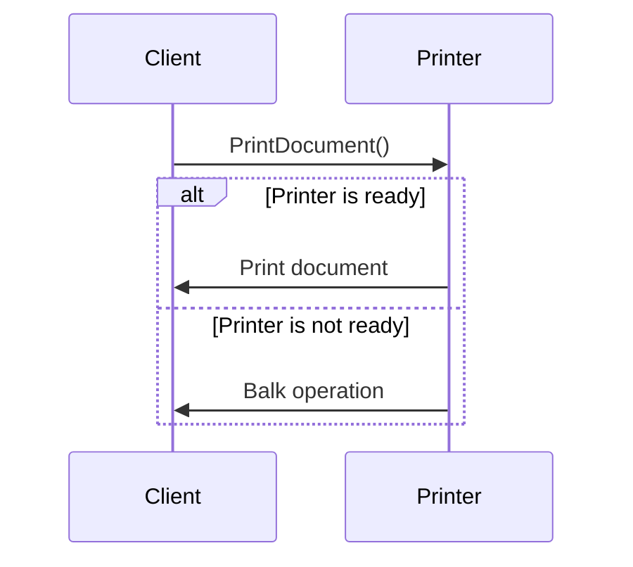

## 6.14 Balking Pattern

In the realm of software design patterns, the Balking Pattern is a behavioral pattern that plays a crucial role in ensuring that operations are only executed when an object is in an appropriate state. This pattern is particularly useful in scenarios where performing an action under unsuitable conditions could lead to errors or inefficient resource usage. Let's delve into the intricacies of the Balking Pattern, its implementation in C#, and explore practical use cases.

### Balking Pattern Description

The Balking Pattern is designed to prevent an object from performing an action if it is not in a suitable state. The term "balking" refers to the act of refusing to proceed with an operation when certain conditions are not met. This pattern is particularly useful in multithreaded environments where operations may be resource-intensive or time-consuming, and executing them under inappropriate conditions could lead to undesirable outcomes.

#### Intent

The primary intent of the Balking Pattern is to avoid the execution of operations when the object is not ready. This is achieved by checking the state of the object before proceeding with the operation. If the object is not in the desired state, the operation is simply skipped or deferred until the conditions are favorable.

### Key Participants

1. **Client**: The entity that requests an operation to be performed.
2. **Balking Object**: The object that checks its state before executing the requested operation.
3. **State Checker**: A mechanism within the balking object that determines whether the operation should proceed.

### Applicability

The Balking Pattern is applicable in scenarios where:
- Operations are resource-intensive and should be avoided under certain conditions.
- The system operates in a multithreaded environment where state changes can occur asynchronously.
- There is a need to ensure that operations are only executed when the object is in a valid state.

### Implementing Balking in C#

To implement the Balking Pattern in C#, we need to incorporate state checks before performing actions. This involves defining a state within the object and implementing a method that checks this state before proceeding with the operation.

#### Sample Code Snippet

Let's consider a scenario where we have a `Printer` class that should only print documents when it is in a "ready" state. Here's how we can implement the Balking Pattern in C#:

```csharp
using System;

public class Printer
{
    private bool isReady;

    public Printer()
    {
        isReady = false;
    }

    // Method to set the printer to ready state
    public void SetReady()
    {
        isReady = true;
        Console.WriteLine("Printer is now ready.");
    }

    // Method to print a document
    public void PrintDocument(string document)
    {
        if (!isReady)
        {
            Console.WriteLine("Printer is not ready. Balking the print operation.");
            return;
        }

        Console.WriteLine($"Printing document: {document}");
        // Simulate printing process
        isReady = false; // Reset state after printing
    }
}

public class Program
{
    public static void Main()
    {
        Printer printer = new Printer();

        // Attempt to print without setting the printer to ready
        printer.PrintDocument("Document1");

        // Set the printer to ready and print again
        printer.SetReady();
        printer.PrintDocument("Document2");
    }
}
```

In this example, the `Printer` class has a boolean state `isReady` that determines whether it can print documents. The `PrintDocument` method checks this state before proceeding with the print operation. If the printer is not ready, the operation is balked, and a message is displayed.

### Design Considerations

When implementing the Balking Pattern, consider the following:
- **State Management**: Ensure that the state of the object is managed correctly and updated appropriately after operations.
- **Thread Safety**: In multithreaded environments, ensure that state checks and updates are thread-safe to prevent race conditions.
- **Performance**: Avoid frequent state checks that could impact performance. Optimize the state-checking mechanism for efficiency.

### Differences and Similarities

The Balking Pattern is often compared to other behavioral patterns such as the State Pattern and the Guarded Suspension Pattern. While the State Pattern involves changing the behavior of an object based on its state, the Balking Pattern focuses on preventing operations when the object is not in a suitable state. The Guarded Suspension Pattern, on the other hand, involves suspending operations until a condition is met, whereas the Balking Pattern simply skips the operation.

### Use Cases and Examples

The Balking Pattern is particularly useful in scenarios where operations are resource-intensive or time-sensitive. Here are some practical use cases:

#### Resource-Intensive Operations

In applications where operations consume significant resources, such as database transactions or network communications, the Balking Pattern can be used to prevent these operations from executing when the system is not ready. For example, a database connection pool can balk connection requests when the pool is exhausted.

#### Multithreaded Environments

In multithreaded applications, the Balking Pattern can be used to ensure that operations are only executed when the object is in a consistent state. For instance, a file writer class can balk write operations if the file is currently being accessed by another thread.

#### User Interface Applications

In user interface applications, the Balking Pattern can be used to prevent actions that require user input when the input is not available. For example, a form submission can be balked if mandatory fields are not filled.

### Visualizing the Balking Pattern

To better understand the Balking Pattern, let's visualize the flow of operations using a sequence diagram.



This sequence diagram illustrates the decision-making process in the Balking Pattern. The `Client` requests the `Printer` to print a document. The `Printer` checks its state and either proceeds with the operation or balks it based on its readiness.

### Try It Yourself

To gain a deeper understanding of the Balking Pattern, try modifying the code example provided. Experiment with different states and conditions to see how the pattern behaves. For instance, you can add a method to reset the printer's state and observe how it affects the print operation.

### Knowledge Check

To reinforce your understanding of the Balking Pattern, consider the following questions:
- What is the primary intent of the Balking Pattern?
- How does the Balking Pattern differ from the State Pattern?
- In what scenarios is the Balking Pattern most useful?

### Embrace the Journey

Remember, mastering design patterns is a journey. The Balking Pattern is just one of many patterns that can enhance your software design skills. As you continue to explore and experiment with different patterns, you'll gain a deeper understanding of how to build scalable and maintainable applications. Keep experimenting, stay curious, and enjoy the journey!

## Quiz Time!



### What is the primary intent of the Balking Pattern?

- [x] To avoid execution of operations when the object is not ready
- [ ] To change the behavior of an object based on its state
- [ ] To suspend operations until a condition is met
- [ ] To ensure operations are executed in a specific order

> **Explanation:** The Balking Pattern is designed to prevent an object from performing an action if it is not in a suitable state, thereby avoiding execution of operations when the object is not ready.

### How does the Balking Pattern differ from the State Pattern?

- [x] The Balking Pattern prevents operations, while the State Pattern changes behavior
- [ ] The Balking Pattern changes behavior, while the State Pattern prevents operations
- [ ] Both patterns prevent operations
- [ ] Both patterns change behavior

> **Explanation:** The Balking Pattern focuses on preventing operations when the object is not in a suitable state, whereas the State Pattern involves changing the behavior of an object based on its state.

### In what scenarios is the Balking Pattern most useful?

- [x] Resource-intensive operations
- [x] Multithreaded environments
- [ ] Simple operations
- [ ] Operations with no state dependency

> **Explanation:** The Balking Pattern is particularly useful in scenarios where operations are resource-intensive or time-sensitive, such as in multithreaded environments.

### What is a key consideration when implementing the Balking Pattern?

- [x] State management
- [ ] Code readability
- [ ] User interface design
- [ ] Network latency

> **Explanation:** When implementing the Balking Pattern, it is crucial to ensure that the state of the object is managed correctly and updated appropriately after operations.

### Which of the following is a participant in the Balking Pattern?

- [x] Balking Object
- [ ] Observer
- [ ] Command
- [ ] Mediator

> **Explanation:** The Balking Object is a key participant in the Balking Pattern, responsible for checking its state before executing the requested operation.

### What does the term "balking" refer to in the context of the Balking Pattern?

- [x] Refusing to proceed with an operation
- [ ] Changing the behavior of an object
- [ ] Suspending operations
- [ ] Executing operations in parallel

> **Explanation:** In the context of the Balking Pattern, "balking" refers to the act of refusing to proceed with an operation when certain conditions are not met.

### How can the Balking Pattern be visualized?

- [x] Using a sequence diagram
- [ ] Using a class diagram
- [ ] Using a flowchart
- [ ] Using a pie chart

> **Explanation:** The Balking Pattern can be visualized using a sequence diagram, which illustrates the decision-making process and flow of operations.

### What is a common use case for the Balking Pattern in user interface applications?

- [x] Preventing actions that require user input when input is not available
- [ ] Changing the layout of the interface
- [ ] Enhancing visual design
- [ ] Improving network performance

> **Explanation:** In user interface applications, the Balking Pattern can be used to prevent actions that require user input when the input is not available, such as form submissions with missing mandatory fields.

### What should be ensured in multithreaded environments when using the Balking Pattern?

- [x] Thread safety
- [ ] Code simplicity
- [ ] User experience
- [ ] Network efficiency

> **Explanation:** In multithreaded environments, it is important to ensure that state checks and updates are thread-safe to prevent race conditions when using the Balking Pattern.

### True or False: The Balking Pattern is only applicable in single-threaded applications.

- [ ] True
- [x] False

> **Explanation:** False. The Balking Pattern is applicable in both single-threaded and multithreaded applications, particularly useful in multithreaded environments where state changes can occur asynchronously.


