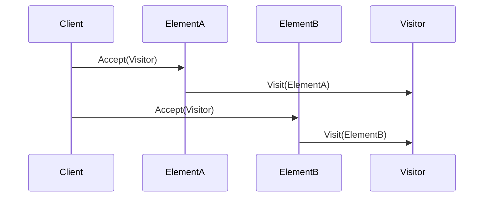

## 6.15 Double Dispatch Pattern

In the realm of software design patterns, the Double Dispatch Pattern stands out as a sophisticated technique that allows a method to be executed based on the runtime types of two objects. This pattern is particularly useful in scenarios where operations need to depend on the concrete types of multiple objects, providing a flexible and dynamic approach to method execution.

### Double Dispatch Pattern Description

The Double Dispatch Pattern is a technique that enables operations to depend on the concrete types of two objects. Unlike single dispatch, where the method to be executed is determined by the runtime type of a single object (usually the object on which the method is called), double dispatch involves two objects and allows the method to be chosen based on the runtime types of both objects involved in the interaction.

#### Key Concepts

- **Single Dispatch**: The default method dispatch mechanism in most object-oriented languages, including C#, where the method to be executed is determined by the runtime type of the object on which the method is called.
- **Double Dispatch**: Extends the concept of single dispatch by allowing the method to be chosen based on the runtime types of two objects, enabling more dynamic and flexible behavior.

### Implementing Double Dispatch in C#

Implementing double dispatch in C# can be achieved through various techniques, including visitor interactions and method overloading. Let's explore these approaches in detail.

#### Using Visitor Pattern

The Visitor Pattern is a common way to implement double dispatch. It involves creating a visitor interface with visit methods for each concrete element type. Each element class implements an accept method that takes a visitor as an argument and calls the appropriate visit method on the visitor.

```csharp
// Define the Visitor interface
public interface IVisitor
{
    void Visit(ElementA element);
    void Visit(ElementB element);
}

// Define the Element interface
public interface IElement
{
    void Accept(IVisitor visitor);
}

// Implement concrete elements
public class ElementA : IElement
{
    public void Accept(IVisitor visitor)
    {
        visitor.Visit(this);
    }
}

public class ElementB : IElement
{
    public void Accept(IVisitor visitor)
    {
        visitor.Visit(this);
    }
}

// Implement a concrete visitor
public class ConcreteVisitor : IVisitor
{
    public void Visit(ElementA element)
    {
        Console.WriteLine("Processing ElementA");
    }

    public void Visit(ElementB element)
    {
        Console.WriteLine("Processing ElementB");
    }
}

// Usage
public class Program
{
    public static void Main()
    {
        IElement[] elements = { new ElementA(), new ElementB() };
        IVisitor visitor = new ConcreteVisitor();

        foreach (var element in elements)
        {
            element.Accept(visitor);
        }
    }
}
```

In this example, the `ConcreteVisitor` class implements the `IVisitor` interface, providing specific implementations for visiting `ElementA` and `ElementB`. Each element class implements the `Accept` method, which takes a visitor as an argument and calls the appropriate visit method on the visitor.

#### Using Method Overloading

Another approach to implementing double dispatch is through method overloading. This technique involves defining overloaded methods for each combination of types that need to be handled.

```csharp
public class DoubleDispatchExample
{
    public void ExecuteOperation(ElementA element, Operation operation)
    {
        operation.Perform(this, element);
    }

    public void ExecuteOperation(ElementB element, Operation operation)
    {
        operation.Perform(this, element);
    }
}

public abstract class Operation
{
    public abstract void Perform(DoubleDispatchExample example, ElementA element);
    public abstract void Perform(DoubleDispatchExample example, ElementB element);
}

public class SpecificOperation : Operation
{
    public override void Perform(DoubleDispatchExample example, ElementA element)
    {
        Console.WriteLine("Performing operation on ElementA");
    }

    public override void Perform(DoubleDispatchExample example, ElementB element)
    {
        Console.WriteLine("Performing operation on ElementB");
    }
}

// Usage
public class Program
{
    public static void Main()
    {
        DoubleDispatchExample example = new DoubleDispatchExample();
        Operation operation = new SpecificOperation();

        ElementA elementA = new ElementA();
        ElementB elementB = new ElementB();

        example.ExecuteOperation(elementA, operation);
        example.ExecuteOperation(elementB, operation);
    }
}
```

In this example, the `DoubleDispatchExample` class defines overloaded `ExecuteOperation` methods for `ElementA` and `ElementB`. The `SpecificOperation` class extends the `Operation` class and provides specific implementations for performing operations on `ElementA` and `ElementB`.

### Use Cases and Examples

The Double Dispatch Pattern is particularly useful in complex event handling and processing scenarios, where operations need to be executed based on the types of multiple objects involved in the interaction.

#### Complex Event Handling

Consider a scenario where different types of events need to be handled by different types of handlers. The Double Dispatch Pattern can be used to dynamically determine the appropriate handler for each event type.

```csharp
public interface IEvent
{
    void Handle(IEventHandler handler);
}

public interface IEventHandler
{
    void HandleEvent(EventA eventA);
    void HandleEvent(EventB eventB);
}

public class EventA : IEvent
{
    public void Handle(IEventHandler handler)
    {
        handler.HandleEvent(this);
    }
}

public class EventB : IEvent
{
    public void Handle(IEventHandler handler)
    {
        handler.HandleEvent(this);
    }
}

public class ConcreteEventHandler : IEventHandler
{
    public void HandleEvent(EventA eventA)
    {
        Console.WriteLine("Handling EventA");
    }

    public void HandleEvent(EventB eventB)
    {
        Console.WriteLine("Handling EventB");
    }
}

// Usage
public class Program
{
    public static void Main()
    {
        IEvent[] events = { new EventA(), new EventB() };
        IEventHandler handler = new ConcreteEventHandler();

        foreach (var eventItem in events)
        {
            eventItem.Handle(handler);
        }
    }
}
```

In this example, the `ConcreteEventHandler` class implements the `IEventHandler` interface, providing specific implementations for handling `EventA` and `EventB`. Each event class implements the `Handle` method, which takes a handler as an argument and calls the appropriate handle method on the handler.

### Visualizing Double Dispatch

To better understand the Double Dispatch Pattern, let's visualize the interaction between objects using a sequence diagram.



This sequence diagram illustrates the interaction between the client, elements, and visitor in the Double Dispatch Pattern. The client initiates the interaction by calling the `Accept` method on an element, which in turn calls the appropriate `Visit` method on the visitor.

### Design Considerations

When implementing the Double Dispatch Pattern, consider the following design considerations:

- **Complexity**: Double dispatch can introduce additional complexity to the codebase. Ensure that the benefits of using double dispatch outweigh the added complexity.
- **Performance**: Double dispatch may have performance implications due to the additional method calls involved. Consider the performance impact in performance-critical applications.
- **Maintainability**: Ensure that the implementation is maintainable and easy to understand. Use clear naming conventions and documentation to aid maintainability.

### Differences and Similarities

The Double Dispatch Pattern is often compared to the Visitor Pattern, as they both involve interactions between multiple objects. However, there are key differences:

- **Visitor Pattern**: Primarily focuses on separating algorithms from the objects on which they operate, allowing new operations to be added without modifying existing classes.
- **Double Dispatch Pattern**: Focuses on executing methods based on the runtime types of two objects, enabling more dynamic and flexible behavior.

### Try It Yourself

To gain a deeper understanding of the Double Dispatch Pattern, try modifying the code examples provided. Experiment with adding new element types, visitor methods, and event handlers to see how the pattern adapts to changes.

### References and Links

For further reading on the Double Dispatch Pattern and related concepts, consider the following resources:

- [Design Patterns: Elements of Reusable Object-Oriented Software](https://en.wikipedia.org/wiki/Design_Patterns) by Erich Gamma, Richard Helm, Ralph Johnson, and John Vlissides.
- [Visitor Pattern on Wikipedia](https://en.wikipedia.org/wiki/Visitor_pattern)
- [C# Programming Guide on Microsoft Docs](https://docs.microsoft.com/en-us/dotnet/csharp/)

### Knowledge Check

To reinforce your understanding of the Double Dispatch Pattern, consider the following questions and exercises:

- What is the primary purpose of the Double Dispatch Pattern?
- How does the Double Dispatch Pattern differ from single dispatch?
- Implement a simple double dispatch scenario using method overloading.

### Embrace the Journey

Remember, mastering design patterns is a journey. As you continue to explore and experiment with different patterns, you'll gain a deeper understanding of their applications and benefits. Keep experimenting, stay curious, and enjoy the journey!

## Quiz Time!



### What is the primary purpose of the Double Dispatch Pattern?

- [x] To execute methods based on the runtime types of two objects.
- [ ] To separate algorithms from the objects on which they operate.
- [ ] To improve performance by reducing method calls.
- [ ] To simplify code by reducing complexity.

> **Explanation:** The Double Dispatch Pattern allows methods to be executed based on the runtime types of two objects, enabling more dynamic and flexible behavior.

### How does the Double Dispatch Pattern differ from single dispatch?

- [x] It involves two objects instead of one.
- [ ] It reduces the number of method calls.
- [ ] It simplifies code by reducing complexity.
- [ ] It improves performance by reducing method calls.

> **Explanation:** The Double Dispatch Pattern involves two objects and allows the method to be chosen based on the runtime types of both objects, unlike single dispatch which involves only one object.

### Which pattern is commonly used to implement double dispatch?

- [x] Visitor Pattern
- [ ] Singleton Pattern
- [ ] Factory Pattern
- [ ] Observer Pattern

> **Explanation:** The Visitor Pattern is commonly used to implement double dispatch, as it involves interactions between multiple objects.

### What is a potential drawback of using the Double Dispatch Pattern?

- [x] Increased complexity
- [ ] Reduced flexibility
- [ ] Improved performance
- [ ] Simplified code

> **Explanation:** The Double Dispatch Pattern can introduce additional complexity to the codebase, which is a potential drawback.

### In the provided code example, what role does the `ConcreteVisitor` class play?

- [x] It implements the visitor interface and provides specific implementations for visiting elements.
- [ ] It defines the element interface and provides specific implementations for elements.
- [ ] It handles events and provides specific implementations for handling events.
- [ ] It executes operations based on the runtime types of two objects.

> **Explanation:** The `ConcreteVisitor` class implements the visitor interface and provides specific implementations for visiting elements.

### What is the role of the `Accept` method in the Visitor Pattern?

- [x] It takes a visitor as an argument and calls the appropriate visit method on the visitor.
- [ ] It defines the visitor interface and provides specific implementations for visitors.
- [ ] It handles events and provides specific implementations for handling events.
- [ ] It executes operations based on the runtime types of two objects.

> **Explanation:** The `Accept` method takes a visitor as an argument and calls the appropriate visit method on the visitor, facilitating double dispatch.

### What is a key benefit of using the Double Dispatch Pattern?

- [x] Dynamic and flexible method execution
- [ ] Simplified code
- [ ] Improved performance
- [ ] Reduced complexity

> **Explanation:** The Double Dispatch Pattern provides dynamic and flexible method execution by allowing methods to be chosen based on the runtime types of two objects.

### What is a common use case for the Double Dispatch Pattern?

- [x] Complex event handling
- [ ] Simplifying code
- [ ] Improving performance
- [ ] Reducing complexity

> **Explanation:** The Double Dispatch Pattern is commonly used in complex event handling scenarios, where operations need to be executed based on the types of multiple objects.

### How can you implement double dispatch using method overloading?

- [x] By defining overloaded methods for each combination of types that need to be handled.
- [ ] By separating algorithms from the objects on which they operate.
- [ ] By reducing the number of method calls.
- [ ] By simplifying code by reducing complexity.

> **Explanation:** Double dispatch can be implemented using method overloading by defining overloaded methods for each combination of types that need to be handled.

### True or False: The Double Dispatch Pattern is primarily focused on improving performance.

- [ ] True
- [x] False

> **Explanation:** The Double Dispatch Pattern is primarily focused on enabling dynamic and flexible method execution based on the runtime types of two objects, not on improving performance.


