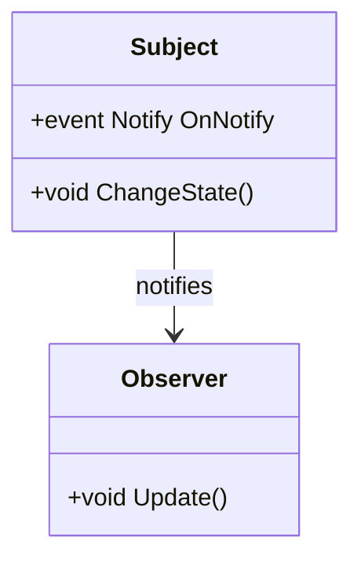

## 6.2 Observer Design Pattern

The Observer Design Pattern is a fundamental behavioral design pattern that establishes a one-to-many dependency between objects. This pattern is particularly useful when you need to ensure that multiple objects are updated automatically whenever a particular object changes state. In this section, we'll delve into the intricacies of the Observer Pattern, explore its implementation in C#, and examine its applications in various scenarios.

### Observer Pattern Description

The Observer Pattern is designed to decouple the subject (the object being observed) from its observers (the objects that need to be notified of changes). This decoupling promotes flexibility and reusability, allowing the subject and observers to evolve independently.

#### Intent

The primary intent of the Observer Pattern is to define a one-to-many dependency between objects so that when one object changes state, all its dependents are notified and updated automatically. This pattern is particularly useful in scenarios where a change in one object requires updates to multiple other objects.

#### Key Participants

1. **Subject**: The object that holds the state and notifies observers of changes.
2. **Observer**: The object that needs to be notified of changes in the subject.
3. **ConcreteSubject**: A concrete implementation of the subject.
4. **ConcreteObserver**: A concrete implementation of the observer.

### Implementing Observer in C#

In C#, the Observer Pattern can be implemented using delegates and events, which provide a robust mechanism for event-driven programming.

#### Using Delegates and Events

Delegates and events in C# are powerful constructs that facilitate the implementation of the Observer Pattern. Delegates are type-safe function pointers, while events provide a way to publish and subscribe to notifications.

```csharp
// Define a delegate for the event
public delegate void Notify();

// Subject class
public class Subject
{
    // Declare the event using the delegate
    public event Notify OnNotify;

    // Method to trigger the event
    public void ChangeState()
    {
        Console.WriteLine("Subject: State has changed.");
        OnNotify?.Invoke();
    }
}

// Observer class
public class Observer
{
    public void Update()
    {
        Console.WriteLine("Observer: Notified of state change.");
    }
}

// Usage
public class Program
{
    public static void Main()
    {
        Subject subject = new Subject();
        Observer observer = new Observer();

        // Subscribe the observer to the subject's event
        subject.OnNotify += observer.Update;

        // Change the state of the subject
        subject.ChangeState();
    }
}
```

In this example, the `Subject` class declares an event `OnNotify` using the `Notify` delegate. The `Observer` class has a method `Update` that gets called when the subject's state changes. The observer subscribes to the subject's event, and when the subject's state changes, the observer is notified.

#### Event Handling

C# provides a rich event handling mechanism that simplifies the implementation of the Observer Pattern. The .NET event pattern involves using delegates and events to create a publish-subscribe model.

##### Utilizing .NET Event Patterns

The .NET event pattern involves defining a delegate, declaring an event based on that delegate, and then raising the event when necessary. Observers subscribe to the event and provide a method that matches the delegate signature.

```csharp
// Define a delegate with event data
public delegate void NotifyEventHandler(object sender, EventArgs e);

// Subject class with event data
public class SubjectWithEventData
{
    // Declare the event using the delegate
    public event NotifyEventHandler OnNotify;

    // Method to trigger the event
    public void ChangeState()
    {
        Console.WriteLine("Subject: State has changed.");
        OnNotify?.Invoke(this, EventArgs.Empty);
    }
}

// Observer class with event data
public class ObserverWithEventData
{
    public void Update(object sender, EventArgs e)
    {
        Console.WriteLine("Observer: Notified of state change with event data.");
    }
}

// Usage
public class ProgramWithEventData
{
    public static void Main()
    {
        SubjectWithEventData subject = new SubjectWithEventData();
        ObserverWithEventData observer = new ObserverWithEventData();

        // Subscribe the observer to the subject's event
        subject.OnNotify += observer.Update;

        // Change the state of the subject
        subject.ChangeState();
    }
}
```

In this example, the `NotifyEventHandler` delegate includes event data, allowing observers to receive additional information about the event. The `ObserverWithEventData` class's `Update` method matches the delegate signature and handles the event.

### Event Aggregator Pattern

The Event Aggregator Pattern is an extension of the Observer Pattern that centralizes event management for decoupled communication. This pattern is particularly useful in complex systems where multiple components need to communicate without direct dependencies.

#### Centralizing Event Management

The Event Aggregator acts as a mediator that collects events from multiple sources and distributes them to interested subscribers. This centralization simplifies event handling and reduces coupling between components.

```csharp
// Event aggregator class
public class EventAggregator
{
    private readonly Dictionary<Type, List<Delegate>> _subscribers = new Dictionary<Type, List<Delegate>>();

    // Subscribe to an event
    public void Subscribe<T>(Action<T> handler)
    {
        if (!_subscribers.ContainsKey(typeof(T)))
        {
            _subscribers[typeof(T)] = new List<Delegate>();
        }
        _subscribers[typeof(T)].Add(handler);
    }

    // Publish an event
    public void Publish<T>(T eventMessage)
    {
        if (_subscribers.ContainsKey(typeof(T)))
        {
            foreach (var handler in _subscribers[typeof(T)])
            {
                ((Action<T>)handler)(eventMessage);
            }
        }
    }
}

// Event message class
public class StateChangeEvent
{
    public string Message { get; set; }
}

// Usage
public class ProgramWithEventAggregator
{
    public static void Main()
    {
        EventAggregator eventAggregator = new EventAggregator();

        // Subscribe to the event
        eventAggregator.Subscribe<StateChangeEvent>(e => Console.WriteLine($"Observer: {e.Message}"));

        // Publish the event
        eventAggregator.Publish(new StateChangeEvent { Message = "State has changed." });
    }
}
```

In this example, the `EventAggregator` class manages subscriptions and publications of events. The `StateChangeEvent` class represents an event message, and the `ProgramWithEventAggregator` class demonstrates subscribing to and publishing events.

### Use Cases and Examples

The Observer Pattern is widely used in various scenarios, including GUI frameworks and data binding.

#### GUI Frameworks

In GUI frameworks, the Observer Pattern is used to update the user interface in response to changes in the underlying data model. For example, when a user interacts with a UI element, the corresponding data model is updated, and the UI is refreshed automatically.

```csharp
// Model class
public class Model
{
    public event EventHandler DataChanged;

    private string _data;
    public string Data
    {
        get => _data;
        set
        {
            _data = value;
            DataChanged?.Invoke(this, EventArgs.Empty);
        }
    }
}

// View class
public class View
{
    public void Update(object sender, EventArgs e)
    {
        Console.WriteLine("View: Data has changed.");
    }
}

// Usage
public class ProgramWithGUI
{
    public static void Main()
    {
        Model model = new Model();
        View view = new View();

        // Subscribe the view to the model's event
        model.DataChanged += view.Update;

        // Change the data in the model
        model.Data = "New Data";
    }
}
```

In this example, the `Model` class represents the data model, and the `View` class represents the user interface. The `DataChanged` event notifies the view of changes in the model, allowing the UI to update automatically.

#### Data Binding

Data binding is another common use case for the Observer Pattern. In data binding, changes in the data source are automatically reflected in the UI, and vice versa.

```csharp
// Data source class
public class DataSource
{
    public event EventHandler DataUpdated;

    private string _data;
    public string Data
    {
        get => _data;
        set
        {
            _data = value;
            DataUpdated?.Invoke(this, EventArgs.Empty);
        }
    }
}

// Data consumer class
public class DataConsumer
{
    public void OnDataUpdated(object sender, EventArgs e)
    {
        Console.WriteLine("DataConsumer: Data has been updated.");
    }
}

// Usage
public class ProgramWithDataBinding
{
    public static void Main()
    {
        DataSource dataSource = new DataSource();
        DataConsumer dataConsumer = new DataConsumer();

        // Subscribe the data consumer to the data source's event
        dataSource.DataUpdated += dataConsumer.OnDataUpdated;

        // Update the data in the data source
        dataSource.Data = "Updated Data";
    }
}
```

In this example, the `DataSource` class represents the data source, and the `DataConsumer` class represents the consumer of the data. The `DataUpdated` event notifies the consumer of changes in the data source.

### Design Considerations

When implementing the Observer Pattern, consider the following design considerations:

- **Decoupling**: Ensure that the subject and observers are decoupled to promote flexibility and reusability.
- **Event Handling**: Use delegates and events to implement the Observer Pattern in C#, taking advantage of the .NET event pattern.
- **Event Aggregator**: Consider using the Event Aggregator Pattern for centralized event management in complex systems.
- **Performance**: Be mindful of the performance implications of notifying multiple observers, especially in systems with a large number of observers.

### Differences and Similarities

The Observer Pattern is often confused with the Publish-Subscribe Pattern. While both patterns involve notifying multiple subscribers of changes, the Observer Pattern is typically used for one-to-many dependencies within a single application, whereas the Publish-Subscribe Pattern is used for decoupled communication between different systems or components.

### Visualizing the Observer Pattern

To better understand the Observer Pattern, let's visualize the relationships between the subject and observers using a class diagram.



In this diagram, the `Subject` class has an event `OnNotify` that is triggered when the state changes. The `Observer` class subscribes to this event and is notified when the state changes.

### Try It Yourself

To deepen your understanding of the Observer Pattern, try modifying the code examples provided. For instance, you can:

- Add multiple observers to the subject and observe how they are all notified of state changes.
- Implement a more complex event message with additional data and see how it affects the observer's response.
- Experiment with the Event Aggregator Pattern by adding more event types and subscribers.

### Knowledge Check

Before we conclude, let's reinforce what we've learned with a few questions:

- What is the primary intent of the Observer Pattern?
- How does the Event Aggregator Pattern differ from the Observer Pattern?
- What are some common use cases for the Observer Pattern?

### Embrace the Journey

Remember, mastering design patterns is a journey. As you continue to explore and implement these patterns, you'll gain a deeper understanding of their nuances and applications. Keep experimenting, stay curious, and enjoy the journey!

## Quiz Time!



### What is the primary intent of the Observer Pattern?

- [x] To define a one-to-many dependency between objects so that when one object changes state, all its dependents are notified and updated automatically.
- [ ] To define a one-to-one dependency between objects.
- [ ] To define a many-to-one dependency between objects.
- [ ] To define a many-to-many dependency between objects.

> **Explanation:** The Observer Pattern is designed to establish a one-to-many dependency between objects, ensuring that when one object changes state, all its dependents are notified and updated automatically.

### How does the Event Aggregator Pattern differ from the Observer Pattern?

- [x] The Event Aggregator Pattern centralizes event management for decoupled communication.
- [ ] The Event Aggregator Pattern is used for one-to-one communication.
- [ ] The Event Aggregator Pattern is used for many-to-one communication.
- [ ] The Event Aggregator Pattern is used for many-to-many communication.

> **Explanation:** The Event Aggregator Pattern centralizes event management, allowing for decoupled communication between components, whereas the Observer Pattern establishes a direct one-to-many dependency.

### What are some common use cases for the Observer Pattern?

- [x] GUI frameworks and data binding.
- [ ] Database management.
- [ ] Network communication.
- [ ] File handling.

> **Explanation:** The Observer Pattern is commonly used in GUI frameworks and data binding to update the user interface in response to changes in the underlying data model.

### In C#, what constructs are used to implement the Observer Pattern?

- [x] Delegates and events.
- [ ] Classes and interfaces.
- [ ] Methods and properties.
- [ ] Variables and constants.

> **Explanation:** In C#, delegates and events are used to implement the Observer Pattern, providing a robust mechanism for event-driven programming.

### What is the role of the Subject in the Observer Pattern?

- [x] To hold the state and notify observers of changes.
- [ ] To observe changes in other objects.
- [ ] To manage event subscriptions.
- [ ] To handle user input.

> **Explanation:** The Subject in the Observer Pattern holds the state and notifies observers of changes, establishing a one-to-many dependency.

### What is the role of the Observer in the Observer Pattern?

- [x] To be notified of changes in the subject.
- [ ] To hold the state and notify other objects.
- [ ] To manage event subscriptions.
- [ ] To handle user input.

> **Explanation:** The Observer in the Observer Pattern is notified of changes in the subject and responds accordingly.

### How can you modify the Observer Pattern to include additional event data?

- [x] By using a delegate with event data.
- [ ] By using a class with properties.
- [ ] By using a method with parameters.
- [ ] By using a variable with a value.

> **Explanation:** You can modify the Observer Pattern to include additional event data by using a delegate with event data, allowing observers to receive more information about the event.

### What is a potential performance consideration when using the Observer Pattern?

- [x] Notifying multiple observers can impact performance.
- [ ] Observers cannot be notified of changes.
- [ ] The subject cannot change state.
- [ ] The pattern cannot be implemented in C#.

> **Explanation:** Notifying multiple observers can impact performance, especially in systems with a large number of observers.

### What is a key benefit of decoupling the subject and observers in the Observer Pattern?

- [x] It promotes flexibility and reusability.
- [ ] It simplifies the code.
- [ ] It increases the number of dependencies.
- [ ] It reduces the number of classes.

> **Explanation:** Decoupling the subject and observers promotes flexibility and reusability, allowing them to evolve independently.

### True or False: The Observer Pattern is only used in GUI frameworks.

- [ ] True
- [x] False

> **Explanation:** False. While the Observer Pattern is commonly used in GUI frameworks, it is also used in other scenarios, such as data binding and event-driven systems.


