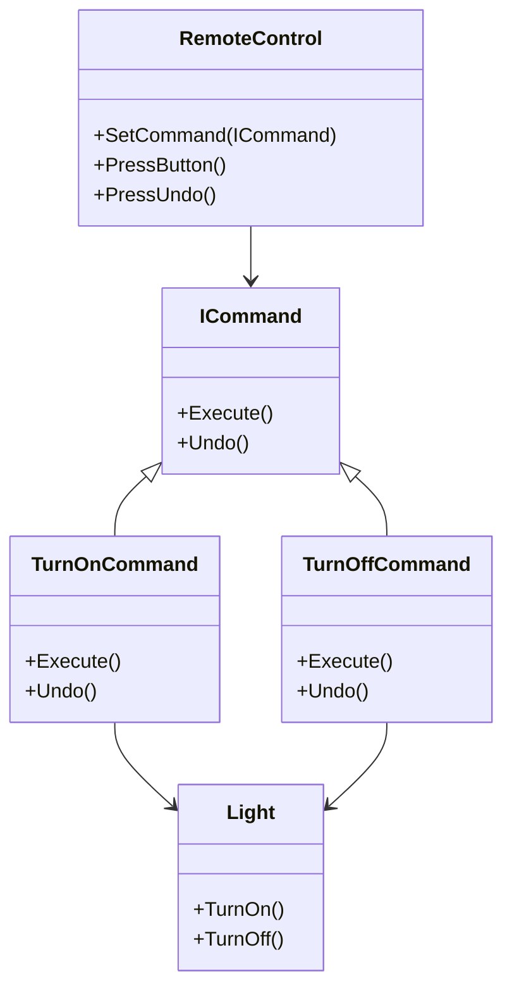

## 6.3 Command Design Pattern

The Command Design Pattern is a behavioral design pattern that encapsulates a request as an object, thereby allowing for parameterization of clients with queues, requests, and operations. This pattern decouples the sender of a request from its receiver by giving the sender a command object that encapsulates the request. This separation allows for more flexible and reusable code, as well as the ability to implement additional features such as undo/redo mechanisms.

### Command Pattern Description

The Command Pattern is one of the most versatile patterns in the Gang of Four (GoF) catalog. It is particularly useful in scenarios where you need to issue requests to objects without knowing anything about the operation being requested or the receiver of the request. This pattern is widely used in GUI applications, task scheduling, and macro recording.

#### Intent

The primary intent of the Command Pattern is to encapsulate a request as an object, allowing you to parameterize clients with different requests, queue or log requests, and support undoable operations.

#### Key Participants

1. **Command**: Declares an interface for executing an operation.
2. **ConcreteCommand**: Defines a binding between a Receiver object and an action. Implements the Execute method by invoking the corresponding operations on Receiver.
3. **Client**: Creates a ConcreteCommand object and sets its receiver.
4. **Invoker**: Asks the command to carry out the request.
5. **Receiver**: Knows how to perform the operations associated with carrying out a request.

### Implementing Command in C#

Let's delve into how we can implement the Command Pattern in C#. We'll start by defining the core components of the pattern.

#### Creating Command Classes for Actions

First, we define the `ICommand` interface, which declares the `Execute` method. This interface will be implemented by all concrete command classes.

```csharp
public interface ICommand
{
    void Execute();
}
```

Next, we create a `Light` class, which will act as the receiver of the command. It contains the actual logic that will be executed when the command is invoked.

```csharp
public class Light
{
    public void TurnOn()
    {
        Console.WriteLine("The light is on.");
    }

    public void TurnOff()
    {
        Console.WriteLine("The light is off.");
    }
}
```

Now, let's create concrete command classes that implement the `ICommand` interface. These classes will encapsulate the actions to be performed on the `Light` object.

```csharp
public class TurnOnCommand : ICommand
{
    private readonly Light _light;

    public TurnOnCommand(Light light)
    {
        _light = light;
    }

    public void Execute()
    {
        _light.TurnOn();
    }
}

public class TurnOffCommand : ICommand
{
    private readonly Light _light;

    public TurnOffCommand(Light light)
    {
        _light = light;
    }

    public void Execute()
    {
        _light.TurnOff();
    }
}
```

#### Commander Pattern

The Commander Pattern is an extension of the Command Pattern that involves managing a group of commands through a commander interface. This is particularly useful when you need to execute a sequence of commands or manage complex command interactions.

Let's create an `Invoker` class that will use the command objects to perform actions.

```csharp
public class RemoteControl
{
    private ICommand _command;

    public void SetCommand(ICommand command)
    {
        _command = command;
    }

    public void PressButton()
    {
        _command.Execute();
    }
}
```

#### Encapsulating Actions

By encapsulating actions in command objects, we decouple the sender (e.g., `RemoteControl`) from the receiver (e.g., `Light`). This allows us to change the command without affecting the sender or receiver.

```csharp
public class Program
{
    public static void Main()
    {
        Light livingRoomLight = new Light();
        ICommand turnOn = new TurnOnCommand(livingRoomLight);
        ICommand turnOff = new TurnOffCommand(livingRoomLight);

        RemoteControl remote = new RemoteControl();

        remote.SetCommand(turnOn);
        remote.PressButton();

        remote.SetCommand(turnOff);
        remote.PressButton();
    }
}
```

### Undo and Redo Mechanisms

One of the powerful features of the Command Pattern is its ability to support undo and redo operations. This is achieved by maintaining a history of executed commands and providing a mechanism to reverse their effects.

#### Implementing Reversible Operations

To implement undo functionality, we need to extend our `ICommand` interface to include an `Undo` method.

```csharp
public interface ICommand
{
    void Execute();
    void Undo();
}
```

We then modify our concrete command classes to implement the `Undo` method.

```csharp
public class TurnOnCommand : ICommand
{
    private readonly Light _light;

    public TurnOnCommand(Light light)
    {
        _light = light;
    }

    public void Execute()
    {
        _light.TurnOn();
    }

    public void Undo()
    {
        _light.TurnOff();
    }
}

public class TurnOffCommand : ICommand
{
    private readonly Light _light;

    public TurnOffCommand(Light light)
    {
        _light = light;
    }

    public void Execute()
    {
        _light.TurnOff();
    }

    public void Undo()
    {
        _light.TurnOn();
    }
}
```

We also need to modify our `RemoteControl` class to support undo operations.

```csharp
public class RemoteControl
{
    private ICommand _command;
    private Stack<ICommand> _commandHistory = new Stack<ICommand>();

    public void SetCommand(ICommand command)
    {
        _command = command;
    }

    public void PressButton()
    {
        _command.Execute();
        _commandHistory.Push(_command);
    }

    public void PressUndo()
    {
        if (_commandHistory.Count > 0)
        {
            ICommand command = _commandHistory.Pop();
            command.Undo();
        }
    }
}
```

### Use Cases and Examples

The Command Pattern is widely used in various applications, particularly in scenarios where actions need to be decoupled from the objects that trigger them. Here are some common use cases:

#### GUI Actions

In graphical user interfaces, the Command Pattern is often used to handle user actions such as button clicks. Each button can be associated with a command object that encapsulates the action to be performed.

#### Macro Recording

The Command Pattern can be used to record a sequence of actions and replay them later. This is useful in applications that support macro recording, such as text editors and graphic design tools.

#### Task Scheduling

In task scheduling systems, commands can be queued and executed at specific times or intervals. This allows for flexible scheduling of tasks without tightly coupling the scheduling logic with the task execution logic.

### Visualizing the Command Pattern

To better understand the Command Pattern, let's visualize the relationships between the key participants using a class diagram.



### Design Considerations

When implementing the Command Pattern, consider the following design considerations:

- **Granularity**: Determine the level of granularity for your commands. Fine-grained commands may lead to a large number of command classes, while coarse-grained commands may reduce flexibility.
- **Undo/Redo**: If your application requires undo/redo functionality, ensure that your command objects can reverse their actions.
- **Command Queuing**: If you need to queue commands, consider using data structures such as stacks or queues to manage the command history.

### Differences and Similarities

The Command Pattern is often confused with other behavioral patterns such as the Strategy Pattern and the Chain of Responsibility Pattern. Here are some key differences:

- **Command vs. Strategy**: The Command Pattern encapsulates a request as an object, while the Strategy Pattern encapsulates an algorithm. The Command Pattern is more focused on decoupling the sender and receiver, while the Strategy Pattern is focused on selecting an algorithm at runtime.
- **Command vs. Chain of Responsibility**: The Command Pattern encapsulates a request as an object, while the Chain of Responsibility Pattern passes a request along a chain of handlers. The Command Pattern is more focused on decoupling the sender and receiver, while the Chain of Responsibility Pattern is focused on allowing multiple handlers to process a request.

### Try It Yourself

To reinforce your understanding of the Command Pattern, try modifying the code examples provided in this section. Here are some suggestions:

- **Add New Commands**: Create additional command classes for different actions, such as dimming the light or changing its color.
- **Implement Redo**: Extend the `RemoteControl` class to support redo operations.
- **Queue Commands**: Modify the `RemoteControl` class to queue commands and execute them in sequence.

### Knowledge Check

Before moving on to the next section, take a moment to review the key concepts covered in this section. Here are some questions to test your understanding:

- What is the primary intent of the Command Pattern?
- How does the Command Pattern decouple the sender and receiver of a request?
- What are some common use cases for the Command Pattern?
- How can the Command Pattern be used to implement undo/redo functionality?

### Embrace the Journey

Remember, mastering design patterns is a journey. The Command Pattern is just one of many patterns that can help you build more flexible and maintainable software. As you continue to explore design patterns, keep experimenting, stay curious, and enjoy the journey!

## Quiz Time!



### What is the primary intent of the Command Pattern?

- [x] To encapsulate a request as an object, allowing for parameterization of clients with queues, requests, and operations.
- [ ] To encapsulate an algorithm as an object, allowing for dynamic selection of algorithms at runtime.
- [ ] To pass a request along a chain of handlers, allowing multiple handlers to process the request.
- [ ] To define a family of algorithms, encapsulate each one, and make them interchangeable.

> **Explanation:** The Command Pattern encapsulates a request as an object, allowing for parameterization of clients with queues, requests, and operations.

### Which of the following is a key participant in the Command Pattern?

- [x] Command
- [ ] Strategy
- [ ] Handler
- [ ] Observer

> **Explanation:** The Command Pattern includes key participants such as Command, ConcreteCommand, Client, Invoker, and Receiver.

### How does the Command Pattern decouple the sender and receiver of a request?

- [x] By encapsulating the request as an object and providing the sender with a command object that encapsulates the request.
- [ ] By passing the request along a chain of handlers, allowing multiple handlers to process the request.
- [ ] By defining a family of algorithms, encapsulating each one, and making them interchangeable.
- [ ] By using a mediator to coordinate interactions between objects.

> **Explanation:** The Command Pattern decouples the sender and receiver by encapsulating the request as an object and providing the sender with a command object that encapsulates the request.

### What is a common use case for the Command Pattern?

- [x] GUI actions
- [ ] Sorting algorithms
- [ ] Data validation
- [ ] Logging

> **Explanation:** The Command Pattern is commonly used in GUI applications to handle user actions such as button clicks.

### How can the Command Pattern be used to implement undo/redo functionality?

- [x] By maintaining a history of executed commands and providing a mechanism to reverse their effects.
- [ ] By passing the request along a chain of handlers, allowing multiple handlers to process the request.
- [ ] By defining a family of algorithms, encapsulating each one, and making them interchangeable.
- [ ] By using a mediator to coordinate interactions between objects.

> **Explanation:** The Command Pattern can implement undo/redo functionality by maintaining a history of executed commands and providing a mechanism to reverse their effects.

### What is the role of the Invoker in the Command Pattern?

- [x] To ask the command to carry out the request.
- [ ] To know how to perform the operations associated with carrying out a request.
- [ ] To declare an interface for executing an operation.
- [ ] To create a ConcreteCommand object and set its receiver.

> **Explanation:** The Invoker in the Command Pattern asks the command to carry out the request.

### Which pattern is often confused with the Command Pattern?

- [x] Strategy Pattern
- [ ] Singleton Pattern
- [ ] Observer Pattern
- [ ] Factory Pattern

> **Explanation:** The Command Pattern is often confused with the Strategy Pattern, as both involve encapsulating operations.

### What is a key difference between the Command Pattern and the Chain of Responsibility Pattern?

- [x] The Command Pattern encapsulates a request as an object, while the Chain of Responsibility Pattern passes a request along a chain of handlers.
- [ ] The Command Pattern defines a family of algorithms, encapsulates each one, and makes them interchangeable.
- [ ] The Command Pattern uses a mediator to coordinate interactions between objects.
- [ ] The Command Pattern is used for creating objects without specifying their concrete classes.

> **Explanation:** The Command Pattern encapsulates a request as an object, while the Chain of Responsibility Pattern passes a request along a chain of handlers.

### What is the purpose of the Undo method in the Command Pattern?

- [x] To reverse the effects of a command.
- [ ] To execute the command.
- [ ] To pass the request along a chain of handlers.
- [ ] To encapsulate an algorithm as an object.

> **Explanation:** The Undo method in the Command Pattern is used to reverse the effects of a command.

### True or False: The Command Pattern can be used to queue commands and execute them in sequence.

- [x] True
- [ ] False

> **Explanation:** The Command Pattern can be used to queue commands and execute them in sequence, providing flexibility in task scheduling.




