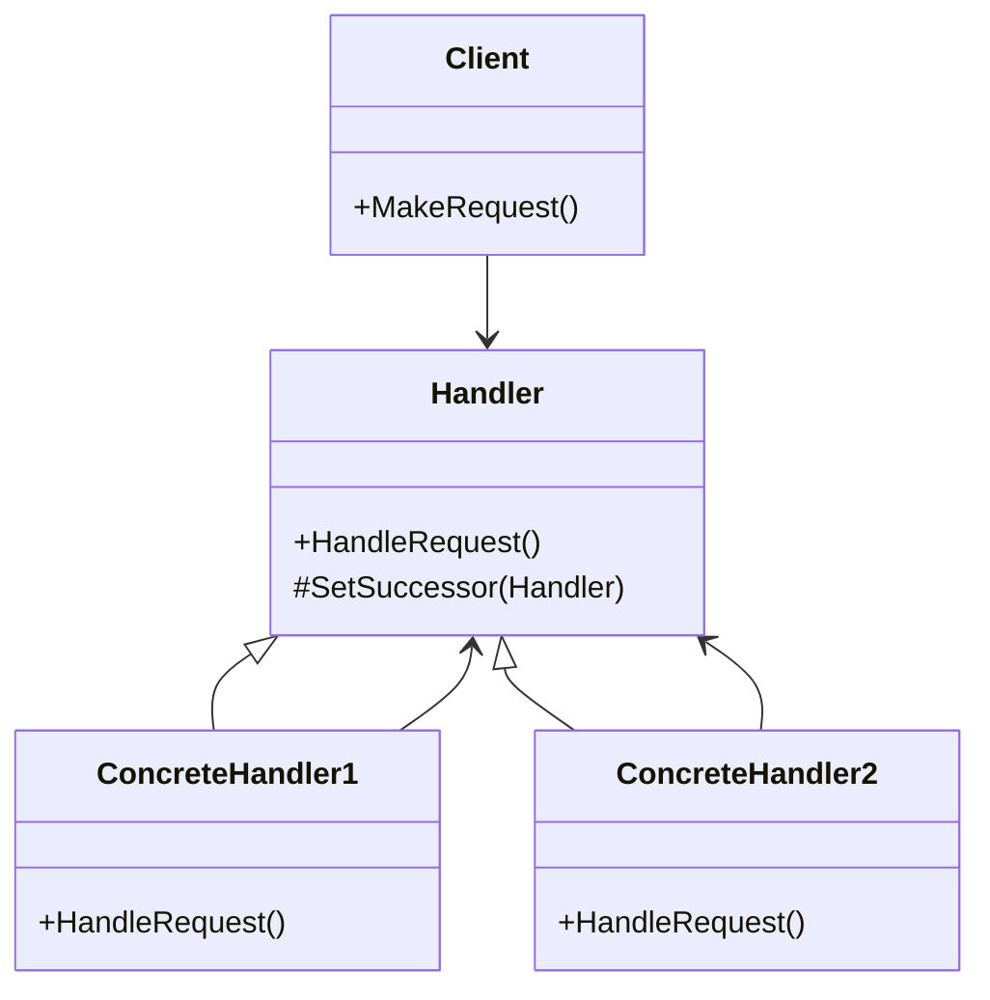

## 6.4 Chain of Responsibility Design Pattern

The Chain of Responsibility design pattern is a behavioral pattern that allows a request to be passed along a chain of handlers. Each handler in the chain has the opportunity to process the request or pass it to the next handler. This pattern is particularly useful for decoupling senders and receivers, providing flexibility in assigning responsibilities to objects dynamically.

### Chain of Responsibility Pattern Description

The Chain of Responsibility pattern is designed to decouple the sender of a request from its receivers by allowing multiple objects to handle the request. This is achieved by chaining the receiving objects and passing the request along the chain until an object handles it. This pattern promotes loose coupling and enhances flexibility in assigning responsibilities to objects.

#### Key Participants

1. **Handler**: Defines an interface for handling requests and optionally implements the successor link.
2. **ConcreteHandler**: Handles requests it is responsible for. It can access its successor and pass the request along the chain.
3. **Client**: Initiates the request to a handler in the chain.

#### Intent

The primary intent of the Chain of Responsibility pattern is to avoid coupling the sender of a request to its receiver by giving more than one object a chance to handle the request. The pattern chains the receiving objects and passes the request along the chain until an object handles it.

### Diagrams

To better understand the Chain of Responsibility pattern, let's visualize it using a class diagram:



**Diagram Description**: This class diagram illustrates the Chain of Responsibility pattern. The `Handler` class defines the interface for handling requests and managing successors. `ConcreteHandler1` and `ConcreteHandler2` are specific implementations that handle requests or pass them along the chain. The `Client` initiates the request.

### Implementing Chain of Responsibility in C#

Let's dive into implementing the Chain of Responsibility pattern in C#. We'll create a series of handlers that can process a request or pass it along the chain.

#### Setting Up Linked Handler Classes

First, we define an abstract `Handler` class that includes a method for handling requests and a method for setting the successor:

```csharp
public abstract class Handler
{
    protected Handler successor;

    public void SetSuccessor(Handler successor)
    {
        this.successor = successor;
    }

    public abstract void HandleRequest(int request);
}
```

Next, we create concrete handlers that extend the `Handler` class. Each handler will determine if it can process the request or pass it to the next handler:

```csharp
public class ConcreteHandler1 : Handler
{
    public override void HandleRequest(int request)
    {
        if (request >= 0 && request < 10)
        {
            Console.WriteLine($"{this.GetType().Name} handled request {request}");
        }
        else if (successor != null)
        {
            successor.HandleRequest(request);
        }
    }
}

public class ConcreteHandler2 : Handler
{
    public override void HandleRequest(int request)
    {
        if (request >= 10 && request < 20)
        {
            Console.WriteLine($"{this.GetType().Name} handled request {request}");
        }
        else if (successor != null)
        {
            successor.HandleRequest(request);
        }
    }
}
```

Finally, we set up the chain of handlers and make a request:

```csharp
public class Client
{
    public static void Main(string[] args)
    {
        Handler handler1 = new ConcreteHandler1();
        Handler handler2 = new ConcreteHandler2();

        handler1.SetSuccessor(handler2);

        int[] requests = { 5, 14, 22 };

        foreach (var request in requests)
        {
            handler1.HandleRequest(request);
        }
    }
}
```

**Explanation**: In this example, we have two concrete handlers, `ConcreteHandler1` and `ConcreteHandler2`, each responsible for handling specific ranges of requests. The client sets up the chain and sends requests to the first handler. If a handler cannot process a request, it passes the request to its successor.

### Handling Requests Dynamically

One of the key advantages of the Chain of Responsibility pattern is its ability to handle requests dynamically. This means that the decision of which handler processes a request can be made at runtime, allowing for flexible and adaptable systems.

#### Deciding Which Handler Processes a Request at Runtime

In some scenarios, you may want to add or remove handlers from the chain dynamically. This can be achieved by maintaining a list of handlers and iterating through them to process requests:

```csharp
public class DynamicHandlerChain
{
    private readonly List<Handler> handlers = new List<Handler>();

    public void AddHandler(Handler handler)
    {
        handlers.Add(handler);
    }

    public void HandleRequest(int request)
    {
        foreach (var handler in handlers)
        {
            handler.HandleRequest(request);
        }
    }
}
```

**Explanation**: The `DynamicHandlerChain` class maintains a list of handlers. You can add handlers to the chain at runtime, and the `HandleRequest` method iterates through the list to process requests.

### Guarded Suspension Pattern

The Guarded Suspension pattern is often used in conjunction with the Chain of Responsibility pattern to manage method execution based on object state. This pattern ensures that a method is executed only when certain conditions are met.

#### Managing Method Execution Based on Object State

In the context of the Chain of Responsibility pattern, the Guarded Suspension pattern can be used to ensure that a handler processes a request only if it is in the appropriate state:

```csharp
public class GuardedHandler : Handler
{
    private bool isReady = false;

    public void SetReady(bool ready)
    {
        isReady = ready;
    }

    public override void HandleRequest(int request)
    {
        if (isReady)
        {
            Console.WriteLine($"{this.GetType().Name} handled request {request}");
        }
        else if (successor != null)
        {
            successor.HandleRequest(request);
        }
    }
}
```

**Explanation**: The `GuardedHandler` class includes a `SetReady` method to change its state. The `HandleRequest` method checks the state before processing the request, ensuring that the handler is ready to handle it.

### Use Cases and Examples

The Chain of Responsibility pattern is widely used in various applications, including logging frameworks and exception handling.

#### Logging Frameworks

In logging frameworks, the Chain of Responsibility pattern can be used to pass log messages through a chain of loggers, each responsible for handling specific types of messages:

```csharp
public abstract class Logger
{
    protected Logger nextLogger;

    public void SetNextLogger(Logger nextLogger)
    {
        this.nextLogger = nextLogger;
    }

    public void LogMessage(int level, string message)
    {
        if (CanHandle(level))
        {
            Write(message);
        }
        else if (nextLogger != null)
        {
            nextLogger.LogMessage(level, message);
        }
    }

    protected abstract bool CanHandle(int level);
    protected abstract void Write(string message);
}

public class ConsoleLogger : Logger
{
    protected override bool CanHandle(int level)
    {
        return level <= 1;
    }

    protected override void Write(string message)
    {
        Console.WriteLine("Console Logger: " + message);
    }
}

public class FileLogger : Logger
{
    protected override bool CanHandle(int level)
    {
        return level <= 2;
    }

    protected override void Write(string message)
    {
        Console.WriteLine("File Logger: " + message);
    }
}
```

**Explanation**: In this example, we have a `Logger` class with two concrete implementations: `ConsoleLogger` and `FileLogger`. Each logger checks if it can handle the log message based on its level and writes the message if it can. Otherwise, it passes the message to the next logger in the chain.

#### Exception Handling

The Chain of Responsibility pattern can also be applied to exception handling, where different handlers are responsible for handling specific types of exceptions:

```csharp
public abstract class ExceptionHandler
{
    protected ExceptionHandler nextHandler;

    public void SetNextHandler(ExceptionHandler nextHandler)
    {
        this.nextHandler = nextHandler;
    }

    public void HandleException(Exception ex)
    {
        if (CanHandle(ex))
        {
            Process(ex);
        }
        else if (nextHandler != null)
        {
            nextHandler.HandleException(ex);
        }
    }

    protected abstract bool CanHandle(Exception ex);
    protected abstract void Process(Exception ex);
}

public class NullReferenceExceptionHandler : ExceptionHandler
{
    protected override bool CanHandle(Exception ex)
    {
        return ex is NullReferenceException;
    }

    protected override void Process(Exception ex)
    {
        Console.WriteLine("Handled NullReferenceException: " + ex.Message);
    }
}

public class ArgumentExceptionHandler : ExceptionHandler
{
    protected override bool CanHandle(Exception ex)
    {
        return ex is ArgumentException;
    }

    protected override void Process(Exception ex)
    {
        Console.WriteLine("Handled ArgumentException: " + ex.Message);
    }
}
```

**Explanation**: In this example, we have an `ExceptionHandler` class with two concrete implementations: `NullReferenceExceptionHandler` and `ArgumentExceptionHandler`. Each handler checks if it can handle the exception and processes it if it can. Otherwise, it passes the exception to the next handler in the chain.

### Design Considerations

When implementing the Chain of Responsibility pattern, consider the following design considerations:

- **Order of Handlers**: The order of handlers in the chain can affect the outcome. Ensure that handlers are ordered logically based on their responsibilities.
- **Termination**: Ensure that the chain terminates correctly. If no handler processes the request, consider implementing a default handler or returning an appropriate response.
- **Performance**: Be mindful of performance implications, especially if the chain is long or handlers are computationally expensive.

### Differences and Similarities

The Chain of Responsibility pattern is often compared to other patterns, such as the Command and Observer patterns. Here are some key differences and similarities:

- **Command Pattern**: The Command pattern encapsulates a request as an object, allowing for parameterization and queuing. The Chain of Responsibility pattern focuses on passing requests through a chain of handlers.
- **Observer Pattern**: The Observer pattern defines a one-to-many dependency between objects, where changes in one object trigger updates in others. The Chain of Responsibility pattern involves passing requests through a chain until one handles it.

### Try It Yourself

To deepen your understanding of the Chain of Responsibility pattern, try modifying the code examples provided:

- **Add a New Handler**: Create a new handler class and add it to the chain. Test how it affects the request handling process.
- **Change Handler Order**: Rearrange the order of handlers in the chain and observe how it impacts the outcome.
- **Dynamic Chain**: Implement a dynamic chain where handlers can be added or removed at runtime.

### Knowledge Check

Let's reinforce our understanding of the Chain of Responsibility pattern with some questions:

- What is the primary intent of the Chain of Responsibility pattern?
- How does the pattern promote loose coupling?
- What are some common use cases for the Chain of Responsibility pattern?
- How can the Guarded Suspension pattern be used with the Chain of Responsibility pattern?

### Embrace the Journey

Remember, mastering design patterns is a journey. The Chain of Responsibility pattern is just one of many tools in your software engineering toolkit. As you continue to explore and apply design patterns, you'll build more robust and flexible applications. Keep experimenting, stay curious, and enjoy the journey!

## Quiz Time!



### What is the primary intent of the Chain of Responsibility pattern?

- [x] To avoid coupling the sender of a request to its receiver by allowing multiple objects to handle the request.
- [ ] To encapsulate a request as an object, allowing for parameterization and queuing.
- [ ] To define a one-to-many dependency between objects.
- [ ] To manage method execution based on object state.

> **Explanation:** The Chain of Responsibility pattern aims to decouple the sender of a request from its receivers by allowing multiple objects to handle the request.

### How does the Chain of Responsibility pattern promote loose coupling?

- [x] By allowing requests to be passed along a chain of handlers.
- [ ] By encapsulating requests as objects.
- [ ] By defining a one-to-many dependency between objects.
- [ ] By managing method execution based on object state.

> **Explanation:** The pattern promotes loose coupling by allowing requests to be passed along a chain of handlers, decoupling the sender from the receiver.

### What is a common use case for the Chain of Responsibility pattern?

- [x] Logging frameworks.
- [ ] Data access.
- [ ] User interface design.
- [ ] Database management.

> **Explanation:** Logging frameworks are a common use case for the Chain of Responsibility pattern, where log messages are passed through a chain of loggers.

### How can the Guarded Suspension pattern be used with the Chain of Responsibility pattern?

- [x] By ensuring a handler processes a request only if it is in the appropriate state.
- [ ] By encapsulating requests as objects.
- [ ] By defining a one-to-many dependency between objects.
- [ ] By allowing requests to be passed along a chain of handlers.

> **Explanation:** The Guarded Suspension pattern ensures that a handler processes a request only if it is in the appropriate state.

### Which pattern is often compared to the Chain of Responsibility pattern?

- [x] Command Pattern.
- [ ] Singleton Pattern.
- [ ] Factory Pattern.
- [ ] Adapter Pattern.

> **Explanation:** The Command pattern is often compared to the Chain of Responsibility pattern, as both involve handling requests.

### What is a key difference between the Chain of Responsibility and Observer patterns?

- [x] The Chain of Responsibility involves passing requests through a chain until one handles it.
- [ ] The Observer pattern encapsulates a request as an object.
- [ ] The Chain of Responsibility defines a one-to-many dependency between objects.
- [ ] The Observer pattern allows multiple objects to handle a request.

> **Explanation:** The Chain of Responsibility involves passing requests through a chain until one handles it, while the Observer pattern defines a one-to-many dependency.

### What should be considered when implementing the Chain of Responsibility pattern?

- [x] Order of Handlers.
- [ ] Singleton Implementation.
- [ ] Factory Method.
- [ ] Adapter Usage.

> **Explanation:** The order of handlers in the chain can affect the outcome, so it should be considered when implementing the pattern.

### How can performance be impacted by the Chain of Responsibility pattern?

- [x] If the chain is long or handlers are computationally expensive.
- [ ] If requests are encapsulated as objects.
- [ ] If a one-to-many dependency is defined.
- [ ] If method execution is managed based on object state.

> **Explanation:** Performance can be impacted if the chain is long or handlers are computationally expensive.

### What is a benefit of using the Chain of Responsibility pattern?

- [x] It allows for flexible and adaptable systems.
- [ ] It defines a one-to-many dependency between objects.
- [ ] It encapsulates requests as objects.
- [ ] It manages method execution based on object state.

> **Explanation:** The pattern allows for flexible and adaptable systems by enabling dynamic request handling.

### True or False: The Chain of Responsibility pattern is used to encapsulate requests as objects.

- [ ] True
- [x] False

> **Explanation:** False. The Chain of Responsibility pattern is used to pass requests along a chain of handlers, not to encapsulate requests as objects.


