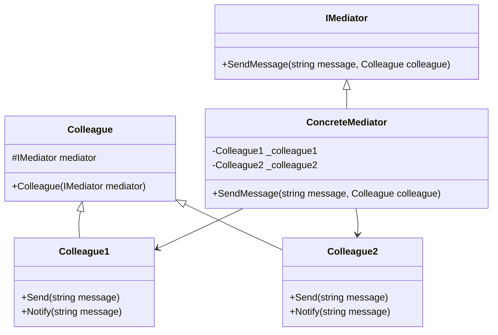

## 6.5 Mediator Design Pattern

The Mediator Design Pattern is a behavioral design pattern that defines an object, known as the mediator, to encapsulate how a set of objects interact. By centralizing complex communications and control logic, the Mediator pattern promotes loose coupling between objects, making systems easier to maintain and extend. In this section, we will explore the Mediator pattern in C#, its implementation, and its application in event-driven architectures.

### Mediator Pattern Description

The Mediator pattern is particularly useful in scenarios where multiple objects need to communicate with each other, but direct communication would lead to a tangled web of dependencies. By introducing a mediator, we can centralize the communication logic, allowing objects to interact indirectly through the mediator. This not only reduces dependencies but also enhances the flexibility and scalability of the system.

#### Key Participants

- **Mediator**: Defines an interface for communicating with Colleague objects.
- **ConcreteMediator**: Implements the Mediator interface and coordinates communication between Colleague objects.
- **Colleague**: Represents an object that communicates with other Colleagues through the Mediator.
- **ConcreteColleague**: Implements the Colleague interface and interacts with other Colleagues through the Mediator.

### Implementing Mediator in C#

Let's delve into how we can implement the Mediator pattern in C#. We'll start by defining the Mediator interface and then create a concrete implementation to manage the communication between Colleague objects.

#### Step 1: Define the Mediator Interface

The Mediator interface declares methods for communication between Colleague objects. Here's a simple example:

```csharp
public interface IMediator
{
    void SendMessage(string message, Colleague colleague);
}
```

#### Step 2: Implement the Concrete Mediator

The ConcreteMediator class implements the Mediator interface and manages the communication between Colleague objects. It maintains references to the Colleague objects and coordinates their interactions.

```csharp
public class ConcreteMediator : IMediator
{
    private Colleague1 _colleague1;
    private Colleague2 _colleague2;

    public Colleague1 Colleague1
    {
        set { _colleague1 = value; }
    }

    public Colleague2 Colleague2
    {
        set { _colleague2 = value; }
    }

    public void SendMessage(string message, Colleague colleague)
    {
        if (colleague == _colleague1)
        {
            _colleague2.Notify(message);
        }
        else
        {
            _colleague1.Notify(message);
        }
    }
}
```

#### Step 3: Define the Colleague Class

The Colleague class represents an object that communicates with other Colleagues through the Mediator. It holds a reference to the Mediator and uses it to send messages.

```csharp
public abstract class Colleague
{
    protected IMediator mediator;

    public Colleague(IMediator mediator)
    {
        this.mediator = mediator;
    }
}
```

#### Step 4: Implement Concrete Colleagues

ConcreteColleague classes implement the Colleague interface and interact with other Colleagues through the Mediator.

```csharp
public class Colleague1 : Colleague
{
    public Colleague1(IMediator mediator) : base(mediator) { }

    public void Send(string message)
    {
        Console.WriteLine("Colleague1 sends message: " + message);
        mediator.SendMessage(message, this);
    }

    public void Notify(string message)
    {
        Console.WriteLine("Colleague1 receives message: " + message);
    }
}

public class Colleague2 : Colleague
{
    public Colleague2(IMediator mediator) : base(mediator) { }

    public void Send(string message)
    {
        Console.WriteLine("Colleague2 sends message: " + message);
        mediator.SendMessage(message, this);
    }

    public void Notify(string message)
    {
        Console.WriteLine("Colleague2 receives message: " + message);
    }
}
```

#### Step 5: Demonstrate the Mediator Pattern

Now, let's see how these components work together in a simple demonstration:

```csharp
class Program
{
    static void Main(string[] args)
    {
        ConcreteMediator mediator = new ConcreteMediator();

        Colleague1 colleague1 = new Colleague1(mediator);
        Colleague2 colleague2 = new Colleague2(mediator);

        mediator.Colleague1 = colleague1;
        mediator.Colleague2 = colleague2;

        colleague1.Send("Hello, Colleague2!");
        colleague2.Send("Hi, Colleague1!");

        // Output:
        // Colleague1 sends message: Hello, Colleague2!
        // Colleague2 receives message: Hello, Colleague2!
        // Colleague2 sends message: Hi, Colleague1!
        // Colleague1 receives message: Hi, Colleague1!
    }
}
```

### Simplifying Object Communication

The Mediator pattern simplifies object communication by reducing dependencies between communicating objects. Instead of each object holding references to all other objects it needs to communicate with, it only holds a reference to the mediator. This reduces the complexity of the system and makes it easier to manage and extend.

#### Benefits of Simplifying Communication

- **Loose Coupling**: Objects are decoupled from each other, reducing dependencies and enhancing flexibility.
- **Centralized Control**: Communication logic is centralized in the mediator, making it easier to manage and modify.
- **Scalability**: Adding new Colleague objects or modifying existing ones becomes easier, as changes are localized to the mediator.

### Event-Driven Architecture

The Mediator pattern is well-suited for building systems based on event publishing and subscription, often referred to as event-driven architecture. In such systems, the mediator acts as an event bus, coordinating the flow of events between different components.

#### Implementing Event-Driven Architecture

To implement an event-driven architecture using the Mediator pattern, we can extend the mediator to handle events and subscriptions. Here's a simple example:

```csharp
public interface IEventMediator
{
    void PublishEvent(string eventName, object eventData);
    void Subscribe(string eventName, Action<object> handler);
}

public class EventMediator : IEventMediator
{
    private readonly Dictionary<string, List<Action<object>>> _eventHandlers = new();

    public void PublishEvent(string eventName, object eventData)
    {
        if (_eventHandlers.ContainsKey(eventName))
        {
            foreach (var handler in _eventHandlers[eventName])
            {
                handler(eventData);
            }
        }
    }

    public void Subscribe(string eventName, Action<object> handler)
    {
        if (!_eventHandlers.ContainsKey(eventName))
        {
            _eventHandlers[eventName] = new List<Action<object>>();
        }
        _eventHandlers[eventName].Add(handler);
    }
}
```

#### Demonstrating Event-Driven Architecture

Let's demonstrate how the EventMediator can be used to build an event-driven system:

```csharp
class Program
{
    static void Main(string[] args)
    {
        IEventMediator mediator = new EventMediator();

        mediator.Subscribe("OrderPlaced", data => Console.WriteLine("Order placed: " + data));
        mediator.Subscribe("OrderShipped", data => Console.WriteLine("Order shipped: " + data));

        mediator.PublishEvent("OrderPlaced", "Order #1234");
        mediator.PublishEvent("OrderShipped", "Order #1234");

        // Output:
        // Order placed: Order #1234
        // Order shipped: Order #1234
    }
}
```

### Use Cases and Examples

The Mediator pattern is widely used in various applications, including chat applications and UI component interactions.

#### Chat Applications

In chat applications, the Mediator pattern can be used to manage communication between users. Each user acts as a Colleague, and the chat server acts as the Mediator, coordinating messages between users.

#### UI Component Interactions

In UI applications, the Mediator pattern can be used to manage interactions between UI components. Each component acts as a Colleague, and the UI controller acts as the Mediator, coordinating interactions between components.

### Design Considerations

When implementing the Mediator pattern, consider the following design considerations:

- **Complexity**: While the Mediator pattern simplifies communication, it can introduce complexity if the mediator becomes too large or complex.
- **Performance**: Centralizing communication in the mediator can introduce performance bottlenecks if not managed properly.
- **Flexibility**: The Mediator pattern enhances flexibility by decoupling objects, but it can also make it harder to understand the flow of communication in the system.

### Differences and Similarities

The Mediator pattern is often confused with the Observer pattern, as both involve communication between objects. However, the key difference is that the Mediator pattern centralizes communication in a mediator, while the Observer pattern involves direct communication between observers and subjects.

### Try It Yourself

To deepen your understanding of the Mediator pattern, try modifying the code examples provided. For instance, add a new Colleague class and modify the ConcreteMediator to handle communication between three Colleague objects. Experiment with different communication scenarios and observe how the Mediator pattern simplifies the interactions.

### Visualizing the Mediator Pattern

To better understand the Mediator pattern, let's visualize the interactions between the Mediator and Colleague objects using a class diagram.



### Knowledge Check

- Explain the role of the Mediator in the Mediator pattern.
- Describe how the Mediator pattern promotes loose coupling.
- Discuss the benefits of using the Mediator pattern in event-driven architectures.
- Provide examples of applications where the Mediator pattern is useful.

### Embrace the Journey

Remember, mastering design patterns is a journey. As you progress, you'll build more complex and maintainable systems. Keep experimenting, stay curious, and enjoy the journey!

## Quiz Time!



### What is the primary role of the Mediator in the Mediator pattern?

- [x] To centralize communication between objects
- [ ] To act as a proxy for object interactions
- [ ] To manage object creation and destruction
- [ ] To enforce access control between objects

> **Explanation:** The Mediator centralizes communication between objects, reducing dependencies and promoting loose coupling.

### How does the Mediator pattern promote loose coupling?

- [x] By reducing direct dependencies between objects
- [ ] By enforcing strict type checking
- [ ] By using inheritance to share behavior
- [ ] By encapsulating object creation

> **Explanation:** The Mediator pattern reduces direct dependencies between objects by centralizing communication in a mediator.

### Which of the following is a benefit of using the Mediator pattern in event-driven architectures?

- [x] Centralized event handling
- [ ] Increased object coupling
- [ ] Simplified object creation
- [ ] Enhanced type safety

> **Explanation:** The Mediator pattern centralizes event handling, making it easier to manage and coordinate events in event-driven architectures.

### In a chat application, what role does the chat server play in the Mediator pattern?

- [x] Mediator
- [ ] Colleague
- [ ] Observer
- [ ] Subject

> **Explanation:** In a chat application, the chat server acts as the Mediator, coordinating communication between users.

### What is a potential drawback of the Mediator pattern?

- [x] The mediator can become a performance bottleneck
- [ ] It increases object coupling
- [ ] It complicates object creation
- [ ] It reduces system flexibility

> **Explanation:** The mediator can become a performance bottleneck if it centralizes too much communication.

### Which pattern is often confused with the Mediator pattern?

- [x] Observer pattern
- [ ] Singleton pattern
- [ ] Factory pattern
- [ ] Adapter pattern

> **Explanation:** The Mediator pattern is often confused with the Observer pattern, as both involve communication between objects.

### What is a key difference between the Mediator and Observer patterns?

- [x] The Mediator centralizes communication, while the Observer involves direct communication
- [ ] The Mediator uses inheritance, while the Observer uses composition
- [ ] The Mediator is a creational pattern, while the Observer is a structural pattern
- [ ] The Mediator enforces access control, while the Observer manages state

> **Explanation:** The Mediator centralizes communication in a mediator, while the Observer involves direct communication between observers and subjects.

### In the provided code example, what method does Colleague1 use to send a message?

- [x] Send
- [ ] Notify
- [ ] Publish
- [ ] Dispatch

> **Explanation:** Colleague1 uses the `Send` method to send a message through the mediator.

### What is the purpose of the `Notify` method in the Colleague classes?

- [x] To receive messages from the mediator
- [ ] To send messages to the mediator
- [ ] To initialize the mediator
- [ ] To subscribe to events

> **Explanation:** The `Notify` method is used to receive messages from the mediator.

### True or False: The Mediator pattern can be used to build event-driven systems.

- [x] True
- [ ] False

> **Explanation:** The Mediator pattern is well-suited for building event-driven systems, as it centralizes event handling and coordination.


