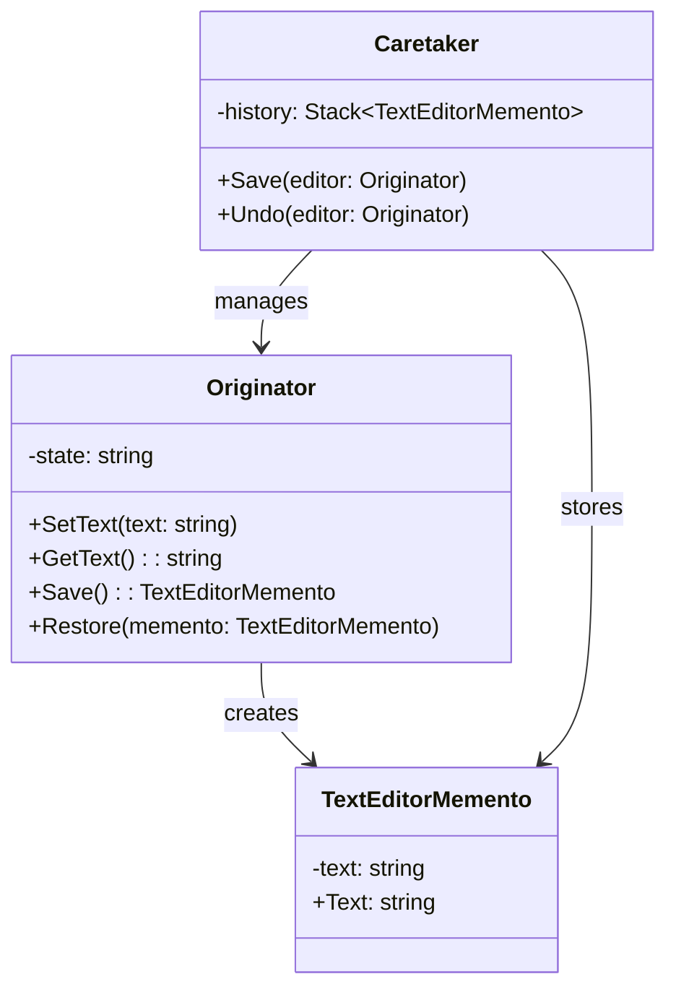

## 6.6 Memento Design Pattern

In the realm of software design patterns, the Memento Design Pattern stands out as a powerful tool for capturing and restoring an object's internal state without violating encapsulation. This pattern is particularly useful in scenarios where you need to implement undo capabilities or maintain a history of states for objects. In this comprehensive guide, we will delve deep into the Memento Design Pattern, exploring its concepts, implementation in C#, and real-world use cases.

### Memento Pattern Description

The Memento Design Pattern is a behavioral pattern that provides mechanisms for saving and restoring the state of an object. It allows an object to be restored to its previous state without exposing its internal structure. This is achieved by storing the state of the object in a separate object called a "memento." The key participants in this pattern are:

- **Originator**: The object whose state needs to be saved and restored.
- **Memento**: The object that stores the state of the Originator.
- **Caretaker**: The object responsible for managing the mementos, typically storing and retrieving them.

The Memento Pattern is particularly useful in applications such as text editors, where users may need to undo and redo changes, or in transactional systems where rollback capabilities are required.

### Implementing Memento in C#

Let's explore how to implement the Memento Design Pattern in C#. We'll start by defining the key components of the pattern and then provide a complete example.

#### Key Participants

1. **Originator**: This is the class whose state we want to save and restore. It creates a memento containing a snapshot of its current state and can use the memento to restore its state.

2. **Memento**: This class stores the state of the Originator. It is typically a simple class with properties to hold the state data.

3. **Caretaker**: This class is responsible for storing and managing mementos. It does not modify or inspect the contents of the memento.

#### Sample Code Snippet

Let's implement a simple text editor application that uses the Memento Design Pattern to provide undo functionality.

```csharp
// The Memento class stores the state of the Originator
public class TextEditorMemento
{
    public string Text { get; private set; }

    public TextEditorMemento(string text)
    {
        Text = text;
    }
}

// The Originator class
public class TextEditor
{
    private string _text;

    public void SetText(string text)
    {
        _text = text;
    }

    public string GetText()
    {
        return _text;
    }

    // Creates a memento containing a snapshot of the current state
    public TextEditorMemento Save()
    {
        return new TextEditorMemento(_text);
    }

    // Restores the state from a memento
    public void Restore(TextEditorMemento memento)
    {
        _text = memento.Text;
    }
}

// The Caretaker class
public class TextEditorHistory
{
    private Stack<TextEditorMemento> _history = new Stack<TextEditorMemento>();

    public void Save(TextEditor editor)
    {
        _history.Push(editor.Save());
    }

    public void Undo(TextEditor editor)
    {
        if (_history.Count > 0)
        {
            editor.Restore(_history.Pop());
        }
    }
}

// Usage
public class Program
{
    public static void Main()
    {
        TextEditor editor = new TextEditor();
        TextEditorHistory history = new TextEditorHistory();

        editor.SetText("Hello, World!");
        history.Save(editor);

        editor.SetText("Hello, C#!");
        history.Save(editor);

        editor.SetText("Hello, Design Patterns!");

        Console.WriteLine("Current Text: " + editor.GetText());

        history.Undo(editor);
        Console.WriteLine("After Undo: " + editor.GetText());

        history.Undo(editor);
        Console.WriteLine("After Second Undo: " + editor.GetText());
    }
}
```

In this example, the `TextEditor` class acts as the Originator, the `TextEditorMemento` class is the Memento, and the `TextEditorHistory` class is the Caretaker. The `TextEditor` class can save its state to a memento and restore it later. The `TextEditorHistory` class manages the mementos and provides undo functionality.

### State Saving and Restoration

The Memento Design Pattern is particularly useful for implementing undo capabilities. By saving snapshots of an object's state at various points in time, you can easily restore the object to a previous state. This is especially useful in applications where users need to revert changes or where transactions need to be rolled back.

#### Implementing Undo Capabilities

To implement undo capabilities using the Memento Pattern, follow these steps:

1. **Identify the Originator**: Determine the class whose state needs to be saved and restored.

2. **Create a Memento Class**: Define a class to store the state of the Originator. This class should have properties to hold the state data.

3. **Implement Save and Restore Methods**: In the Originator class, implement methods to create a memento and restore the state from a memento.

4. **Manage Mementos with a Caretaker**: Create a Caretaker class to manage the mementos. This class should provide methods to save and restore states.

5. **Integrate Undo Functionality**: Use the Caretaker class to provide undo functionality in your application.

### Use Cases and Examples

The Memento Design Pattern is widely used in various applications. Here are some common use cases:

1. **Text Editors**: In text editors, users often need to undo and redo changes. The Memento Pattern can be used to save the state of the document at different points in time, allowing users to revert to previous versions.

2. **Transactional Systems**: In transactional systems, it is important to maintain a history of states to support rollback capabilities. The Memento Pattern can be used to save the state of the system before a transaction is executed, allowing for rollback in case of failure.

3. **Game Development**: In games, the Memento Pattern can be used to save the state of the game at different checkpoints, allowing players to revert to a previous state if they make a mistake.

4. **Configuration Management**: In applications with complex configurations, the Memento Pattern can be used to save and restore configurations, allowing users to experiment with different settings and revert to a previous configuration if needed.

### Visualizing the Memento Pattern

To better understand the Memento Design Pattern, let's visualize the interaction between the key participants using a class diagram.



In this diagram, the `Originator` class creates and restores `TextEditorMemento` objects, while the `Caretaker` class manages the mementos.

### Design Considerations

When using the Memento Design Pattern, consider the following:

- **Encapsulation**: The Memento Pattern preserves encapsulation by not exposing the internal state of the Originator. The Memento class should only be accessible to the Originator and the Caretaker.

- **Memory Usage**: Storing multiple mementos can consume a significant amount of memory, especially if the state of the Originator is large. Consider using techniques such as compression or delta encoding to reduce memory usage.

- **Performance**: Creating and restoring mementos can be computationally expensive. Optimize the performance of your application by minimizing the number of mementos created and restored.

- **C# Specific Features**: In C#, you can use features such as serialization to simplify the implementation of the Memento Pattern. Consider using the `System.Runtime.Serialization` namespace to serialize and deserialize the state of the Originator.

### Differences and Similarities

The Memento Design Pattern is often compared to other patterns, such as:

- **Command Pattern**: Both the Memento and Command patterns can be used to implement undo functionality. However, the Command Pattern focuses on encapsulating a request as an object, while the Memento Pattern focuses on capturing and restoring the state of an object.

- **Prototype Pattern**: The Prototype Pattern involves creating a copy of an object, while the Memento Pattern involves saving and restoring the state of an object. The Memento Pattern is more suitable for scenarios where you need to maintain a history of states.

### Try It Yourself

To deepen your understanding of the Memento Design Pattern, try modifying the code example provided earlier. Here are some suggestions:

- **Add Redo Functionality**: Extend the `TextEditorHistory` class to support redo functionality. This will require maintaining a separate stack for redo operations.

- **Implement a GUI**: Create a simple graphical user interface (GUI) for the text editor application. Use buttons to trigger undo and redo operations.

- **Optimize Memory Usage**: Implement a mechanism to limit the number of mementos stored in the `TextEditorHistory` class. For example, you could use a circular buffer to store a fixed number of mementos.

### Knowledge Check

Before we conclude, let's summarize the key takeaways from this section:

- The Memento Design Pattern is used to capture and restore an object's state without violating encapsulation.
- The key participants in the pattern are the Originator, Memento, and Caretaker.
- The pattern is useful for implementing undo capabilities and maintaining a history of states.
- Considerations include encapsulation, memory usage, and performance.

### Embrace the Journey

Remember, mastering design patterns is a journey. As you continue to explore and apply the Memento Design Pattern, you'll gain a deeper understanding of its nuances and benefits. Keep experimenting, stay curious, and enjoy the process of learning and growing as a software engineer.

## Quiz Time!



### What is the primary purpose of the Memento Design Pattern?

- [x] To capture and restore an object's internal state without violating encapsulation.
- [ ] To encapsulate a request as an object.
- [ ] To define a family of algorithms and make them interchangeable.
- [ ] To provide a way to access the elements of an aggregate object sequentially.

> **Explanation:** The Memento Design Pattern is specifically designed to capture and restore an object's internal state without violating encapsulation.

### Which of the following is NOT a key participant in the Memento Design Pattern?

- [ ] Originator
- [ ] Memento
- [ ] Caretaker
- [x] Observer

> **Explanation:** The Observer is not a participant in the Memento Design Pattern. The key participants are the Originator, Memento, and Caretaker.

### In the Memento Design Pattern, what is the role of the Caretaker?

- [ ] To create and restore mementos.
- [x] To manage and store mementos.
- [ ] To expose the internal state of the Originator.
- [ ] To define a family of algorithms.

> **Explanation:** The Caretaker is responsible for managing and storing mementos, without modifying or inspecting their contents.

### How does the Memento Design Pattern preserve encapsulation?

- [x] By not exposing the internal state of the Originator.
- [ ] By using interfaces to define behavior.
- [ ] By allowing multiple inheritance.
- [ ] By using abstract classes.

> **Explanation:** The Memento Pattern preserves encapsulation by not exposing the internal state of the Originator. The Memento class is only accessible to the Originator and the Caretaker.

### Which of the following is a common use case for the Memento Design Pattern?

- [x] Implementing undo functionality in text editors.
- [ ] Defining a family of algorithms.
- [ ] Providing a way to access elements sequentially.
- [ ] Encapsulating a request as an object.

> **Explanation:** The Memento Pattern is commonly used to implement undo functionality in applications such as text editors.

### What is a potential drawback of using the Memento Design Pattern?

- [ ] It violates encapsulation.
- [x] It can consume a significant amount of memory.
- [ ] It does not support undo functionality.
- [ ] It requires multiple inheritance.

> **Explanation:** Storing multiple mementos can consume a significant amount of memory, especially if the state of the Originator is large.

### How can you optimize memory usage when using the Memento Design Pattern?

- [x] By using techniques such as compression or delta encoding.
- [ ] By exposing the internal state of the Originator.
- [ ] By using multiple inheritance.
- [ ] By defining a family of algorithms.

> **Explanation:** Techniques such as compression or delta encoding can be used to reduce memory usage when storing multiple mementos.

### What is the difference between the Memento and Command patterns?

- [x] The Memento Pattern captures and restores state, while the Command Pattern encapsulates a request.
- [ ] The Memento Pattern defines a family of algorithms, while the Command Pattern captures and restores state.
- [ ] The Memento Pattern provides a way to access elements sequentially, while the Command Pattern encapsulates a request.
- [ ] The Memento Pattern encapsulates a request, while the Command Pattern captures and restores state.

> **Explanation:** The Memento Pattern captures and restores an object's state, while the Command Pattern encapsulates a request as an object.

### Which C# feature can simplify the implementation of the Memento Pattern?

- [x] Serialization
- [ ] Multiple inheritance
- [ ] Interfaces
- [ ] Abstract classes

> **Explanation:** In C#, serialization can be used to simplify the implementation of the Memento Pattern by serializing and deserializing the state of the Originator.

### True or False: The Memento Pattern is suitable for maintaining a history of states in transactional systems.

- [x] True
- [ ] False

> **Explanation:** The Memento Pattern is suitable for maintaining a history of states, making it useful in transactional systems where rollback capabilities are required.


