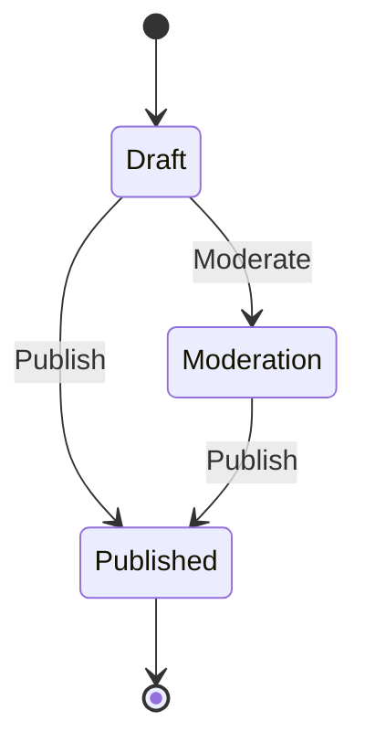

## 6.7 State Design Pattern

The State Design Pattern is a behavioral design pattern that allows an object to change its behavior when its internal state changes. This pattern is particularly useful in scenarios where an object must exhibit different behaviors depending on its current state, such as in workflow management or game state handling. In this section, we will explore the State Design Pattern in depth, focusing on its implementation in C#, managing object states, and practical use cases.

### State Design Pattern Description

The State Design Pattern is about encapsulating state-specific behavior and delegating behavior to the current state. This pattern is beneficial when an object must change its behavior at runtime depending on its state. By using the State Design Pattern, we can avoid large conditional statements and instead use polymorphism to achieve state-specific behavior.

#### Intent

The primary intent of the State Design Pattern is to allow an object to alter its behavior when its internal state changes. The object will appear to change its class, as different states are represented by different classes.

#### Key Participants

1. **Context**: Maintains an instance of a ConcreteState subclass that defines the current state.
2. **State**: Defines an interface for encapsulating the behavior associated with a particular state of the Context.
3. **ConcreteState**: Each subclass implements a behavior associated with a state of the Context.

### Implementing State in C#

To implement the State Design Pattern in C#, we encapsulate state-specific behavior in separate classes. The Context class maintains a reference to an instance of a State subclass, which represents the current state. The Context delegates state-specific behavior to this instance.

#### Encapsulating State-Specific Behavior in Classes

Let's consider a simple example of a `Document` class that can be in different states: Draft, Moderation, and Published. Each state will have different behaviors for actions like `Edit`, `Publish`, and `Moderate`.

```csharp
// State interface
public interface IDocumentState
{
    void Edit(Document context);
    void Publish(Document context);
    void Moderate(Document context);
}

// Concrete States
public class DraftState : IDocumentState
{
    public void Edit(Document context)
    {
        Console.WriteLine("Editing the document in Draft state.");
    }

    public void Publish(Document context)
    {
        Console.WriteLine("Publishing the document from Draft state.");
        context.SetState(new PublishedState());
    }

    public void Moderate(Document context)
    {
        Console.WriteLine("Cannot moderate a document in Draft state.");
    }
}

public class ModerationState : IDocumentState
{
    public void Edit(Document context)
    {
        Console.WriteLine("Editing the document in Moderation state.");
    }

    public void Publish(Document context)
    {
        Console.WriteLine("Publishing the document from Moderation state.");
        context.SetState(new PublishedState());
    }

    public void Moderate(Document context)
    {
        Console.WriteLine("Moderating the document.");
    }
}

public class PublishedState : IDocumentState
{
    public void Edit(Document context)
    {
        Console.WriteLine("Cannot edit a published document.");
    }

    public void Publish(Document context)
    {
        Console.WriteLine("Document is already published.");
    }

    public void Moderate(Document context)
    {
        Console.WriteLine("Cannot moderate a published document.");
    }
}

// Context
public class Document
{
    private IDocumentState _state;

    public Document(IDocumentState state)
    {
        _state = state;
    }

    public void SetState(IDocumentState state)
    {
        _state = state;
    }

    public void Edit()
    {
        _state.Edit(this);
    }

    public void Publish()
    {
        _state.Publish(this);
    }

    public void Moderate()
    {
        _state.Moderate(this);
    }
}
```

In this example, the `Document` class acts as the Context, and it maintains a reference to a `IDocumentState` instance. The `DraftState`, `ModerationState`, and `PublishedState` classes are ConcreteStates that implement the `IDocumentState` interface.

### Managing Object State

Managing object state involves transitioning between different states and ensuring that the object behaves correctly in each state. The State Design Pattern provides a structured way to manage these transitions and behaviors.

#### Transitioning Between Different States

The transition between states is typically handled by the ConcreteState classes themselves. Each state knows what the next state should be based on the actions performed.

```csharp
// Example usage
var document = new Document(new DraftState());

document.Edit();      // Output: Editing the document in Draft state.
document.Publish();   // Output: Publishing the document from Draft state.
document.Edit();      // Output: Cannot edit a published document.
```

In this example, the `Document` starts in the `DraftState`. When the `Publish` method is called, the state transitions to `PublishedState`, and subsequent calls to `Edit` reflect the behavior of the `PublishedState`.

### Use Cases and Examples

The State Design Pattern is widely used in scenarios where an object's behavior depends on its state. Some common use cases include:

- **Workflow Management**: Managing different stages of a workflow, such as approval processes.
- **Game State Handling**: Managing different states in a game, such as playing, paused, or game over.
- **UI Components**: Managing different states of UI components, such as enabled, disabled, or loading.

#### Workflow Management Example

Consider a workflow management system where a task can be in different states: To Do, In Progress, and Done. Each state has different behaviors for actions like `Start`, `Complete`, and `Reopen`.

```csharp
// State interface
public interface ITaskState
{
    void Start(Task context);
    void Complete(Task context);
    void Reopen(Task context);
}

// Concrete States
public class ToDoState : ITaskState
{
    public void Start(Task context)
    {
        Console.WriteLine("Starting the task.");
        context.SetState(new InProgressState());
    }

    public void Complete(Task context)
    {
        Console.WriteLine("Cannot complete a task that hasn't started.");
    }

    public void Reopen(Task context)
    {
        Console.WriteLine("Task is already in To Do state.");
    }
}

public class InProgressState : ITaskState
{
    public void Start(Task context)
    {
        Console.WriteLine("Task is already in progress.");
    }

    public void Complete(Task context)
    {
        Console.WriteLine("Completing the task.");
        context.SetState(new DoneState());
    }

    public void Reopen(Task context)
    {
        Console.WriteLine("Reopening the task.");
        context.SetState(new ToDoState());
    }
}

public class DoneState : ITaskState
{
    public void Start(Task context)
    {
        Console.WriteLine("Cannot start a completed task.");
    }

    public void Complete(Task context)
    {
        Console.WriteLine("Task is already completed.");
    }

    public void Reopen(Task context)
    {
        Console.WriteLine("Reopening the task.");
        context.SetState(new ToDoState());
    }
}

// Context
public class Task
{
    private ITaskState _state;

    public Task(ITaskState state)
    {
        _state = state;
    }

    public void SetState(ITaskState state)
    {
        _state = state;
    }

    public void Start()
    {
        _state.Start(this);
    }

    public void Complete()
    {
        _state.Complete(this);
    }

    public void Reopen()
    {
        _state.Reopen(this);
    }
}
```

In this example, the `Task` class acts as the Context, and it maintains a reference to an `ITaskState` instance. The `ToDoState`, `InProgressState`, and `DoneState` classes are ConcreteStates that implement the `ITaskState` interface.

### Visualizing the State Design Pattern

To better understand the State Design Pattern, let's visualize the transitions between states using a state diagram.



**Diagram Description**: This state diagram represents the transitions between different states of a `Document`. The document can transition from Draft to Moderation or Published, and from Moderation to Published.

### Design Considerations

When implementing the State Design Pattern, consider the following:

- **Complexity**: The pattern can increase the complexity of the codebase by introducing multiple classes for each state.
- **State Explosion**: If there are many states, the number of classes can grow significantly.
- **State Transition Logic**: Ensure that state transitions are well-defined and managed within the state classes.

### Differences and Similarities

The State Design Pattern is often confused with the Strategy Design Pattern. While both patterns use composition to change behavior, they differ in intent:

- **State Pattern**: Focuses on changing behavior based on the object's state.
- **Strategy Pattern**: Focuses on changing behavior by selecting a strategy.

### Try It Yourself

To deepen your understanding of the State Design Pattern, try modifying the code examples provided. Experiment with adding new states or actions and observe how the behavior changes. Consider implementing a state machine for a different domain, such as a vending machine or a traffic light system.

### Knowledge Check

- What is the primary intent of the State Design Pattern?
- How does the State Design Pattern differ from the Strategy Design Pattern?
- What are some common use cases for the State Design Pattern?

### Embrace the Journey

Remember, mastering design patterns is a journey. As you continue to explore and implement the State Design Pattern, you'll gain a deeper understanding of how to manage complex behaviors in your applications. Keep experimenting, stay curious, and enjoy the journey!

## Quiz Time!



### What is the primary intent of the State Design Pattern?

- [x] To allow an object to alter its behavior when its internal state changes.
- [ ] To encapsulate a family of algorithms.
- [ ] To define a one-to-many dependency between objects.
- [ ] To provide a way to access the elements of an aggregate object sequentially.

> **Explanation:** The State Design Pattern allows an object to change its behavior when its internal state changes.

### How does the State Design Pattern differ from the Strategy Design Pattern?

- [x] State focuses on changing behavior based on state, while Strategy focuses on selecting a strategy.
- [ ] State and Strategy are identical in implementation.
- [ ] State is used for one-to-many dependencies, while Strategy is not.
- [ ] State is used for encapsulating algorithms, while Strategy is not.

> **Explanation:** The State Pattern changes behavior based on the object's state, while the Strategy Pattern changes behavior by selecting a strategy.

### Which of the following is a common use case for the State Design Pattern?

- [x] Workflow management
- [ ] Sorting algorithms
- [ ] Data access
- [ ] Logging

> **Explanation:** The State Design Pattern is commonly used in workflow management to manage different stages of a process.

### In the State Design Pattern, what role does the Context play?

- [x] Maintains an instance of a ConcreteState subclass that defines the current state.
- [ ] Defines an interface for encapsulating behavior.
- [ ] Implements behavior associated with a state.
- [ ] Provides a way to access elements of an aggregate object.

> **Explanation:** The Context maintains an instance of a ConcreteState subclass that defines the current state.

### What is a potential drawback of using the State Design Pattern?

- [x] Increased complexity due to multiple classes for each state.
- [ ] Lack of flexibility in changing behavior.
- [ ] Difficulty in maintaining state transitions.
- [ ] Limited applicability to real-world scenarios.

> **Explanation:** The State Design Pattern can increase complexity by introducing multiple classes for each state.

### Which pattern is often confused with the State Design Pattern?

- [x] Strategy Pattern
- [ ] Observer Pattern
- [ ] Singleton Pattern
- [ ] Factory Pattern

> **Explanation:** The State Design Pattern is often confused with the Strategy Pattern due to their similar use of composition.

### What is the role of ConcreteState in the State Design Pattern?

- [x] Implements behavior associated with a state of the Context.
- [ ] Maintains an instance of a ConcreteState subclass.
- [ ] Defines an interface for encapsulating behavior.
- [ ] Provides a way to access elements of an aggregate object.

> **Explanation:** ConcreteState implements behavior associated with a state of the Context.

### How can state transitions be managed in the State Design Pattern?

- [x] By defining transitions within the ConcreteState classes.
- [ ] By using a separate transition manager.
- [ ] By hardcoding transitions in the Context class.
- [ ] By using a global state manager.

> **Explanation:** State transitions are typically managed within the ConcreteState classes.

### What is a benefit of using the State Design Pattern?

- [x] It avoids large conditional statements by using polymorphism.
- [ ] It simplifies the code by reducing the number of classes.
- [ ] It provides a way to access elements of an aggregate object.
- [ ] It encapsulates a family of algorithms.

> **Explanation:** The State Design Pattern avoids large conditional statements by using polymorphism to achieve state-specific behavior.

### True or False: The State Design Pattern is only applicable to UI components.

- [ ] True
- [x] False

> **Explanation:** The State Design Pattern is applicable to various domains, including workflow management, game state handling, and more.


