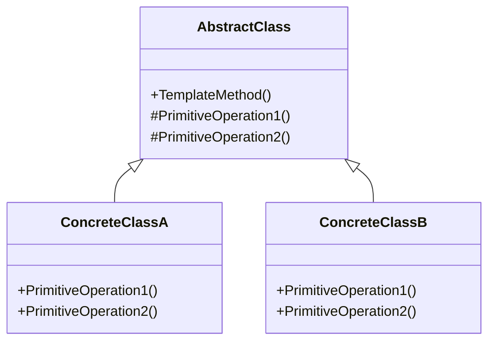

## 6.8 Template Method Design Pattern

In the realm of software design, the Template Method Design Pattern stands out as a quintessential behavioral pattern. It provides a framework for defining the skeleton of an algorithm, while allowing subclasses to redefine certain steps without altering the algorithm's overall structure. This pattern is particularly useful in scenarios where a general algorithm can be defined, but specific steps may vary depending on the context or subclass implementation.

### Template Method Pattern Description

The Template Method Pattern is a behavioral design pattern that defines the program skeleton of an algorithm in an operation, deferring some steps to subclasses. It allows subclasses to redefine certain steps of an algorithm without changing its structure. This pattern is instrumental in promoting code reuse and ensuring that the core logic remains intact while allowing flexibility in specific operations.

#### Key Participants

1. **Abstract Class**: Defines the template method and declares abstract methods that subclasses must implement.
2. **Concrete Class**: Implements the abstract methods defined in the abstract class. Each concrete class provides its own implementation of the steps.

#### Intent

The primary intent of the Template Method Pattern is to define the skeleton of an algorithm in a method, deferring some steps to subclasses. It lets subclasses redefine certain steps of an algorithm without changing the algorithm's structure.

### Diagrams

To better understand the Template Method Pattern, let's visualize it using a class diagram:



**Diagram Description**: The diagram illustrates the relationship between the abstract class and its concrete subclasses. The abstract class defines the `TemplateMethod`, which calls the primitive operations. The concrete classes implement these primitive operations.

### Implementing Template Method in C#

In C#, the Template Method Pattern is typically implemented using abstract classes and methods. Let's explore how to implement this pattern step by step.

#### Step 1: Define the Abstract Class

The abstract class contains the template method and abstract methods for the steps that need to be implemented by subclasses.

```csharp
public abstract class DataProcessor
{
    // Template method
    public void ProcessData()
    {
        ReadData();
        Process();
        SaveData();
    }

    // Abstract methods to be implemented by subclasses
    protected abstract void ReadData();
    protected abstract void Process();
    protected abstract void SaveData();
}
```

**Explanation**: The `DataProcessor` class defines the `ProcessData` method, which is the template method. It calls three abstract methods: `ReadData`, `Process`, and `SaveData`, which must be implemented by subclasses.

#### Step 2: Implement Concrete Classes

Concrete classes provide specific implementations for the abstract methods defined in the abstract class.

```csharp
public class CsvDataProcessor : DataProcessor
{
    protected override void ReadData()
    {
        Console.WriteLine("Reading data from CSV file.");
    }

    protected override void Process()
    {
        Console.WriteLine("Processing CSV data.");
    }

    protected override void SaveData()
    {
        Console.WriteLine("Saving processed CSV data.");
    }
}

public class XmlDataProcessor : DataProcessor
{
    protected override void ReadData()
    {
        Console.WriteLine("Reading data from XML file.");
    }

    protected override void Process()
    {
        Console.WriteLine("Processing XML data.");
    }

    protected override void SaveData()
    {
        Console.WriteLine("Saving processed XML data.");
    }
}
```

**Explanation**: The `CsvDataProcessor` and `XmlDataProcessor` classes implement the abstract methods from the `DataProcessor` class, providing specific behavior for reading, processing, and saving data.

### Defining Algorithm Steps

The Template Method Pattern allows for the definition of algorithm steps in a structured manner. By providing hooks for subclasses to override, it ensures that the algorithm's structure remains consistent while allowing flexibility in specific operations.

#### Hooks and Optional Steps

In addition to abstract methods, the Template Method Pattern can include hooks—optional methods that can be overridden by subclasses. Hooks provide additional flexibility and customization options.

```csharp
public abstract class ReportGenerator
{
    // Template method
    public void GenerateReport()
    {
        GatherData();
        AnalyzeData();
        if (IsDetailedReport())
        {
            GenerateDetailedReport();
        }
        else
        {
            GenerateSummaryReport();
        }
        PrintReport();
    }

    protected abstract void GatherData();
    protected abstract void AnalyzeData();
    protected virtual bool IsDetailedReport() => true;
    protected abstract void GenerateDetailedReport();
    protected abstract void GenerateSummaryReport();
    protected abstract void PrintReport();
}
```

**Explanation**: The `ReportGenerator` class includes a hook method `IsDetailedReport`, which can be overridden by subclasses to determine whether a detailed report should be generated.

### Use Cases and Examples

The Template Method Pattern is widely used in various scenarios, including data processing, report generation, and more. Let's explore some practical use cases and examples.

#### Use Case 1: Data Processing

In data processing applications, the Template Method Pattern can be used to define a common workflow for processing different types of data.

```csharp
public class JsonDataProcessor : DataProcessor
{
    protected override void ReadData()
    {
        Console.WriteLine("Reading data from JSON file.");
    }

    protected override void Process()
    {
        Console.WriteLine("Processing JSON data.");
    }

    protected override void SaveData()
    {
        Console.WriteLine("Saving processed JSON data.");
    }
}
```

**Explanation**: The `JsonDataProcessor` class extends the `DataProcessor` class, providing specific implementations for reading, processing, and saving JSON data.

#### Use Case 2: Report Generation

In report generation systems, the Template Method Pattern can be used to define a common structure for generating different types of reports.

```csharp
public class SalesReportGenerator : ReportGenerator
{
    protected override void GatherData()
    {
        Console.WriteLine("Gathering sales data.");
    }

    protected override void AnalyzeData()
    {
        Console.WriteLine("Analyzing sales data.");
    }

    protected override void GenerateDetailedReport()
    {
        Console.WriteLine("Generating detailed sales report.");
    }

    protected override void GenerateSummaryReport()
    {
        Console.WriteLine("Generating summary sales report.");
    }

    protected override void PrintReport()
    {
        Console.WriteLine("Printing sales report.");
    }
}
```

**Explanation**: The `SalesReportGenerator` class implements the abstract methods from the `ReportGenerator` class, providing specific behavior for generating sales reports.

### Design Considerations

When implementing the Template Method Pattern, consider the following design considerations:

- **When to Use**: Use the Template Method Pattern when you have a common algorithm structure with varying steps that can be implemented by subclasses.
- **Flexibility**: The pattern provides flexibility by allowing subclasses to override specific steps while maintaining the overall algorithm structure.
- **Code Reuse**: The pattern promotes code reuse by defining common behavior in the abstract class and allowing subclasses to provide specific implementations.
- **C# Features**: Utilize C# features such as abstract classes and methods to implement the pattern effectively.

### Differences and Similarities

The Template Method Pattern is often compared to other design patterns, such as the Strategy Pattern and the Factory Method Pattern. Let's explore the differences and similarities.

- **Template Method vs. Strategy**: The Template Method Pattern defines the skeleton of an algorithm in a method, while the Strategy Pattern defines a family of algorithms and encapsulates each one. The Template Method Pattern uses inheritance, whereas the Strategy Pattern uses composition.
- **Template Method vs. Factory Method**: The Template Method Pattern focuses on defining an algorithm's structure, while the Factory Method Pattern focuses on creating objects. The Template Method Pattern uses abstract methods for steps, whereas the Factory Method Pattern uses abstract methods for object creation.

### Try It Yourself

To deepen your understanding of the Template Method Pattern, try modifying the code examples provided. Experiment with adding new concrete classes, implementing additional hooks, or changing the algorithm structure. This hands-on approach will help reinforce the concepts and enhance your learning experience.

### Knowledge Check

Let's summarize the key takeaways from this section:

- The Template Method Pattern defines the skeleton of an algorithm, allowing subclasses to redefine specific steps.
- It promotes code reuse and flexibility by maintaining the overall algorithm structure while allowing customization in specific operations.
- The pattern is implemented using abstract classes and methods in C#.
- Use cases include data processing, report generation, and more.

Remember, mastering design patterns is a journey. Keep experimenting, stay curious, and enjoy the process of learning and applying these powerful tools in your software development projects.

## Quiz Time!



### What is the primary intent of the Template Method Pattern?

- [x] To define the skeleton of an algorithm, deferring some steps to subclasses.
- [ ] To encapsulate a family of algorithms and make them interchangeable.
- [ ] To provide a way to create objects without specifying the exact class.
- [ ] To allow an object to alter its behavior when its internal state changes.

> **Explanation:** The Template Method Pattern defines the skeleton of an algorithm, allowing subclasses to redefine specific steps without changing the overall structure.

### Which of the following is a key participant in the Template Method Pattern?

- [x] Abstract Class
- [ ] Singleton Class
- [ ] Adapter Class
- [ ] Proxy Class

> **Explanation:** The Abstract Class defines the template method and declares abstract methods that subclasses must implement.

### How is the Template Method Pattern typically implemented in C#?

- [x] Using abstract classes and methods.
- [ ] Using interfaces and delegates.
- [ ] Using sealed classes and static methods.
- [ ] Using concrete classes and virtual methods.

> **Explanation:** The Template Method Pattern is implemented using abstract classes and methods to define the algorithm's structure and allow subclasses to provide specific implementations.

### What is the role of hooks in the Template Method Pattern?

- [x] Hooks are optional methods that can be overridden by subclasses for additional customization.
- [ ] Hooks are mandatory methods that must be implemented by all subclasses.
- [ ] Hooks are static methods that provide default behavior for the algorithm.
- [ ] Hooks are private methods that cannot be accessed by subclasses.

> **Explanation:** Hooks are optional methods that provide additional flexibility and customization options for subclasses.

### Which pattern is often compared to the Template Method Pattern due to its use of inheritance?

- [x] Strategy Pattern
- [ ] Observer Pattern
- [ ] Factory Method Pattern
- [ ] Command Pattern

> **Explanation:** The Strategy Pattern is often compared to the Template Method Pattern, but it uses composition instead of inheritance.

### In which scenario would you use the Template Method Pattern?

- [x] When you have a common algorithm structure with varying steps that can be implemented by subclasses.
- [ ] When you need to create a family of related or dependent objects.
- [ ] When you want to provide a unified interface to a set of interfaces in a subsystem.
- [ ] When you need to decouple an abstraction from its implementation.

> **Explanation:** The Template Method Pattern is used when you have a common algorithm structure with steps that can vary in subclasses.

### What is a key benefit of using the Template Method Pattern?

- [x] It promotes code reuse by defining common behavior in the abstract class.
- [ ] It allows objects to be created without specifying the exact class.
- [ ] It provides a way to access the elements of an aggregate object sequentially.
- [ ] It defines a one-to-many dependency between objects.

> **Explanation:** The Template Method Pattern promotes code reuse by defining common behavior in the abstract class and allowing subclasses to provide specific implementations.

### How does the Template Method Pattern differ from the Factory Method Pattern?

- [x] The Template Method Pattern focuses on defining an algorithm's structure, while the Factory Method Pattern focuses on creating objects.
- [ ] The Template Method Pattern uses composition, while the Factory Method Pattern uses inheritance.
- [ ] The Template Method Pattern is used for behavioral patterns, while the Factory Method Pattern is used for structural patterns.
- [ ] The Template Method Pattern is used for concurrency, while the Factory Method Pattern is used for synchronization.

> **Explanation:** The Template Method Pattern focuses on defining an algorithm's structure, while the Factory Method Pattern focuses on creating objects.

### True or False: The Template Method Pattern uses composition to define the algorithm's structure.

- [ ] True
- [x] False

> **Explanation:** False. The Template Method Pattern uses inheritance to define the algorithm's structure, not composition.

### Which of the following is a common use case for the Template Method Pattern?

- [x] Report generation
- [ ] Event handling
- [ ] User authentication
- [ ] Network communication

> **Explanation:** Report generation is a common use case for the Template Method Pattern, where a common structure is defined for generating different types of reports.




