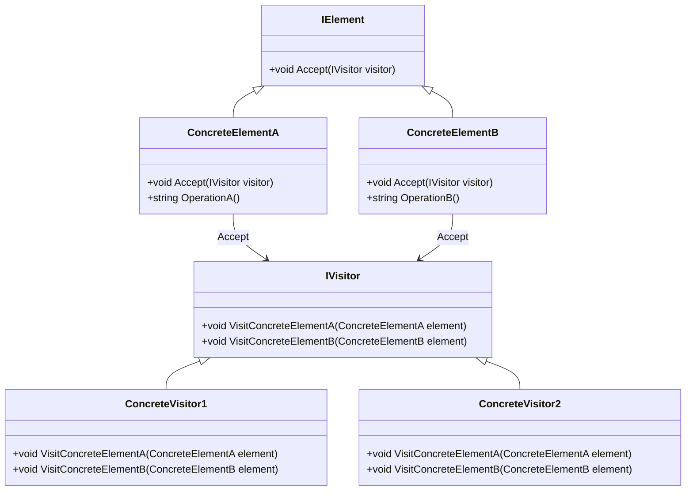

## 6.9 Visitor Design Pattern

The Visitor Design Pattern is a behavioral design pattern that allows you to add new operations to existing object structures without modifying the structures themselves. This pattern is particularly useful when you have a complex object structure and you need to perform various operations on these objects. By separating the operations from the objects, the Visitor Pattern promotes flexibility and maintainability in your codebase.

### Visitor Pattern Description

The Visitor Pattern involves two main components: the visitor and the elements it visits. The visitor is an object that implements an operation to be performed on elements of an object structure. The elements are the objects on which the operations are performed. This separation of concerns allows you to define new operations without changing the classes of the elements on which they operate.

#### Key Concepts

- **Double Dispatch**: The Visitor Pattern uses double dispatch to determine the correct method to invoke. This means that the operation to be performed depends on both the type of the visitor and the type of the element being visited.
- **Extensibility**: You can add new operations by simply creating new visitor classes, without altering the existing element classes.
- **Separation of Concerns**: By moving the operation logic out of the element classes and into visitor classes, you achieve a cleaner separation of concerns.

### Implementing Visitor in C#

Let's explore how to implement the Visitor Pattern in C#. We'll start by defining a simple object structure and then create a visitor to operate on it.

#### Step-by-Step Implementation

1. **Define the Element Interface**: The element interface declares an `Accept` method that takes a visitor as an argument.

```csharp
public interface IElement
{
    void Accept(IVisitor visitor);
}
```

2. **Create Concrete Elements**: Implement the element interface in concrete classes. Each class implements the `Accept` method to call the visitor's method corresponding to its type.

```csharp
public class ConcreteElementA : IElement
{
    public void Accept(IVisitor visitor)
    {
        visitor.VisitConcreteElementA(this);
    }

    public string OperationA()
    {
        return "ConcreteElementA";
    }
}

public class ConcreteElementB : IElement
{
    public void Accept(IVisitor visitor)
    {
        visitor.VisitConcreteElementB(this);
    }

    public string OperationB()
    {
        return "ConcreteElementB";
    }
}
```

3. **Define the Visitor Interface**: The visitor interface declares a visit operation for each type of concrete element.

```csharp
public interface IVisitor
{
    void VisitConcreteElementA(ConcreteElementA element);
    void VisitConcreteElementB(ConcreteElementB element);
}
```

4. **Create Concrete Visitors**: Implement the visitor interface in concrete classes. Each class implements the visit operations for the concrete elements.

```csharp
public class ConcreteVisitor1 : IVisitor
{
    public void VisitConcreteElementA(ConcreteElementA element)
    {
        Console.WriteLine($"{element.OperationA()} visited by ConcreteVisitor1");
    }

    public void VisitConcreteElementB(ConcreteElementB element)
    {
        Console.WriteLine($"{element.OperationB()} visited by ConcreteVisitor1");
    }
}

public class ConcreteVisitor2 : IVisitor
{
    public void VisitConcreteElementA(ConcreteElementA element)
    {
        Console.WriteLine($"{element.OperationA()} visited by ConcreteVisitor2");
    }

    public void VisitConcreteElementB(ConcreteElementB element)
    {
        Console.WriteLine($"{element.OperationB()} visited by ConcreteVisitor2");
    }
}
```

5. **Client Code**: The client code creates elements and visitors, and then applies the visitors to the elements.

```csharp
public class Client
{
    public static void Main(string[] args)
    {
        List<IElement> elements = new List<IElement>
        {
            new ConcreteElementA(),
            new ConcreteElementB()
        };

        IVisitor visitor1 = new ConcreteVisitor1();
        IVisitor visitor2 = new ConcreteVisitor2();

        foreach (var element in elements)
        {
            element.Accept(visitor1);
            element.Accept(visitor2);
        }
    }
}
```

### Operations on Object Structures

One of the primary benefits of the Visitor Pattern is its ability to add new operations to existing object structures without modifying the classes of the elements. This is particularly useful in scenarios where the object structure is stable, but the operations on it are subject to change.

#### Adding New Operations

To add a new operation, you simply create a new visitor class that implements the visitor interface. This new visitor can then be applied to the existing elements without any changes to their code.

### Acyclic Visitor Pattern

The Acyclic Visitor Pattern is a variation of the Visitor Pattern that avoids cyclic dependencies between the visitor and the elements. This is achieved by using interfaces and inheritance to decouple the visitor from the elements.

#### Implementing Non-Cyclic Visitor Structures

In the Acyclic Visitor Pattern, each element implements a specific visitor interface that corresponds to its type. This allows for greater flexibility and reduces the coupling between the visitor and the elements.

```csharp
public interface IVisitorA
{
    void Visit(ConcreteElementA element);
}

public interface IVisitorB
{
    void Visit(ConcreteElementB element);
}

public class AcyclicVisitor : IVisitorA, IVisitorB
{
    public void Visit(ConcreteElementA element)
    {
        Console.WriteLine($"{element.OperationA()} visited by AcyclicVisitor");
    }

    public void Visit(ConcreteElementB element)
    {
        Console.WriteLine($"{element.OperationB()} visited by AcyclicVisitor");
    }
}
```

### Use Cases and Examples

The Visitor Pattern is widely used in scenarios where you need to perform operations on a complex object structure. Some common use cases include:

- **Compilers**: The Visitor Pattern is often used in compilers to perform operations such as type checking, code generation, and optimization on abstract syntax trees.
- **Expression Evaluation**: In mathematical expression evaluation, the Visitor Pattern can be used to traverse and evaluate expressions represented as trees.

#### Example: Expression Evaluation

Let's consider a simple example of using the Visitor Pattern to evaluate mathematical expressions.

```csharp
public interface IExpression
{
    void Accept(IExpressionVisitor visitor);
}

public class Number : IExpression
{
    public int Value { get; }

    public Number(int value)
    {
        Value = value;
    }

    public void Accept(IExpressionVisitor visitor)
    {
        visitor.VisitNumber(this);
    }
}

public class Addition : IExpression
{
    public IExpression Left { get; }
    public IExpression Right { get; }

    public Addition(IExpression left, IExpression right)
    {
        Left = left;
        Right = right;
    }

    public void Accept(IExpressionVisitor visitor)
    {
        visitor.VisitAddition(this);
    }
}

public interface IExpressionVisitor
{
    void VisitNumber(Number number);
    void VisitAddition(Addition addition);
}

public class EvaluationVisitor : IExpressionVisitor
{
    public int Result { get; private set; }

    public void VisitNumber(Number number)
    {
        Result = number.Value;
    }

    public void VisitAddition(Addition addition)
    {
        addition.Left.Accept(this);
        int leftResult = Result;
        addition.Right.Accept(this);
        int rightResult = Result;
        Result = leftResult + rightResult;
    }
}

public class ExpressionClient
{
    public static void Main(string[] args)
    {
        IExpression expression = new Addition(new Number(5), new Number(3));
        EvaluationVisitor visitor = new EvaluationVisitor();
        expression.Accept(visitor);
        Console.WriteLine($"Result of expression: {visitor.Result}");
    }
}
```

### Design Considerations

When using the Visitor Pattern, consider the following:

- **Complexity**: The Visitor Pattern can introduce complexity, especially if the object structure is not stable or if there are many different types of elements.
- **Performance**: The use of double dispatch can have performance implications, particularly in performance-critical applications.
- **Flexibility**: The pattern provides flexibility in adding new operations, but at the cost of making it harder to add new element types.

### Differences and Similarities

The Visitor Pattern is often compared to other behavioral patterns, such as the Strategy Pattern and the Command Pattern. While all these patterns deal with encapsulating operations, the Visitor Pattern is unique in its ability to operate on a complex object structure without modifying the structure itself.

- **Visitor vs. Strategy**: The Strategy Pattern is used to encapsulate algorithms, while the Visitor Pattern is used to perform operations on object structures.
- **Visitor vs. Command**: The Command Pattern encapsulates a request as an object, whereas the Visitor Pattern encapsulates operations on object structures.

### Visualizing the Visitor Pattern

To better understand the Visitor Pattern, let's visualize the interaction between the elements and the visitors.



### Try It Yourself

Experiment with the Visitor Pattern by modifying the code examples provided. Try adding new operations by creating additional visitor classes, or introduce new element types and see how the pattern adapts.

### Knowledge Check

Before we conclude, let's reinforce what we've learned with a few questions:

- What is the primary benefit of using the Visitor Pattern?
- How does the Visitor Pattern achieve double dispatch?
- In what scenarios is the Visitor Pattern most useful?

### Embrace the Journey

Remember, mastering design patterns is a journey. The Visitor Pattern is just one tool in your toolbox, but it's a powerful one. As you continue to explore and experiment with design patterns, you'll find new ways to apply them to your projects. Keep learning, stay curious, and enjoy the journey!

## Quiz Time!



### What is the primary purpose of the Visitor Pattern?

- [x] To separate algorithms from the objects on which they operate
- [ ] To encapsulate a request as an object
- [ ] To define a family of algorithms
- [ ] To provide a way to access the elements of an aggregate object sequentially

> **Explanation:** The Visitor Pattern is designed to separate algorithms from the objects on which they operate, allowing new operations to be added without modifying the object structure.

### How does the Visitor Pattern achieve double dispatch?

- [x] By having the element call a method on the visitor, passing itself as an argument
- [ ] By using reflection to determine the type of the element
- [ ] By implementing a switch statement in the visitor
- [ ] By using a factory method to create the visitor

> **Explanation:** Double dispatch is achieved by having the element call a method on the visitor, passing itself as an argument, which allows the visitor to determine the type of the element.

### In which scenario is the Visitor Pattern most useful?

- [x] When you need to perform operations on a complex object structure
- [ ] When you need to encapsulate a request as an object
- [ ] When you need to define a family of algorithms
- [ ] When you need to provide a way to access the elements of an aggregate object sequentially

> **Explanation:** The Visitor Pattern is most useful when you need to perform operations on a complex object structure without modifying the structure itself.

### What is a potential drawback of the Visitor Pattern?

- [x] It can introduce complexity if the object structure is not stable
- [ ] It requires the use of reflection
- [ ] It cannot be used with interfaces
- [ ] It is not compatible with object-oriented programming

> **Explanation:** The Visitor Pattern can introduce complexity, especially if the object structure is not stable or if there are many different types of elements.

### How can you add a new operation using the Visitor Pattern?

- [x] By creating a new visitor class
- [ ] By modifying the existing element classes
- [ ] By adding a new method to the element interface
- [ ] By using a factory method to create the visitor

> **Explanation:** To add a new operation, you create a new visitor class that implements the visitor interface, without altering the existing element classes.

### What is the role of the `Accept` method in the Visitor Pattern?

- [x] It allows the visitor to perform an operation on the element
- [ ] It creates a new instance of the visitor
- [ ] It encapsulates a request as an object
- [ ] It defines a family of algorithms

> **Explanation:** The `Accept` method allows the visitor to perform an operation on the element by calling the appropriate method on the visitor.

### What is the difference between the Visitor Pattern and the Strategy Pattern?

- [x] The Visitor Pattern operates on object structures, while the Strategy Pattern encapsulates algorithms
- [ ] The Visitor Pattern encapsulates a request as an object, while the Strategy Pattern defines a family of algorithms
- [ ] The Visitor Pattern provides a way to access elements sequentially, while the Strategy Pattern separates algorithms
- [ ] The Visitor Pattern is used for concurrency, while the Strategy Pattern is used for encapsulation

> **Explanation:** The Visitor Pattern is used to perform operations on object structures, while the Strategy Pattern is used to encapsulate algorithms.

### What is the Acyclic Visitor Pattern?

- [x] A variation of the Visitor Pattern that avoids cyclic dependencies
- [ ] A pattern that encapsulates a request as an object
- [ ] A pattern that defines a family of algorithms
- [ ] A pattern that provides a way to access elements sequentially

> **Explanation:** The Acyclic Visitor Pattern is a variation that avoids cyclic dependencies between the visitor and the elements.

### Can the Visitor Pattern be used with interfaces?

- [x] True
- [ ] False

> **Explanation:** The Visitor Pattern can be used with interfaces, allowing for greater flexibility and decoupling between the visitor and the elements.

### What is the benefit of using double dispatch in the Visitor Pattern?

- [x] It allows the visitor to determine the type of the element and perform the appropriate operation
- [ ] It encapsulates a request as an object
- [ ] It defines a family of algorithms
- [ ] It provides a way to access elements sequentially

> **Explanation:** Double dispatch allows the visitor to determine the type of the element and perform the appropriate operation, enabling the separation of algorithms from the objects they operate on.


