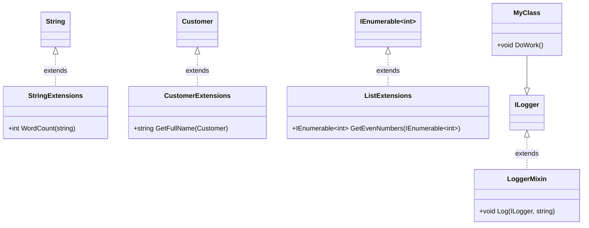

## 7.1 Extension Methods and Mixins

In the realm of C# programming, Extension Methods and Mixins stand out as powerful idiomatic patterns that allow developers to enhance and extend the functionality of existing classes without modifying their source code. This section delves into the intricacies of these patterns, providing expert software engineers and enterprise architects with the knowledge needed to leverage them effectively in their projects.

### Understanding Extension Methods

Extension Methods in C# are a feature that allows developers to add new methods to existing types without altering their definition. This is particularly useful when working with classes from external libraries or when you want to keep your codebase clean and maintainable by avoiding subclassing.

#### Implementing Extension Methods in C#

To implement an Extension Method, you need to define a static method in a static class. The first parameter of this method specifies the type it extends and is preceded by the `this` keyword. This syntax tells the C# compiler that the method is an extension of the specified type.

Here's a simple example to illustrate how Extension Methods work:

```csharp
using System;

namespace ExtensionMethodsDemo
{
    // Static class to hold extension methods
    public static class StringExtensions
    {
        // Extension method to count words in a string
        public static int WordCount(this string str)
        {
            return str.Split(new char[] { ' ', '.', '?' }, StringSplitOptions.RemoveEmptyEntries).Length;
        }
    }

    class Program
    {
        static void Main()
        {
            string sentence = "Hello, welcome to the world of C# programming!";
            // Using the extension method
            int wordCount = sentence.WordCount();
            Console.WriteLine($"Word Count: {wordCount}");
        }
    }
}
```

In this example, the `WordCount` method is added to the `string` type, allowing us to call it directly on any string instance. This enhances the functionality of the `string` class without modifying its original implementation.

#### Key Benefits of Extension Methods

- **Non-Intrusive**: Extension Methods allow you to add functionality to existing classes without altering their source code, making them ideal for extending library classes.
- **Readability**: They enable a more fluent and readable syntax, as methods can be called directly on the object they extend.
- **Encapsulation**: By keeping the extension methods in separate static classes, you maintain a clean separation of concerns.

### Use Cases and Examples

Extension Methods are particularly useful in scenarios where you need to enhance library classes or when you want to provide additional functionality to a class without subclassing. Let's explore some common use cases:

#### Enhancing Library Classes

Suppose you are working with a third-party library that provides a `Customer` class but lacks a method to format the customer's full name. You can easily add this functionality using an Extension Method:

```csharp
namespace CustomerExtensions
{
    public class Customer
    {
        public string FirstName { get; set; }
        public string LastName { get; set; }
    }

    public static class CustomerExtensions
    {
        public static string GetFullName(this Customer customer)
        {
            return $"{customer.FirstName} {customer.LastName}";
        }
    }
}
```

With this extension, you can now call `GetFullName` on any `Customer` instance, enhancing the class's functionality without modifying its original code.

#### Working with Collections

Extension Methods can also be used to add functionality to collections. For example, you might want to add a method to filter a list of integers to only include even numbers:

```csharp
using System.Collections.Generic;
using System.Linq;

namespace CollectionExtensions
{
    public static class ListExtensions
    {
        public static IEnumerable<int> GetEvenNumbers(this IEnumerable<int> numbers)
        {
            return numbers.Where(n => n % 2 == 0);
        }
    }
}
```

This method can be called on any `IEnumerable<int>` collection, providing a convenient way to filter even numbers.

### Mixins in C#

Mixins are a concept that allows you to combine properties and methods from multiple sources into a single object. While C# does not support mixins in the same way as some other languages, you can achieve similar functionality using interfaces and Extension Methods.

#### Implementing Mixins with Interfaces and Extension Methods

To implement mixins in C#, you can define an interface that specifies the methods and properties you want to include, and then use Extension Methods to provide the implementation.

Here's an example of how you might implement a simple logging mixin:

```csharp
using System;

namespace MixinDemo
{
    // Interface defining the logging functionality
    public interface ILogger
    {
    }

    // Static class providing the logging implementation
    public static class LoggerMixin
    {
        public static void Log(this ILogger logger, string message)
        {
            Console.WriteLine($"Log: {message}");
        }
    }

    // Class that uses the logging mixin
    public class MyClass : ILogger
    {
        public void DoWork()
        {
            this.Log("Work is being done.");
        }
    }

    class Program
    {
        static void Main()
        {
            MyClass myClass = new MyClass();
            myClass.DoWork();
        }
    }
}
```

In this example, `MyClass` implements the `ILogger` interface, allowing it to use the `Log` method provided by the `LoggerMixin` extension. This approach enables you to mix in functionality from multiple sources without using inheritance.

### Visualizing Extension Methods and Mixins

To better understand how Extension Methods and Mixins work, let's visualize their structure using a class diagram:



This diagram illustrates how Extension Methods extend existing classes and interfaces, providing additional functionality without modifying the original types.

### Design Considerations

When using Extension Methods and Mixins, it's important to consider the following:

- **Naming Conflicts**: Be mindful of potential naming conflicts with existing methods. Choose method names that are unlikely to clash with future updates to the extended class.
- **Performance**: Extension Methods are syntactic sugar and do not incur a performance penalty. However, be cautious when using them in performance-critical sections of your code.
- **Discoverability**: Since Extension Methods are not part of the original class, they may be less discoverable to developers unfamiliar with the codebase. Consider documenting them thoroughly.

### Differences and Similarities

Extension Methods and Mixins share some similarities, such as their ability to enhance existing types without modifying their source code. However, they differ in their implementation and use cases:

- **Extension Methods**: Primarily used to add methods to existing types, enhancing their functionality in a non-intrusive manner.
- **Mixins**: Achieved through interfaces and Extension Methods in C#, allowing you to combine functionality from multiple sources into a single class.

### Try It Yourself

To solidify your understanding of Extension Methods and Mixins, try modifying the code examples provided:

1. **Add a new Extension Method** to the `string` class that reverses the characters in a string.
2. **Create a new Mixin** that provides a method to calculate the area of a rectangle, and apply it to a class representing a rectangle.

### Knowledge Check

- **What are the key benefits of using Extension Methods in C#?**
- **How can you implement mixins in C#?**
- **What are some common use cases for Extension Methods?**

### Embrace the Journey

Remember, mastering Extension Methods and Mixins is just one step in your journey to becoming an expert C# developer. Keep experimenting with these patterns, explore their potential in your projects, and enjoy the process of enhancing your code with idiomatic C# techniques.

## Quiz Time!



### What is the primary purpose of Extension Methods in C#?

- [x] To add new methods to existing types without modifying their source code.
- [ ] To create new classes that inherit from existing ones.
- [ ] To replace existing methods in a class.
- [ ] To encapsulate data within a class.

> **Explanation:** Extension Methods allow developers to add new methods to existing types without altering their original implementation, enhancing functionality in a non-intrusive manner.

### How do you define an Extension Method in C#?

- [x] By creating a static method in a static class with the first parameter preceded by the `this` keyword.
- [ ] By creating a non-static method in a static class.
- [ ] By creating a static method in a non-static class.
- [ ] By creating a non-static method in a non-static class.

> **Explanation:** Extension Methods are defined as static methods in a static class, with the first parameter specifying the type to extend, preceded by the `this` keyword.

### Which of the following is a common use case for Extension Methods?

- [x] Enhancing library classes without inheritance.
- [ ] Creating new classes from scratch.
- [ ] Modifying the source code of existing classes.
- [ ] Replacing existing methods in a class.

> **Explanation:** Extension Methods are often used to enhance library classes by adding new functionality without modifying their source code or using inheritance.

### How can mixins be implemented in C#?

- [x] By using interfaces and Extension Methods to provide functionality.
- [ ] By using inheritance to combine multiple classes.
- [ ] By using static classes to encapsulate methods.
- [ ] By using abstract classes to define shared methods.

> **Explanation:** Mixins in C# can be implemented using interfaces to define the desired functionality and Extension Methods to provide the implementation.

### What is a potential drawback of using Extension Methods?

- [x] They may be less discoverable to developers unfamiliar with the codebase.
- [ ] They incur a significant performance penalty.
- [ ] They require modifying the source code of existing classes.
- [ ] They cannot be used with library classes.

> **Explanation:** Since Extension Methods are not part of the original class, they may be less discoverable to developers who are not familiar with the codebase, making thorough documentation important.

### Can Extension Methods be used to override existing methods in a class?

- [ ] Yes, they can replace existing methods.
- [x] No, they cannot override existing methods.
- [ ] Yes, but only in static classes.
- [ ] No, they can only be used with interfaces.

> **Explanation:** Extension Methods cannot override existing methods in a class; they can only add new methods.

### What is a key difference between Extension Methods and Mixins?

- [x] Extension Methods add methods to existing types, while Mixins combine functionality from multiple sources.
- [ ] Extension Methods are used for inheritance, while Mixins are used for encapsulation.
- [ ] Extension Methods modify source code, while Mixins do not.
- [ ] Extension Methods are less efficient than Mixins.

> **Explanation:** Extension Methods are used to add methods to existing types, while Mixins allow for combining functionality from multiple sources into a single class.

### Which keyword is used to specify the type being extended in an Extension Method?

- [x] this
- [ ] base
- [ ] override
- [ ] new

> **Explanation:** The `this` keyword is used in the first parameter of an Extension Method to specify the type being extended.

### Can Extension Methods be defined in non-static classes?

- [ ] Yes, they can be defined in any class.
- [x] No, they must be defined in static classes.
- [ ] Yes, but only if the class is sealed.
- [ ] No, they must be defined in abstract classes.

> **Explanation:** Extension Methods must be defined in static classes to be recognized by the C# compiler.

### True or False: Mixins in C# are implemented using inheritance.

- [ ] True
- [x] False

> **Explanation:** Mixins in C# are implemented using interfaces and Extension Methods, not inheritance.




