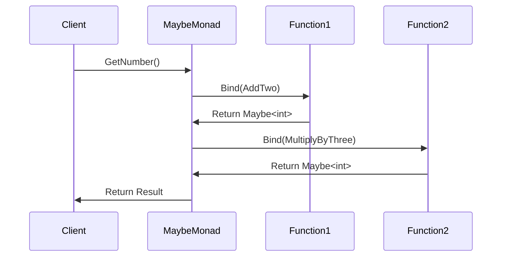

## 7.10 Monad Pattern

In the realm of functional programming, monads are a powerful abstraction that allows developers to handle computation patterns in a clean and elegant manner. In C#, understanding and implementing monads can significantly enhance your ability to write robust, maintainable, and expressive code. This section will guide you through the concept of monads, demonstrate how to implement the Maybe (Option) monad, explore functional composition techniques, and provide practical use cases and examples.

### Understanding Monads

#### Concept of Monads in Functional Programming

Monads are a design pattern used in functional programming to handle side effects, manage state, and sequence computations. They provide a way to wrap values and define how functions are applied to these wrapped values. A monad consists of three primary components:

1. **Type Constructor**: A way to wrap a value into a monadic context.
2. **Unit Function (also known as `return` or `pure`)**: A function that takes a value and returns it wrapped in a monad.
3. **Bind Function (also known as `flatMap` or `>>=`)**: A function that takes a monadic value and a function that returns a monadic value, and returns a new monadic value.

Monads allow for the chaining of operations while abstracting away the underlying complexity. This is particularly useful for handling operations like error handling, asynchronous programming, and state management.

#### Implementing the Maybe (Option) Monad

The Maybe monad, also known as the Option monad, is a common monad used to represent computations that might fail or return nothing. It encapsulates an optional value, which can either be `Some` (containing a value) or `None` (representing the absence of a value).

Let's implement a simple Maybe monad in C#:

```csharp
public abstract class Maybe<T>
{
    public static Maybe<T> Some(T value) => new Some<T>(value);
    public static Maybe<T> None() => new None<T>();

    public abstract Maybe<TResult> Bind<TResult>(Func<T, Maybe<TResult>> func);
}

public class Some<T> : Maybe<T>
{
    private readonly T _value;

    public Some(T value)
    {
        _value = value;
    }

    public override Maybe<TResult> Bind<TResult>(Func<T, Maybe<TResult>> func)
    {
        return func(_value);
    }
}

public class None<T> : Maybe<T>
{
    public override Maybe<TResult> Bind<TResult>(Func<T, Maybe<TResult>> func)
    {
        return new None<TResult>();
    }
}
```

In this implementation, the `Maybe<T>` class is an abstract class with a `Bind` method. The `Some<T>` class represents a value, while the `None<T>` class represents the absence of a value. The `Bind` method in `Some<T>` applies the function to the contained value, while in `None<T>`, it simply returns `None`.

### Functional Composition Techniques

#### Chaining Functions Together

Functional composition is the process of combining simple functions to build more complex ones. In C#, you can achieve this by chaining functions together using the `Bind` method of the monad. This allows you to sequence operations in a clean and readable manner.

Consider the following example where we chain operations using the Maybe monad:

```csharp
Maybe<int> GetNumber()
{
    return Maybe<int>.Some(5);
}

Maybe<int> AddTwo(int number)
{
    return Maybe<int>.Some(number + 2);
}

Maybe<int> MultiplyByThree(int number)
{
    return Maybe<int>.Some(number * 3);
}

var result = GetNumber()
    .Bind(AddTwo)
    .Bind(MultiplyByThree);

Console.WriteLine(result); // Output: Some(21)
```

In this example, we define three functions: `GetNumber`, `AddTwo`, and `MultiplyByThree`. We then chain these functions together using the `Bind` method, resulting in a computation that first adds two to the number and then multiplies the result by three.

#### Using LINQ for Sequence Operations

C#'s Language Integrated Query (LINQ) provides a powerful syntax for working with sequences and collections. You can leverage LINQ to work with monads by implementing the `SelectMany` method, which is the LINQ equivalent of the `Bind` method.

Here's how you can integrate LINQ with the Maybe monad:

```csharp
public static class MaybeExtensions
{
    public static Maybe<TResult> SelectMany<T, TResult>(
        this Maybe<T> maybe,
        Func<T, Maybe<TResult>> func)
    {
        return maybe.Bind(func);
    }
}

var result = from number in GetNumber()
             from added in AddTwo(number)
             from multiplied in MultiplyByThree(added)
             select multiplied;

Console.WriteLine(result); // Output: Some(21)
```

In this example, we define a `SelectMany` extension method for the Maybe monad, allowing us to use LINQ's query syntax to chain operations. This syntax can make the code more readable and expressive.

### Use Cases and Examples

#### Error Handling Without Exceptions

One of the primary use cases for the Maybe monad is error handling without exceptions. By using the Maybe monad, you can represent operations that might fail without resorting to exceptions, which can be costly in terms of performance.

Consider the following example where we use the Maybe monad for error handling:

```csharp
Maybe<int> ParseNumber(string input)
{
    if (int.TryParse(input, out int result))
    {
        return Maybe<int>.Some(result);
    }
    return Maybe<int>.None();
}

var input = "123";
var parsedNumber = ParseNumber(input)
    .Bind(AddTwo)
    .Bind(MultiplyByThree);

Console.WriteLine(parsedNumber); // Output: Some(375)
```

In this example, the `ParseNumber` function attempts to parse a string into an integer. If the parsing is successful, it returns `Some(result)`, otherwise, it returns `None`. This allows us to chain further operations without worrying about exceptions.

#### Managing Nullability Elegantly

The Maybe monad provides a clean way to handle nullability in C#. Instead of checking for `null` values explicitly, you can use the Maybe monad to represent optional values.

Here's an example of managing nullability using the Maybe monad:

```csharp
Maybe<string> GetUserName(int userId)
{
    // Simulate a user lookup
    if (userId == 1)
    {
        return Maybe<string>.Some("Alice");
    }
    return Maybe<string>.None();
}

var userName = GetUserName(1)
    .Bind(name => Maybe<string>.Some(name.ToUpper()));

Console.WriteLine(userName); // Output: Some(ALICE)
```

In this example, the `GetUserName` function returns a user's name if the user exists, otherwise, it returns `None`. We then chain an operation to convert the name to uppercase using the `Bind` method.

### Visualizing Monads

To better understand the flow of monadic operations, let's visualize the process using a sequence diagram:



This diagram illustrates the sequence of operations when chaining functions using the Maybe monad. The client initiates the process by calling `GetNumber`, which returns a `Maybe<int>`. The `Bind` method is then used to apply `AddTwo` and `MultiplyByThree` sequentially, resulting in the final monadic value.

### Design Considerations

When using the Monad pattern in C#, consider the following:

- **Readability**: Monads can make code more readable by abstracting away error handling and null checks. However, overuse or misuse can lead to complex and hard-to-understand code.
- **Performance**: While monads provide a clean abstraction, they can introduce overhead. Consider the performance implications, especially in performance-critical applications.
- **C# Features**: Leverage C# features like LINQ and extension methods to integrate monads seamlessly into your codebase.

### Differences and Similarities

Monads are often compared to other patterns like the Strategy pattern or the Chain of Responsibility pattern. While they share similarities in chaining operations, monads provide a more general-purpose abstraction for handling computation patterns, especially in functional programming contexts.

### Try It Yourself

To deepen your understanding of the Monad pattern, try modifying the code examples provided:

- Implement a `Maybe` monad for a different data type, such as `double` or `string`.
- Create a new function that uses the Maybe monad to handle a different computation, such as division or string concatenation.
- Experiment with LINQ's query syntax to chain operations in a more expressive manner.

### Knowledge Check

- What are the three primary components of a monad?
- How does the Maybe monad handle nullability in C#?
- What is the purpose of the `Bind` method in a monad?
- How can LINQ be used with monads in C#?

### Embrace the Journey

Remember, mastering the Monad pattern is just the beginning of your journey into functional programming with C#. As you progress, you'll discover more patterns and techniques that will enhance your ability to write clean, expressive, and maintainable code. Keep experimenting, stay curious, and enjoy the journey!

## Quiz Time!



### What are the three primary components of a monad?

- [x] Type Constructor, Unit Function, Bind Function
- [ ] Type Constructor, Map Function, Reduce Function
- [ ] Type Constructor, Filter Function, Bind Function
- [ ] Unit Function, Map Function, Reduce Function

> **Explanation:** A monad consists of a Type Constructor, a Unit Function (also known as `return` or `pure`), and a Bind Function (also known as `flatMap` or `>>=`).

### How does the Maybe monad handle nullability in C#?

- [x] By representing optional values as `Some` or `None`
- [ ] By throwing exceptions for null values
- [ ] By using nullable reference types
- [ ] By using default values

> **Explanation:** The Maybe monad represents optional values using `Some` for present values and `None` for absent values, providing a clean way to handle nullability.

### What is the purpose of the `Bind` method in a monad?

- [x] To chain operations by applying functions to monadic values
- [ ] To initialize a monadic value
- [ ] To convert a monadic value to a regular value
- [ ] To handle exceptions in monadic operations

> **Explanation:** The `Bind` method is used to chain operations by applying functions to monadic values, allowing for sequential computations.

### How can LINQ be used with monads in C#?

- [x] By implementing the `SelectMany` method for monads
- [ ] By using the `Select` method for monads
- [ ] By using the `Where` method for monads
- [ ] By using the `OrderBy` method for monads

> **Explanation:** LINQ can be used with monads by implementing the `SelectMany` method, which is the LINQ equivalent of the `Bind` method.

### Which of the following is a common use case for the Maybe monad?

- [x] Error handling without exceptions
- [ ] Sorting collections
- [ ] Filtering data
- [ ] Logging operations

> **Explanation:** The Maybe monad is commonly used for error handling without exceptions, allowing for clean and efficient handling of operations that might fail.

### What is the main advantage of using monads in functional programming?

- [x] They provide a clean abstraction for handling computation patterns
- [ ] They improve the performance of the code
- [ ] They simplify the syntax of the code
- [ ] They eliminate the need for functions

> **Explanation:** Monads provide a clean abstraction for handling computation patterns, such as error handling and state management, in functional programming.

### What is the role of the `Unit` function in a monad?

- [x] To wrap a value into a monadic context
- [ ] To unwrap a monadic value
- [ ] To apply a function to a monadic value
- [ ] To handle errors in monadic operations

> **Explanation:** The `Unit` function, also known as `return` or `pure`, is used to wrap a value into a monadic context.

### How does the Maybe monad differ from exception handling?

- [x] It represents failure as a value rather than an exception
- [ ] It uses exceptions to represent failure
- [ ] It does not handle failure at all
- [ ] It uses logging to represent failure

> **Explanation:** The Maybe monad represents failure as a value (`None`) rather than an exception, providing a more functional approach to error handling.

### What is the significance of the `Some` and `None` classes in the Maybe monad?

- [x] They represent the presence and absence of a value, respectively
- [ ] They represent different types of exceptions
- [ ] They are used for logging operations
- [ ] They are used for sorting collections

> **Explanation:** The `Some` class represents the presence of a value, while the `None` class represents the absence of a value in the Maybe monad.

### True or False: Monads are only useful in functional programming languages.

- [ ] True
- [x] False

> **Explanation:** False. While monads are a concept from functional programming, they can be applied in any language, including C#, to handle computation patterns and side effects.


