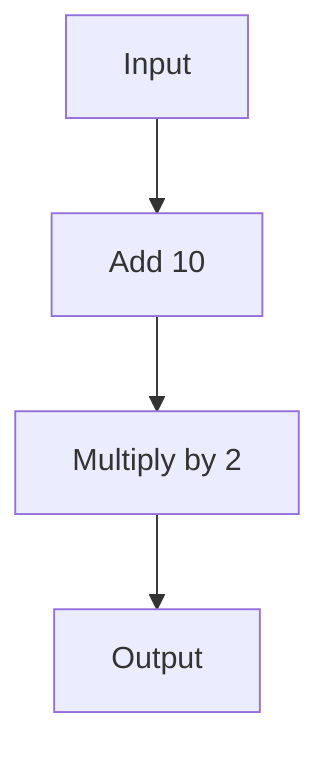

## 7.11 Function Composition Pattern

In the realm of software engineering, the ability to create modular, reusable, and maintainable code is paramount. The Function Composition Pattern in C# offers a powerful technique to achieve this by allowing developers to combine multiple functions into a single cohesive operation. This pattern is particularly useful for creating pipelines and designing modular functions that can be easily reused and adapted. In this comprehensive guide, we will delve into the intricacies of the Function Composition Pattern, explore its implementation in C#, and examine practical use cases and examples.

### Understanding Function Composition

Function composition is a mathematical concept that involves combining two or more functions to produce a new function. In programming, this concept translates into creating a function that applies multiple operations in sequence. The result of one function becomes the input for the next, forming a pipeline of operations.

#### Key Concepts

- **Modularity**: Function composition promotes modularity by breaking down complex operations into smaller, reusable functions.
- **Reusability**: Composed functions can be reused across different parts of an application, reducing code duplication.
- **Maintainability**: By separating concerns into distinct functions, code becomes easier to understand and maintain.

### Implementing Function Composition in C#

In C#, function composition can be implemented using delegates, lambda expressions, and LINQ (Language Integrated Query) expressions. These features allow developers to create flexible and powerful function compositions.

#### Using Delegates

Delegates in C# are type-safe function pointers that can be used to encapsulate methods. They provide a way to pass methods as arguments, making them ideal for function composition.

```csharp
// Define a delegate that takes an integer and returns an integer
delegate int Operation(int x);

// Define two simple functions
int Add(int x) => x + 10;
int Multiply(int x) => x * 2;

// Compose functions using delegates
Operation composedOperation = x => Multiply(Add(x));

// Test the composed function
int result = composedOperation(5); // Output: 30
Console.WriteLine(result);
```

In this example, we define two simple functions, `Add` and `Multiply`, and compose them using a delegate. The composed function first adds 10 to the input and then multiplies the result by 2.

#### Using LINQ Expressions

LINQ expressions provide a powerful way to query and manipulate data in C#. They can also be used for function composition by chaining operations together.

```csharp
using System;
using System.Linq;

class Program
{
    static void Main()
    {
        // Define a sequence of operations using LINQ
        Func<int, int> operations = x => new[] { x }
            .Select(Add)
            .Select(Multiply)
            .First();

        // Test the composed function
        int result = operations(5); // Output: 30
        Console.WriteLine(result);
    }

    static int Add(int x) => x + 10;
    static int Multiply(int x) => x * 2;
}
```

In this example, we use LINQ to compose the `Add` and `Multiply` functions. The `Select` method is used to apply each function in sequence, and the `First` method retrieves the final result.

### Use Cases and Examples

Function composition is a versatile pattern that can be applied in various scenarios. Let's explore some practical use cases and examples.

#### Creating Pipelines

One of the most common applications of function composition is creating pipelines. Pipelines allow data to flow through a series of transformations, making them ideal for processing streams of data.

```csharp
using System;
using System.Collections.Generic;
using System.Linq;

class Program
{
    static void Main()
    {
        // Define a list of numbers
        List<int> numbers = new List<int> { 1, 2, 3, 4, 5 };

        // Define a pipeline of operations
        Func<int, int> pipeline = x => new[] { x }
            .Select(Add)
            .Select(Multiply)
            .First();

        // Apply the pipeline to each number
        IEnumerable<int> results = numbers.Select(pipeline);

        // Output the results
        foreach (int result in results)
        {
            Console.WriteLine(result); // Output: 22, 24, 26, 28, 30
        }
    }

    static int Add(int x) => x + 10;
    static int Multiply(int x) => x * 2;
}
```

In this example, we define a pipeline of operations and apply it to a list of numbers. Each number is transformed by the pipeline, demonstrating the power of function composition for data processing.

#### Modular Function Design

Function composition encourages modular function design by allowing developers to break down complex operations into smaller, reusable functions.

```csharp
using System;

class Program
{
    static void Main()
    {
        // Define a composed function
        Func<int, int> composedFunction = Compose(Add, Multiply);

        // Test the composed function
        int result = composedFunction(5); // Output: 30
        Console.WriteLine(result);
    }

    static Func<T, T> Compose<T>(Func<T, T> f, Func<T, T> g)
    {
        return x => g(f(x));
    }

    static int Add(int x) => x + 10;
    static int Multiply(int x) => x * 2;
}
```

In this example, we define a generic `Compose` function that takes two functions as arguments and returns their composition. This approach promotes modularity and reusability.

### Visualizing Function Composition

To better understand function composition, let's visualize the process using a flowchart. The following diagram illustrates the flow of data through a composed function.



**Description**: This flowchart represents the function composition process, where the input is first transformed by the `Add` function and then by the `Multiply` function, resulting in the final output.

### Design Considerations

When implementing function composition in C#, consider the following design considerations:

- **Function Signature Compatibility**: Ensure that the output type of one function matches the input type of the next function in the composition.
- **Error Handling**: Implement error handling mechanisms to manage exceptions that may occur during function execution.
- **Performance**: Be mindful of performance implications, especially when composing a large number of functions or processing large datasets.

### Differences and Similarities with Other Patterns

Function composition shares similarities with other design patterns, such as the Chain of Responsibility Pattern, where operations are applied in sequence. However, function composition focuses on combining functions rather than objects or handlers.

### Try It Yourself

To deepen your understanding of function composition, try modifying the code examples to include additional operations or different data types. Experiment with composing functions that perform string manipulations, data filtering, or other transformations.

### Knowledge Check

- What is function composition, and how does it promote modularity?
- How can delegates be used to implement function composition in C#?
- What are some practical use cases for function composition?

### Embrace the Journey

Remember, mastering function composition is just one step in your journey to becoming a proficient C# developer. As you continue to explore and experiment with design patterns, you'll gain valuable insights and skills that will enhance your software development capabilities. Keep experimenting, stay curious, and enjoy the journey!

## Quiz Time!



### What is function composition in programming?

- [x] Combining multiple functions into a single function
- [ ] Creating a new class from existing classes
- [ ] Defining a function within another function
- [ ] Using functions to manipulate data structures

> **Explanation:** Function composition involves combining multiple functions into a single function, where the output of one function becomes the input for the next.

### Which C# feature is commonly used for function composition?

- [x] Delegates
- [ ] Interfaces
- [ ] Abstract Classes
- [ ] Enums

> **Explanation:** Delegates in C# are type-safe function pointers that can be used to encapsulate methods, making them ideal for function composition.

### What is a key benefit of function composition?

- [x] Modularity
- [ ] Increased code complexity
- [ ] Reduced code readability
- [ ] Decreased performance

> **Explanation:** Function composition promotes modularity by breaking down complex operations into smaller, reusable functions.

### How can LINQ be used in function composition?

- [x] By chaining operations together
- [ ] By defining new data types
- [ ] By creating new classes
- [ ] By implementing interfaces

> **Explanation:** LINQ expressions can be used for function composition by chaining operations together, allowing for flexible and powerful data manipulation.

### What is a common use case for function composition?

- [x] Creating pipelines
- [ ] Defining new classes
- [ ] Implementing interfaces
- [ ] Managing memory

> **Explanation:** Function composition is commonly used to create pipelines, where data flows through a series of transformations.

### What should be considered when implementing function composition?

- [x] Function signature compatibility
- [ ] Class inheritance
- [ ] Interface implementation
- [ ] Memory allocation

> **Explanation:** When implementing function composition, ensure that the output type of one function matches the input type of the next function in the composition.

### How does function composition relate to the Chain of Responsibility Pattern?

- [x] Both apply operations in sequence
- [ ] Both focus on object creation
- [ ] Both involve data storage
- [ ] Both require inheritance

> **Explanation:** Function composition and the Chain of Responsibility Pattern both involve applying operations in sequence, but function composition focuses on combining functions.

### What is a potential drawback of function composition?

- [x] Performance implications
- [ ] Increased code readability
- [ ] Enhanced modularity
- [ ] Simplified error handling

> **Explanation:** Be mindful of performance implications, especially when composing a large number of functions or processing large datasets.

### Can function composition be used with different data types?

- [x] True
- [ ] False

> **Explanation:** Function composition can be used with different data types, as long as the function signatures are compatible.

### What is the purpose of the `Compose` function in the example?

- [x] To combine two functions into a single function
- [ ] To define a new class
- [ ] To create a data structure
- [ ] To implement an interface

> **Explanation:** The `Compose` function takes two functions as arguments and returns their composition, promoting modularity and reusability.


