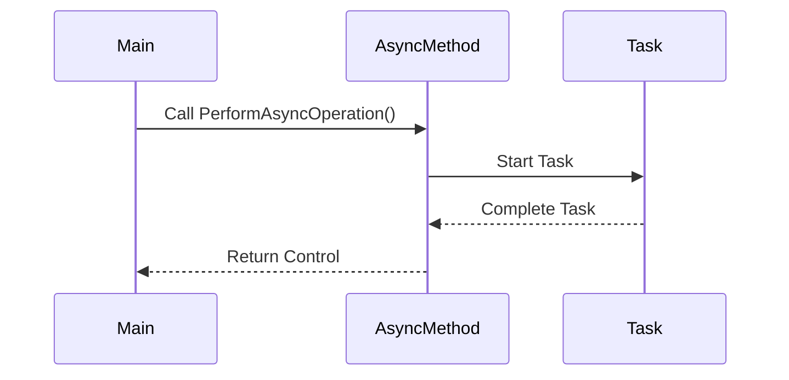

## 7.2 Async/Await and Task-Based Patterns

In the modern landscape of software development, asynchronous programming has become a cornerstone for building responsive and efficient applications. C# provides robust support for asynchronous operations through the `async` and `await` keywords, which simplify the process of writing asynchronous code. This section delves into the intricacies of async/await and task-based patterns in C#, offering expert insights into their implementation, use cases, and best practices.

### Understanding Asynchronous Programming

Asynchronous programming allows a program to perform tasks concurrently without blocking the execution of other operations. This is particularly useful in scenarios where tasks involve waiting for external resources, such as network requests or file I/O operations. By leveraging asynchronous programming, applications can remain responsive and efficient, even when performing long-running tasks.

#### The Evolution of Asynchronous Programming in C#

Before the introduction of async/await, developers relied on callback methods and event-based asynchronous patterns (EAP) to handle asynchronous operations. These approaches, while functional, often led to complex and hard-to-maintain code. The introduction of the Task Parallel Library (TPL) and the async/await syntax in C# 5.0 revolutionized asynchronous programming by providing a more intuitive and readable way to manage asynchronous tasks.

### Implementing Asynchronous Code with Async/Await

The `async` and `await` keywords are central to writing asynchronous code in C#. They enable developers to write code that looks synchronous while executing asynchronously. This section explores how to implement asynchronous code using these keywords.

#### The `async` Keyword

The `async` keyword is used to define an asynchronous method. It indicates that the method contains asynchronous operations and may use the `await` keyword. An `async` method typically returns a `Task` or `Task<T>`, which represents the ongoing operation.

```csharp
public async Task PerformAsyncOperation()
{
    // Simulate an asynchronous operation
    await Task.Delay(1000);
    Console.WriteLine("Operation completed.");
}
```

#### The `await` Keyword

The `await` keyword is used to pause the execution of an asynchronous method until the awaited task completes. It allows the method to yield control back to the caller, enabling other operations to run concurrently.

```csharp
public async Task FetchDataAsync()
{
    // Await an asynchronous network request
    string data = await GetDataFromServerAsync();
    Console.WriteLine(data);
}

private async Task<string> GetDataFromServerAsync()
{
    // Simulate a network request
    await Task.Delay(2000);
    return "Data from server";
}
```

### Use Cases and Examples

Asynchronous programming is particularly beneficial in scenarios where tasks involve waiting for external resources. Let's explore some common use cases and examples.

#### Network Requests

Network requests are inherently asynchronous, as they involve communication with external servers. Using async/await, developers can perform network requests without blocking the main thread, ensuring that applications remain responsive.

```csharp
public async Task<string> DownloadContentAsync(string url)
{
    using (HttpClient client = new HttpClient())
    {
        // Await the asynchronous download operation
        string content = await client.GetStringAsync(url);
        return content;
    }
}
```

#### File I/O Operations

File I/O operations can be time-consuming, especially when dealing with large files. Asynchronous file operations allow applications to continue executing other tasks while waiting for file operations to complete.

```csharp
public async Task WriteToFileAsync(string filePath, string content)
{
    using (StreamWriter writer = new StreamWriter(filePath))
    {
        // Await the asynchronous write operation
        await writer.WriteLineAsync(content);
    }
}
```

### Task-Based Asynchronous Pattern (TAP)

The Task-Based Asynchronous Pattern (TAP) is a design pattern in C# that uses tasks to represent asynchronous operations. TAP provides a unified model for asynchronous programming, making it easier to compose and manage asynchronous tasks.

#### Creating and Managing Tasks

Tasks in C# are represented by the `Task` and `Task<T>` classes. These classes provide methods for creating, running, and managing asynchronous operations.

```csharp
public Task<int> CalculateSumAsync(int a, int b)
{
    return Task.Run(() =>
    {
        // Simulate a long-running calculation
        Task.Delay(1000).Wait();
        return a + b;
    });
}
```

#### Continuations and Task Composition

TAP allows developers to compose tasks using continuations, which are actions that run after a task completes. Continuations enable complex asynchronous workflows by chaining multiple tasks together.

```csharp
public async Task ProcessDataAsync()
{
    int result = await CalculateSumAsync(5, 10);
    Console.WriteLine($"Sum: {result}");
}
```

### Best Practices for Asynchronous Programming

To effectively utilize async/await and task-based patterns, developers should adhere to best practices that ensure code readability, maintainability, and performance.

#### Avoid Blocking Calls

Avoid using blocking calls, such as `Task.Wait()` or `Task.Result`, within asynchronous methods, as they can lead to deadlocks and reduced performance.

#### Use ConfigureAwait

Use `ConfigureAwait(false)` when awaiting tasks in library code to avoid capturing the synchronization context, which can improve performance in certain scenarios.

```csharp
await Task.Delay(1000).ConfigureAwait(false);
```

#### Handle Exceptions Gracefully

Asynchronous methods can throw exceptions, which should be handled gracefully using try-catch blocks. Ensure that exceptions are properly propagated and logged.

```csharp
try
{
    await PerformAsyncOperation();
}
catch (Exception ex)
{
    Console.WriteLine($"Error: {ex.Message}");
}
```

### Visualizing Asynchronous Workflows

To better understand the flow of asynchronous operations, let's visualize a simple asynchronous workflow using a sequence diagram.



**Diagram Description:** This sequence diagram illustrates the flow of an asynchronous operation. The main method calls an asynchronous method, which starts a task. Once the task completes, control is returned to the main method.

### Try It Yourself

Experiment with the provided code examples by modifying them to suit different scenarios. For instance, try changing the delay duration in the `Task.Delay()` method or handling multiple asynchronous operations concurrently.

### References and Further Reading

- [Microsoft Docs: Asynchronous Programming with Async and Await](https://docs.microsoft.com/en-us/dotnet/csharp/programming-guide/concepts/async/)
- [C# Async/Await Best Practices](https://www.pluralsight.com/guides/csharp-async-await-best-practices)
- [Task-Based Asynchronous Pattern (TAP)](https://docs.microsoft.com/en-us/dotnet/standard/asynchronous-programming-patterns/task-based-asynchronous-pattern-tap)

### Knowledge Check

- What is the purpose of the `async` keyword in C#?
- How does the `await` keyword improve code readability?
- Why is it important to avoid blocking calls in asynchronous methods?
- What is the role of `ConfigureAwait(false)` in asynchronous programming?

### Embrace the Journey

Remember, mastering asynchronous programming is a journey. As you continue to explore async/await and task-based patterns, you'll gain the skills needed to build responsive and efficient applications. Keep experimenting, stay curious, and enjoy the journey!

## Quiz Time!



### What is the primary purpose of the `async` keyword in C#?

- [x] To define an asynchronous method
- [ ] To pause the execution of a method
- [ ] To handle exceptions in asynchronous code
- [ ] To improve code performance

> **Explanation:** The `async` keyword is used to define an asynchronous method, indicating that it contains asynchronous operations.

### How does the `await` keyword enhance code readability?

- [x] By allowing asynchronous code to be written in a synchronous style
- [ ] By improving the performance of asynchronous operations
- [ ] By automatically handling exceptions
- [ ] By reducing the number of lines of code

> **Explanation:** The `await` keyword allows asynchronous code to be written in a synchronous style, making it easier to read and understand.

### Why should blocking calls be avoided in asynchronous methods?

- [x] They can lead to deadlocks and reduced performance
- [ ] They improve code readability
- [ ] They automatically handle exceptions
- [ ] They simplify task composition

> **Explanation:** Blocking calls can lead to deadlocks and reduced performance, which is why they should be avoided in asynchronous methods.

### What is the role of `ConfigureAwait(false)` in asynchronous programming?

- [x] To avoid capturing the synchronization context
- [ ] To improve code readability
- [ ] To handle exceptions automatically
- [ ] To define an asynchronous method

> **Explanation:** `ConfigureAwait(false)` is used to avoid capturing the synchronization context, which can improve performance in certain scenarios.

### Which of the following is a benefit of using async/await in C#?

- [x] Improved code readability
- [x] Enhanced application responsiveness
- [ ] Automatic exception handling
- [ ] Reduced code complexity

> **Explanation:** Async/await improves code readability and enhances application responsiveness by allowing asynchronous operations to be written in a synchronous style.

### What is the Task-Based Asynchronous Pattern (TAP)?

- [x] A design pattern that uses tasks to represent asynchronous operations
- [ ] A method for handling exceptions in asynchronous code
- [ ] A way to improve the performance of asynchronous operations
- [ ] A technique for reducing code complexity

> **Explanation:** TAP is a design pattern that uses tasks to represent asynchronous operations, providing a unified model for asynchronous programming.

### How can continuations be used in task-based patterns?

- [x] By chaining multiple tasks together
- [ ] By improving code readability
- [ ] By automatically handling exceptions
- [ ] By reducing the number of lines of code

> **Explanation:** Continuations allow developers to chain multiple tasks together, enabling complex asynchronous workflows.

### What is a common use case for asynchronous programming?

- [x] Network requests
- [ ] Simple arithmetic operations
- [ ] String manipulation
- [ ] Data validation

> **Explanation:** Network requests are a common use case for asynchronous programming, as they involve communication with external servers.

### Which keyword is used to pause the execution of an asynchronous method until a task completes?

- [x] await
- [ ] async
- [ ] Task
- [ ] ConfigureAwait

> **Explanation:** The `await` keyword is used to pause the execution of an asynchronous method until the awaited task completes.

### True or False: Asynchronous programming can improve application responsiveness.

- [x] True
- [ ] False

> **Explanation:** Asynchronous programming can improve application responsiveness by allowing tasks to run concurrently without blocking the main thread.


