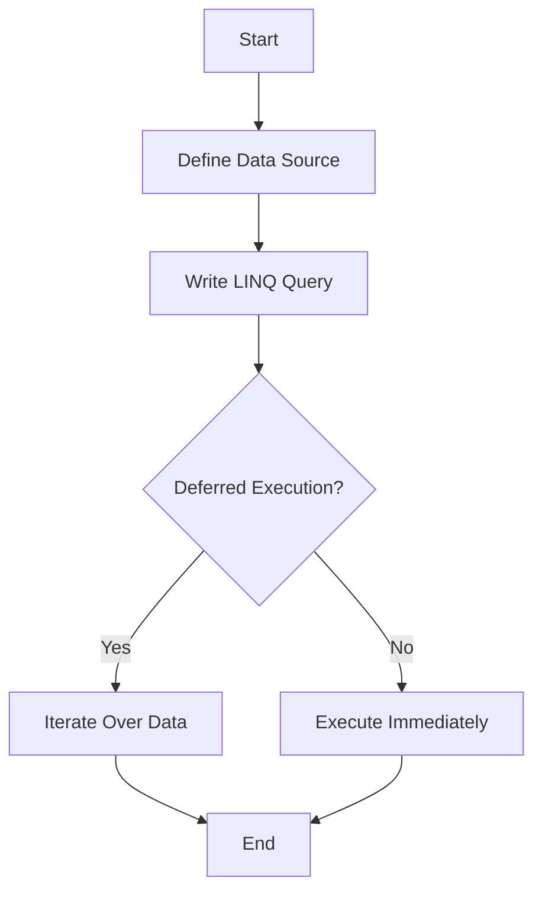
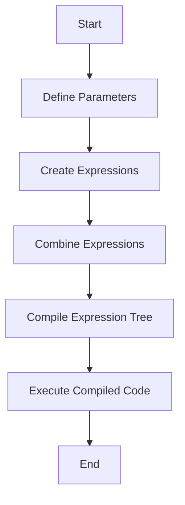

## 7.3 LINQ and Expression Trees

In the realm of C# programming, Language Integrated Query (LINQ) and expression trees are powerful tools that enable developers to write concise, readable, and efficient code for querying and transforming data. This section delves into advanced LINQ techniques and the intricacies of expression trees, providing expert software engineers and enterprise architects with the knowledge to harness these features for dynamic code generation and complex data manipulation.

### Introduction to LINQ

LINQ is a set of technologies based on the integration of query capabilities directly into the C# language. It allows developers to query various data sources, such as collections, databases, XML, and more, using a consistent syntax. LINQ queries can be written in two forms: query syntax and method syntax.

#### Query Syntax

Query syntax resembles SQL and is often more readable for those familiar with SQL. Here's a simple example:

```csharp
// Define a data source
int[] numbers = { 5, 10, 8, 3, 6, 12 };

// Define a query expression
var numQuery = from num in numbers
               where num % 2 == 0
               orderby num
               select num;

// Execute the query
foreach (int num in numQuery)
{
    Console.WriteLine(num);
}
```

#### Method Syntax

Method syntax uses extension methods and lambda expressions. The same query can be written as:

```csharp
// Using method syntax
var numQuery = numbers.Where(num => num % 2 == 0).OrderBy(num => num);

// Execute the query
foreach (int num in numQuery)
{
    Console.WriteLine(num);
}
```

### Advanced LINQ Techniques

LINQ is not just about querying; it also includes powerful transformation capabilities. Let's explore some advanced techniques.

#### Querying and Transforming Data Collections

LINQ can be used to perform complex transformations on data collections. Consider the following example where we transform a list of objects:

```csharp
public class Student
{
    public string Name { get; set; }
    public int Age { get; set; }
}

List<Student> students = new List<Student>
{
    new Student { Name = "Alice", Age = 20 },
    new Student { Name = "Bob", Age = 22 },
    new Student { Name = "Charlie", Age = 23 }
};

// Transforming data
var transformedStudents = students.Select(s => new
{
    FullName = s.Name.ToUpper(),
    IsAdult = s.Age >= 21
});

foreach (var student in transformedStudents)
{
    Console.WriteLine($"Name: {student.FullName}, IsAdult: {student.IsAdult}");
}
```

#### Deferred Execution

LINQ queries use deferred execution, meaning the query is not executed until the data is iterated over. This allows for efficient data processing and the ability to chain multiple operations together.

```csharp
var query = numbers.Where(n => n > 5).Select(n => n * 2);

// The query is executed here
foreach (var n in query)
{
    Console.WriteLine(n);
}
```

#### Parallel LINQ (PLINQ)

For performance optimization, LINQ queries can be parallelized using PLINQ, which can significantly speed up data processing on multi-core systems.

```csharp
var parallelQuery = numbers.AsParallel().Where(n => n > 5).Select(n => n * 2);

foreach (var n in parallelQuery)
{
    Console.WriteLine(n);
}
```

### Introduction to Expression Trees

Expression trees represent code in a tree-like data structure, where each node is an expression, such as a method call or a binary operation. They are particularly useful for building dynamic queries and are extensively used in ORM tools like Entity Framework.

#### Building Expression Trees

Expression trees can be constructed manually using the `System.Linq.Expressions` namespace. Here's a simple example:

```csharp
using System;
using System.Linq.Expressions;

class Program
{
    static void Main()
    {
        // Create an expression tree for a simple arithmetic operation
        Expression<Func<int, int, int>> expression = (a, b) => a + b;

        // Compile the expression tree into a delegate
        Func<int, int, int> func = expression.Compile();

        // Execute the delegate
        int result = func(2, 3);
        Console.WriteLine(result); // Output: 5
    }
}
```

#### Compiling and Executing Expression Trees

Expression trees can be compiled into executable code at runtime, allowing for dynamic code generation. This is particularly useful in scenarios where the code to be executed is not known at compile time.

```csharp
// Define parameters
ParameterExpression paramA = Expression.Parameter(typeof(int), "a");
ParameterExpression paramB = Expression.Parameter(typeof(int), "b");

// Create an addition operation
BinaryExpression body = Expression.Add(paramA, paramB);

// Create a lambda expression
Expression<Func<int, int, int>> addExpression = Expression.Lambda<Func<int, int, int>>(body, paramA, paramB);

// Compile and execute
Func<int, int, int> addFunc = addExpression.Compile();
Console.WriteLine(addFunc(10, 20)); // Output: 30
```

### Use Cases and Examples

Expression trees are a cornerstone of many advanced C# features and libraries. Let's explore some practical use cases.

#### Dynamic Queries

Expression trees enable the creation of dynamic queries, which can be modified at runtime. This is particularly useful in applications where the query criteria are not known until runtime.

```csharp
public static Func<T, bool> BuildPredicate<T>(string propertyName, object value)
{
    var param = Expression.Parameter(typeof(T), "x");
    var property = Expression.Property(param, propertyName);
    var constant = Expression.Constant(value);
    var equality = Expression.Equal(property, constant);

    return Expression.Lambda<Func<T, bool>>(equality, param).Compile();
}

// Usage
var predicate = BuildPredicate<Student>("Age", 22);
var filteredStudents = students.Where(predicate).ToList();
```

#### ORM Tools like Entity Framework

Entity Framework uses expression trees to translate LINQ queries into SQL queries. This allows developers to write database queries in C# and have them executed efficiently by the database engine.

```csharp
using (var context = new SchoolContext())
{
    var students = context.Students.Where(s => s.Age > 20).ToList();
    // The above LINQ query is translated into SQL by Entity Framework
}
```

### Visualizing LINQ and Expression Trees

To better understand how LINQ queries and expression trees work, let's visualize the process using Mermaid.js diagrams.

#### LINQ Query Execution Flow



#### Expression Tree Construction



### Knowledge Check

Before we conclude, let's reinforce our understanding with some questions and exercises.

1. **What is deferred execution in LINQ, and why is it beneficial?**

2. **How can expression trees be used to create dynamic queries? Provide an example.**

3. **Explain how PLINQ can improve the performance of LINQ queries.**

4. **Describe a scenario where using expression trees would be advantageous.**

### Try It Yourself

Experiment with the code examples provided in this section. Try modifying the LINQ queries to use different data sources or criteria. Build your own expression trees to perform various operations, and see how they can be compiled and executed dynamically.

### Conclusion

Mastering LINQ and expression trees in C# opens up a world of possibilities for writing efficient, dynamic, and maintainable code. By understanding these concepts, you can leverage the full power of C# to build robust applications that handle complex data manipulation and dynamic code generation with ease. Remember, this is just the beginning. Keep experimenting, stay curious, and enjoy the journey!

## Quiz Time!



### What is LINQ primarily used for in C#?

- [x] Querying and transforming data collections
- [ ] Compiling and executing dynamic code
- [ ] Building user interfaces
- [ ] Managing memory allocation

> **Explanation:** LINQ is primarily used for querying and transforming data collections in C#.

### What is the benefit of deferred execution in LINQ?

- [x] It allows queries to be executed only when needed, improving performance.
- [ ] It compiles code at runtime for dynamic execution.
- [ ] It enables parallel processing of queries.
- [ ] It simplifies syntax for complex queries.

> **Explanation:** Deferred execution allows LINQ queries to be executed only when the data is iterated over, which can improve performance by avoiding unnecessary computation.

### How does PLINQ enhance LINQ queries?

- [x] By parallelizing queries to utilize multiple cores
- [ ] By simplifying query syntax
- [ ] By enabling dynamic query generation
- [ ] By improving memory management

> **Explanation:** PLINQ enhances LINQ queries by parallelizing them, allowing them to utilize multiple cores for improved performance.

### What is an expression tree in C#?

- [x] A data structure representing code in a tree-like format
- [ ] A method for querying databases
- [ ] A tool for building user interfaces
- [ ] A technique for memory management

> **Explanation:** An expression tree is a data structure that represents code in a tree-like format, allowing for dynamic code generation and execution.

### Which namespace is used for working with expression trees in C#?

- [x] System.Linq.Expressions
- [ ] System.Collections.Generic
- [ ] System.Threading.Tasks
- [ ] System.IO

> **Explanation:** The `System.Linq.Expressions` namespace is used for working with expression trees in C#.

### How can expression trees be used in ORM tools like Entity Framework?

- [x] To translate LINQ queries into SQL queries
- [ ] To manage database connections
- [ ] To handle user authentication
- [ ] To optimize memory usage

> **Explanation:** Expression trees are used in ORM tools like Entity Framework to translate LINQ queries into SQL queries for efficient execution by the database engine.

### What is the purpose of compiling an expression tree?

- [x] To convert it into executable code at runtime
- [ ] To simplify query syntax
- [ ] To improve memory management
- [ ] To parallelize query execution

> **Explanation:** Compiling an expression tree converts it into executable code at runtime, allowing for dynamic code generation and execution.

### What is the primary advantage of using LINQ over traditional loops for data manipulation?

- [x] Improved readability and maintainability
- [ ] Faster execution speed
- [ ] Better memory management
- [ ] Simplified syntax for complex operations

> **Explanation:** LINQ provides improved readability and maintainability over traditional loops, making it easier to write and understand data manipulation code.

### What is a common use case for expression trees?

- [x] Creating dynamic queries
- [ ] Building user interfaces
- [ ] Managing memory allocation
- [ ] Handling user authentication

> **Explanation:** A common use case for expression trees is creating dynamic queries that can be modified at runtime.

### True or False: LINQ can only be used with collections in memory.

- [ ] True
- [x] False

> **Explanation:** False. LINQ can be used with various data sources, including collections in memory, databases, XML, and more.


