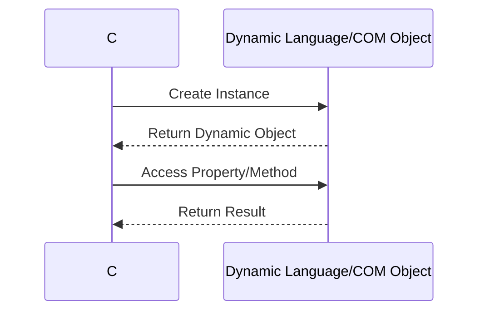

## 7.4 Dynamic Language Features

In the world of C#, the `dynamic` keyword introduces a powerful way to handle types and operations that are resolved at runtime. This feature allows developers to write more flexible and adaptable code, especially when dealing with scenarios that require runtime type information or interoperability with other dynamic languages and COM objects. In this section, we will delve into the intricacies of dynamic language features in C#, explore their use cases, and provide comprehensive examples to illustrate their application.

### Understanding the `dynamic` Keyword

The `dynamic` keyword in C# is a type that bypasses compile-time type checking. Instead, it defers type checking to runtime, allowing for more flexible and adaptable code. This can be particularly useful in scenarios where the type of an object is not known until runtime or when interacting with dynamic languages and COM objects.

#### Key Characteristics of `dynamic`

- **Runtime Type Resolution**: The type of a `dynamic` object is resolved at runtime, allowing for operations that are not known at compile time.
- **Interoperability**: Facilitates interaction with dynamic languages and COM objects, which may not have static type information available.
- **Flexibility**: Enables writing code that can adapt to different types and operations without requiring explicit type definitions.

### Implementing Dynamic Behavior

Implementing dynamic behavior in C# involves using the `dynamic` keyword to declare variables and perform operations that are resolved at runtime. This can be particularly useful in scenarios where the type of data is not known until runtime or when working with external libraries and APIs that return dynamic types.

#### Accessing Type Information at Runtime

One of the primary benefits of using `dynamic` is the ability to access type information at runtime. This allows developers to perform operations on objects without knowing their types at compile time. Here's a simple example to illustrate this concept:

```csharp
using System;

class Program
{
    static void Main()
    {
        dynamic obj = GetDynamicObject();
        Console.WriteLine(obj.Name); // Accessing property at runtime
        obj.DoSomething(); // Invoking method at runtime
    }

    static dynamic GetDynamicObject()
    {
        return new
        {
            Name = "Dynamic Object",
            DoSomething = new Action(() => Console.WriteLine("Doing something dynamically!"))
        };
    }
}
```

In this example, the `GetDynamicObject` method returns an anonymous object with a `Name` property and a `DoSomething` method. The `dynamic` keyword allows us to access these members at runtime without knowing their types at compile time.

### Use Cases and Examples

The `dynamic` keyword is particularly useful in scenarios where flexibility and adaptability are required. Let's explore some common use cases and examples where dynamic language features in C# shine.

#### Interoperability with Dynamic Languages

C# can interoperate with dynamic languages such as Python and JavaScript, which often use dynamic typing. The `dynamic` keyword allows C# to interact with these languages seamlessly. For example, when using IronPython, a .NET implementation of Python, you can execute Python scripts and access Python objects dynamically:

```csharp
using System;
using IronPython.Hosting;
using Microsoft.Scripting.Hosting;

class Program
{
    static void Main()
    {
        ScriptEngine engine = Python.CreateEngine();
        dynamic py = engine.Execute("x = 10; y = 20; z = x + y; z");
        Console.WriteLine(py); // Output: 30
    }
}
```

In this example, we use IronPython to execute a Python script that performs a simple addition. The result is accessed dynamically in C# using the `dynamic` keyword.

#### Interoperability with COM Objects

COM (Component Object Model) is a platform-independent, distributed, object-oriented system for creating binary software components that can interact. The `dynamic` keyword simplifies interaction with COM objects, which often lack static type information. Here's an example of using `dynamic` to interact with a COM object:

```csharp
using System;
using System.Runtime.InteropServices;

class Program
{
    static void Main()
    {
        Type excelType = Type.GetTypeFromProgID("Excel.Application");
        dynamic excel = Activator.CreateInstance(excelType);
        excel.Visible = true;
        excel.Workbooks.Add();
        excel.Cells[1, 1].Value = "Hello, Excel!";
    }
}
```

In this example, we use `dynamic` to interact with Microsoft Excel, a COM object. The `dynamic` keyword allows us to access Excel's properties and methods without needing explicit type definitions.

### Visualizing Dynamic Language Features

To better understand how dynamic language features work in C#, let's visualize the process using a sequence diagram. This diagram illustrates the interaction between a C# application and a dynamic language or COM object.



**Diagram Description**: This sequence diagram shows the interaction between a C# application and a dynamic language or COM object. The C# application creates an instance of the dynamic object, accesses its properties or methods, and receives the result dynamically at runtime.

### Design Considerations

When using dynamic language features in C#, there are several design considerations to keep in mind:

- **Performance**: Dynamic operations are resolved at runtime, which can introduce performance overhead compared to static typing. Use dynamic features judiciously in performance-critical applications.
- **Error Handling**: Since type checking is deferred to runtime, errors related to type mismatches or missing members will only be caught at runtime. Implement robust error handling to manage such scenarios.
- **Maintainability**: Code that relies heavily on dynamic features can be harder to maintain and understand. Ensure that the use of `dynamic` is well-documented and justified.

### Differences and Similarities with Other Patterns

The `dynamic` keyword is often compared to reflection, another feature that allows runtime type inspection and invocation. However, there are key differences:

- **Reflection**: Provides a more explicit and controlled way to access type information and invoke members at runtime. It requires more boilerplate code compared to `dynamic`.
- **Dynamic**: Offers a more concise and flexible approach to runtime type resolution, but with less control and more potential for runtime errors.

### Try It Yourself

To gain a deeper understanding of dynamic language features, try modifying the code examples provided in this section. Experiment with different dynamic objects, properties, and methods. Consider integrating dynamic language features into a small project to see how they can enhance flexibility and interoperability.

### Knowledge Check

Before we conclude this section, let's reinforce what we've learned with a few questions and exercises:

- **Question**: What are the primary benefits of using the `dynamic` keyword in C#?
- **Exercise**: Modify the IronPython example to execute a more complex Python script and access its results dynamically in C#.
- **Challenge**: Create a C# application that interacts with a COM object of your choice using the `dynamic` keyword. Document the process and any challenges you encounter.

### Summary

In this section, we've explored the dynamic language features in C# and how the `dynamic` keyword can be leveraged for flexible programming. We've seen how dynamic behavior can be implemented, examined use cases such as interoperability with dynamic languages and COM objects, and discussed design considerations. By understanding and applying these concepts, you can write more adaptable and interoperable C# applications.

Remember, this is just the beginning. As you continue to explore dynamic language features, you'll discover new ways to enhance the flexibility and adaptability of your C# applications. Keep experimenting, stay curious, and enjoy the journey!

## Quiz Time!



### What is the primary purpose of the `dynamic` keyword in C#?

- [x] To defer type checking to runtime
- [ ] To enforce strict type checking at compile time
- [ ] To improve performance by optimizing code
- [ ] To simplify syntax for lambda expressions

> **Explanation:** The `dynamic` keyword in C# defers type checking to runtime, allowing for more flexible and adaptable code.

### Which of the following is a key characteristic of `dynamic` in C#?

- [x] Runtime type resolution
- [ ] Compile-time type safety
- [ ] Improved performance
- [ ] Static type enforcement

> **Explanation:** `dynamic` allows for runtime type resolution, enabling operations that are not known at compile time.

### How does the `dynamic` keyword facilitate interoperability with dynamic languages?

- [x] By allowing C# to interact with languages that use dynamic typing
- [ ] By enforcing strict type checking for dynamic languages
- [ ] By converting dynamic language code to C#
- [ ] By optimizing dynamic language performance

> **Explanation:** The `dynamic` keyword allows C# to interact with dynamic languages that use dynamic typing, facilitating interoperability.

### What is a potential drawback of using `dynamic` in performance-critical applications?

- [x] Performance overhead due to runtime type resolution
- [ ] Increased compile-time errors
- [ ] Reduced code readability
- [ ] Limited interoperability with COM objects

> **Explanation:** Dynamic operations are resolved at runtime, which can introduce performance overhead compared to static typing.

### Which feature is often compared to `dynamic` due to its ability to access type information at runtime?

- [x] Reflection
- [ ] LINQ
- [ ] Generics
- [ ] Delegates

> **Explanation:** Reflection is often compared to `dynamic` as both allow runtime type inspection and invocation.

### What is a key difference between `dynamic` and reflection?

- [x] `dynamic` offers a more concise approach to runtime type resolution
- [ ] Reflection provides less control over runtime operations
- [ ] `dynamic` requires more boilerplate code
- [ ] Reflection is only available in .NET Core

> **Explanation:** `dynamic` offers a more concise and flexible approach to runtime type resolution compared to reflection.

### In the context of COM interoperability, what advantage does `dynamic` provide?

- [x] Simplifies interaction with COM objects lacking static type information
- [ ] Enforces strict type checking for COM objects
- [ ] Converts COM objects to C# objects
- [ ] Optimizes COM object performance

> **Explanation:** `dynamic` simplifies interaction with COM objects, which often lack static type information.

### What should developers consider when using `dynamic` in their code?

- [x] Implement robust error handling to manage runtime errors
- [ ] Avoid using `dynamic` in all scenarios
- [ ] Use `dynamic` to improve compile-time performance
- [ ] Rely solely on `dynamic` for type safety

> **Explanation:** Since type checking is deferred to runtime, developers should implement robust error handling to manage potential runtime errors.

### How can developers experiment with dynamic language features?

- [x] By modifying code examples and integrating dynamic features into projects
- [ ] By avoiding the use of `dynamic` in all projects
- [ ] By focusing solely on static typing
- [ ] By using `dynamic` only for performance optimization

> **Explanation:** Developers can experiment with dynamic language features by modifying code examples and integrating them into projects to see how they enhance flexibility and interoperability.

### True or False: The `dynamic` keyword in C# enforces compile-time type safety.

- [ ] True
- [x] False

> **Explanation:** False. The `dynamic` keyword defers type checking to runtime, allowing for more flexible and adaptable code.


