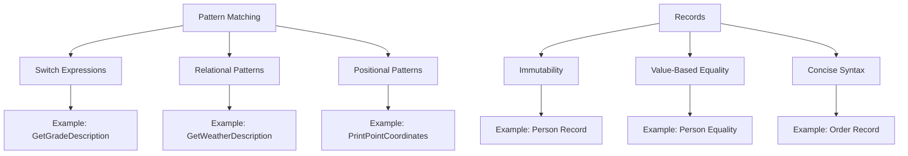

## 7.5 Pattern Matching and Records

In the ever-evolving landscape of C# programming, pattern matching and records have emerged as powerful tools to simplify code, enhance readability, and improve maintainability. These features allow developers to write more expressive and concise code, making it easier to manage complex logic and data structures. In this section, we will delve into the intricacies of pattern matching and records, exploring their implementation, use cases, and practical examples.

### Simplifying Code Using Pattern Matching

Pattern matching is a feature that allows developers to test and extract data from objects in a more declarative and readable manner. It simplifies complex conditional logic by enabling concise and expressive code constructs. Let's explore the key components of pattern matching in C#.

#### Implementing Pattern Matching

Pattern matching in C# can be implemented using various constructs, including `switch` expressions, relational patterns, and positional patterns. These constructs provide a flexible and powerful way to handle complex data structures and conditional logic.

##### Using `switch` Expressions and Relational Patterns

The `switch` expression is a modern alternative to the traditional `switch` statement, offering a more concise and expressive syntax. It allows developers to match patterns and execute code based on the matched pattern. Relational patterns enable comparisons using relational operators, enhancing the flexibility of pattern matching.

```csharp
public string GetGradeDescription(int score)
{
    return score switch
    {
        >= 90 => "Excellent",
        >= 80 => "Very Good",
        >= 70 => "Good",
        >= 60 => "Satisfactory",
        _ => "Needs Improvement"
    };
}
```

In this example, the `switch` expression is used to determine the grade description based on the score. The relational patterns (`>= 90`, `>= 80`, etc.) provide a concise way to express the conditions.

##### Deconstructing Data with Positional Patterns

Positional patterns allow developers to deconstruct data types, extracting values from objects and tuples. This feature is particularly useful when working with complex data structures, enabling more readable and maintainable code.

```csharp
public void PrintPointCoordinates(Point point)
{
    if (point is (int x, int y))
    {
        Console.WriteLine($"X: {x}, Y: {y}");
    }
}
```

In this example, the `Point` object is deconstructed into its `x` and `y` coordinates using positional patterns. This approach simplifies the extraction of data from objects, making the code more intuitive.

### Use Cases and Examples

Pattern matching and records offer numerous use cases and examples that demonstrate their effectiveness in simplifying code and enhancing readability. Let's explore some practical scenarios where these features can be applied.

#### Deconstructing Data Types

Pattern matching is particularly useful for deconstructing data types, allowing developers to extract values from objects and tuples with ease. This capability is invaluable when working with complex data structures, enabling more concise and expressive code.

```csharp
public void ProcessShape(Shape shape)
{
    switch (shape)
    {
        case Circle(var radius):
            Console.WriteLine($"Circle with radius: {radius}");
            break;
        case Rectangle(var width, var height):
            Console.WriteLine($"Rectangle with width: {width}, height: {height}");
            break;
        default:
            Console.WriteLine("Unknown shape");
            break;
    }
}
```

In this example, the `ProcessShape` method uses pattern matching to deconstruct different shape types (`Circle` and `Rectangle`) and extract their properties. This approach simplifies the handling of various shape types, making the code more readable and maintainable.

#### Simplifying Conditional Logic

Pattern matching can significantly simplify complex conditional logic, reducing the need for nested `if` statements and enhancing code readability. By using pattern matching, developers can express conditions more declaratively, leading to cleaner and more maintainable code.

```csharp
public string GetWeatherDescription(Weather weather)
{
    return weather switch
    {
        { Temperature: > 30 } => "Hot",
        { Temperature: > 20 } => "Warm",
        { Temperature: > 10 } => "Cool",
        _ => "Cold"
    };
}
```

In this example, the `GetWeatherDescription` method uses pattern matching to determine the weather description based on the temperature. The use of relational patterns (`> 30`, `> 20`, etc.) simplifies the conditional logic, making the code more concise and expressive.

### Records: A New Way to Define Data Structures

Records are a new feature in C# that provide a concise way to define immutable data structures. They are particularly useful for representing data transfer objects, value objects, and other data-centric types. Records offer several benefits, including immutability, value-based equality, and concise syntax.

#### Defining Records

Records can be defined using a simple and concise syntax, making them easy to create and use. They automatically provide value-based equality, `ToString`, and `GetHashCode` implementations, reducing boilerplate code and enhancing code readability.

```csharp
public record Person(string FirstName, string LastName, int Age);
```

In this example, the `Person` record is defined with three properties: `FirstName`, `LastName`, and `Age`. The concise syntax makes it easy to define and use records, reducing the amount of boilerplate code required.

#### Immutability and Value-Based Equality

Records are immutable by default, meaning their properties cannot be changed after they are created. This immutability ensures that records are thread-safe and can be safely shared across different parts of an application. Additionally, records provide value-based equality, meaning two records with the same property values are considered equal.

```csharp
var person1 = new Person("John", "Doe", 30);
var person2 = new Person("John", "Doe", 30);

Console.WriteLine(person1 == person2); // Output: True
```

In this example, `person1` and `person2` are considered equal because they have the same property values. The value-based equality provided by records simplifies comparisons and enhances code readability.

### Combining Pattern Matching and Records

Pattern matching and records can be combined to create powerful and expressive code constructs. By leveraging the strengths of both features, developers can write more concise and maintainable code, simplifying complex logic and data handling.

#### Practical Example: Processing Orders

Let's consider a practical example where pattern matching and records are used to process orders in an e-commerce application. This example demonstrates how these features can simplify code and enhance readability.

```csharp
public record Order(int Id, string Product, int Quantity, decimal Price);

public string ProcessOrder(Order order)
{
    return order switch
    {
        { Quantity: > 100 } => "Bulk order",
        { Price: > 1000 } => "High-value order",
        _ => "Standard order"
    };
}
```

In this example, the `ProcessOrder` method uses pattern matching to determine the type of order based on its quantity and price. The use of records simplifies the definition of the `Order` data structure, while pattern matching enhances the readability of the conditional logic.

### Visualizing Pattern Matching and Records

To better understand the concepts of pattern matching and records, let's visualize their implementation and usage using Hugo-compatible Mermaid.js diagrams.



This diagram illustrates the key components of pattern matching and records, highlighting their relationships and practical examples. By visualizing these concepts, we can gain a deeper understanding of their implementation and usage.

### References and Links

For further reading and exploration of pattern matching and records in C#, consider the following resources:

- [Microsoft Docs: Pattern Matching in C#](https://docs.microsoft.com/en-us/dotnet/csharp/pattern-matching)
- [Microsoft Docs: Records in C#](https://docs.microsoft.com/en-us/dotnet/csharp/whats-new/tutorials/records)
- [C# 9.0: Pattern Matching Enhancements](https://devblogs.microsoft.com/dotnet/c-9-0-pattern-matching-enhancements/)
- [C# 9.0: Records](https://devblogs.microsoft.com/dotnet/c-9-0-on-the-record/)

### Knowledge Check

To reinforce your understanding of pattern matching and records, consider the following questions and challenges:

1. Explain how pattern matching can simplify conditional logic in C#.
2. Demonstrate how to use positional patterns to deconstruct a tuple.
3. Provide an example of a record and explain its benefits.
4. Compare and contrast pattern matching with traditional `if` statements.
5. Describe a scenario where records would be particularly useful.

### Embrace the Journey

Remember, mastering pattern matching and records is just the beginning. As you continue to explore these features, you'll discover new ways to simplify code, enhance readability, and improve maintainability. Keep experimenting, stay curious, and enjoy the journey!

## Quiz Time!



### What is the primary benefit of using pattern matching in C#?

- [x] Simplifies complex conditional logic
- [ ] Increases code execution speed
- [ ] Reduces memory usage
- [ ] Enhances security

> **Explanation:** Pattern matching simplifies complex conditional logic by allowing developers to express conditions more declaratively.

### How do records in C# provide value-based equality?

- [x] By comparing property values
- [ ] By comparing object references
- [ ] By using custom equality methods
- [ ] By using hash codes

> **Explanation:** Records provide value-based equality by comparing the property values of two records.

### Which pattern matching construct allows for deconstructing data types?

- [x] Positional patterns
- [ ] Relational patterns
- [ ] Logical patterns
- [ ] Type patterns

> **Explanation:** Positional patterns allow for deconstructing data types, extracting values from objects and tuples.

### What is the default behavior of records in terms of mutability?

- [x] Immutable
- [ ] Mutable
- [ ] Partially mutable
- [ ] Conditionally mutable

> **Explanation:** Records are immutable by default, meaning their properties cannot be changed after they are created.

### Which C# feature provides a concise way to define immutable data structures?

- [x] Records
- [ ] Classes
- [ ] Interfaces
- [ ] Delegates

> **Explanation:** Records provide a concise way to define immutable data structures, reducing boilerplate code.

### How does pattern matching enhance code readability?

- [x] By allowing more declarative and expressive code constructs
- [ ] By reducing the number of lines of code
- [ ] By increasing code execution speed
- [ ] By using complex syntax

> **Explanation:** Pattern matching enhances code readability by allowing more declarative and expressive code constructs.

### What is a practical use case for combining pattern matching and records?

- [x] Processing orders in an e-commerce application
- [ ] Implementing a sorting algorithm
- [ ] Managing database connections
- [ ] Designing a user interface

> **Explanation:** Combining pattern matching and records is practical for processing orders in an e-commerce application, simplifying code and enhancing readability.

### How do relational patterns in C# pattern matching work?

- [x] By using relational operators to compare values
- [ ] By using logical operators to combine conditions
- [ ] By using type checks to match patterns
- [ ] By using regular expressions to match strings

> **Explanation:** Relational patterns use relational operators to compare values, enhancing the flexibility of pattern matching.

### What is the output of the following code snippet?
```csharp
var person1 = new Person("John", "Doe", 30);
var person2 = new Person("John", "Doe", 30);
Console.WriteLine(person1 == person2);
```

- [x] True
- [ ] False

> **Explanation:** The output is `True` because records provide value-based equality, meaning two records with the same property values are considered equal.

### True or False: Pattern matching can only be used with primitive data types.

- [ ] True
- [x] False

> **Explanation:** False. Pattern matching can be used with complex data types, including objects and tuples, allowing for more expressive and concise code constructs.


