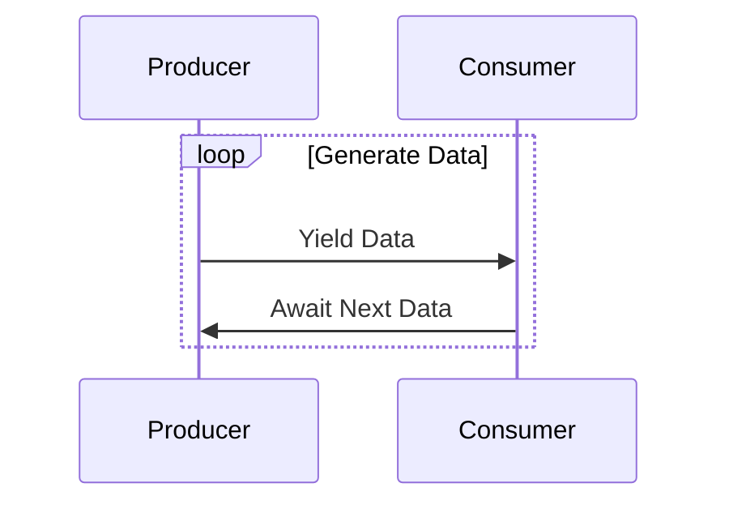

## 7.6 Asynchronous Streams

Asynchronous programming has become a cornerstone of modern software development, especially in environments where responsiveness and efficiency are paramount. In C#, asynchronous streams offer a powerful way to handle data that is produced over time, allowing developers to process data as it becomes available without blocking the main thread. This section will delve into the intricacies of asynchronous streams in C#, focusing on implementing them using `IAsyncEnumerable` and `await foreach`, and exploring practical use cases and examples.

### Understanding Asynchronous Streams

Asynchronous streams in C# are a way to work with sequences of data that are produced asynchronously. Unlike traditional synchronous streams, where data is processed in a blocking manner, asynchronous streams allow data to be processed as it becomes available, without blocking the execution of the program. This is particularly useful in scenarios where data is fetched from a network, read from a file, or generated by a sensor, and you want to process it in real-time.

#### Key Concepts

- **Asynchronous Data Processing**: The ability to handle data that is produced over time without blocking the execution of the program.
- **IAsyncEnumerable<T>**: An interface that represents an asynchronous stream of data.
- **await foreach**: A construct that allows iterating over an `IAsyncEnumerable<T>` asynchronously.

### Implementing Asynchronous Streams

To implement asynchronous streams in C#, you need to understand the `IAsyncEnumerable<T>` interface and the `await foreach` loop. These constructs enable you to define and consume asynchronous streams efficiently.

#### Using `IAsyncEnumerable<T>`

The `IAsyncEnumerable<T>` interface is the cornerstone of asynchronous streams in C#. It represents a sequence of elements that can be enumerated asynchronously. Here's how you can define an asynchronous stream using `IAsyncEnumerable<T>`:

```csharp
using System;
using System.Collections.Generic;
using System.Threading.Tasks;

public class DataProducer
{
    public async IAsyncEnumerable<int> GenerateNumbersAsync()
    {
        for (int i = 0; i < 10; i++)
        {
            await Task.Delay(1000); // Simulate asynchronous data generation
            yield return i;
        }
    }
}
```

In this example, `GenerateNumbersAsync` is an asynchronous method that returns an `IAsyncEnumerable<int>`. It generates numbers asynchronously, simulating a delay to mimic data production over time.

#### Consuming Asynchronous Streams with `await foreach`

Once you have an asynchronous stream, you can consume it using the `await foreach` loop. This construct allows you to iterate over the elements of an `IAsyncEnumerable<T>` asynchronously:

```csharp
public class DataConsumer
{
    public async Task ProcessNumbersAsync()
    {
        var producer = new DataProducer();
        await foreach (var number in producer.GenerateNumbersAsync())
        {
            Console.WriteLine($"Received number: {number}");
        }
    }
}
```

In this example, `ProcessNumbersAsync` is an asynchronous method that consumes the asynchronous stream produced by `GenerateNumbersAsync`. The `await foreach` loop iterates over the numbers as they become available, allowing the program to continue executing other tasks in the meantime.

### Use Cases and Examples

Asynchronous streams are particularly useful in scenarios where data is produced over time and needs to be processed as it becomes available. Here are some practical use cases and examples:

#### Real-Time Data Processing

In applications that require real-time data processing, such as financial trading platforms or live sports score updates, asynchronous streams can be used to handle incoming data efficiently. By processing data as it arrives, you can ensure that your application remains responsive and up-to-date.

```csharp
public class StockPriceUpdater
{
    public async IAsyncEnumerable<decimal> GetStockPricesAsync(string stockSymbol)
    {
        while (true)
        {
            await Task.Delay(1000); // Simulate fetching stock price
            yield return FetchCurrentPrice(stockSymbol);
        }
    }

    private decimal FetchCurrentPrice(string stockSymbol)
    {
        // Simulate fetching the current stock price
        return new Random().Next(100, 200);
    }
}
```

In this example, `GetStockPricesAsync` is an asynchronous stream that continuously fetches the current price of a stock. The `await foreach` loop can be used to process these prices as they become available.

#### Streaming Data from External Sources

Asynchronous streams are ideal for handling data from external sources, such as APIs or databases, where data may not be available all at once. By using asynchronous streams, you can fetch and process data incrementally, reducing the load on your application and improving performance.

```csharp
public class ApiDataFetcher
{
    public async IAsyncEnumerable<string> FetchDataFromApiAsync(string apiUrl)
    {
        using var httpClient = new HttpClient();
        var response = await httpClient.GetAsync(apiUrl, HttpCompletionOption.ResponseHeadersRead);
        response.EnsureSuccessStatusCode();

        using var stream = await response.Content.ReadAsStreamAsync();
        using var reader = new StreamReader(stream);

        while (!reader.EndOfStream)
        {
            var line = await reader.ReadLineAsync();
            yield return line;
        }
    }
}
```

In this example, `FetchDataFromApiAsync` is an asynchronous stream that reads data from an API line by line. This approach allows you to process each line as it becomes available, rather than waiting for the entire response to be downloaded.

### Visualizing Asynchronous Streams

To better understand how asynchronous streams work, let's visualize the flow of data using a sequence diagram. This diagram illustrates the interaction between a data producer and a data consumer in an asynchronous stream scenario.



**Diagram Description**: This sequence diagram shows the interaction between a data producer and a consumer. The producer yields data asynchronously, and the consumer awaits the next piece of data, allowing for non-blocking data processing.

### Design Considerations

When implementing asynchronous streams, there are several design considerations to keep in mind:

- **Error Handling**: Ensure that your asynchronous streams handle errors gracefully. Use try-catch blocks within your `IAsyncEnumerable<T>` methods to catch and handle exceptions.
- **Cancellation**: Provide a way to cancel the enumeration of an asynchronous stream. Use `CancellationToken` to allow consumers to cancel the operation if needed.
- **Performance**: Be mindful of the performance implications of asynchronous streams. While they can improve responsiveness, they may also introduce overhead if not used judiciously.

### Differences and Similarities

Asynchronous streams share similarities with other asynchronous programming patterns, such as tasks and events, but they are distinct in their ability to handle sequences of data over time. Unlike tasks, which represent a single operation, asynchronous streams represent a sequence of operations. Similarly, while events can be used to signal the availability of data, asynchronous streams provide a more structured way to process data incrementally.

### Try It Yourself

To deepen your understanding of asynchronous streams, try modifying the code examples provided in this section. Experiment with different data sources, such as files or databases, and see how asynchronous streams can be used to process data in real-time. Consider adding error handling and cancellation support to your implementations.

### Knowledge Check

Before moving on, let's review some key takeaways from this section:

- Asynchronous streams allow you to process data as it becomes available, without blocking the main thread.
- The `IAsyncEnumerable<T>` interface and `await foreach` loop are essential constructs for implementing asynchronous streams in C#.
- Asynchronous streams are ideal for real-time data processing and handling data from external sources.

### Embrace the Journey

Remember, mastering asynchronous streams is just one step in your journey to becoming an expert C# developer. As you continue to explore the world of asynchronous programming, keep experimenting, stay curious, and enjoy the process of learning and growing as a developer.

## Quiz Time!



### What is the primary advantage of using asynchronous streams in C#?

- [x] They allow processing of data as it becomes available without blocking the main thread.
- [ ] They improve the speed of data processing by using parallel threads.
- [ ] They automatically handle errors in data processing.
- [ ] They simplify the syntax of asynchronous programming.

> **Explanation:** Asynchronous streams enable non-blocking data processing, allowing data to be handled as it arrives, which is crucial for maintaining application responsiveness.

### Which interface is used to represent an asynchronous stream in C#?

- [x] IAsyncEnumerable<T>
- [ ] IEnumerable<T>
- [ ] IAsyncEnumerator<T>
- [ ] IObservable<T>

> **Explanation:** `IAsyncEnumerable<T>` is the interface used to define asynchronous streams in C#, allowing for asynchronous iteration over a sequence of data.

### How do you iterate over an asynchronous stream in C#?

- [x] Using the `await foreach` loop.
- [ ] Using the `foreach` loop.
- [ ] Using the `Task.Run` method.
- [ ] Using the `Parallel.ForEach` method.

> **Explanation:** The `await foreach` loop is specifically designed for iterating over `IAsyncEnumerable<T>` asynchronously.

### What is a common use case for asynchronous streams?

- [x] Real-time data processing.
- [ ] Batch processing of large datasets.
- [ ] Static data analysis.
- [ ] Synchronous file reading.

> **Explanation:** Asynchronous streams are ideal for real-time data processing, where data is produced and consumed incrementally.

### What should you consider when implementing asynchronous streams?

- [x] Error handling and cancellation.
- [ ] Using synchronous methods for data fetching.
- [ ] Avoiding the use of `await` keyword.
- [ ] Ensuring all data is available before processing.

> **Explanation:** Proper error handling and support for cancellation are crucial when working with asynchronous streams to ensure robust and responsive applications.

### Which of the following is NOT a benefit of asynchronous streams?

- [ ] Non-blocking data processing.
- [ ] Real-time data handling.
- [x] Guaranteed data order.
- [ ] Improved application responsiveness.

> **Explanation:** Asynchronous streams do not inherently guarantee the order of data processing, especially in scenarios involving parallelism or concurrency.

### How can you cancel the enumeration of an asynchronous stream?

- [x] By using a `CancellationToken`.
- [ ] By throwing an exception.
- [ ] By using the `break` statement.
- [ ] By closing the data source.

> **Explanation:** A `CancellationToken` can be used to signal cancellation of an asynchronous operation, including the enumeration of an asynchronous stream.

### What is the role of `yield return` in an asynchronous stream?

- [x] It yields a value to the consumer of the stream.
- [ ] It terminates the asynchronous stream.
- [ ] It starts the asynchronous operation.
- [ ] It handles exceptions in the stream.

> **Explanation:** `yield return` is used to produce values in an `IAsyncEnumerable<T>`, allowing the consumer to receive data incrementally.

### Can asynchronous streams be used with external data sources like APIs?

- [x] True
- [ ] False

> **Explanation:** Asynchronous streams are well-suited for handling data from external sources, such as APIs, where data may be available incrementally.

### What is the purpose of the `HttpCompletionOption.ResponseHeadersRead` option in the `HttpClient.GetAsync` method?

- [x] To start processing the response as soon as the headers are received.
- [ ] To wait for the entire response to be downloaded before processing.
- [ ] To ensure the response is cached.
- [ ] To automatically retry failed requests.

> **Explanation:** The `HttpCompletionOption.ResponseHeadersRead` option allows processing of the response to begin as soon as the headers are received, which is useful for streaming scenarios.




