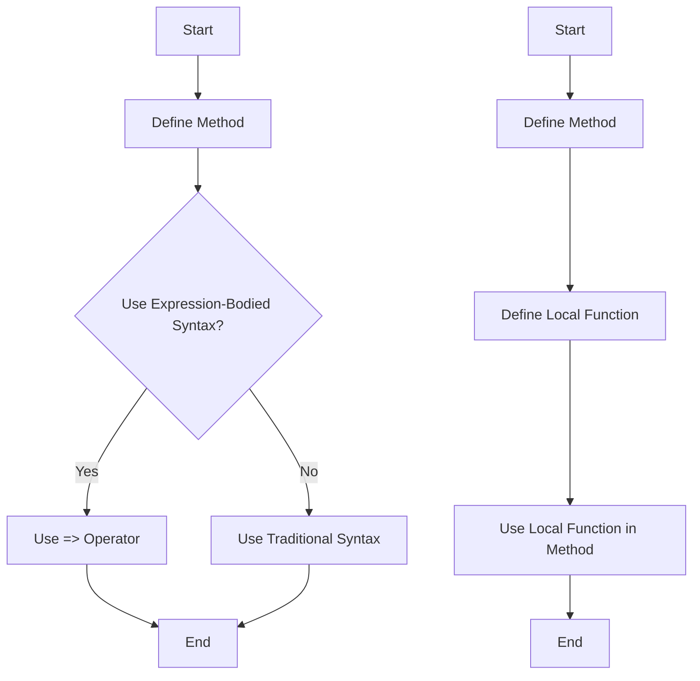

## 7.7 Expression-Bodied Members and Local Functions

In the ever-evolving landscape of C# programming, writing concise and readable code is paramount. Expression-bodied members and local functions are two powerful features that enable developers to achieve this goal. By understanding and implementing these features, you can enhance the clarity and efficiency of your code, making it more maintainable and easier to understand.

### Writing Concise Code with Expression-Bodied Members

Expression-bodied members were introduced in C# 6.0 and have since become a staple for writing succinct code. They allow you to define methods, properties, and other members using a single expression, eliminating the need for verbose syntax. This feature is particularly useful for simple operations where the traditional method body would be unnecessarily lengthy.

#### Implementing Expression-Bodied Members

Expression-bodied members can be applied to methods, properties, indexers, and even constructors and destructors. Let's explore how to implement them in various scenarios.

##### Simplifying Method and Property Definitions

Consider a method that returns the square of a number. Traditionally, you might write it like this:

```csharp
public int Square(int number)
{
    return number * number;
}
```

With expression-bodied members, this can be simplified to:

```csharp
public int Square(int number) => number * number;
```

The `=>` operator is used to define the expression body, making the code more concise and readable.

Similarly, properties can be defined using expression-bodied syntax. Here's an example:

```csharp
private string _name;

public string Name
{
    get { return _name; }
    set { _name = value; }
}
```

This can be rewritten as:

```csharp
public string Name
{
    get => _name;
    set => _name = value;
}
```

For read-only properties, the syntax is even more compact:

```csharp
public string Name => _name;
```

##### Constructors and Destructors

Expression-bodied members can also be used in constructors and destructors, although this is less common. Here's an example of a constructor:

```csharp
public MyClass(string name) => _name = name;
```

And a destructor:

```csharp
~MyClass() => Console.WriteLine("Destructor called");
```

These examples demonstrate how expression-bodied members can streamline your code, reducing boilerplate and enhancing readability.

### Local Functions

Local functions, introduced in C# 7.0, allow you to define functions within the scope of another function. This feature is particularly useful for encapsulating logic that is only relevant within the context of the containing method, improving both readability and maintainability.

#### Defining Functions Within Functions for Improved Readability

Local functions are defined within the body of a method and can access the variables and parameters of the containing method. This makes them ideal for breaking down complex operations into smaller, more manageable pieces.

Consider a method that processes a list of numbers and applies a transformation to each element. Without local functions, you might write:

```csharp
public List<int> ProcessNumbers(List<int> numbers)
{
    List<int> result = new List<int>();
    foreach (var number in numbers)
    {
        result.Add(Transform(number));
    }
    return result;
}

private int Transform(int number)
{
    return number * 2;
}
```

With local functions, the `Transform` method can be defined within `ProcessNumbers`, keeping related logic together:

```csharp
public List<int> ProcessNumbers(List<int> numbers)
{
    List<int> result = new List<int>();
    foreach (var number in numbers)
    {
        result.Add(Transform(number));
    }
    return result;

    int Transform(int number) => number * 2;
}
```

This approach enhances readability by keeping the transformation logic close to where it's used, reducing the cognitive load on the reader.

#### Benefits of Local Functions

Local functions offer several advantages:

1. **Encapsulation**: They encapsulate logic that is only relevant within the containing method, reducing the risk of unintended use elsewhere in the codebase.

2. **Readability**: By keeping related logic together, local functions improve the readability of your code, making it easier to understand and maintain.

3. **Performance**: Local functions can be more performant than anonymous methods or lambda expressions, as they do not incur the overhead of capturing variables.

4. **Access to Local Variables**: Local functions have access to the variables and parameters of the containing method, allowing for more flexible and powerful implementations.

### Code Examples and Practice

Let's explore some practical examples to solidify your understanding of expression-bodied members and local functions.

#### Example 1: Expression-Bodied Methods

```csharp
public class Calculator
{
    public int Add(int a, int b) => a + b;
    public int Subtract(int a, int b) => a - b;
    public int Multiply(int a, int b) => a * b;
    public double Divide(int a, int b) => (double)a / b;
}
```

In this example, each method is defined using an expression body, making the code concise and easy to read.

#### Example 2: Local Functions for Data Processing

```csharp
public List<int> FilterAndTransform(List<int> numbers, int threshold)
{
    List<int> result = new List<int>();
    foreach (var number in numbers)
    {
        if (IsAboveThreshold(number))
        {
            result.Add(Transform(number));
        }
    }
    return result;

    bool IsAboveThreshold(int number) => number > threshold;
    int Transform(int number) => number * 2;
}
```

Here, local functions `IsAboveThreshold` and `Transform` encapsulate specific logic, improving the clarity and maintainability of the `FilterAndTransform` method.

### Visualizing Expression-Bodied Members and Local Functions

To better understand the flow and structure of code using expression-bodied members and local functions, let's visualize the process with a diagram.



**Diagram Description**: The first flowchart illustrates the decision-making process for using expression-bodied syntax in method definitions. The second flowchart demonstrates the process of defining and using local functions within a method.

### Try It Yourself

To gain hands-on experience with expression-bodied members and local functions, try modifying the examples provided. Experiment with different scenarios, such as:

- Implementing expression-bodied properties in a class.
- Creating local functions that perform complex calculations.
- Refactoring existing code to use expression-bodied members and local functions.

### Knowledge Check

Before we conclude, let's reinforce your understanding with a few questions:

1. What are the benefits of using expression-bodied members in C#?
2. How do local functions improve code readability and maintainability?
3. Can local functions access variables from the containing method? Why is this useful?

### Summary

In this section, we've explored the power of expression-bodied members and local functions in C#. By leveraging these features, you can write more concise, readable, and efficient code. Expression-bodied members simplify method and property definitions, while local functions encapsulate logic within the context of a containing method. As you continue to develop your skills, remember to experiment with these features and apply them to your projects.

### References and Further Reading

- [Microsoft Docs: Expression-bodied members](https://docs.microsoft.com/en-us/dotnet/csharp/programming-guide/statements-expressions-operators/expression-bodied-members)
- [Microsoft Docs: Local functions](https://docs.microsoft.com/en-us/dotnet/csharp/programming-guide/classes-and-structs/local-functions)
- [C# Programming Guide](https://docs.microsoft.com/en-us/dotnet/csharp/programming-guide/)

## Quiz Time!



### What is the primary benefit of using expression-bodied members?

- [x] They make code more concise and readable.
- [ ] They improve performance significantly.
- [ ] They allow for dynamic typing.
- [ ] They enable multi-threading.

> **Explanation:** Expression-bodied members simplify code by allowing methods and properties to be defined with a single expression, enhancing readability.

### Which operator is used for expression-bodied members?

- [x] =>
- [ ] ->
- [ ] ::
- [ ] **

> **Explanation:** The `=>` operator is used to define expression-bodied members in C#.

### Can local functions access variables from the containing method?

- [x] Yes
- [ ] No

> **Explanation:** Local functions can access variables and parameters from the containing method, allowing for more flexible implementations.

### What is a key advantage of local functions?

- [x] They encapsulate logic within the containing method.
- [ ] They improve network performance.
- [ ] They allow for global variable access.
- [ ] They enable dynamic typing.

> **Explanation:** Local functions encapsulate logic that is only relevant within the containing method, improving readability and maintainability.

### How do expression-bodied members affect performance?

- [ ] They significantly improve performance.
- [x] They have minimal impact on performance.
- [ ] They degrade performance.
- [ ] They enable parallel processing.

> **Explanation:** Expression-bodied members primarily enhance readability and conciseness, with minimal impact on performance.

### What version of C# introduced local functions?

- [ ] C# 5.0
- [x] C# 7.0
- [ ] C# 8.0
- [ ] C# 9.0

> **Explanation:** Local functions were introduced in C# 7.0.

### Can expression-bodied members be used for constructors?

- [x] Yes
- [ ] No

> **Explanation:** Expression-bodied members can be used for constructors, allowing for concise initialization logic.

### What is the syntax for defining a local function?

- [x] Define the function within the body of a method.
- [ ] Use the `local` keyword.
- [ ] Define the function at the class level.
- [ ] Use the `func` keyword.

> **Explanation:** Local functions are defined within the body of a method, encapsulating logic relevant to that method.

### What is the main purpose of using expression-bodied properties?

- [x] To simplify property definitions.
- [ ] To enable dynamic property types.
- [ ] To improve property performance.
- [ ] To allow for property overloading.

> **Explanation:** Expression-bodied properties simplify property definitions by using a single expression for the getter or setter.

### True or False: Local functions can be used to improve code readability.

- [x] True
- [ ] False

> **Explanation:** Local functions improve code readability by encapsulating logic within the containing method, making the code easier to understand.



Remember, this is just the beginning. As you progress, you'll build more complex and interactive applications. Keep experimenting, stay curious, and enjoy the journey!
