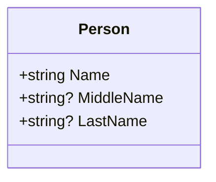

## 7.8 Nullable Reference Types

In the world of software development, null reference exceptions have been a notorious source of runtime errors. C# 8.0 introduced nullable reference types to address this issue, providing developers with a powerful tool to enhance null safety in their applications. In this section, we will delve into the concept of nullable reference types, explore how to enable nullable contexts, and examine practical use cases and examples that demonstrate their effectiveness in preventing null reference exceptions.

### Understanding Nullable Reference Types

Nullable reference types are a feature introduced in C# 8.0 that allows developers to explicitly define whether a reference type variable can be null. This feature is designed to help developers avoid null reference exceptions by providing compile-time warnings when a nullable reference type is dereferenced without a null check.

#### Key Concepts

- **Nullable Reference Types**: By default, reference types in C# can be null. With nullable reference types, you can specify whether a reference type is nullable or non-nullable.
- **Nullable Annotations**: These are used to indicate whether a reference type is nullable (`string?`) or non-nullable (`string`).
- **Nullable Warnings**: The compiler provides warnings when nullable reference types are used in a way that might lead to null reference exceptions.

### Enabling Nullable Contexts

To take advantage of nullable reference types, you need to enable nullable contexts in your C# project. This can be done by using nullable annotations and directives.

#### Using Nullable Annotations

Nullable annotations are used to specify whether a reference type is nullable or non-nullable. Here's how you can use them:

```csharp
#nullable enable

public class Person
{
    public string Name { get; set; } // Non-nullable
    public string? MiddleName { get; set; } // Nullable
    public string? LastName { get; set; } // Nullable
}

#nullable disable
```

In the example above, `Name` is a non-nullable reference type, while `MiddleName` and `LastName` are nullable reference types. The `#nullable enable` directive enables nullable annotations for the code that follows.

#### Using Nullable Directives

Nullable directives are used to enable or disable nullable contexts at the file or project level. They can be specified in the project file or directly in the code.

- **Project File**: You can enable nullable contexts for the entire project by adding the following line to your `.csproj` file:

```xml
<Nullable>enable</Nullable>
```

- **Code File**: You can enable or disable nullable contexts within a specific code file using the `#nullable` directive:

```csharp
#nullable enable

// Code with nullable annotations

#nullable disable
```

### Use Cases and Examples

Nullable reference types are particularly useful in scenarios where null reference exceptions are common. Let's explore some use cases and examples that highlight their benefits.

#### Preventing Null Reference Exceptions

One of the primary benefits of nullable reference types is their ability to prevent null reference exceptions. By explicitly defining whether a reference type can be null, you can catch potential null reference exceptions at compile time.

Consider the following example:

```csharp
#nullable enable

public class Order
{
    public string? OrderId { get; set; }
    public Customer? Customer { get; set; }

    public void ProcessOrder()
    {
        if (OrderId == null)
        {
            throw new InvalidOperationException("OrderId cannot be null.");
        }

        // Safe to use OrderId here
        Console.WriteLine($"Processing order {OrderId}");
    }
}

public class Customer
{
    public string Name { get; set; } = string.Empty;
}

#nullable disable
```

In this example, the `OrderId` property is nullable, and the `ProcessOrder` method includes a null check to ensure that `OrderId` is not null before using it. This prevents a null reference exception from occurring at runtime.

#### Enhancing Code Readability and Maintainability

Nullable reference types also enhance code readability and maintainability by making the nullability of reference types explicit. This helps developers understand the intended use of reference types and reduces the likelihood of null reference exceptions.

Consider the following example:

```csharp
#nullable enable

public class Product
{
    public string Name { get; set; } = string.Empty;
    public string? Description { get; set; }

    public void DisplayProductInfo()
    {
        Console.WriteLine($"Product: {Name}");
        if (Description != null)
        {
            Console.WriteLine($"Description: {Description}");
        }
    }
}

#nullable disable
```

In this example, the `Description` property is nullable, indicating that it may or may not have a value. This makes the code more readable and helps developers understand the intended use of the `Description` property.

### Visualizing Nullable Reference Types

To better understand the concept of nullable reference types, let's visualize the relationship between nullable and non-nullable reference types using a class diagram.



In this diagram, the `Person` class has three properties: `Name`, `MiddleName`, and `LastName`. The `Name` property is non-nullable, while `MiddleName` and `LastName` are nullable.

### Design Considerations

When using nullable reference types, it's important to consider the following design considerations:

- **Backward Compatibility**: Enabling nullable reference types in an existing codebase may introduce a large number of warnings. It's important to address these warnings to ensure that your code is null-safe.
- **Code Consistency**: Ensure that nullable annotations are used consistently throughout your codebase to maintain code readability and maintainability.
- **Testing**: Thoroughly test your code to ensure that null reference exceptions are handled appropriately.

### Differences and Similarities

Nullable reference types are often compared to nullable value types, which have been a part of C# since version 2.0. While both features provide nullability, they are used in different contexts:

- **Nullable Value Types**: Used for value types (e.g., `int?`) to indicate that they can be null.
- **Nullable Reference Types**: Used for reference types (e.g., `string?`) to indicate that they can be null.

### Try It Yourself

To gain a deeper understanding of nullable reference types, try modifying the code examples provided in this section. Experiment with enabling and disabling nullable contexts, and observe how the compiler provides warnings for potential null reference exceptions.

### Knowledge Check

To reinforce your understanding of nullable reference types, consider the following questions:

- What are nullable reference types, and how do they enhance null safety in C#?
- How can you enable nullable contexts in a C# project?
- What are some common use cases for nullable reference types?

### Embrace the Journey

Remember, mastering nullable reference types is just one step in your journey to becoming an expert C# developer. As you continue to explore the world of C# and .NET development, keep experimenting, stay curious, and enjoy the journey!

### References and Links

For further reading on nullable reference types, consider the following resources:

- [Microsoft Docs: Nullable Reference Types](https://docs.microsoft.com/en-us/dotnet/csharp/nullable-references)
- [C# 8.0 Nullable Reference Types](https://docs.microsoft.com/en-us/dotnet/csharp/whats-new/csharp-8#nullable-reference-types)

## Quiz Time!



### What is the primary purpose of nullable reference types in C#?

- [x] To enhance null safety and prevent null reference exceptions
- [ ] To improve performance of reference types
- [ ] To allow reference types to store multiple values
- [ ] To enable dynamic typing in C#

> **Explanation:** Nullable reference types are designed to enhance null safety by providing compile-time warnings for potential null reference exceptions.

### How do you enable nullable contexts in a C# project?

- [x] By adding `<Nullable>enable</Nullable>` to the project file
- [ ] By using the `#nullable` directive only
- [ ] By setting a compiler flag
- [ ] By using a special library

> **Explanation:** Nullable contexts can be enabled by adding `<Nullable>enable</Nullable>` to the project file or using the `#nullable` directive in code.

### Which of the following is a nullable reference type?

- [ ] `int`
- [x] `string?`
- [ ] `bool`
- [ ] `double`

> **Explanation:** `string?` is a nullable reference type, indicating that it can hold a null value.

### What happens if you try to dereference a nullable reference type without a null check?

- [ ] The code will compile without warnings
- [x] The compiler will provide a warning
- [ ] The code will throw an exception at compile time
- [ ] The code will automatically handle the null value

> **Explanation:** The compiler provides a warning when a nullable reference type is dereferenced without a null check.

### Which directive is used to enable nullable annotations in a code file?

- [x] `#nullable enable`
- [ ] `#nullable disable`
- [ ] `#nullable on`
- [ ] `#nullable off`

> **Explanation:** The `#nullable enable` directive is used to enable nullable annotations in a code file.

### What is the difference between nullable reference types and nullable value types?

- [x] Nullable reference types are for reference types, while nullable value types are for value types
- [ ] Nullable reference types are for value types, while nullable value types are for reference types
- [ ] Both are used for reference types
- [ ] Both are used for value types

> **Explanation:** Nullable reference types are used for reference types, while nullable value types are used for value types.

### Which of the following is a non-nullable reference type?

- [x] `string`
- [ ] `string?`
- [ ] `int?`
- [ ] `bool?`

> **Explanation:** `string` is a non-nullable reference type, meaning it cannot hold a null value.

### What is the benefit of using nullable reference types in terms of code readability?

- [x] They make the nullability of reference types explicit
- [ ] They reduce the number of lines of code
- [ ] They improve performance
- [ ] They allow for dynamic typing

> **Explanation:** Nullable reference types make the nullability of reference types explicit, enhancing code readability.

### Can nullable reference types be used in C# versions prior to 8.0?

- [ ] Yes
- [x] No

> **Explanation:** Nullable reference types were introduced in C# 8.0 and are not available in earlier versions.

### True or False: Enabling nullable reference types will automatically fix all null reference exceptions in your code.

- [ ] True
- [x] False

> **Explanation:** Enabling nullable reference types provides compile-time warnings, but developers must still address these warnings to prevent null reference exceptions.


