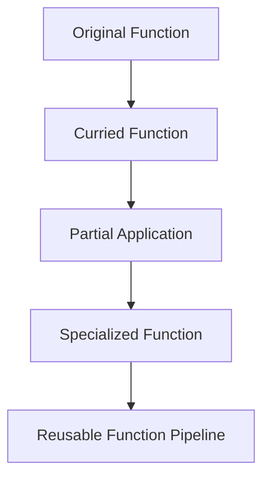

## 7.9 Currying and Partial Application

In the realm of functional programming, currying and partial application are powerful techniques that allow developers to create flexible and reusable function pipelines. These concepts, although rooted in functional programming languages, can be effectively applied in C# to enhance code modularity and reusability. In this section, we will delve into the intricacies of currying and partial application, explore their implementation in C#, and examine practical use cases and examples.

### Understanding Currying

Currying is a technique in functional programming where a function with multiple arguments is transformed into a sequence of functions, each taking a single argument. This transformation allows for more flexible function composition and reuse. The concept is named after the mathematician Haskell Curry, who contributed significantly to the development of combinatory logic.

#### Breaking Down Functions into Smaller Units

In C#, currying involves breaking down a function that takes multiple arguments into a series of nested functions, each accepting a single argument. This approach enables the creation of specialized functions by fixing some arguments while leaving others open for future specification.

Consider the following example of a simple function that adds two numbers:

```csharp
public static int Add(int x, int y)
{
    return x + y;
}
```

To curry this function, we transform it into a series of functions, each taking one argument:

```csharp
public static Func<int, Func<int, int>> CurriedAdd()
{
    return x => y => x + y;
}
```

In this curried version, `CurriedAdd` returns a function that takes an integer `x` and returns another function that takes an integer `y`, ultimately returning the sum of `x` and `y`.

#### Using Closures for Partial Application

Partial application is a related concept where a function is applied to some of its arguments, producing a new function that takes the remaining arguments. Closures in C# provide a mechanism to achieve partial application by capturing the environment in which a function is created.

Let's illustrate partial application using the curried `Add` function:

```csharp
var addFive = CurriedAdd()(5);
int result = addFive(10); // result is 15
```

In this example, `addFive` is a partially applied function that adds 5 to its argument. The closure captures the value 5, allowing the function to be reused with different arguments.

### Implementing Currying in C#

Implementing currying in C# involves leveraging delegates and lambda expressions to create nested functions. This approach allows developers to build flexible and reusable function pipelines.

#### Step-by-Step Implementation

1. **Define the Original Function**: Start with a function that takes multiple arguments.

   ```csharp
   public static int Multiply(int a, int b, int c)
   {
       return a * b * c;
   }
   ```

2. **Transform into Curried Form**: Convert the function into a series of nested functions using lambda expressions.

   ```csharp
   public static Func<int, Func<int, Func<int, int>>> CurriedMultiply()
   {
       return a => b => c => a * b * c;
   }
   ```

3. **Apply Partial Application**: Use closures to fix some arguments and create specialized functions.

   ```csharp
   var multiplyByTwo = CurriedMultiply()(2);
   var multiplyByTwoAndThree = multiplyByTwo(3);
   int result = multiplyByTwoAndThree(4); // result is 24
   ```

In this example, `multiplyByTwo` is a partially applied function that multiplies its argument by 2, and `multiplyByTwoAndThree` further specializes it by multiplying by 3.

### Use Cases and Examples

Currying and partial application are particularly useful in scenarios where functions need to be customized or reused in different contexts. Let's explore some practical use cases and examples.

#### Customizing Functions for Specific Scenarios

Currying allows developers to create specialized functions tailored to specific scenarios. For instance, consider a logging function that logs messages with varying levels of severity:

```csharp
public static Action<string> CreateLogger(string level)
{
    return message => Console.WriteLine($"[{level}] {message}");
}
```

By currying this function, we can create specialized loggers for different severity levels:

```csharp
var infoLogger = CreateLogger("INFO");
var errorLogger = CreateLogger("ERROR");

infoLogger("This is an informational message.");
errorLogger("This is an error message.");
```

#### Creating Reusable Function Pipelines

Currying and partial application facilitate the creation of reusable function pipelines, enabling developers to compose complex operations from simple building blocks.

Consider a scenario where we need to process a list of numbers by applying a series of transformations:

```csharp
public static Func<int, int> Add(int x) => y => x + y;
public static Func<int, int> Multiply(int x) => y => x * y;

var addThree = Add(3);
var multiplyByTwo = Multiply(2);

var pipeline = addThree.Compose(multiplyByTwo);

int result = pipeline(5); // result is 16
```

In this example, the `Compose` extension method combines the `addThree` and `multiplyByTwo` functions into a reusable pipeline.

### Visualizing Currying and Partial Application

To better understand the flow of currying and partial application, let's visualize the process using a flowchart.



**Figure 1**: Visualizing the transformation from an original function to a reusable function pipeline through currying and partial application.

### Design Considerations

When implementing currying and partial application in C#, consider the following design considerations:

- **Performance**: Currying can introduce additional function calls, which may impact performance in performance-critical applications. Evaluate the trade-offs between flexibility and efficiency.
- **Readability**: While currying enhances modularity, it can also make code less readable for developers unfamiliar with functional programming concepts. Use clear naming conventions and documentation to improve readability.
- **Compatibility**: Ensure that curried functions are compatible with existing codebases and adhere to established coding standards.

### Differences and Similarities

Currying and partial application are often confused due to their similarities. However, they have distinct differences:

- **Currying**: Transforms a function with multiple arguments into a series of functions, each taking a single argument.
- **Partial Application**: Fixes some arguments of a function, producing a new function that takes the remaining arguments.

Both techniques enhance function composition and reuse, but they achieve this through different mechanisms.

### Try It Yourself

To deepen your understanding of currying and partial application, try modifying the code examples provided in this section. Experiment with different functions, arguments, and compositions to see how these techniques can be applied in various contexts.

### References and Links

For further reading on currying and partial application, consider the following resources:

- [Functional Programming in C#](https://docs.microsoft.com/en-us/dotnet/csharp/functional-programming)
- [Lambda Expressions in C#](https://docs.microsoft.com/en-us/dotnet/csharp/programming-guide/statements-expressions-operators/lambda-expressions)
- [Delegates and Lambda Expressions](https://docs.microsoft.com/en-us/dotnet/csharp/programming-guide/delegates/)

### Knowledge Check

To reinforce your understanding of currying and partial application, consider the following questions:

- What is the primary difference between currying and partial application?
- How can closures be used to achieve partial application in C#?
- What are some practical use cases for currying in software development?

### Embrace the Journey

Remember, mastering currying and partial application is just the beginning of your journey into functional programming in C#. As you progress, you'll discover new ways to create flexible and reusable code. Keep experimenting, stay curious, and enjoy the journey!

## Quiz Time!



### What is currying in functional programming?

- [x] Transforming a function with multiple arguments into a sequence of functions, each taking a single argument.
- [ ] Combining multiple functions into a single function.
- [ ] Creating a function that takes a variable number of arguments.
- [ ] Transforming a function into a lambda expression.

> **Explanation:** Currying involves transforming a function with multiple arguments into a series of functions, each taking a single argument.

### How does partial application differ from currying?

- [x] Partial application fixes some arguments of a function, producing a new function that takes the remaining arguments.
- [ ] Partial application transforms a function into a lambda expression.
- [ ] Partial application combines multiple functions into a single function.
- [ ] Partial application creates a function that takes a variable number of arguments.

> **Explanation:** Partial application fixes some arguments of a function, producing a new function that takes the remaining arguments, while currying transforms a function into a series of single-argument functions.

### What is a closure in C#?

- [x] A function that captures the environment in which it was created, allowing it to access variables outside its scope.
- [ ] A function that takes a variable number of arguments.
- [ ] A function that is defined within another function.
- [ ] A function that returns another function.

> **Explanation:** A closure is a function that captures the environment in which it was created, allowing it to access variables outside its scope.

### Which of the following is a use case for currying?

- [x] Creating specialized functions tailored to specific scenarios.
- [ ] Combining multiple functions into a single function.
- [ ] Creating a function that takes a variable number of arguments.
- [ ] Transforming a function into a lambda expression.

> **Explanation:** Currying allows for the creation of specialized functions tailored to specific scenarios by transforming functions into a series of single-argument functions.

### What is the purpose of using closures for partial application?

- [x] To capture the environment in which a function is created, allowing for argument fixation.
- [ ] To transform a function into a lambda expression.
- [ ] To combine multiple functions into a single function.
- [ ] To create a function that takes a variable number of arguments.

> **Explanation:** Closures capture the environment in which a function is created, allowing for the fixation of some arguments and the creation of specialized functions.

### How can currying enhance code modularity?

- [x] By breaking down functions into smaller, reusable units.
- [ ] By combining multiple functions into a single function.
- [ ] By creating functions that take a variable number of arguments.
- [ ] By transforming functions into lambda expressions.

> **Explanation:** Currying enhances code modularity by breaking down functions into smaller, reusable units, allowing for flexible function composition.

### What is a potential drawback of currying in C#?

- [x] It can introduce additional function calls, impacting performance.
- [ ] It makes code less readable for developers familiar with functional programming.
- [ ] It is incompatible with existing codebases.
- [ ] It cannot be used with lambda expressions.

> **Explanation:** Currying can introduce additional function calls, which may impact performance in performance-critical applications.

### How can currying be implemented in C#?

- [x] By using delegates and lambda expressions to create nested functions.
- [ ] By combining multiple functions into a single function.
- [ ] By creating functions that take a variable number of arguments.
- [ ] By transforming functions into lambda expressions.

> **Explanation:** Currying can be implemented in C# by using delegates and lambda expressions to create nested functions, each taking a single argument.

### What is the role of the `Compose` extension method in function pipelines?

- [x] It combines multiple functions into a reusable pipeline.
- [ ] It transforms functions into lambda expressions.
- [ ] It creates functions that take a variable number of arguments.
- [ ] It breaks down functions into smaller units.

> **Explanation:** The `Compose` extension method combines multiple functions into a reusable pipeline, allowing for flexible function composition.

### True or False: Currying and partial application are identical concepts.

- [ ] True
- [x] False

> **Explanation:** Currying and partial application are related but distinct concepts. Currying transforms a function into a series of single-argument functions, while partial application fixes some arguments of a function, producing a new function that takes the remaining arguments.


