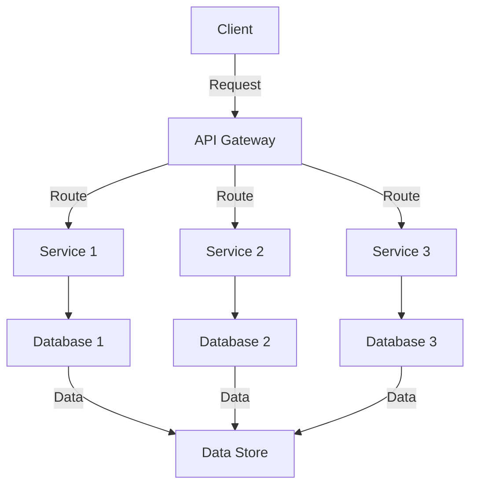

## 8.1 Introduction to Microservices Architecture

In the ever-evolving landscape of software development, microservices architecture has emerged as a transformative approach, enabling organizations to build scalable, flexible, and resilient applications. This section delves into the core concepts of microservices architecture, its benefits, and how it compares to traditional monolithic systems. We will explore the key characteristics that define microservices, such as scalability, isolation, and autonomy, and provide insights into how this architectural style can revolutionize software development.

### Understanding Microservices Architecture

Microservices architecture is a design approach where an application is composed of small, independent services that communicate over a network. Each service is focused on a specific business capability and can be developed, deployed, and scaled independently. This contrasts with the traditional monolithic architecture, where an application is built as a single, cohesive unit.

#### Key Concepts

- **Service Independence**: Each microservice operates independently, allowing teams to develop, deploy, and scale services without affecting others.
- **Business Capability**: Microservices are organized around business capabilities, ensuring that each service aligns with a specific business function.
- **Communication**: Services communicate over a network using lightweight protocols such as HTTP/REST, gRPC, or messaging queues.

### Benefits of Microservices Architecture

Microservices architecture offers several advantages over monolithic systems, making it an attractive choice for modern software development.

#### Scalability

One of the most significant benefits of microservices is their ability to scale independently. Each service can be scaled based on its specific needs, allowing for efficient resource utilization and improved performance.

- **Horizontal Scaling**: Services can be replicated across multiple servers to handle increased load.
- **Resource Optimization**: Allocate resources based on the demand of each service, reducing waste and improving cost-efficiency.

#### Isolation

Microservices provide isolation between services, which enhances fault tolerance and system reliability.

- **Fault Isolation**: Failures in one service do not impact others, allowing the system to remain operational even when individual components fail.
- **Independent Deployment**: Services can be updated or rolled back independently, reducing the risk of system-wide failures.

#### Autonomy

Microservices promote autonomy, enabling teams to work independently and make decisions that best suit their service.

- **Decentralized Governance**: Teams have the freedom to choose the best tools and technologies for their service.
- **Continuous Delivery**: Independent deployment pipelines allow for faster release cycles and more frequent updates.

### Comparing Monolithic and Microservices Architectures

To fully appreciate the benefits of microservices, it's essential to understand how they differ from monolithic architectures.

#### Monolithic Architecture

In a monolithic architecture, an application is built as a single, unified unit. All components are tightly coupled, sharing the same codebase and resources.

- **Tight Coupling**: Changes to one part of the system often require changes to other parts, increasing complexity and risk.
- **Single Deployment**: The entire application must be deployed as a whole, making updates and scaling more challenging.
- **Limited Scalability**: Scaling a monolithic application typically involves replicating the entire system, which can be inefficient and costly.

#### Microservices Architecture

Microservices architecture, on the other hand, breaks down the application into smaller, independent services.

- **Loose Coupling**: Services are loosely coupled, allowing for independent development and deployment.
- **Independent Deployment**: Each service can be deployed independently, enabling more frequent updates and faster time-to-market.
- **Scalability**: Services can be scaled independently, optimizing resource usage and improving performance.

### Key Characteristics of Microservices

Microservices architecture is defined by several key characteristics that contribute to its effectiveness and popularity.

#### Scalability

Microservices are inherently scalable, allowing organizations to efficiently manage resources and handle varying loads.

- **Elasticity**: Services can be dynamically scaled up or down based on demand, ensuring optimal performance and cost-efficiency.
- **Load Balancing**: Distribute traffic across multiple instances of a service to prevent bottlenecks and ensure high availability.

#### Isolation

Isolation is a critical aspect of microservices, providing fault tolerance and system resilience.

- **Service Boundaries**: Each service operates within its own boundaries, minimizing the impact of failures and reducing the risk of cascading failures.
- **Data Isolation**: Services manage their own data, reducing dependencies and improving data integrity.

#### Autonomy

Autonomy empowers teams to innovate and deliver value more quickly.

- **Decentralized Development**: Teams can work independently, choosing the best tools and practices for their service.
- **Rapid Iteration**: Independent deployment pipelines enable rapid iteration and continuous improvement.

### Visualizing Microservices Architecture

To better understand the structure and flow of microservices architecture, let's visualize it using a diagram.



**Diagram Description**: This diagram illustrates a typical microservices architecture, where a client interacts with an API Gateway. The gateway routes requests to various services, each with its own database. The services communicate with a shared data store for data persistence.

### Code Example: Implementing a Simple Microservice in C#

Let's implement a simple microservice in C# using ASP.NET Core. This example demonstrates how to create a basic service that handles HTTP requests.

```csharp
using Microsoft.AspNetCore.Builder;
using Microsoft.AspNetCore.Hosting;
using Microsoft.Extensions.DependencyInjection;
using Microsoft.Extensions.Hosting;

namespace SimpleMicroservice
{
    public class Startup
    {
        public void ConfigureServices(IServiceCollection services)
        {
            // Add services to the container
            services.AddControllers();
        }

        public void Configure(IApplicationBuilder app, IWebHostEnvironment env)
        {
            if (env.IsDevelopment())
            {
                app.UseDeveloperExceptionPage();
            }

            app.UseRouting();

            app.UseEndpoints(endpoints =>
            {
                endpoints.MapControllers();
            });
        }
    }
}
```

**Code Explanation**: This code sets up a basic ASP.NET Core application with a single microservice. The `Startup` class configures services and middleware, enabling the application to handle HTTP requests.

### Try It Yourself

To experiment with this code, try adding a new controller to handle specific requests. For example, create a `WeatherController` that returns weather data. This exercise will help you understand how to extend and customize microservices.

### Knowledge Check

Before we move on, let's review some key concepts:

- What are the main benefits of microservices architecture?
- How do microservices differ from monolithic systems?
- What are the key characteristics of microservices?

### Embrace the Journey

Remember, mastering microservices architecture is a journey. As you explore this architectural style, you'll discover new ways to build scalable, resilient, and flexible applications. Keep experimenting, stay curious, and enjoy the process!

### References and Further Reading

For more information on microservices architecture, consider exploring the following resources:

- [Microservices.io](https://microservices.io)
- [Martin Fowler's Microservices Guide](https://martinfowler.com/microservices/)
- [Microsoft's Microservices Architecture Guide](https://docs.microsoft.com/en-us/dotnet/architecture/microservices/)

## Quiz Time!



### What is a key benefit of microservices architecture?

- [x] Scalability
- [ ] Tight coupling
- [ ] Single deployment
- [ ] Limited scalability

> **Explanation:** Microservices architecture allows for independent scaling of services, improving scalability.

### How do microservices communicate?

- [x] Over a network using lightweight protocols
- [ ] Through shared memory
- [ ] Via direct function calls
- [ ] Using global variables

> **Explanation:** Microservices communicate over a network using protocols like HTTP/REST or messaging queues.

### What is a characteristic of monolithic architecture?

- [x] Tight coupling
- [ ] Loose coupling
- [ ] Independent deployment
- [ ] Decentralized governance

> **Explanation:** Monolithic architecture involves tight coupling, where components are interdependent.

### What allows microservices to be independently deployed?

- [x] Loose coupling
- [ ] Tight coupling
- [ ] Shared codebase
- [ ] Single deployment pipeline

> **Explanation:** Loose coupling in microservices allows for independent development and deployment.

### What is a key characteristic of microservices?

- [x] Autonomy
- [ ] Centralized governance
- [ ] Single codebase
- [ ] Limited scalability

> **Explanation:** Autonomy allows teams to work independently and make decisions for their service.

### How do microservices handle failures?

- [x] Fault isolation
- [ ] System-wide shutdown
- [ ] Shared error handling
- [ ] Centralized error logging

> **Explanation:** Fault isolation ensures that failures in one service do not affect others.

### What is a benefit of decentralized governance in microservices?

- [x] Teams can choose the best tools for their service
- [ ] Centralized decision-making
- [ ] Uniform technology stack
- [ ] Single point of failure

> **Explanation:** Decentralized governance allows teams to select tools and technologies that best suit their needs.

### What is a common protocol used for microservices communication?

- [x] HTTP/REST
- [ ] FTP
- [ ] SMTP
- [ ] SNMP

> **Explanation:** HTTP/REST is a common protocol for communication between microservices.

### What is a challenge of monolithic architecture?

- [x] Limited scalability
- [ ] Independent deployment
- [ ] Loose coupling
- [ ] Decentralized development

> **Explanation:** Monolithic architecture often faces challenges with scalability due to its tightly coupled nature.

### True or False: Microservices architecture allows for independent scaling of services.

- [x] True
- [ ] False

> **Explanation:** Microservices architecture enables each service to be scaled independently, optimizing resource usage.


