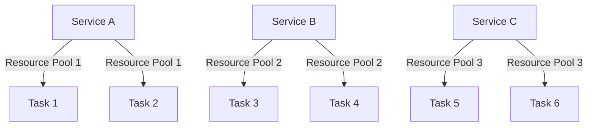

## 8.10 Bulkhead Pattern

In the realm of microservices architecture, ensuring the resilience and reliability of applications is paramount. The Bulkhead Pattern is a crucial design strategy that isolates critical resources, preventing failures in one part of the system from cascading into others. This pattern is inspired by the bulkheads used in ships, which compartmentalize sections to prevent water from flooding the entire vessel in case of a breach. Similarly, in software systems, the Bulkhead Pattern helps maintain high availability and robustness by isolating failures.

### Intent

The primary intent of the Bulkhead Pattern is to improve the resilience of a system by isolating failures. By partitioning resources, such as threads, memory, or network connections, into separate pools, the pattern ensures that a failure in one component does not affect the entire system. This isolation allows other parts of the application to continue functioning, thereby enhancing overall system stability and availability.

### Key Participants

- **Resource Pools**: These are isolated groups of resources dedicated to specific tasks or services. Each pool operates independently, ensuring that a failure in one pool does not impact others.
- **Service Consumers**: These are the clients or services that utilize the resources. They interact with the resource pools to perform their operations.
- **Isolation Mechanisms**: These are the techniques or tools used to implement the bulkhead pattern, such as thread pools, connection pools, or circuit breakers.

### Applicability

The Bulkhead Pattern is particularly useful in scenarios where:

- **High Availability is Critical**: Systems that require continuous uptime, such as financial services or healthcare applications, benefit from the isolation provided by bulkheads.
- **Resource Contention is a Concern**: In environments where resources are limited or shared among multiple services, isolating resources can prevent one service from monopolizing them.
- **Failure Isolation is Necessary**: When a failure in one service should not affect others, the Bulkhead Pattern provides a robust solution.

### Implementing Bulkhead in C#

Implementing the Bulkhead Pattern in C# involves creating isolated resource pools and managing them effectively. Let's explore how to achieve this using resource pools and partitioning.

#### Using Resource Pools and Partitioning

Resource pools are a common way to implement the Bulkhead Pattern. By partitioning resources into separate pools, we can ensure that a failure in one pool does not affect others. Here's how you can implement resource pools in C#:

```csharp
using System;
using System.Collections.Concurrent;
using System.Threading;
using System.Threading.Tasks;

public class Bulkhead
{
    private readonly SemaphoreSlim _semaphore;
    private readonly ConcurrentQueue<Task> _taskQueue;

    public Bulkhead(int maxConcurrentTasks)
    {
        _semaphore = new SemaphoreSlim(maxConcurrentTasks);
        _taskQueue = new ConcurrentQueue<Task>();
    }

    public async Task ExecuteAsync(Func<Task> task)
    {
        await _semaphore.WaitAsync();
        try
        {
            var runningTask = Task.Run(task);
            _taskQueue.Enqueue(runningTask);
            await runningTask;
        }
        finally
        {
            _semaphore.Release();
        }
    }
}
```

In this example, we create a `Bulkhead` class that uses a `SemaphoreSlim` to limit the number of concurrent tasks. The `ExecuteAsync` method enqueues tasks and ensures that only a specified number of tasks run concurrently. This approach isolates tasks, preventing a failure in one from affecting others.

#### Try It Yourself

Experiment with the above code by modifying the `maxConcurrentTasks` parameter to see how it affects task execution. You can also simulate task failures and observe how the bulkhead pattern isolates these failures.

### Use Cases and Examples

The Bulkhead Pattern is widely used in high-availability systems and scenarios where resource isolation is crucial. Let's explore some practical use cases and examples.

#### High-Availability Systems

In high-availability systems, such as online banking platforms or e-commerce websites, ensuring continuous service is critical. The Bulkhead Pattern can be used to isolate different services, such as payment processing, inventory management, and user authentication, into separate resource pools. This isolation ensures that a failure in one service does not affect the others, maintaining overall system availability.

#### Resource Isolation

In environments where multiple services share resources, such as a cloud-based application with limited database connections, the Bulkhead Pattern can prevent resource contention. By partitioning resources into separate pools, each service can operate independently, reducing the risk of one service monopolizing resources and causing failures in others.

### Visualizing the Bulkhead Pattern

To better understand the Bulkhead Pattern, let's visualize it using a Mermaid.js diagram. This diagram illustrates how resources are partitioned into separate pools, isolating failures and ensuring system resilience.



**Diagram Description**: This diagram shows three services (A, B, and C) each using separate resource pools. Tasks within each service are isolated, ensuring that a failure in one pool does not affect others.

### Design Considerations

When implementing the Bulkhead Pattern, consider the following design considerations:

- **Resource Allocation**: Determine the appropriate size for each resource pool based on the expected load and resource availability.
- **Failure Handling**: Implement robust error handling mechanisms to manage failures within each pool without affecting others.
- **Monitoring and Logging**: Use monitoring tools to track resource usage and identify potential bottlenecks or failures.

### Differences and Similarities

The Bulkhead Pattern is often compared to other resilience patterns, such as the Circuit Breaker Pattern. While both patterns aim to enhance system resilience, they differ in their approach:

- **Bulkhead Pattern**: Focuses on isolating resources to prevent cascading failures.
- **Circuit Breaker Pattern**: Prevents repeated failures by temporarily halting operations when a failure threshold is reached.

Both patterns can be used together to enhance system resilience, with the Bulkhead Pattern providing resource isolation and the Circuit Breaker Pattern managing failure thresholds.

### Knowledge Check

Let's reinforce our understanding of the Bulkhead Pattern with a few questions:

- What is the primary intent of the Bulkhead Pattern?
- How does the Bulkhead Pattern improve system resilience?
- What are some common use cases for the Bulkhead Pattern?

### Embrace the Journey

Remember, mastering design patterns is a journey. As you continue to explore and implement patterns like the Bulkhead Pattern, you'll enhance your ability to build resilient and high-performing systems. Keep experimenting, stay curious, and enjoy the journey!

## Quiz Time!



### What is the primary intent of the Bulkhead Pattern?

- [x] To isolate critical resources and prevent cascading failures
- [ ] To enhance system performance by optimizing resource usage
- [ ] To simplify code by reducing complexity
- [ ] To improve user interface design

> **Explanation:** The Bulkhead Pattern is designed to isolate critical resources, ensuring that a failure in one part of the system does not cascade into others.

### Which of the following is a key participant in the Bulkhead Pattern?

- [x] Resource Pools
- [ ] User Interfaces
- [ ] Database Connections
- [ ] Network Protocols

> **Explanation:** Resource Pools are a key participant in the Bulkhead Pattern, as they provide the isolation needed to prevent cascading failures.

### How does the Bulkhead Pattern improve system resilience?

- [x] By isolating resources into separate pools
- [ ] By increasing the number of available resources
- [ ] By reducing the complexity of the codebase
- [ ] By enhancing user experience

> **Explanation:** The Bulkhead Pattern improves system resilience by isolating resources into separate pools, preventing failures in one pool from affecting others.

### In which scenarios is the Bulkhead Pattern particularly useful?

- [x] High-availability systems
- [ ] Low-latency applications
- [ ] User interface design
- [ ] Data visualization

> **Explanation:** The Bulkhead Pattern is particularly useful in high-availability systems where continuous uptime is critical.

### What is a common technique used to implement the Bulkhead Pattern in C#?

- [x] Using SemaphoreSlim for resource isolation
- [ ] Using LINQ for data queries
- [ ] Using async/await for asynchronous programming
- [ ] Using inheritance for code reuse

> **Explanation:** SemaphoreSlim is commonly used in C# to implement resource isolation as part of the Bulkhead Pattern.

### What is the relationship between the Bulkhead Pattern and the Circuit Breaker Pattern?

- [x] Both enhance system resilience but use different approaches
- [ ] Both focus on improving user interface design
- [ ] Both are used to optimize database queries
- [ ] Both are used to enhance data visualization

> **Explanation:** Both the Bulkhead Pattern and the Circuit Breaker Pattern enhance system resilience, but they use different approaches. The Bulkhead Pattern isolates resources, while the Circuit Breaker Pattern manages failure thresholds.

### Which of the following is NOT a design consideration for the Bulkhead Pattern?

- [ ] Resource Allocation
- [ ] Failure Handling
- [ ] Monitoring and Logging
- [x] User Interface Design

> **Explanation:** User Interface Design is not a design consideration for the Bulkhead Pattern, which focuses on resource isolation and failure management.

### What is a common use case for the Bulkhead Pattern?

- [x] Resource isolation in cloud-based applications
- [ ] Enhancing user interface responsiveness
- [ ] Optimizing database queries
- [ ] Improving data visualization

> **Explanation:** A common use case for the Bulkhead Pattern is resource isolation in cloud-based applications to prevent resource contention.

### How can you experiment with the Bulkhead Pattern in C#?

- [x] By modifying the maxConcurrentTasks parameter in the example code
- [ ] By changing the user interface design
- [ ] By optimizing database queries
- [ ] By enhancing data visualization

> **Explanation:** You can experiment with the Bulkhead Pattern in C# by modifying the maxConcurrentTasks parameter in the example code to see how it affects task execution.

### True or False: The Bulkhead Pattern is inspired by the bulkheads used in ships.

- [x] True
- [ ] False

> **Explanation:** True. The Bulkhead Pattern is inspired by the bulkheads used in ships, which compartmentalize sections to prevent water from flooding the entire vessel in case of a breach.


