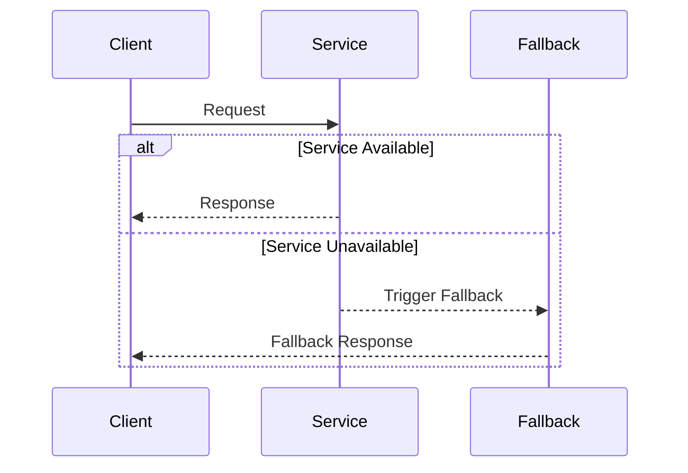

## 8.11 Fallback Pattern

In the world of microservices, where applications are composed of numerous independent services, ensuring resilience and reliability is paramount. The Fallback Pattern is a crucial design pattern that provides alternative responses or actions when a service fails. This pattern is essential for maintaining seamless user experiences and preventing cascading failures in distributed systems.

### Intent

The primary intent of the Fallback Pattern is to provide a mechanism to handle failures gracefully. When a service is unavailable or fails to respond, the Fallback Pattern allows the system to continue functioning by providing an alternative response or action. This ensures that users are not left with a broken application and that the system can recover from failures without significant disruption.

### Key Participants

- **Service Consumer**: The component or service that makes requests to another service.
- **Service Provider**: The service being consumed, which may fail or become unavailable.
- **Fallback Mechanism**: The logic that provides an alternative response or action when the service provider fails.

### Applicability

The Fallback Pattern is applicable in scenarios where:

- Services are prone to failures or downtimes.
- High availability and seamless user experiences are critical.
- There is a need to prevent cascading failures in a distributed system.
- Alternative responses or actions can be provided when a service fails.

### Implementing Fallback Strategies

Implementing fallback strategies in C# can be efficiently achieved using the Polly library. Polly is a .NET resilience and transient-fault-handling library that provides policies for handling retries, circuit breakers, timeouts, and fallbacks.

#### Using Polly's Fallback Policies

Polly's fallback policies allow you to define alternative actions when a service call fails. Here's how you can implement a fallback strategy using Polly:

```csharp
using Polly;
using System;
using System.Net.Http;
using System.Threading.Tasks;

class FallbackExample
{
    static async Task Main(string[] args)
    {
        // Define a fallback policy
        var fallbackPolicy = Policy
            .Handle<HttpRequestException>()
            .FallbackAsync(async (cancellationToken) =>
            {
                Console.WriteLine("Fallback action executed.");
                return new HttpResponseMessage(System.Net.HttpStatusCode.OK)
                {
                    Content = new StringContent("Fallback response")
                };
            });

        // Simulate a service call with fallback
        var httpClient = new HttpClient();
        var response = await fallbackPolicy.ExecuteAsync(async () =>
        {
            Console.WriteLine("Attempting to call service...");
            // Simulate a failing service call
            throw new HttpRequestException("Service is unavailable.");
        });

        Console.WriteLine($"Response: {await response.Content.ReadAsStringAsync()}");
    }
}
```

In this example, we define a fallback policy that handles `HttpRequestException`. When the service call fails, the fallback action is executed, providing a fallback response.

### Use Cases and Examples

The Fallback Pattern is widely used in various scenarios to handle service downtimes gracefully. Let's explore some common use cases and examples:

#### Handling Service Downtimes Gracefully

In a microservices architecture, services may become unavailable due to network issues, server failures, or maintenance. The Fallback Pattern allows you to handle these downtimes gracefully by providing alternative responses or actions.

For instance, consider an e-commerce application where the product recommendation service is temporarily unavailable. Instead of displaying an error message to the user, the application can use the Fallback Pattern to show a default set of popular products.

#### Providing Cached Responses

Another common use case for the Fallback Pattern is providing cached responses when a service fails. By caching responses from previous successful requests, you can ensure that users receive relevant data even when the service is unavailable.

Here's an example of using the Fallback Pattern with caching:

```csharp
using Polly;
using Polly.Caching;
using Polly.Caching.Memory;
using System;
using System.Net.Http;
using System.Threading.Tasks;

class FallbackWithCachingExample
{
    static async Task Main(string[] args)
    {
        var memoryCacheProvider = new MemoryCacheProvider(new Microsoft.Extensions.Caching.Memory.MemoryCache(new Microsoft.Extensions.Caching.Memory.MemoryCacheOptions()));

        // Define a cache policy
        var cachePolicy = Policy.CacheAsync(memoryCacheProvider, TimeSpan.FromMinutes(5));

        // Define a fallback policy with caching
        var fallbackPolicy = Policy
            .Handle<HttpRequestException>()
            .FallbackAsync(async (cancellationToken) =>
            {
                Console.WriteLine("Fallback action executed with cached response.");
                return new HttpResponseMessage(System.Net.HttpStatusCode.OK)
                {
                    Content = new StringContent("Cached response")
                };
            });

        // Combine cache and fallback policies
        var policyWrap = Policy.WrapAsync(fallbackPolicy, cachePolicy);

        // Simulate a service call with fallback and caching
        var httpClient = new HttpClient();
        var response = await policyWrap.ExecuteAsync(async (context) =>
        {
            Console.WriteLine("Attempting to call service...");
            // Simulate a failing service call
            throw new HttpRequestException("Service is unavailable.");
        }, new Context("cacheKey"));

        Console.WriteLine($"Response: {await response.Content.ReadAsStringAsync()}");
    }
}
```

In this example, we use Polly's caching policy to store responses in memory. When the service call fails, the fallback action provides a cached response.

### Design Considerations

When implementing the Fallback Pattern, consider the following design considerations:

- **Fallback Logic**: Ensure that the fallback logic provides meaningful and relevant responses to users. Avoid generic error messages that do not add value.
- **Performance**: Implement caching strategies to improve performance and reduce the load on fallback mechanisms.
- **Testing**: Thoroughly test fallback scenarios to ensure that the system behaves as expected during failures.
- **Monitoring**: Implement monitoring and logging to track fallback occurrences and identify potential issues.

### Differences and Similarities

The Fallback Pattern is often compared to other resilience patterns, such as the Circuit Breaker Pattern. While both patterns aim to handle failures gracefully, they differ in their approaches:

- **Fallback Pattern**: Provides alternative responses or actions when a service fails.
- **Circuit Breaker Pattern**: Prevents further calls to a failing service to allow it time to recover.

Both patterns can be used together to enhance resilience in microservices architectures.

### Visualizing the Fallback Pattern

To better understand the Fallback Pattern, let's visualize its workflow using a sequence diagram:



In this sequence diagram, the client makes a request to the service. If the service is available, it responds to the client. If the service is unavailable, the fallback mechanism is triggered, providing a fallback response to the client.

### Try It Yourself

To deepen your understanding of the Fallback Pattern, try modifying the code examples provided:

- Experiment with different types of exceptions to trigger the fallback mechanism.
- Implement a more complex fallback logic that retrieves data from an alternative service.
- Integrate the Fallback Pattern with other resilience patterns, such as retries and circuit breakers.

### References and Links

For further reading on the Fallback Pattern and resilience in microservices, consider the following resources:

- [Polly Documentation](https://github.com/App-vNext/Polly)
- [Microservices Patterns: With examples in Java](https://www.amazon.com/Microservices-Patterns-examples-Chris-Richardson/dp/1617294543)
- [Building Microservices: Designing Fine-Grained Systems](https://www.amazon.com/Building-Microservices-Designing-Fine-Grained-Systems/dp/1491950358)

### Knowledge Check

To reinforce your understanding of the Fallback Pattern, consider the following questions:

- What is the primary intent of the Fallback Pattern?
- How does the Fallback Pattern differ from the Circuit Breaker Pattern?
- What are some common use cases for the Fallback Pattern?
- How can caching be integrated with the Fallback Pattern?

### Embrace the Journey

Remember, mastering design patterns is a journey. As you continue to explore and implement patterns like the Fallback Pattern, you'll build more resilient and reliable applications. Keep experimenting, stay curious, and enjoy the journey!

## Quiz Time!



### What is the primary intent of the Fallback Pattern?

- [x] To provide alternative responses or actions when a service fails.
- [ ] To prevent further calls to a failing service.
- [ ] To improve the performance of a service.
- [ ] To enhance the security of a service.

> **Explanation:** The Fallback Pattern aims to provide alternative responses or actions when a service fails, ensuring resilience and reliability.

### Which library is commonly used in C# to implement fallback strategies?

- [x] Polly
- [ ] NLog
- [ ] Serilog
- [ ] AutoMapper

> **Explanation:** Polly is a .NET resilience and transient-fault-handling library that provides policies for handling retries, circuit breakers, timeouts, and fallbacks.

### What is a common use case for the Fallback Pattern?

- [x] Handling service downtimes gracefully.
- [ ] Improving data processing speed.
- [ ] Enhancing user interface design.
- [ ] Securing user authentication.

> **Explanation:** The Fallback Pattern is commonly used to handle service downtimes gracefully by providing alternative responses or actions.

### How does the Fallback Pattern differ from the Circuit Breaker Pattern?

- [x] The Fallback Pattern provides alternative responses, while the Circuit Breaker Pattern prevents further calls to a failing service.
- [ ] The Fallback Pattern improves performance, while the Circuit Breaker Pattern enhances security.
- [ ] The Fallback Pattern is used for caching, while the Circuit Breaker Pattern is used for logging.
- [ ] The Fallback Pattern is a security pattern, while the Circuit Breaker Pattern is a performance pattern.

> **Explanation:** The Fallback Pattern provides alternative responses or actions when a service fails, whereas the Circuit Breaker Pattern prevents further calls to a failing service.

### What is a key design consideration when implementing the Fallback Pattern?

- [x] Ensure that the fallback logic provides meaningful and relevant responses.
- [ ] Focus solely on improving performance.
- [ ] Avoid testing fallback scenarios.
- [ ] Implement fallback logic only for security purposes.

> **Explanation:** When implementing the Fallback Pattern, it's important to ensure that the fallback logic provides meaningful and relevant responses to users.

### Which of the following is a benefit of using the Fallback Pattern?

- [x] It ensures seamless user experiences during service failures.
- [ ] It increases the complexity of the system.
- [ ] It reduces the need for monitoring and logging.
- [ ] It eliminates the need for testing.

> **Explanation:** The Fallback Pattern ensures seamless user experiences during service failures by providing alternative responses or actions.

### What is a common strategy to improve performance when using the Fallback Pattern?

- [x] Implement caching strategies.
- [ ] Increase the number of service calls.
- [ ] Reduce the number of fallback mechanisms.
- [ ] Focus on enhancing security features.

> **Explanation:** Implementing caching strategies can improve performance and reduce the load on fallback mechanisms.

### Which of the following is a key participant in the Fallback Pattern?

- [x] Fallback Mechanism
- [ ] User Interface
- [ ] Database
- [ ] Security Module

> **Explanation:** The Fallback Mechanism is a key participant in the Fallback Pattern, providing alternative responses or actions when a service fails.

### True or False: The Fallback Pattern can be used in conjunction with other resilience patterns.

- [x] True
- [ ] False

> **Explanation:** The Fallback Pattern can be used in conjunction with other resilience patterns, such as retries and circuit breakers, to enhance resilience in microservices architectures.

### Which of the following is a recommended practice when testing fallback scenarios?

- [x] Thoroughly test fallback scenarios to ensure expected behavior during failures.
- [ ] Avoid testing fallback scenarios to save time.
- [ ] Focus only on testing successful service calls.
- [ ] Implement fallback scenarios only in production environments.

> **Explanation:** It's important to thoroughly test fallback scenarios to ensure that the system behaves as expected during failures.


