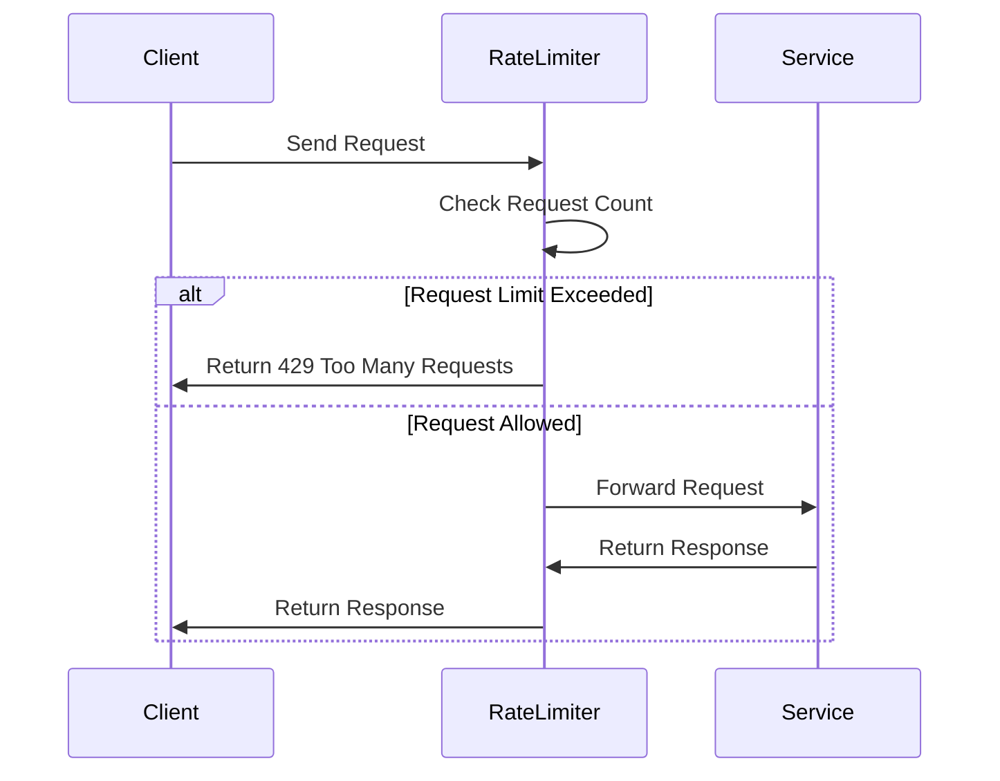

## 8.12 Rate Limiting Pattern

In the world of microservices, managing the flow of requests to ensure fair usage and prevent abuse is crucial. The Rate Limiting Pattern is a powerful tool that helps control the number of requests a client can make to a service within a specified time frame. This pattern is essential for maintaining the stability and performance of your services, especially when dealing with high traffic or shared resources.

### Introduction to Rate Limiting

Rate limiting is a technique used to control the amount of incoming and outgoing traffic to or from a network. In the context of microservices, it is used to limit the number of requests a client can make to a service within a given time period. This helps in preventing abuse, ensuring fair usage, and protecting the backend services from being overwhelmed by too many requests.

#### Why Use Rate Limiting?

- **Preventing Abuse**: Protects your services from being overwhelmed by too many requests from a single client.
- **Ensuring Fair Usage**: Ensures that all clients have fair access to the service.
- **Protecting Resources**: Prevents overuse of resources, which can lead to degraded performance or service outages.
- **Improving Performance**: Helps maintain optimal performance by controlling the load on the service.

### Implementing Rate Limiting in C#

In C#, rate limiting can be implemented using various techniques. One of the most common methods is using ASP.NET Core middleware. This allows you to intercept requests and apply rate limiting logic before the request reaches your service.

#### Using ASP.NET Core Middleware

ASP.NET Core provides a flexible way to implement rate limiting through middleware. Middleware is software that's assembled into an application pipeline to handle requests and responses. By creating custom middleware, you can implement rate limiting logic to control the flow of requests.

##### Step-by-Step Implementation

1. **Create a Middleware Class**: Start by creating a middleware class that will handle the rate limiting logic.

```csharp
public class RateLimitingMiddleware
{
    private readonly RequestDelegate _next;
    private static readonly Dictionary<string, DateTime> _clients = new Dictionary<string, DateTime>();
    private readonly int _requestLimit = 100; // Limit to 100 requests
    private readonly TimeSpan _timeSpan = TimeSpan.FromMinutes(1); // Within 1 minute

    public RateLimitingMiddleware(RequestDelegate next)
    {
        _next = next;
    }

    public async Task InvokeAsync(HttpContext context)
    {
        var clientIp = context.Connection.RemoteIpAddress.ToString();

        if (_clients.ContainsKey(clientIp))
        {
            var lastRequestTime = _clients[clientIp];
            if (DateTime.UtcNow - lastRequestTime < _timeSpan)
            {
                context.Response.StatusCode = 429; // Too Many Requests
                await context.Response.WriteAsync("Rate limit exceeded. Try again later.");
                return;
            }
        }

        _clients[clientIp] = DateTime.UtcNow;
        await _next(context);
    }
}
```

2. **Register the Middleware**: Register the middleware in the `Startup.cs` file.

```csharp
public class Startup
{
    public void Configure(IApplicationBuilder app, IHostingEnvironment env)
    {
        app.UseMiddleware<RateLimitingMiddleware>();
        // Other middleware registrations
    }
}
```

3. **Test the Middleware**: Test the middleware by sending multiple requests from the same client and observing the rate limiting behavior.

##### Key Considerations

- **Storage**: The example uses an in-memory dictionary to store client request times. For distributed systems, consider using a distributed cache like Redis.
- **Concurrency**: Ensure thread safety when accessing shared resources like the dictionary.
- **Customization**: Adjust the request limit and time span according to your application's needs.

### Use Cases and Examples

Rate limiting is commonly used in scenarios where you need to enforce API usage policies, ensure fair resource allocation, and protect services from abuse.

#### API Usage Policies

APIs often have usage policies that limit the number of requests a client can make. This ensures that all clients have fair access to the API and prevents any single client from monopolizing the service.

```csharp
// Example: Implementing API usage policy with rate limiting
public class ApiRateLimitingMiddleware
{
    private readonly RequestDelegate _next;
    private readonly int _requestLimit = 1000; // Limit to 1000 requests
    private readonly TimeSpan _timeSpan = TimeSpan.FromHours(1); // Within 1 hour

    public ApiRateLimitingMiddleware(RequestDelegate next)
    {
        _next = next;
    }

    public async Task InvokeAsync(HttpContext context)
    {
        var apiKey = context.Request.Headers["ApiKey"].ToString();
        // Implement rate limiting logic based on API key
    }
}
```

#### Fair Resource Allocation

In multi-tenant applications, rate limiting ensures that resources are allocated fairly among tenants. This prevents any single tenant from consuming more than their fair share of resources.

```csharp
// Example: Fair resource allocation in a multi-tenant application
public class TenantRateLimitingMiddleware
{
    private readonly RequestDelegate _next;
    private readonly Dictionary<string, int> _tenantLimits = new Dictionary<string, int>
    {
        { "TenantA", 500 },
        { "TenantB", 300 }
    };

    public TenantRateLimitingMiddleware(RequestDelegate next)
    {
        _next = next;
    }

    public async Task InvokeAsync(HttpContext context)
    {
        var tenantId = context.Request.Headers["TenantId"].ToString();
        // Implement rate limiting logic based on tenant ID
    }
}
```

### Visualizing Rate Limiting

To better understand how rate limiting works, let's visualize the process using a sequence diagram. This diagram illustrates the interaction between a client and a service with rate limiting in place.



### Design Considerations

When implementing rate limiting, consider the following design aspects:

- **Scalability**: Ensure your rate limiting solution can scale with your application's growth.
- **Flexibility**: Allow for customizable rate limits based on client, API key, or other criteria.
- **Performance**: Minimize the performance impact of rate limiting on your service.
- **Security**: Protect against malicious clients attempting to bypass rate limits.

### Differences and Similarities

Rate limiting is often confused with throttling. While both control the flow of requests, they serve different purposes:

- **Rate Limiting**: Restricts the number of requests over a period of time.
- **Throttling**: Slows down the processing of requests to prevent overloading the system.

### Try It Yourself

Experiment with the rate limiting middleware by modifying the request limit and time span. Observe how these changes affect the behavior of your application. Consider implementing a distributed rate limiting solution using Redis or another distributed cache.

### Knowledge Check

- What is the primary purpose of rate limiting in microservices?
- How does rate limiting differ from throttling?
- What are some common use cases for rate limiting?
- How can you implement rate limiting in a distributed system?

### Embrace the Journey

Remember, mastering rate limiting is just one step in building robust and scalable microservices. As you continue your journey, explore other patterns and techniques to enhance your application's performance and reliability. Keep experimenting, stay curious, and enjoy the process!

## Quiz Time!



### What is the primary purpose of rate limiting in microservices?

- [x] To control the number of requests a client can make within a specified time frame
- [ ] To increase the speed of request processing
- [ ] To reduce the number of services in a microservices architecture
- [ ] To enhance the security of the service

> **Explanation:** Rate limiting is used to control the number of requests a client can make to a service within a specified time frame, ensuring fair usage and preventing abuse.

### How does rate limiting differ from throttling?

- [x] Rate limiting restricts the number of requests over time, while throttling slows down request processing
- [ ] Rate limiting and throttling are the same
- [ ] Throttling restricts the number of requests over time, while rate limiting slows down request processing
- [ ] Throttling is used for security, while rate limiting is used for performance

> **Explanation:** Rate limiting restricts the number of requests a client can make over a period of time, while throttling slows down the processing of requests to prevent system overload.

### Which ASP.NET Core component is commonly used to implement rate limiting?

- [x] Middleware
- [ ] Controllers
- [ ] Services
- [ ] Filters

> **Explanation:** Middleware in ASP.NET Core is used to handle requests and responses, making it a suitable component for implementing rate limiting.

### What HTTP status code is typically returned when a rate limit is exceeded?

- [x] 429
- [ ] 404
- [ ] 500
- [ ] 200

> **Explanation:** The HTTP status code 429 indicates "Too Many Requests," which is returned when a rate limit is exceeded.

### In a multi-tenant application, what is a common use case for rate limiting?

- [x] Ensuring fair resource allocation among tenants
- [ ] Increasing the number of tenants
- [ ] Reducing the number of API endpoints
- [ ] Enhancing the user interface

> **Explanation:** Rate limiting in a multi-tenant application ensures that resources are allocated fairly among tenants, preventing any single tenant from consuming more than their fair share.

### What is a potential storage solution for implementing distributed rate limiting?

- [x] Redis
- [ ] SQL Server
- [ ] File System
- [ ] Local Variables

> **Explanation:** Redis is a distributed cache that can be used to store rate limiting data, making it suitable for distributed rate limiting solutions.

### What is a key design consideration when implementing rate limiting?

- [x] Scalability
- [ ] Color scheme of the application
- [ ] Number of developers on the team
- [ ] Type of database used

> **Explanation:** Scalability is crucial when implementing rate limiting to ensure the solution can handle the application's growth.

### What is the role of the `RequestDelegate` in ASP.NET Core middleware?

- [x] It represents the next middleware in the pipeline
- [ ] It handles database connections
- [ ] It manages user authentication
- [ ] It logs request data

> **Explanation:** `RequestDelegate` represents the next middleware in the pipeline and is used to pass control to the next component.

### True or False: Rate limiting can help improve the performance of a service.

- [x] True
- [ ] False

> **Explanation:** By controlling the number of requests, rate limiting helps maintain optimal performance and prevents the service from being overwhelmed.

### Which of the following is NOT a benefit of rate limiting?

- [ ] Preventing abuse
- [ ] Ensuring fair usage
- [ ] Protecting resources
- [x] Increasing the number of requests

> **Explanation:** Rate limiting is designed to control the number of requests, not increase them.


