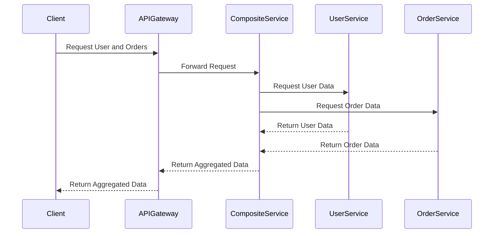

## 8.13 API Composition Pattern

In the world of microservices, where applications are broken down into smaller, independent services, the need to aggregate data from multiple services into a single response becomes crucial. The API Composition Pattern is a design pattern that addresses this need by allowing developers to aggregate data from various microservices and present a unified response to the client. This pattern is particularly useful in scenarios where a client requires data that resides in multiple services.

### Intent

The primary intent of the API Composition Pattern is to provide a mechanism for aggregating data from multiple microservices into a single, cohesive response. This pattern helps in reducing the number of calls a client needs to make to gather all necessary data, thereby improving performance and simplifying client-side logic.

### Key Participants

1. **API Gateway**: Acts as the entry point for client requests and orchestrates calls to various microservices.
2. **Composite Service**: A service that aggregates data from multiple microservices and returns a unified response.
3. **Microservices**: Individual services that provide specific pieces of data required by the client.
4. **Client**: The consumer of the aggregated data, which could be a web application, mobile app, or any other client.

### Applicability

The API Composition Pattern is applicable in scenarios where:
- A client needs data from multiple microservices.
- Reducing the number of client-server interactions is desired.
- Simplifying client-side logic is beneficial.
- There is a need to transform or enrich data before presenting it to the client.

### Implementing API Composition in C#

Implementing the API Composition Pattern in C# involves using API Gateways and composite services. Let's explore these components in detail.

#### Using API Gateways

An API Gateway acts as a single entry point for all client requests. It routes requests to the appropriate microservices and aggregates the responses. In C#, you can implement an API Gateway using frameworks like Ocelot or Azure API Management.

##### Example: Implementing an API Gateway with Ocelot

Ocelot is a popular open-source API Gateway for .NET. It provides features like routing, request aggregation, and more.

```csharp
// Ocelot configuration example
{
  "Routes": [
    {
      "DownstreamPathTemplate": "/service1/{everything}",
      "DownstreamScheme": "http",
      "DownstreamHostAndPorts": [
        {
          "Host": "localhost",
          "Port": 5001
        }
      ],
      "UpstreamPathTemplate": "/api/service1/{everything}",
      "UpstreamHttpMethod": [ "Get" ]
    },
    {
      "DownstreamPathTemplate": "/service2/{everything}",
      "DownstreamScheme": "http",
      "DownstreamHostAndPorts": [
        {
          "Host": "localhost",
          "Port": 5002
        }
      ],
      "UpstreamPathTemplate": "/api/service2/{everything}",
      "UpstreamHttpMethod": [ "Get" ]
    }
  ],
  "GlobalConfiguration": {
    "BaseUrl": "http://localhost:5000"
  }
}
```

In this example, the API Gateway routes requests to two different services based on the URL path. The `UpstreamPathTemplate` defines the path the client uses, while the `DownstreamPathTemplate` specifies the path to the actual service.

#### Composite Services

A composite service is responsible for aggregating data from multiple microservices. It makes calls to the necessary services, combines the data, and returns a single response to the client.

##### Example: Creating a Composite Service in C#

Let's create a simple composite service that aggregates data from two microservices: `UserService` and `OrderService`.

```csharp
public class CompositeService
{
    private readonly HttpClient _httpClient;

    public CompositeService(HttpClient httpClient)
    {
        _httpClient = httpClient;
    }

    public async Task<CompositeResponse> GetCompositeDataAsync(int userId)
    {
        var userTask = _httpClient.GetAsync($"http://localhost:5001/api/users/{userId}");
        var ordersTask = _httpClient.GetAsync($"http://localhost:5002/api/orders/user/{userId}");

        await Task.WhenAll(userTask, ordersTask);

        var userResponse = await userTask.Result.Content.ReadAsAsync<User>();
        var ordersResponse = await ordersTask.Result.Content.ReadAsAsync<List<Order>>();

        return new CompositeResponse
        {
            User = userResponse,
            Orders = ordersResponse
        };
    }
}

public class CompositeResponse
{
    public User User { get; set; }
    public List<Order> Orders { get; set; }
}

public class User
{
    public int Id { get; set; }
    public string Name { get; set; }
}

public class Order
{
    public int Id { get; set; }
    public string ProductName { get; set; }
    public decimal Price { get; set; }
}
```

In this example, the `CompositeService` class makes asynchronous calls to `UserService` and `OrderService` to fetch user and order data. It then combines the data into a `CompositeResponse` object.

### Use Cases and Examples

The API Composition Pattern is widely used in various scenarios. Let's explore some common use cases and examples.

#### Use Case 1: E-commerce Platform

In an e-commerce platform, a client might need to display a user's profile along with their recent orders. Instead of making separate calls to `UserService` and `OrderService`, the API Composition Pattern allows the client to make a single call to a composite service that aggregates the data.

#### Use Case 2: Social Media Application

In a social media application, a client might need to display a user's profile, posts, and friends list. The API Composition Pattern can be used to aggregate data from `UserService`, `PostService`, and `FriendService` into a single response.

#### Example: Aggregating Data for Client Consumption

Let's consider a scenario where a client needs to display a dashboard with user information and recent activities. We can use the API Composition Pattern to aggregate data from `UserService` and `ActivityService`.

```csharp
public class DashboardService
{
    private readonly HttpClient _httpClient;

    public DashboardService(HttpClient httpClient)
    {
        _httpClient = httpClient;
    }

    public async Task<DashboardResponse> GetDashboardDataAsync(int userId)
    {
        var userTask = _httpClient.GetAsync($"http://localhost:5001/api/users/{userId}");
        var activitiesTask = _httpClient.GetAsync($"http://localhost:5003/api/activities/user/{userId}");

        await Task.WhenAll(userTask, activitiesTask);

        var userResponse = await userTask.Result.Content.ReadAsAsync<User>();
        var activitiesResponse = await activitiesTask.Result.Content.ReadAsAsync<List<Activity>>();

        return new DashboardResponse
        {
            User = userResponse,
            Activities = activitiesResponse
        };
    }
}

public class DashboardResponse
{
    public User User { get; set; }
    public List<Activity> Activities { get; set; }
}

public class Activity
{
    public int Id { get; set; }
    public string Description { get; set; }
    public DateTime Date { get; set; }
}
```

In this example, the `DashboardService` class aggregates user and activity data into a `DashboardResponse` object.

### Design Considerations

When implementing the API Composition Pattern, consider the following:

- **Performance**: Aggregating data from multiple services can introduce latency. Use asynchronous calls and caching to improve performance.
- **Error Handling**: Implement robust error handling to manage failures in individual service calls.
- **Security**: Ensure that the composite service enforces security policies and access controls.
- **Scalability**: Design the composite service to handle increased load and scale horizontally if necessary.

### Differences and Similarities

The API Composition Pattern is often compared to the **Backend for Frontend (BFF) Pattern**. While both patterns involve aggregating data for client consumption, the BFF pattern is more focused on tailoring the backend to specific client needs, whereas the API Composition Pattern is more about aggregating data from multiple services.

### Visualizing API Composition

To better understand the API Composition Pattern, let's visualize the flow of data using a sequence diagram.



This diagram illustrates how a client request is processed through an API Gateway, which forwards the request to a composite service. The composite service then makes calls to `UserService` and `OrderService`, aggregates the data, and returns it to the client.

### Try It Yourself

To gain a deeper understanding of the API Composition Pattern, try modifying the code examples provided. Here are some suggestions:

- Add additional microservices to the composite service and aggregate their data.
- Implement caching in the composite service to improve performance.
- Experiment with error handling strategies to manage service failures.

### Knowledge Check

Before we conclude, let's reinforce what we've learned with some questions and exercises.

- What is the primary intent of the API Composition Pattern?
- How does an API Gateway facilitate the API Composition Pattern?
- What are some common use cases for the API Composition Pattern?
- Implement a composite service that aggregates data from three microservices.

### Embrace the Journey

Remember, mastering design patterns is a journey. As you continue to explore and implement the API Composition Pattern, you'll gain valuable insights into building scalable and maintainable microservices architectures. Keep experimenting, stay curious, and enjoy the journey!

## Quiz Time!



### What is the primary intent of the API Composition Pattern?

- [x] To aggregate data from multiple microservices into a single response
- [ ] To decompose a monolithic application into microservices
- [ ] To provide a single entry point for all client requests
- [ ] To enhance security by enforcing access controls

> **Explanation:** The API Composition Pattern is designed to aggregate data from multiple microservices into a single, cohesive response for the client.

### Which component acts as the entry point for client requests in the API Composition Pattern?

- [ ] Composite Service
- [x] API Gateway
- [ ] Microservice
- [ ] Client

> **Explanation:** The API Gateway acts as the entry point for client requests and orchestrates calls to various microservices.

### What is a common use case for the API Composition Pattern?

- [ ] Decomposing a monolithic application
- [x] Aggregating data for an e-commerce platform
- [ ] Implementing a caching mechanism
- [ ] Enhancing security protocols

> **Explanation:** A common use case for the API Composition Pattern is aggregating data from multiple services, such as in an e-commerce platform where user and order data are combined.

### What is a key consideration when implementing the API Composition Pattern?

- [ ] Ensuring all microservices are stateless
- [ ] Using synchronous calls for better performance
- [x] Implementing robust error handling
- [ ] Avoiding the use of API Gateways

> **Explanation:** Implementing robust error handling is crucial to manage failures in individual service calls when using the API Composition Pattern.

### How does the API Composition Pattern differ from the Backend for Frontend (BFF) Pattern?

- [x] The API Composition Pattern focuses on aggregating data, while BFF tailors the backend to specific client needs
- [ ] The API Composition Pattern is used only for security purposes
- [ ] BFF is a subset of the API Composition Pattern
- [ ] They are essentially the same pattern

> **Explanation:** The API Composition Pattern is about aggregating data from multiple services, whereas the BFF Pattern is about tailoring the backend to specific client needs.

### What is the role of a composite service in the API Composition Pattern?

- [ ] To act as a client for microservices
- [x] To aggregate data from multiple microservices
- [ ] To enforce security policies
- [ ] To replace the API Gateway

> **Explanation:** A composite service aggregates data from multiple microservices and returns a unified response to the client.

### Which of the following is a benefit of using the API Composition Pattern?

- [x] Reducing the number of client-server interactions
- [ ] Increasing the complexity of client-side logic
- [ ] Decreasing the performance of the application
- [ ] Eliminating the need for microservices

> **Explanation:** The API Composition Pattern reduces the number of client-server interactions by aggregating data from multiple services into a single response.

### What is a potential drawback of the API Composition Pattern?

- [ ] It simplifies client-side logic
- [ ] It enhances performance
- [x] It can introduce latency due to multiple service calls
- [ ] It eliminates the need for an API Gateway

> **Explanation:** Aggregating data from multiple services can introduce latency, which is a potential drawback of the API Composition Pattern.

### Which C# framework is commonly used to implement an API Gateway?

- [ ] ASP.NET Core
- [x] Ocelot
- [ ] Entity Framework
- [ ] Xamarin

> **Explanation:** Ocelot is a popular open-source API Gateway for .NET used to implement the API Composition Pattern.

### True or False: The API Composition Pattern is only applicable in monolithic architectures.

- [ ] True
- [x] False

> **Explanation:** The API Composition Pattern is primarily used in microservices architectures to aggregate data from multiple services.


